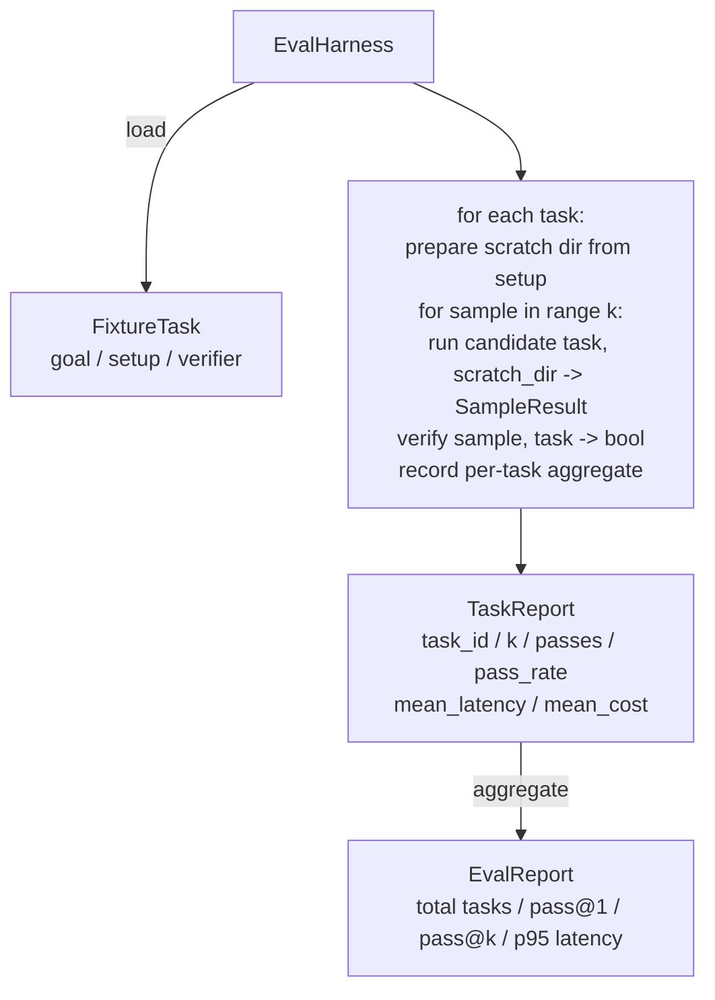

# Capstone Lekcja 27: Uprząż ewaluacyjna z zadaniami związanymi z urządzeniami

> Agent kodujący jest tak dobry, jak zestaw zadań, względem których go mierzysz. W tej lekcji budujemy zestaw ewaluacyjny, który bierze folder z ustalonymi zadaniami, przepuszcza każde przez potencjalnego agenta, ocenia pozytywny lub negatywny wynik za pomocą deterministycznego weryfikatora i agreguje wyniki w postaci pass@1, pass@k, średniego opóźnienia i średniego kosztu. Uprząż jest źródłem prawdy, która pozwala odróżnić regresję od refaktora.

**Typ:** Kompilacja
**Języki:** Python (stdlib)
**Wymagania wstępne:** Faza 19 · 25 (bramki weryfikacyjne), Faza 19 · 26 (biegacz piaskownicy), Faza 14 · 30 (rozwój agenta opartego na ewaluacji), Faza 14 · 19 (bench SWE i testy porównawcze GAIA)
**Czas:** ~90 minut

## Cele nauczania

- Zdefiniuj zadanie meczowe jako potrójne zadanie, ustawienie i weryfikator.
- Oceń wiele przykładowych przebiegów na zadanie i oblicz pass@1 i pass@k.
- Zagreguj opóźnienia i koszty w metryki średnie i 95-centylowe.
- Podłącz deterministyczne weryfikatory (różnica pliku, kod zakończenia, dopasowanie wyrażenia regularnego) do funkcji wielokrotnego użytku.
— Wyemituj ustrukturyzowany raport JSON, który może pozyskać skrypt śledzenia regresji.

## Problem

Testy porównawcze agentów plagi z trzema trybami awarii zbudowane bez wiązki eval.

Pierwsza to przepustka niezweryfikowana. Agent twierdzi, że naprawił błąd, człowiek spogląda na różnicę, pakiet jest oznaczony na zielono, a trzy tygodnie później test regresyjny ujawnia ten sam błąd. Agent rozumował wiarygodnie, niczego nie poprawiając.

Drugi to niewykryta regresja. Zmiana szablonu podpowiedzi sprawia, że ​​agent jest o 4% lepszy w przypadku głośnego zadania i 14% gorszy w przypadku cichego zadania. Bez zestawu złota i wyniku dla poszczególnych zadań regresja pojawia się głównie i wychodzi na jaw dopiero wtedy, gdy klient narzeka.

Trzeci to dryf według zadania. Ocena odbyła się w poniedziałek ze 100 zadaniami, a w piątek z 95, ponieważ ktoś zmienił nazwy pięciu meczów. Wskaźnik zdawalności wygląda na poprawę o 5%. To nie jest.

Uprząż to program, który zamienia te niepowodzenia w fakty. Za każdym razem uruchamia każde urządzenie w powtarzalnej kolejności względem weryfikatora, który w ramach kontroli deterministycznej zwraca wartość prawda lub fałsz.

## Koncepcja

```mermaid
flowchart LR
  F1[fixtures/task_001/<br/>task.json + expected/] --> Harness
  F2[fixtures/task_002/<br/>...] --> Harness
  Harness[Harness<br/>for each task:<br/>setup / run agent k samples /<br/>verify each sample /<br/>record latency, cost]
  Harness --> Report[EvalReport<br/>pass@1 / pass@k<br/>mean ms / p95 ms<br/>mean cost]
```

`FixtureTask` to mały plik JSON plus opcjonalny katalog `expected/`. JSON deklaruje blok `id`, `goal` (podpowiedź przekazywana agentowi), blok `setup` (pliki do upuszczenia w katalogu źródłowym) i blok `verifier`. Blok weryfikatora nazywa funkcję w rejestrze weryfikatorów wiązki przewodów i dostarcza jej argumenty.

Trzy kształty weryfikatorów pokrywają większość przydatnych zadań.

Pierwszy to `file_equals`. Po uruchomieniu agenta porównaj nazwany plik z oczekiwaną zawartością. To wychwytuje zadania „napraw ten błąd dokładnie w ten sposób”.

Drugi to `regex_match`. Zawartość nazwanego pliku jest dopasowywana do wyrażenia regularnego. Wychwytuje to zadania „funkcja musi istnieć i zwracać X”, gdy istnieje wiele akceptowalnych rozwiązań.

Trzeci to `shell_exit_zero`. Uprząż uruchamia polecenie powłoki (przez piaskownicę z lekcji 26) i przekazuje zadanie tylko wtedy, gdy polecenie wyjdzie z zera. To wychwytuje zadania „testy muszą przejść”.

Uprząż uruchamia każde zadanie `k` razy. Pass@k to `1 - (1 - p)^k` gdzie p to empiryczny współczynnik zdawalności; uprząż raportuje również surowe zliczenia, dzięki czemu można wykryć wariancje. Opóźnienie wynosi zegar ścienny na próbkę. Koszt to kwota, którą agent sam zgłasza (liczba tokenów, USD lub jedno i drugie); wiązka sumuje je z próbek i przedstawia liczby poszczególnych zadań i wartości zbiorcze.

## Architektura



Kandydat jest wywoływalny: `Callable[[FixtureTask, str], SampleResult]`. Wiązka przewodów tworzy katalog tymczasowy poprzez `tempfile.mkdtemp()` i przekazuje swoją ścieżkę jako zwykły ciąg znaków. Uprzęży nie interesuje, jak kandydat pracuje. Kandydatem może być deterministyczny aplikator łatek (przydatny do autotestów uprzęży), prawdziwy agent LLM, fuzzer. Kontrakt to SampleResult.

## Co zbudujesz

`main.py` wysyła:

1. Klasa danych `FixtureTask`.
2. `SampleResult` klasa danych: Success_self_reported, latency_ms, cost_units, zmiany.
3. Klasy danych `TaskReport`, `EvalReport` z `to_dict()`.
4. `VerifierRegistry` mapowanie nazwy weryfikatora na funkcję. Wbudowane weryfikatory: file_equals, regex_match, Shell_exit_zero.
5. Klasa `EvalHarness`. Uruchamia katalog zadań wobec kandydata. Zwraca raport Eval.
6. Pięć zadań mocowania w pakiecie `tasks/`:
   - off-by-one w `fizzbuzz`
   - brak zwrotu w `factorial`
   - literówka w komunikacie o błędzie
   - puste ciało funkcji
   - off-by-one podczas przeglądania listy połączonej
7. Deterministyczny kandydat odniesienia (`apply_known_fixes`), którego uprząż używa do wykazania czystego przejścia@1 wynoszącego 1,0.
8. Wersja demonstracyjna drukuje plik EvalReport w formacie JSON i kończy działanie zerem.

Zadania osprzętu są spakowane jako pliki JSON w `tasks/` oraz sparowane pliki źródłowe w `tasks/<id>/buggy/` i `tasks/<id>/expected/`. Uprząż kopiuje wózek do katalogu zdrapek, przekazuje go kandydatowi i sprawdza zgodność z oczekiwaniami.

## Dlaczego pass@k, a nie tylko pass@1

Prawdziwi agenci LLM są stochastyczni. Pass@1 wynoszący 0,6 wygląda na porażkę. Wynik Pass@5 wynoszący 0,95 oznacza, że ​​agent w większości przypadków uzyskuje prawidłową odpowiedź, ale we wczesnych próbkach wybiera błędną odpowiedź. Rozwiązaniem jest pobieranie próbek i ranking, a nie zawsze więcej szkoleń. Pass@k sprawia, że ​​jest to widoczne.

Pass@k jest zgłaszane obok pass@1, ponieważ pass@k dokumentuje prawdziwą porażkę: jeśli model otrzyma właściwą odpowiedź raz na dwadzieścia prób, nie masz przydatnego agenta. Uprząż pokazuje jedno i drugie.

## Jak to się komponuje z resztą ścieżki A

Lekcja 25 stworzyła łańcuch bramowy. Lekcja 26 stworzyła piaskownicę. Uprząż wykorzystuje piaskownicę dla dowolnego weryfikatora `shell_exit_zero`. Lekcja 28 opisuje każdy przebieg wiązki przewodów w śladzie Otel. Lekcja 29 przeprowadza kompleksowe demo dla jednego z dołączonych urządzeń i stwierdza, że ​​pass@1 = 1,0 dla kandydata referencyjnego.

## Uruchomienie

```bash
cd phases/19-capstone-projects/27-eval-harness-fixture-tasks
python3 code/main.py
python3 -m pytest code/tests/ -v
```

Wersja demonstracyjna drukuje raport EvalReport w formacie JSON, zawierający pass@1, pass@5, średnie opóźnienie i podział na zadania. Kod wyjścia to zero. Testy obejmują funkcje weryfikatora, obliczenia pass@k, ładowanie osprzętu i kompleksowe okablowanie względem dołączonego kandydata referencyjnego.