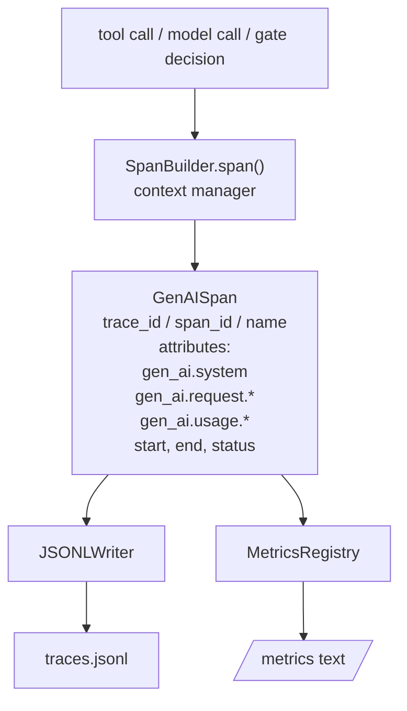
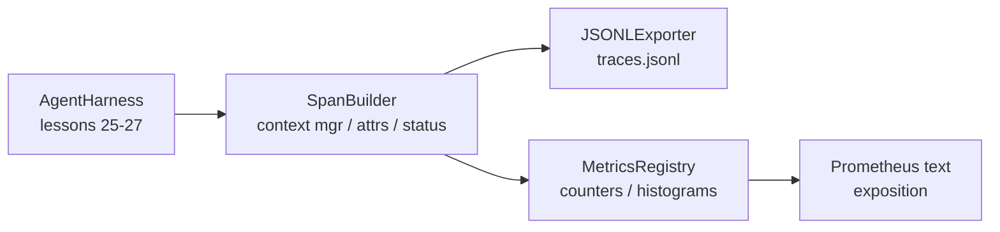

# Capstone Lekcja 28: Obserwowalność za pomocą rozpiętości Otel GenAI i metryk Prometheus

> Wiązanie agentów bez możliwości obserwowania to czarna skrzynka, która kosztuje. W tej lekcji ręcznie omówiono konstruktora zakresu, który emituje rekordy zgodne z konwencjami semantycznymi OpenTelemetry GenAI, zapisuje je do pliku JSON-Lines po jednym rozpiętości w wierszu i udostępnia liczniki i histogramy w formacie tekstowym Prometheus. Całość to stdlib Python i działa w trybie offline.

**Typ:** Kompilacja
**Języki:** Python (stdlib)
**Wymagania wstępne:** Faza 19 · 25 (bramki weryfikacyjne), Faza 19 · 26 (piaskownica), Faza 19 · 27 (wiązka eval), Faza 13 · 20 (OpenTelemetry GenAI), Faza 14 · 23 (konwencje Otel GenAI)
**Czas:** ~90 minut

## Cele nauczania

- Zbuduj klasę danych zakresu ukształtowaną zgodnie z konwencjami semantycznymi OpenTelemetry GenAI.
- Zaimplementuj eksporter JSONL, który zapisuje jeden samodzielny zakres w każdej linii.
- Twórz liczniki i histogramy za pomocą etykiet i ekspozycji w formacie tekstowym Prometheus.
- Zawiń dowolne wywołanie w menedżerze kontekstu zakresu, który rejestruje czas trwania, status i wyjątki.
- Sprawdź, czy emitowany zakres obejmuje podróż w obie strony przez `json.loads` i odpowiada kształtowi specyfikacji.

## Problem

Agent kodujący pracujący w środowisku produkcyjnym wytwarza w każdej turze trzy klasy artefaktów: wywołanie modelu, wykonanie narzędzia i decyzja bramki weryfikacyjnej. Żadne z nich nie jest przydatne bez strukturalnej telemetrii.

Pierwszym trybem awarii jest brakujący ślad. We wtorek coś poszło nie tak, ale jedynym zapisem jest dziennik czatu zawierający 500 linii. Nie ma zapisów, które narzędzie zostało uruchomione, jak długo to trwało, ile tokenów trafiło do zachęty ani czy brama czegokolwiek odmówiła. Autor agenta musi zgadywać.

Drugi tryb awarii to nieparsowalny ślad. Uprząż zapisywała zakresy, ale używała własnych, doraźnych nazw pól. Nic w Grafanie, Honeycomb, Jaeger ani lokalnym CLI nie może ich odczytać. Wszelkie narzędzia znajdujące się w stosie zespołu są marnowane, ponieważ rozpiętości są niestandardowe.

Trzeci tryb awarii to metryka niezagregowana. W śladzie widać jedno powolne wywołanie narzędzia, ale nie można odpowiedzieć na pytanie „Jakie jest opóźnienie p95 wywołań read_file w ciągu ostatniej godziny?” ponieważ nie ma żadnych metryk, są tylko ślady.

Konwencje semantyczne OpenTelemetry GenAI istnieją właśnie w tym celu. Definiują mały zestaw standardowych atrybutów, które obejmują emitery we wszystkich strukturach LLM. Jeśli Twoja uprząż zapisuje te atrybuty, każdy backend kompatybilny z Otel może je odczytać.

## Koncepcja



Każda operacja w uprzęży powoduje rozpiętość. Rozpiętość zawiera identyfikator śledzenia (całe wywołanie agenta), identyfikator rozpiętości (ta jedna operacja), nazwę (np. `gen_ai.chat`, `gen_ai.tool.execution`), atrybuty zgodne z konwencjami GenAI, czas rozpoczęcia i zakończenia oraz status.

Konwencje GenAI standaryzują te klucze atrybutów: `gen_ai.system` (który dostawca, np. `anthropic`, `openai`), `gen_ai.request.model` (identyfikator modelu), `gen_ai.request.max_tokens`, `gen_ai.usage.input_tokens`, `gen_ai.usage.output_tokens`, `gen_ai.response.model`, `gen_ai.response.id`, `gen_ai.operation.name` oraz klucze specyficzne dla narzędzia `gen_ai.tool.name` i `gen_ai.tool.call.id`.

Eksporter zapisuje JSONL. Jeden obiekt JSON na linię. Jest to najprostszy możliwy format, który narzędzia podrzędne mogą przesyłać strumieniowo, grepować i importować. Prawdziwy eksporter Otel posługiwałby się językiem OTLP gRPC; Eksporter JSONL lekcji jest odpowiednikiem trybu offline i kończy działanie zerem na każdej stacji roboczej.

Metryki żyją obok śladów. Licznik zwiększa się przy każdym wywołaniu narzędzia: `tools_called_total{tool="read_file"}`. Histogram rejestruje zaobserwowane opóźnienie: `tool_latency_ms{tool="read_file"}`. Obydwa serializują do formatu ekspozycji tekstu Prometheus, który jest de facto standardem dla metryk opartych na ściąganiu.

## Architektura



Konstruktor zakresu to mała klasa z metodą `span(name, attrs)`, która zwraca menedżera kontekstu. Menedżer kontekstu rejestruje czas rozpoczęcia przy wejściu, rejestruje czas zakończenia przy wyjściu, dołącza wyjątek, jeśli został zgłoszony, i przekazuje sfinalizowany zakres do eksportera.

Rejestr metryk to dwa dyktatury. Liczniki to `{(name, frozen_labels): int}`. Histogramy przechowują surowe próbki na liście i serializują je do segmentów histogramu Prometheus w czasie ekspozycji.

## Co zbudujesz

`main.py` wysyła:

1. `GenAISpan` klasa danych: trace_id, span_id, parent_span_id, nazwa, atrybuty, start_unix_nano, end_unix_nano, status, status_message, zdarzenia.
2. Klasa `SpanBuilder` z menedżerem kontekstu `span(name, attrs, parent=None)`.
3. Klasa `JSONLExporter` z `export(span)` dołączającą jedną linię.
4. Klasy `Counter` i `Histogram` plus `MetricsRegistry`.
5. `prometheus_exposition(registry)` generujący dane wyjściowe w formacie tekstowym.
6. Dekorator `wrap_tool_call(name)`, który emituje zakres i aktualizuje metryki.
7. Demo: syntetyzuje pełne wywołanie agenta (rozpiętość gen_ai.chat wokół rozpiętości narzędzi), zapisuje plik traces.jsonl, drukuje ekspozycję Prometheusa, wychodzi zerem.

Identyfikator zakresu i identyfikator śledzenia to 16-bajtowe ciągi szesnastkowe wygenerowane z `os.urandom`. Pasuje to do kontekstu śledzenia W3C firmy Otel. Eksporter nigdy nie rzuca; Pojawiają się błędy we/wy, ale wiązka przewodów nadal działa.

Histogram ma stały zestaw segmentów (domyślny zestaw OTel dla opóźnienia w milisekundach: 5, 10, 25, 50, 100, 250, 500, 1000, 2500, 5000, 10000, +Inf). Próbki są przechowywane w formie listy; ekspozycja oblicza liczbę przypadającą na segment na żądanie.

## Dlaczego ręcznie walcowane zamiast opentelemetry-sdk

Zestaw SDK Otel Python jest prawdziwą zależnością. To także kilka tysięcy linii kodu, wiele procesów dla eksportera OTLP i koszt czasu wykonania, który pochłania budżet lekcji. Wersja ręcznie walcowana uczy formatu drutu. W środowisku produkcyjnym podłączasz te same atrybuty do prawdziwego zestawu SDK i otrzymujesz za darmo eksporter OTLP, przetwarzanie wsadowe i wykrywanie zasobów.

Konwencje są stabilne. Format łącznika emitowany przez lekcję będzie analizowany w 2030 r., ponieważ Otel nigdy nie łamie nazw atrybutów GenAI; dodają tylko nowe.

## Jak to się komponuje z resztą ścieżki A

Lekcja 25 stworzyła łańcuch bramowy. Lekcja 26 stworzyła piaskownicę. Lekcja 27 stworzyła uprząż eval. Lekcja 28 sprawia, że ​​wszystkie trzy są obserwowalne. Lekcja 29 przedstawia każdy krok kompleksowego pokazu w różnych zakresach i na końcu wyświetla tekst Prometeusza.

## Uruchomienie

```bash
cd phases/19-capstone-projects/28-observability-otel-traces
python3 code/main.py
python3 -m pytest code/tests/ -v
```

Demo emituje `traces.jsonl` w katalogu roboczym lekcji (wyczyszczonym na końcu), następnie drukuje próbkę trzech zakresów, a następnie drukuje ekspozycję Prometheusa dla liczników i histogramów. Testy sprawdzają, czy obejmuje to cykl serializacji w obie strony, czy obecne są kanoniczne atrybuty GenAI, czy przyrosty są prawidłowo zliczane, a ekspozycja histogramu zawiera oczekiwaną liczbę segmentów.