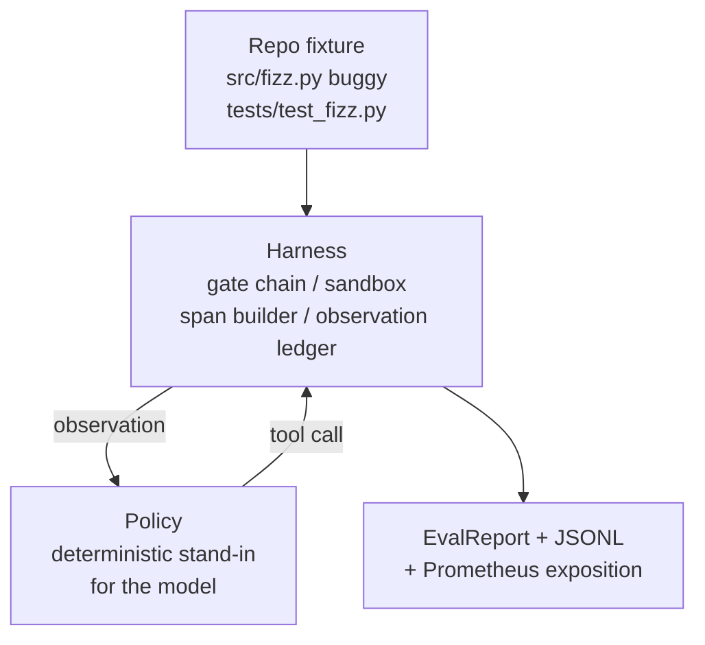
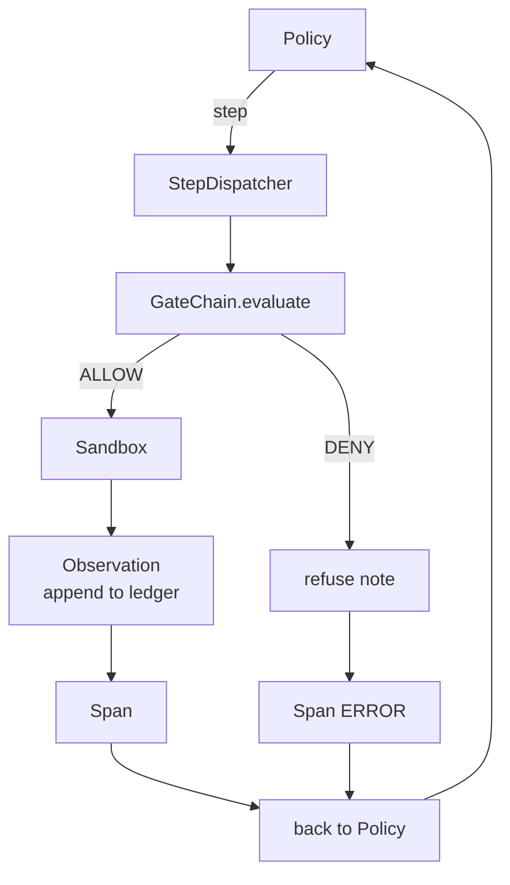

# Capstone Lekcja 29: Kompleksowy agent kodujący na wiązce przewodów

> Śledź wypłatę A. Ta lekcja łączy łańcuch bramek, piaskownicę, wiązkę eval i Otel w jednego działającego agenta kodującego, który naprawia rzeczywisty (mały, skalowany na urządzenie) błąd w wieloplikowym projekcie Pythona. Agent jest polityką deterministyczną, a nie LLM; podstawienie sprawia, że ​​lekcja jest powtarzalna i pokazuje, że uprząż była przez cały czas interesującą częścią. Umowa jest identyczna: na szwie polisy podłączany jest prawdziwy model.

**Typ:** Kompilacja
**Języki:** Python (stdlib)
**Wymagania wstępne:** Faza 19 · 25 (bramki weryfikacyjne), Faza 19 · 26 (piaskownica), Faza 19 · 27 (wiązka eval), Faza 19 · 28 (obserwowalność), Faza 14 · 38 (bramki weryfikacyjne), Faza 14 · 41 (stół warsztatowy dla prawdziwych repozytoriów), Faza 14 · 42 (zwieńczenie stołu warsztatowego agenta)
**Czas:** ~90 minut

## Cele nauczania

- Skomponuj łańcuch bram, piaskownicę, uprząż ewaluacyjną i narzędzie do tworzenia rozpiętości w pętlę jednego agenta.
- Zaimplementuj deterministyczną politykę, która używa read_file, run_tests i write_file, aby naprawić błąd urządzenia.
- Egzekwuj globalny budżet krokowy oraz budżet tokenów obserwacyjnych w całym cyklu.
- Emituj pełne ślady Otel GenAI i metryki Prometheus dla pełnego przebiegu.
- Sprawdź, czy agent rozwiązuje urządzenie w mniej niż 12 krokach przy zerowym wyłączeniu bramki przy użyciu legalnych narzędzi.

## Problem

Większość wersji demonstracyjnych agentów działa w izolacji: sama piaskownica, sama uprząż eval, sam emiter zakresu. Wyglądają dobrze. Skomponuj je, a szwy będą widoczne.

Łańcuch bram mówi ZEZWALAJ, ale piaskownica odmawia z powodu, którego łańcuch nie przewidywał. Uprząż eval rejestruje przepustkę, ale rozpiętości Otel mówią, że brama odmówiła użycia narzędzia, którego agent twierdzi, że użył. Licznik Prometeusza zwiększa się dwukrotnie, podczas gdy powinien być zwiększany raz. Budżet obserwacji został przekroczony, ale agent kontynuował pracę, ponieważ budżet był śledzony w łańcuchu, a piaskownica nie wiedziała.

Ta lekcja jest sprawdzianem integracyjnym dla całego utworu. Agent musi wykonać cztery czynności w podanej kolejności: przeczytać projekt, uruchomić testy, zidentyfikować błąd wynikający z niepowodzenia testu, napisać poprawkę, ponownie uruchomić testy i zatrzymać się. Każda operacja przechodzi przez łańcuch bramek. Każde wykonanie narzędzia przechodzi przez piaskownicę. Każdy krok jest owinięty przęsłem. Uprząż eval ocenia całość na końcu.

## Koncepcja



Polityka agenta jest maszyną stanów. Pięć stanów.

`SURVEY`: agent czyta listę projektów. Następny stan to RUN_TESTS.

`RUN_TESTS`: agent uruchamia polecenie testowe. Jeśli testy zakończą się pomyślnie, maszyna stanów zatrzyma się pomyślnie. W przeciwnym razie następnym stanem będzie INSPECT.

`INSPECT`: agent odczytuje uszkodzony plik źródłowy. Następnym stanem jest FIX.

`FIX`: agent zapisuje poprawiony plik. Następnym stanem jest WERYFIKACJA.

`VERIFY`: agent ponownie uruchamia komendę testową. Jeśli testy zakończą się pomyślnie, zatrzymaj sukces. W przeciwnym razie zatrzymaj się z porażką.

Każdy stan odpowiada wywołaniu narzędzia. Każde wywołanie narzędzia przechodzi przez łańcuch bramek. Jeżeli wywołanie narzędzia zostanie odrzucone, agent zgłasza odmowę w śladzie i zatrzymuje się.

Błąd związany z wyposażeniem występuje pojedynczo w `fizz.py`. Polityka deterministyczna wykrywa błąd w komunikacie o niepowodzeniu testu za pomocą wyrażenia regularnego i emituje poprawiony plik. Zastąpienie polisy LLM nie powoduje zmiany umowy uprzęży.

## Architektura



Lekcja jest samodzielna. Każdy element podstawowy z poprzedniej lekcji jest ponownie zaimplementowany w minimalnej skali w `main.py` (brama, piaskownica, księga, zakres), więc lekcja przebiega bez importowania rodzeństwa. Nazwy dokładnie odpowiadają lekcjom 25-28, więc mapowanie pojęciowe jest jednoznaczne.

## Co zbudujesz

`main.py` wysyła:

1. Minimalne elementy podstawowe uprzęży, skopiowane pod tymi samymi nazwami co lekcje 25-28: `GateChain`, `Sandbox`, `ObservationLedger`, `SpanBuilder`, `MetricsRegistry`.
2. Klasa `CodingAgentPolicy`: maszyna stanowa z pięcioma stanami.
3. Pomocnik `Repo`: przygotowuje katalog Scratch za pomocą dołączonego urządzenia buggy.
4. Klasa `AgentRun`: steruje polityką, wysyła poprzez wiązkę przewodów, zwraca `AgentRunReport`.
5. Dołączone urządzenie (`fixture_repo/`) z plikami src/fizz.py, tests/test_fizz.py i drzewem oczekiwanym/ dla wiązki eval.
6. Demo: uruchamia politykę od początku do końca, drukuje ślad krok po kroku, potwierdza przejście, drukuje metryki.

Dołączone urządzenie ma taki sam kształt jak struktura zadań z lekcji 27: plik z błędami i plik testowy. Komunikat o niepowodzeniu testu zawiera wystarczającą ilość informacji, aby polityka deterministyczna mogła zidentyfikować poprawkę. Prawdziwy LLM wykonałby tę samą pracę, wolniej i z szerszą pamięcią, ale nie zmieniłoby to oczekiwań wobec uprzęży.

## Dlaczego polisa nie jest LLM

Prawdziwy LLM wymaga klucza API, połączenia sieciowego i nieweryfikowalnej stochastyczności. Uprząż jest częścią, na której skupia się lekcja. Podłączenie polityki deterministycznej pozwala na uruchomienie lekcji na dowolnym laptopie programisty bez zewnętrznych zależności i pozwala zestawowi testów sprawdzić dokładną liczbę kroków.

Zasady lekcji stanowią ścisły podzbiór tego, co robi agent LLM. Polityka odczytuje repozytorium, widzi test zakończony niepowodzeniem, identyfikuje linię i emituje poprawkę. LLM przechodzi przez tę samą pętlę z tym samym kontraktem uprzęży; księgowość jest identyczna.

## Co potwierdza demonstracja

Kompleksowe demo potwierdza pięć rzeczy w momencie zakończenia, a zestaw testów potwierdza je programowo.

Polityka rozwiązała problem w mniej niż 12 krokach.

Budżet obserwacji nigdy nie został przekroczony.

Odmowy zerowej bramki oparte na legalnych narzędziach. (Agent nigdy nie wymyślił nazwy narzędzia, której odmówiono.)

Każdy krok ma odpowiedni zakres w pliku traces.jsonl.

Ekspozycja Prometheusa zawiera wpis `tools_called_total{tool="read_file"}` i histogram `tool_latency_ms`.

## Jak to się komponuje z resztą ścieżki A

Ta lekcja to integracja. W lekcji 25 napisano łańcuch bram. Lekcja 26 napisała piaskownicę. W lekcji 27 napisano uprząż eval. W lekcji 28 zapisano obserwowalność. Lekcja 29 pokazuje, że działają one jako system. Stąd rozciąga się wiązka prawdziwego agenta: zamień politykę deterministyczną na model, zamień dołączone urządzenie na zadanie prawdziwego repo, zamień eksportera JSONL na OTLP.

## Uruchomienie

```bash
cd phases/19-capstone-projects/29-end-to-end-coding-task-demo
python3 code/main.py
python3 -m pytest code/tests/ -v
```

Wersja demonstracyjna drukuje ślad krokowy, końcowy raport ewaluacyjny i ekspozycję Prometheus. Kod wyjścia to zero. Testy obejmują przejścia stanu polityki, odmowy bramek w wywołaniach narzędzi syntetycznych, kompleksowe działanie na dołączonym urządzeniu i niezmienniki budżetu krokowego.