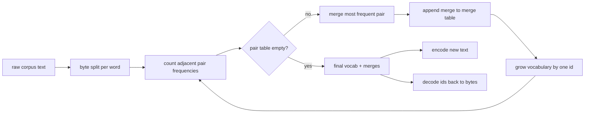
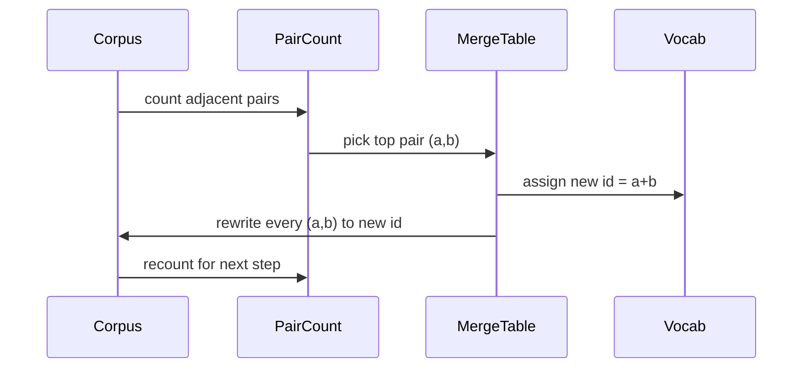

# Tokenizator BPE od podstaw

> Bajty dodane, identyfikatory usunięte, identyfikatory z powrotem do tych samych bajtów. Zbuduj tokenizator, od którego zaczyna się każdy nowoczesny model tekstu.

**Typ:** Kompilacja
**Języki:** Python
**Wymagania wstępne:** Lekcje fazy 04, lekcje transformatora fazy 07
**Czas:** ~90 minut

## Cele nauczania
- Trenuj słownictwo kodowania par bajtów z korpusu surowego tekstu, wielokrotnie łącząc najczęściej sąsiadującą parę symboli.
- Zaimplementuj deterministyczną tabelę scalania i zastosuj ją do świeżego tekstu, aby wygenerować strumień identyfikatorów podsłów.
- Dowolne wejście UTF-8 w obie strony do identyfikatorów i z powrotem bez utraty informacji.
- Rezerwuj i chroń specjalne tokeny (`<|endoftext|>`, `<|pad|>`), aby przetrwały szkolenie i dekodowanie.
- Powód, dla którego alfabet na poziomie bajtów jest właściwym poziomem dla tokenizera ogólnego przeznaczenia.

## Rama

Model języka nigdy nie widzi tekstu. Widzi liczby całkowite. Mapa od ciągu znaków do listy liczb całkowitych i z powrotem to tokenizator. Jeśli źle zrozumiesz tę warstwę, każda krzywa strat w biegu treningowym będzie mierzyć niewłaściwą rzecz.

Dominującą rodziną tokenizatorów podsłów dla ogólnych modeli tekstu jest kodowanie par bajtów. Pomysł jest niewielki. Zacznij od znanego alfabetu. Znajdź sąsiadującą parę symboli, która pojawia się najczęściej w korpusie szkoleniowym. Połącz go w nowy symbol. Powtarzaj, aż słownictwo osiągnie docelowy rozmiar. Kodowanie nowego tekstu powoduje ponowne użycie tej samej listy scalającej w tej samej kolejności.

Zbudujemy wariant na poziomie bajtu. Alfabet to 256 surowych bajtów, a nie punkty kodowe Unicode. Ten wybór pozwala tokenizerowi obsłużyć dowolne dane wejściowe w formacie UTF-8 bez cofania się do nieznanego tokena.

## Rurociąg

Strona ucząca i strona wnioskowania korzystają ze wspólnej tabeli scalania. To dzielenie się jest umową. Jeśli zmienisz kolejność scalania podczas wnioskowania, dekodujesz inny strumień identyfikatorów.

## Alfabet bajtowy

Pierwsze 256 identyfikatorów jest zarezerwowanych dla surowych bajtów od 0x00 do 0xFF. Gwarantuje to, że każdy ciąg wejściowy może zostać wyrażony w słownictwie, zanim nastąpi jakiekolwiek połączenie. Po bloku bajtów rezerwujemy niewielki zakres dla tokenów specjalnych. Pętla szkoleniowa nigdy nie proponuje tych identyfikatorów jako celów scalania, ponieważ całkowicie trzymamy je poza wstępnie tokenizowanym strumieniem.

Narzędzie pretokenizer dzieli korpus na białe znaki i granice interpunkcji, zanim zostanie to zauważone przez szkolenie. Bez tego podziału etap łączenia BPE z radością nauczyłby się łączenia, które przekracza granice słów, a słownictwo wypełnia się całymi popularnymi zwrotami. W przypadku podziału połączenia pozostają w słowie, a wynik jest uogólniany.

## Pętla treningowa

Dla każdego kroku szkoleniowego pętla wykonuje trzy czynności. Przechodzi przez każde słowo w korpusie i zlicza, jak często pojawia się każda sąsiadująca para bieżących symboli, ważona według tego, jak często pojawia się samo słowo. Wybiera parę z największą liczbą. Zapisuje każde wystąpienie tej pary w jeden nowy symbol, którego identyfikator jest kolejnym wolnym miejscem w słowniku. Następnie rejestruje połączenie.

Koszt każdego kroku jest liniowy pod względem rozmiaru korpusu wyrażonego jako lista sekwencji symboli. W przypadku miliona słów i docelowego słownictwa dziesięciu tysięcy identyfikatorów pętla kończy się w ciągu kilku sekund, ponieważ sekwencje symboli kurczą się w miarę łączenia.

## Kodowanie nowego tekstu

Wnioskowanie nie wywołuje licznika scalania. Stosuje tabelę scalania w tej samej kolejności, w jakiej została nauczona. W przypadku świeżego słowa koder zaczyna od podziału bajtów. Skanuje bieżącą sekwencję w poszukiwaniu scalania o najniższym rankingu (najwcześniejszego, które ma zastosowanie). Wykonuje to scalanie. Skanuje ponownie. Pętla kończy się, gdy w bieżącej sekwencji nie ma zastosowania żadne scalanie w tabeli.

Porządkowanie według rangi jest właściwością, która sprawia, że ​​kodowanie jest deterministyczne i dopasowuje zachowanie szkoleniowe na tym samym wejściu. Połączenie, którego nauczyłeś się jako pierwsze, znajduje się na górze tabeli i jest stosowane jako pierwsze. Jeżeli na tym samym stanowisku mogłyby zostać zastosowane dwie fuzje, wygrywa ta o niższej randze.

## Specjalne tokeny

Tokeny specjalne to identyfikatory, których strumień bajtów nigdy nie może wygenerować. Rezerwujemy je ręcznie. Do tej lekcji wystarczą dwa.

- `<|endoftext|>` oddziela dokumenty podczas wstępnego uczenia. Mówi modelowi: „tu zaczyna się nowy dokument, nie pozwól, aby kontekst poprzedniego przedostał się do wnętrza”.
- `<|pad|>` wypełnia krótkie sekwencje, więc partia może być tensorem prostokątnym. Maska strat ukrywa ją podczas treningu.

Koder akceptuje flagę zezwalającą na wprowadzenie specjalnych tokenów na wejściu. Gdy flaga jest wyłączona, ciągi `<|endoftext|>` i `<|pad|>` są tokenizowane jako bajty, które je oznaczają. Gdy flaga jest włączona, ciągi literałów są mapowane na ich zarezerwowane identyfikatory i nie podlegają żadnemu scalaniu.

## Gwarancja podróży w obie strony

Kodowanie, a następnie dekodowanie musi zwracać dokładnie bajty wejściowe. Dekoder łączy w kolejności rozwinięcie bajtów każdego identyfikatora. Ponieważ każdy identyfikator jest albo surowym bajtem, albo połączeniem dwóch wcześniej znanych identyfikatorów, rekurencyjne rozwinięcie zawsze kończy się na nieprzetworzonych bajtach. Dekodowanie zwraca następnie ciąg UTF-8 zapisany w tych bajtach.

Zestaw testów przedstawiony w tej lekcji sprawdza tę właściwość w przypadku niewidocznego zdania, zdania zawierającego emoji Unicode oraz zdania zawierającego dosłowny token `<|endoftext|>`.

## Czego ta lekcja nie robi

Nie buduje pretokenizera opartego na regexach w stylu największych tokenizerów produkcyjnych. Pretokenizerem jest tutaj mały odstęp i podział na znaki interpunkcyjne. Wystarczy stworzyć rozsądne połączenia na małym korpusie szkoleniowym, a kontrakt z resztą łańcucha lekcji pozostanie taki sam. Następna lekcja traktuje tokenizer jak czarną skrzynkę i tworzy na jej podstawie zestaw danych przesuwanego okna.

Nie powoduje to zrównoleglenia licznika par. Pętla w Pythonie nad korpusem kilku tysięcy słów kończy się w czasie krótszym niż sekunda. W przypadku większych korpusów oczywistym posunięciem jest liczenie par na słowo równolegle i redukcja.

## Jak odczytać kod

`main.py` definiuje cztery obiekty. `BPETokenizer` zawiera słownictwo, tabelę scalania i tabelę tokenów specjalnych. `train` to pętla treningowa. `encode` to ścieżka wnioskowania. `decode` to konkatenacja bajtów. Demo na dole trenuje mały tokenizer na wbudowanym korpusie, koduje wstrzymane zdanie, ponownie dekoduje identyfikatory i drukuje oba. Testy w `code/tests/test_bpe.py` przypinają właściwość podróży w obie strony, rezerwację tokenu specjalnego i kolejność scalania.

Uruchom wersję demonstracyjną. Następnie zmień docelowy rozmiar słownictwa w wersji demonstracyjnej z 300 na 600 i obserwuj, jak spada zakodowana długość wstrzymanego zdania. Ta krzywa to krzywa kompresji BPE.