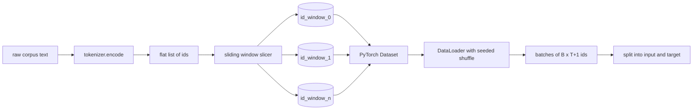
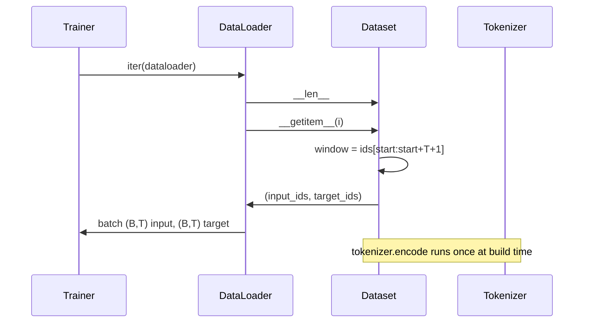

# Tokenizowany zbiór danych z przesuwanym oknem

> Przebieg przedtreningowy to funkcja od identyfikatorów tokenów po gradienty. W tej lekcji omówiono budowę przenośnika dostarczającego identyfikatory.

**Typ:** Kompilacja
**Języki:** Python
**Wymagania wstępne:** lekcje fazy 04, lekcje transformatora fazy 07, lekcja 30 tej fazy
**Czas:** ~90 minut

## Cele nauczania
- Przekształć surowy korpus w strumień identyfikatorów tokenów, wywołując jednokrotnie tokenizer.
- Pokrój strumień id na okna o stałej długości z konfigurowalnym krokiem nakładania się.
- Zbuduj zestaw danych PyTorch, który zwraca tensory wejściowe i docelowe na potrzeby przewidywania następnego tokenu.
- Zawiń zestaw danych w DataLoader z deterministycznym tasowaniem rozsiewanym na epokę.
- Powód kompromisu pomiędzy krokiem, redundancją i efektywnym rozmiarem zbioru danych.

## Rama

Przebieg przedtreningowy odczytuje pojedynczo jedną partię identyfikatorów tokenów i aktualizuje model. Kształt każdej partii ustala umowa szkoleniowa. W przypadku modelu języka przyczynowego partia zawiera identyfikatory wejściowe `(B, T)` i identyfikatory docelowe `(B, T)`, gdzie celem jest dane wejściowe przesunięte w lewo o jeden. Zadaniem potoku danych jest tworzenie tego kontraktu na żądanie, w sposób deterministyczny i odtwarzalny, z korpusu, który może zawierać kilka gigabajtów surowego tekstu.

Ta lekcja buduje potok. Tokenizer z poprzedniej lekcji zamienia tekst w długą, płaską listę identyfikatorów. Przesuwane okno dzieli tę listę na przykłady szkoleniowe. Niestandardowy zestaw danych udostępnia przykłady jako tensory. DataLoader grupuje je i tasuje ze znanym materiałem siewnym.

## Umowa kształtu

Przyczynowy LM wykorzystuje identyfikatory kształtu `(B, T)`, gdzie `B` to rozmiar partii, a `T` to długość kontekstu. Cel na pozycji `t` jest wejściem na pozycji `t+1`. Oznacza to, że każdy przykład szkolenia obejmuje `T+1` surowe identyfikatory. Krok okna kontroluje stopień nakładania się kolejnych przykładów.

Fragmentator nigdy nie zachodzi na granicę korpusu. Jeśli ostatnie okno nie ma wystarczającej liczby identyfikatorów, aby wypełnić pozycje `T+1`, fragmentator je upuszcza. Wypełnienie ogona za pomocą `<|pad|>` jest również prawidłowym wyborem, ale komplikuje maskę strat. Na tę lekcję odpuszczamy.

## Dlaczego okno przesuwne

Korpus przedtreningowy to jeden długi strumień identyfikatorów. Jeśli model widział tylko nienakładające się okna, każdy przykład szkoleniowy nauczyłby go tych samych granic `T`. Dostosowanie kroku przesuwa te granice, dzięki czemu model widzi bardziej zróżnicowane zadania typu „przewiduj następny token”.

Krok `T` powoduje utworzenie nienakładających się okien. Krok `T // 2` powoduje nałożenie się w pięćdziesięciu procentach i podwaja efektywny zbiór danych. Krok `1` powoduje maksymalne nakładanie się i zwiększa zbiór danych o współczynnik `T`. Koszt to więcej obliczeń na epokę. Korzyścią jest większa różnorodność granic. W większości przebiegów przedtreningowych stosuje się krok równy długości kontekstu, ponieważ korpus jest już znacznie większy, niż model może ukończyć w jednej epoce, więc argument dotyczący różnorodności granic jest słabszy.

## Klasa zestawu danych

Zestaw danych PyTorch ma dwie wymagane metody. `__len__` zwraca liczbę przykładów. `__getitem__` zwraca jeden przykład jako parę tensorów. Nasz zestaw danych przechowuje zakodowany strumień identyfikatora i krok. Indeksowanie do niego oblicza początek okna w locie, więc koszt pamięci wynosi jedną kopię strumienia id, niezależnie od tego, ile przykładów generuje krok.

Przesunięcie o jeden następuje wewnątrz `__getitem__`. Zestaw danych zwraca `(input, target)` gdzie `input = window[:-1]` i `target = window[1:]`. Oba są długimi tensorami PyTorch. Pętla treningowa traktuje je jako podstawową prawdę.

## Deterministyczne przetasowanie

DataLoader z `shuffle=True` odczytuje z generatora losowego PyTorch. Przekazując jawne `torch.Generator` inicjowane na epokę, otrzymujemy to samo przetasowanie za każdym razem, gdy uruchamiamy ponownie. Ta właściwość ma znaczenie, gdy chcesz porównać dwa przebiegi, które różnią się tylko jednym hiperparametrem. Bez materiału siewnego w dwóch seriach dane są przedstawiane w różnej kolejności, a krzywe strat różnią się z przyczyn niezwiązanych ze zmianą.

Kontrakt nasion przedstawiony w tej lekcji jest prosty. `epoch_seed = base_seed + epoch_index`. Podstawowy materiał siewny jest przekazywany na etapie budowy. Indeks epoki jest zwiększany przez trenera na górze każdej epoki. Ponowne uruchomienie z tym samym podstawowym ziarnem zawsze ma tę samą kolejność w każdej epoce.

## Próbnik wsadowy

Domyślny próbnik w PyTorch wybiera indeksy równomiernie i losowo z wyłączoną funkcją zastępowania. Tego właśnie chcemy przed treningiem. W przypadku dostrajania małego zbioru danych umowa jest taka sama. DataLoader składa partię, wywołując `__getitem__` `B` razy i łącząc wyniki. Ponieważ każdy przykład ma tę samą długość ze względu na konstrukcję, nie jest wymagana żadna logika dopełniania.

Dla uproszczenia lekcja ta zawiera `num_workers=0`. Podczas uruchomienia produkcyjnego pracownicy wykonują równoległe wywołania `__getitem__`. W przypadku naszego potoku jest to w większości przypadków niewykonalne, ponieważ praca to tylko wycinek tensora w pamięci, ale ten sam interfejs API zestawu danych obsługuje procesy robocze w czysty sposób.

## Liczenie przykładów

Dla strumienia identyfikacyjnego o długości `N`, długości kontekstu `T` i kroku `S` liczba przykładów wynosi `max(0, 1 + (N - (T + 1)) // S)`. Lekcja przedstawia to obliczenie jako metodę statyczną w zestawie danych, dzięki czemu trener może obliczyć całkowitą liczbę kroków na epokę bez iteracji.

## Czego ta lekcja nie robi

Nie przesyła strumieniowo z dysku. Korpus jest w całości zakodowany w pamięci i przechowywany jako pojedynczy tensor. Dla korpusu składającego się z kilku milionów identyfikatorów, który ma znacznie poniżej stu megabajtów i ma odpowiedni kształt do lekcji. Przesyłanie strumieniowe dysku to osobny problem, który można podłączyć poprzez wymianę pamięci, ale zachowuje umowę zestawu danych.

Nie obsługuje wielu dokumentów. Korpus traktowany jest jako jeden ciągły strumień identyfikatora. Granica następnego dokumentu jest kodowana poprzez wstawienie identyfikatorów `<|endoftext|>`, gdy korpus jest zbudowany z wielu dokumentów. Model uczy się przewidywać wokół granicy.

## Jak odczytać kod

`main.py` definiuje dwie klasy i jednego pomocnika. `SlidingWindowDataset` to zbiór danych PyTorch. `make_dataloader` zwraca skonfigurowany moduł DataLoader z generatorem zaszczepionym. `_encode_corpus_to_ids` to jednorazowe wywołanie tokenizatora. Demo na dole buduje w trakcie mały tokenizer, koduje wbudowany korpus, konstruuje zestaw danych i moduł ładujący dane, drukuje jedną partię i potwierdza kontrakt kształtu. Testy w `code/tests/test_dataset.py` ustalają formułę zliczania okien, właściwość przesunięcia o jeden, deterministyczne przetasowanie i kompromis między krokami.

Uruchom wersję demonstracyjną. Następnie zmień długość kontekstu z 16 na 32 i obserwuj, jak spada liczba przykładów na epokę. Ta liczba to budżet kroków na epokę.