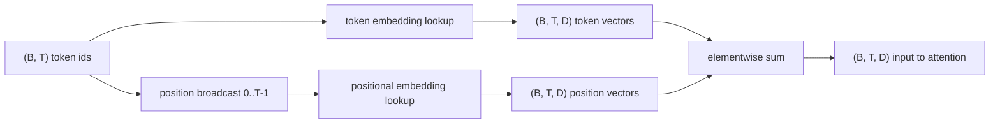
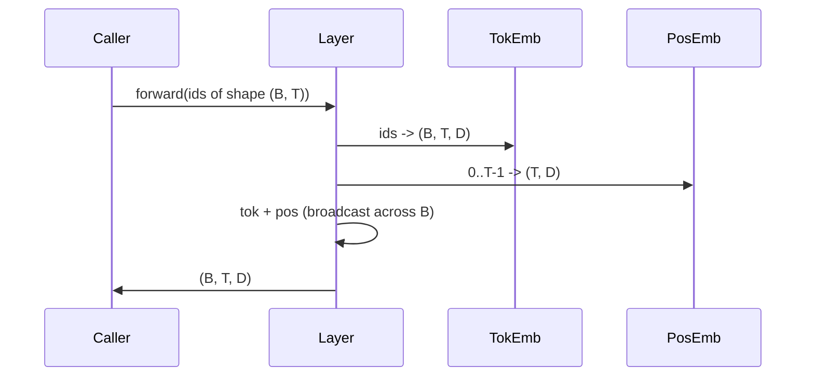

# Osadzanie tokenów i pozycyjnych

> Identyfikatory są liczbami całkowitymi. Model potrzebuje wektorów. Pomiędzy nimi znajdują się dwie tabele przeglądowe, a wybór tej pozycyjnej kształtuje to, czego model może się nauczyć.

**Typ:** Kompilacja
**Języki:** Python
**Wymagania wstępne:** lekcje fazy 04, lekcje transformatora fazy 07, lekcje 30 i 31 tej fazy
**Czas:** ~90 minut

## Cele nauczania
- Zbuduj tabelę wyszukiwania osadzającą tokeny, która odwzorowuje identyfikatory słownictwa na gęste wektory.
- Zbuduj wyuczoną tabelę wyszukiwania z osadzaniem pozycyjnym, indeksowaną według pozycji.
- Zbuduj stałe sinusoidalne osadzanie pozycyjne indeksowane według pozycji bez parametrów.
- Skomponuj osadzenie tokenowe i pozycyjne w jednym wejściu dla bloku transformatora.
- Kontrast wyuczony i osadzania sinusoidalne w uogólnianiu długości i liczeniu parametrów.

## Rama

Pierwszy kontakt modelu z identyfikatorem tokena polega na sprawdzeniu wiersza w macierzy osadzania tokenów. Macierz zawiera jeden wiersz na identyfikator słownika i jedną kolumnę na każdy wymiar modelu. Wyszukiwanie zwraca wektor, który reszta modelu traktuje jako znaczenie identyfikatora. Backprop aktualizuje wiersze użyte w przejściu do przodu. Podczas treningu geometria tych wierszy uczy się kodować podobieństwo kierunków.

Same identyfikatory tokenów nie mają kolejności. Model potrzebuje drugiego sygnału, który powie mu, że pozycja pierwsza różni się od pozycji siedemnastej. Dwie dominujące opcje dla tego sygnału to wyuczone osadzanie pozycyjne (druga tabela przeglądowa, jeden wiersz na pozycję) i osadzanie pozycyjne o stałej sinusoidalnej pozycji (wzór matematyczny bez parametrów). Wybór ma konsekwencje. Wyuczona tabela jest parametrem i jest ograniczona przez maksymalną długość kontekstu, na którym model był szkolony. Tabela sinusoidalna jest teoretycznie wolna od parametrów, a formuła rozciąga się na dowolną pozycję, ale `SinusoidalPositionalEmbedding` z tej lekcji oblicza wstępnie stałą tabelę w `max_context_length`, a jej `forward` podnosi się powyżej tej granicy; dlatego oba moduły wymuszają tutaj maksymalną długość kontekstu. Model może nadal mieć trudności z przekroczeniem długości treningu, nawet jeśli stół jest wystarczająco duży, aby można go było indeksować.

Ta lekcja buduje oba i łączy je z osadzeniem tokena w jednym wejściu dla bloku uwagi na następnej lekcji.

## Umowa kształtu

Dane wejściowe do etapu osadzania to partia identyfikatorów tokenów o kształcie `(B, T)`. Dane wyjściowe to tensor kształtu `(B, T, D)`, gdzie `D` to wymiar modelu. Każdy element wsadowy ma tę samą długość kontekstu `T`. Każda pozycja ma ten sam wymiar wektorowy `D`.



Kompozycja jest sumą, a nie konkatenacją. Sumowanie utrzymuje `D` na stałym poziomie w całej sieci i pozwala modelowi decydować na podstawie poszczególnych funkcji, czy w każdej warstwie dominuje znaczenie tokenu, czy jego pozycja.

## Macierz osadzania tokenów

Osadzanie tokenu jest tensorem parametru kształtu `(V, D)`, gdzie `V` to rozmiar słownictwa. PyTorch udostępnia go jako `nn.Embedding(V, D)`. Na początku wpisy są pobierane z małego Gaussa, tradycyjnie ze średnim zerem i odchyleniem standardowym około `0.02` dla modeli w skali transformatora. Dokładny init ma mniejsze znaczenie niż to, że pozostaje spójny w różnych przebiegach.

Przejście do przodu to pojedyncza operacja indeksowania. PyTorch mapuje identyfikatory `(B, T)` int64 na elementy pływające `(B, T, D)`, zbierając wiersze. Przejście do tyłu gromadzi gradienty tylko w rzędach, które zostały dotknięte podczas przejścia do przodu. Dwa wiersze, które nigdy nie pojawiły się w partii, otrzymują na tym etapie gradient zerowy.

Subtelny szczegół. Osadzanie tokenów i projekcja wyników na końcu modelu często mają wspólne wagi (wiązanie wag). Kiedy tak się dzieje, każde przejście do tyłu dotyka każdego rzędu osadzania po stronie wyjściowej. Lekcja przedstawia oba jako oddzielne moduły, ale ta sama macierz może odgrywać obie role w pełnym modelu.

## Wyuczone osadzanie pozycyjne

Wyuczone osadzanie pozycyjne to drugi `nn.Embedding` kształtu `(max_context_length, D)`. Wyszukiwanie jest oparte na identyfikatorze pozycji `0, 1, 2, ..., T-1`. Przejście do przodu rozgłasza ten wektor pozycji w całym wymiarze wsadowym.

Wadą wyuczonej tabeli jest to, że nie można odpytywać jej o pozycję `T`, jeśli model został przeszkolony tylko do pozycji `T-1`. Wiersz nie istnieje. Modele przeznaczone wyłącznie do dekodera produkcyjnego, które korzystają z tego schematu, włączają do architektury maksymalną długość kontekstu i nie przetwarzają dłuższych danych wejściowych.

## Sinusoidalne osadzanie pozycyjne

Sinusoidalne osadzenie pozycyjne jest funkcją od położenia do wektora. Pozycja `p` i funkcja `i` produkują

```python
angle = p / (10000 ** (2 * (i // 2) / D))
emb[p, 2k]     = sin(angle)
emb[p, 2k + 1] = cos(angle)
```

Funkcja nie ma parametrów. Każda pozycja ma unikalny wektor. Długość fali zmienia się geometrycznie w zależności od wymiarów elementu, więc dolne wymiary kodują położenie zgrubne, a wyższe wymiary kodują położenie dokładne.

Właściwość wynikająca z wyboru `sin` i `cos` jest taka, że ​​wektor w pozycji `p + k` jest funkcją liniową wektora w pozycji `p`. Dzięki temu warstwa uwagi może łatwo nauczyć się przesunięć względnych pozycji. Model nie potrzebuje osobnego parametru, aby wyrazić „Sprawdź pięć tokenów wstecz”.

Lekcja oblicza pełną tablicę sinusoidalną już na etapie konstruowania i indeksuje ją w późniejszym czasie.

## Kompozycja

Potok wejściowy wykonuje trzy czynności w kolejności. Przeczytaj identyfikatory tokenów. Wyszukaj wektory tokenów. Dodaj wektory pozycyjne. Zwróć sumę.



Rozgłaszanie w kroku sumy replikuje tensor pozycyjny `(T, D)` wzdłuż wymiaru wsadowego. PyTorch obsługuje to automatycznie, ponieważ tensor pozycyjny ma kształt `(1, T, D)` po zwolnieniu.

## Analiza kontrastowa

Lekcja uruchamia oba warianty na tych samych danych wejściowych i wyświetla dwie diagnostyki.

Pierwszym z nich jest liczba parametrów. Wyuczony wariant dodaje parametry `max_context_length * D` oprócz osadzania tokenu. Wariant sinusoidalny dodaje zero.

Drugim jest cosinus podobieństwa pomiędzy osadzaniami w sąsiednich pozycjach. Wariant sinusoidalny ma płynny i przewidywalny zanik, ponieważ funkcja jest ciągła. Wyuczony wariant podczas inicjalizacji ma niemal losowe podobieństwo, ponieważ wiersze są rysowane niezależnie. Po treningu wyuczony wariant zazwyczaj rozwija podobną gładką strukturę, ale musi odkryć tę strukturę na podstawie danych.

## Czego ta lekcja nie robi

Nie tworzy obrotowego kodowania pozycyjnego (RoPE) ani AliBi. Takie są współczesne wybory w transformatorach produkcyjnych. Obydwa mają tę samą umowę kształtu, co osadzenie tutaj (zastosuj transformację zależną od położenia do wektorów kształtu `(B, T, D)`), ale mają zastosowanie na etapie projekcji uwagi, a nie na wejściu. Następna lekcja buduje blok uwagi, a jednym z opcjonalnych rozszerzeń jest złożenie obrotowego w tam projekcji klucza zapytania.

Nie ćwiczy osadzania. Trening wymaga straty, która wymaga wyjścia modelowego, co wymaga uwagi i głowy LM. To następna lekcja i następna.

## Jak odczytać kod

`main.py` definiuje trzy moduły. `TokenEmbedding` otacza `nn.Embedding(V, D)`. `LearnedPositionalEmbedding` otacza `nn.Embedding(L, D)`. `SinusoidalPositionalEmbedding` wstępnie oblicza tabelę i udostępnia ją jako bufor. `EmbeddingComposer` łączy ze sobą osadzanie tokenu i osadzanie pozycyjne. Demo na dole drukuje kształty, liczniki parametrów i diagnostykę podobieństwa pozycji sąsiadów. Testy `code/tests/test_embeddings.py` kształtu pinów, zachowania rozgłaszania, liczby parametrów i wzoru sinusoidalnego.

Uruchom wersję demonstracyjną. Następnie zmień wymiar modelu `D` z 64 na 32 i obserwuj, jak zmieniają się sinusoidalne pasma długości fal.