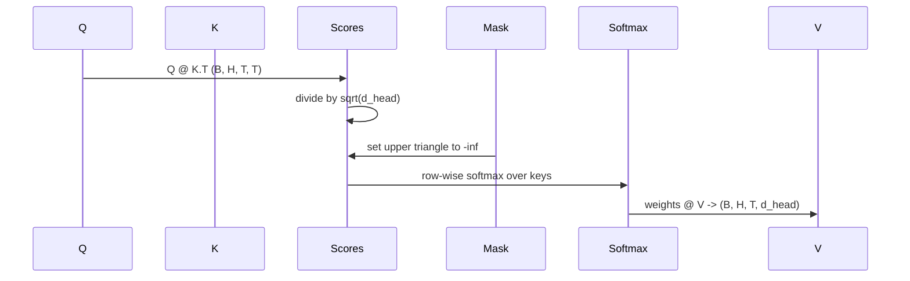

# Wielogłowa samouważność

> Jeden rzut liniowy, trzy widoki, H równoległych głowic, jedna maska. Blok uwagi, ponieważ model faktycznie go używa.

**Typ:** Kompilacja
**Języki:** Python
**Wymagania wstępne:** lekcje fazy 04, lekcje transformatora fazy 07, lekcje od 30 do 32 tej fazy
**Czas:** ~90 minut

## Cele nauczania
- Zaimplementuj zbiorczą projekcję zapytania/klucza/wartości jako pojedynczą warstwę liniową podzieloną na H głowice.
- Oblicz skalowaną uwagę iloczynu skalarnego przy prawidłowej normalizacji i obsłudze typu d.
- Zastosuj maskę przyczynową, która uniemożliwia uwzględnienie pozycji w przyszłych pozycjach.
- Sprawdź wagi uwagi na głowę, aby uzyskać stałe dane wejściowe i powód, na co patrzy każda głowa.
- Trenuj małą koncentrację uwagi na zabawkowym zadaniu i obserwuj, jak spada strata, gdy głowy się specjalizują.

## Rama

Uwaga to funkcja, która pozwala reprezentacji tokena pobierać informacje z innych tokenów w tej samej kolejności. Samouważność oznacza, że ​​zapytania, klucze i wartości pochodzą z tych samych danych wejściowych. Wielogłowicowy oznacza, że ​​projekcja jest podzielona na H równoległych problemów z uwagą, których wyniki są łączone i rzutowane z powrotem.

Wydajny wzorzec implementacji to jedna warstwa liniowa, która rzutuje z `D` do `3 * D` i jest dzielona na trzy widoki, a następnie przekształcana w głowy H o rozmiarze `D // H` każdy. Matmul, softmax i suma ważona odbywają się jako wsadowe operacje tensora, więc głowice działają równolegle na akceleratorze.

Ta lekcja buduje ten blok. Dodaje także maskę przyczynową, dzięki czemu ten sam kod działa jako warstwa uwagi w modelu językowym obsługującym tylko dekoder. Następna lekcja składa blok w pełny transformator, a następna lekcja go trenuje.

## Umowa kształtu

Dane wejściowe to `(B, T, D)`. Dane wyjściowe to `(B, T, D)`. Maska jest `(T, T)` lub może być do niej transmitowana. Wewnątrz bloku tensory pośrednie mają kształt `(B, H, T, d_head)` gdzie `d_head = D // H`. Ograniczenie to `D % H == 0`.

```mermaid
flowchart LR
    A["(B, T, D) input"] --> B[Linear D -> 3D]
    B --> C["split into Q, K, V"]
    C --> D["reshape to (B, H, T, d_head)"]
    D --> E["scores = Q @ K.T / sqrt(d_head)"]
    E --> F[apply causal mask]
    F --> G[softmax over keys]
    G --> H["context = weights @ V"]
    H --> I["reshape to (B, T, D)"]
    I --> J[output Linear D -> D]
    J --> K["(B, T, D) output"]
```

Dwie warstwy liniowe (projekcja QKV i projekcja wyjściowa) są jedynymi parametrami w bloku. Maska, softmax, matmuls i zmiany kształtu są wolne od parametrów.

## Rozłam QKV

Implementacja naiwna ma trzy oddzielne warstwy liniowe, po jednej dla Q, K i V. Wydajna implementacja ma pojedynczą warstwę, która generuje funkcje `3 * D` i dzieli wynik. Obydwa są matematycznie równoważne, ponieważ trzy oddzielne mnożenia macierzy przez wagi `(D, D)` to dokładnie jedno mnożenie macierzy przez nałożoną na nie wagę `(3D, D)`.

Wydajna wersja jest szybsza, ponieważ akcelerator uruchamia jeden matmul zamiast trzech. Łatwiej jest także inicjować, ponieważ trzy podmacierze żyją w tym samym tensorze parametrów i mogą być inicjalizowane razem.

## Zmiana kształtu głowy

Po podziale każdy z Q, K, V ma wartość `(B, T, D)`. Aby przekształcić to w problemy z uwagą równoległą H, zmieniamy kształt na `(B, T, H, d_head)` i transponujemy na `(B, H, T, d_head)`. Wymiar głowy znajduje się teraz obok wymiaru wsadowego, więc PyTorch traktuje uwagę przypadającą na głowę jako operację wsadową obejmującą `B * H` niezależne instancje.

Wymiar d_head pozostaje ostatni, więc wynik matmul `Q @ K.transpose(-2, -1)` go zawęża. Wynik to `(B, H, T, T)` wynik uwagi przypadający na głowę.

## Skalowanie

Wyniki są dzielone przez `sqrt(d_head)` przed softmaxem. Bez tego skalowania produkty kropkowe rosną wraz ze wzrostem `d_head` i przesuwają softmax w tryb, w którym jeden wpis ma prawie całą masę, a pozostałe są znikomo małe. Gradienty w tym systemie są małe i utrudniają naukę. Dzielenie przez `sqrt(d_head)` pozwala zachować wariancję wyników w przybliżeniu stałą w zależności od rozmiaru głowy.

## Maska przyczynowa

Model języka obsługujący tylko dekoder może opierać się jedynie na przeszłości podczas przewidywania następnego tokenu. Maska to wymusza. Konkretnie, przed softmaxem, każdy wpis powyżej przekątnej macierzy wyników `(T, T)` jest zastępowany przez ujemną nieskończoność. Po softmaksie te pozycje uzyskują wagę zerową.

Rejestrujemy maskę jako bufor podczas konstruowania, dzięki czemu znajduje się ona na tym samym urządzeniu co model i nie jest częścią wykresu gradientu. Maska obejmuje maksymalną długość kontekstu, jaką blok kiedykolwiek zobaczy. W czasie przewijania wycinamy lewy górny róg `(T, T)`.

## Projekcja wyjściowa

Po wektorach kontekstu na głowę `(B, H, T, d_head)` transponujemy z powrotem do `(B, T, H, d_head)`, zmieniamy kształt na `(B, T, D)` i stosujemy końcowe `(D, D)` rzutowanie liniowe. Projekcja wyjściowa pozwala modelowi wymieszać głowy. Bez tego głowy H łączyłyby się ponownie tylko w późniejszych warstwach, a blok byłby sztucznie ograniczony.

## Uwaga kontrola wagi

Lekcja przedstawia flagę `return_weights=True` przy przepustce do przodu. Po ustawieniu blok zwraca wagę uwagi na głowę w kształcie `(B, H, T, T)` wraz z danymi wyjściowymi. Demo drukuje mapę cieplną ciężarów jednej głowy na krótkim wejściu, dzięki czemu można zobaczyć strukturę trójkąta przyczynowego i skupienie na pozycję.

W wytrenowanym modelu różne głowy uczą się różnych wzorców. Niektóre głowy zajmują się bezpośrednio poprzedzającym żetonem. Niektóre głowy pilnują początku sekwencji. Niektóre głowy rozkładały uwagę niemal równomiernie. Hak inspekcyjny jest punktem wejścia do pracy nad interpretacją.

## Demo szkoleniowe

Demo na dole `main.py` łączy blok uwagi z małą głową LM i ćwiczy całość w powtarzalnym zadaniu. Każdy wiersz danych wejściowych to pojedynczy losowy identyfikator replikowany w całym kontekście. Celem jest wejście przesunięte o jeden, więc model musi dowiedzieć się, że następny żeton jest taki sam jak poprzedni. Strata ma charakter entropii krzyżowej. Przy H=4, D=32, T=12 i słownictwie 64, strata spada z losowej (około `log(64) ~ 4.16`) do znacznie poniżej `1.0` w ciągu trzech epok procesora.

Celem demonstracji nie jest nauczenie przydatnego modelu. Chodzi o to, aby potwierdzić, że gradienty przepływają przez każdy element bloku, a szefowie dowiedzą się czegoś o problemie, w którym odpowiedź jest oczywista.

## Czego ta lekcja nie robi

Nie dodaje bloku sprzężenia zwrotnego. Warstwa transformatora w prawdziwym modelu to uwaga, po której następuje dwuwarstwowy MLP z połączeniem resztkowym i normą warstw wokół każdej z nich. Następna lekcja dodaje je.

Nie implementuje kodowania pozycyjnego obrotowego ani AliBi. Obydwa obowiązują na etapie projekcji QKV w tym samym bloku, lecz stanowią odrębną jednostkę dydaktyczną. Zbudowany tutaj blok jest kompatybilny z obydwoma, przekształcając Q i K przed matmul.

Nie implementuje pamięci podręcznej KV do wnioskowania. Buforowanie kluczy i wartości podczas przekazywania w przód to optymalizacja, która przyspiesza dekodowanie autoregresyjne. Zmienia kontrakt kształtu na tensorach K i V, ale nie na Q. Należy to do lekcji wnioskowania.

## Jak odczytać kod

`main.py` definiuje `MultiHeadSelfAttention`. Klasa zawiera dwie warstwy liniowe i zarejestrowany bufor maski. Przejście do przodu projektuje, zmienia kształty, punktuje, maski, softmaxy, ciężary, zmienia kształty i ponownie projektuje. Demo na dole tworzy mały model, który skupia uwagę za pomocą osadzania tokenów i pozycyjnych oraz głowy LM, szkoli go w zakresie zadania kopiowania przez trzy epoki i drukuje krzywą straty oraz mapę cieplną uwagi na głowę. Testy w `code/tests/test_attention.py` łączą kontrakt kształtu, właściwość przyczynowości, właściwość softmax, właściwość podziału głowy i przepływ gradientu.

Uruchom wersję demonstracyjną. Następnie zwiększ `n_heads` z 4 do 8 (zachowując `d_model=32`, więc `d_head=4`) i obserwuj zmianę mapy cieplnej.