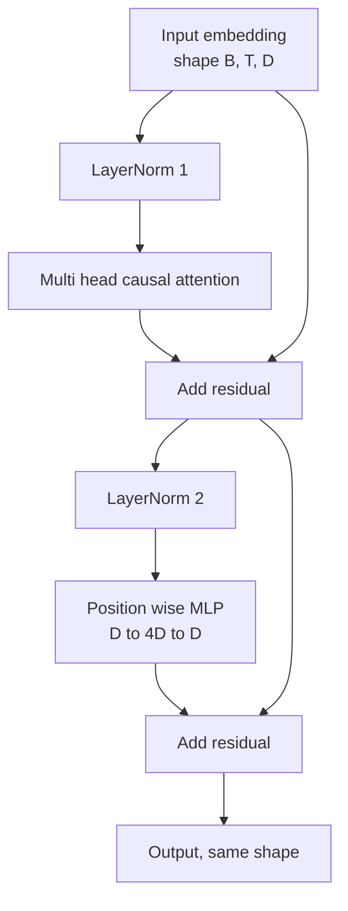
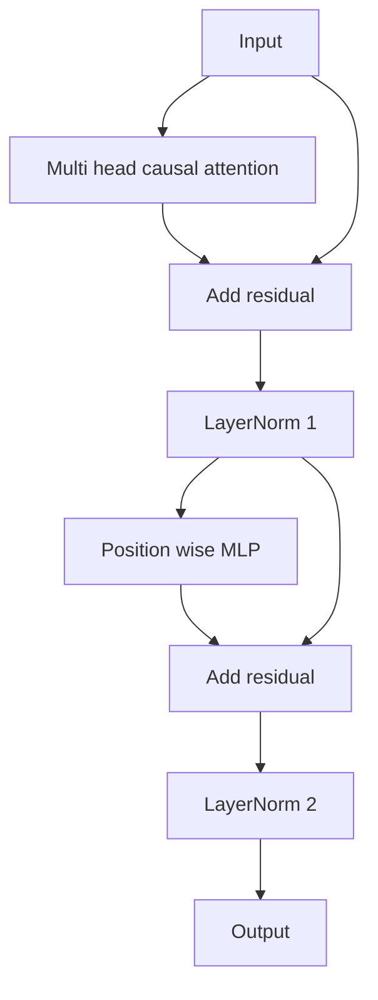

# Blok transformatorowy od podstaw

> Jeden blok to jednostka każdego nowoczesnego dekodera LLM. Norma warstwowa, uwaga wielogłowicowa, resztkowa, MLP, resztkowa. Wariant sprzed LN trenuje stabilnie bez rozgrzewki. Wariant post-LN jest tym, co wysłano z oryginalnego papieru. Ta lekcja buduje oba elementy obok siebie i pokazuje, który z nich przetrwa 12-warstwowy stos przy typowym tempie uczenia się.

**Typ:** Kompilacja
**Języki:** Python
**Wymagania wstępne:** Faza 19, lekcje od 30 do 33 (tokenizer, osadzanie, matematyka uwagi, wsadowy moduł ładowania danych)
**Czas:** ~90 minut

## Cele nauczania

- Zbuduj blok transformatora w PyTorch z czterech ruchomych elementów: LayerNorm, wielogłowicowa uwaga przyczynowa, połączenia resztkowe, MLP uwzględniające położenie.
- Umieść LayerNorms w dwóch konfiguracjach (przed LN i po LN) i wyjaśnij, dlaczego trenuje się stabilnie bez rozgrzewki.
- Zaimplementuj maskowanie przyczynowe wewnątrz uwagi wielogłowicowej, aby token `i` nie widział tokenów `j > i`.
- Śledź przepływ gradientu w obu wariantach na stosie 12 warstw i odczytaj wynik bez machania ręką.
- Użyj bloku ponownie jako jednostki wsuwanej, gdy podczas następnej lekcji zostanie zmontowany GPT o 124 milionach parametrów.

## Problem

Transformator to powtarzany jeden blok. Raz popełnij błąd w bloku, powtórz to dwanaście razy, a wyślesz model, który różni się w pierwszej epoce lub który wymaga hacków na rozgrzewkę przez resztę drogi. Dwa tryby awarii, które zobaczysz w tej lekcji, nie są egzotyczne. Pojawiają się za pierwszym razem, gdy uczeń naiwnie układa klocki. Jedną z nich jest warstwa uwagi, która skupia się na przyszłości. Drugi to LayerNorm umieszczony tam, gdzie nie jest w stanie ujarzmić sygnału szczątkowego na głębokości.

Poprawka ma charakter mechaniczny, gdy ją zobaczysz. Blok ma dokładnie dwie ścieżki resztkowe i dokładnie dwie pozycje normalizacyjne. Wybierz pozycje poprawnie, a reszta stosu to tylko księgowość.

## Koncepcja

Każdy blok transformatora przeznaczony wyłącznie do dekodera jest funkcją, która przyjmuje tensor o kształcie `(batch, sequence, embedding)` i zwraca tensor o tym samym kształcie. Wewnątrz pracę wykonują dwie podwarstwy.



To jest wersja sprzed LN. LayerNorm znajduje się wewnątrz pozostałej gałęzi, przed podwarstwą. Połączenie resztkowe przenosi nieznormalizowany sygnał do przodu.

Wariant po LN przenosi LayerNorm po dodaniu resztkowym.



Kształt jest identyczny. Zachowanie szkoleniowe nie. W przypadku post-LN gradient przepływający z powrotem przez ścieżkę resztkową musi przejść przez LayerNorm. Na głębokości dwunastej i tempie uczenia się `3e-4` gradient ten zmniejsza się na tyle szybko, że potrzebny jest harmonogram rozgrzewki. Pre-LN pozostawia ścieżkę resztkową nieznormalizowaną, więc gradienty rozchodzą się czysto do warstwy osadzającej. Z tego powodu pre-LN jest konfiguracją, z którą dostarczane są późniejsze GPT-2.

### Przyczynowa uwaga wielogłowa

Podwarstwa uwagi rzutuje dane wejściowe na trzy sposoby na tensory zapytania, klucza i wartości. Kształt każdego z nich zmienia się z `(B, T, D)` na `(B, H, T, D/H)`, gdzie `H` to liczba osób. Skalowana uwaga produktu kropkowego oblicza `softmax(Q K^T / sqrt(d_k))` na głowę, maskuje górny trójkąt do ujemnej nieskończoności, stosuje maskę za pomocą softmax, a następnie mnoży przez `V`. Głowy są ponownie łączone w pojedynczy tensor `(B, T, D)` i rzutowane jeszcze raz. Maska jest jedynym elementem, który czyni model przyczynowym. Zapomnij o masce, a wytrenujesz model, który oszukuje.

### MLP

MLP pod względem pozycji stosuje tę samą dwuwarstwową sieć niezależnie do każdego tokena. Ukryta szerokość jest czterokrotnością szerokości osadzania, aktywacja to GELU, a zanik następuje po drugiej liniowej. Żadne tokeny nie komunikują się ze sobą wewnątrz MLP. Całe mieszanie symboli odbywa się w skupieniu.

### Pozostałe połączenia służą dwóm celom

Sprawiają, że ścieżka gradientu jest addytywna na całej głębokości, co utrzymuje normę gradientu w skali w dwunastu warstwach. Pozwalają także każdemu blokowi nauczyć się dodatkowej aktualizacji działającej reprezentacji, a nie pełnego zastąpienia. Obydwa efekty powodują skalowanie bloku.

## Zbuduj to

`code/main.py` implementuje:

- `class LayerNorm` z możliwością uczenia się skali i przesunięcia, obciążonym eps, stosowanym na wektor tokenu.
- `class MultiHeadAttention` z `num_heads`, `head_dim = d_model // num_heads`, połączoną projekcją QKV, zarejestrowaną maską przyczynową, uwagą i resztkowym porzuceniem.
- `class FeedForward` z dwiema warstwami liniowymi, aktywacją GELU, rezygnacją.
- `class TransformerBlock` z flagą `pre_ln` przełączającą pomiędzy dwoma wariantami.
- Demo budujące 6-warstwowy stos przed LN i 6-warstwowy stos po LN z identycznymi danymi wejściowymi i wydrukami (a) kształtu wyjściowego, (b) normy gradientu przy osadzaniu po jednym przejściu wstecz.

Uruchom to:

```bash
python3 code/main.py
```

Wynik: sprawdzenie kształtu na obu stosach, normy gradientu obok siebie. Gradient osadzania stosu przed LN jest o rząd wielkości większy niż stos po LN przy tej samej szybkości uczenia się, co stanowi sygnał empiryczny przed pociągami LN bez rozgrzewania.

## Stos

- `torch` dla matematyki tensorowej, autogradu i `nn.Module` hydrauliki.
- Nie `transformers`, brak wstępnie wytrenowanych ciężarów. Blok jest implementowany z prymitywów.

## Wzorce produkcji na wolności

Trzy wzory zmieniają blok podręcznika w coś, co można wysłać.

**Skondensowana projekcja QKV.** Trzy oddzielne warstwy liniowe kosztują trzy uruchomienia jądra i trzy matmuls. Jedna warstwa liniowa o szerokości `3 * d_model` wykonuje tę samą pracę podczas jednego uruchomienia, a następnie dzieli wynik wzdłuż ostatniej osi. Połączona ścieżka jest szybsza na każdym akceleratorze i odpowiada wszystkim dostępnym referencyjnym implementacjom GPT-2, LLaMA i Mistral.

**Zarejestrowany bufor maski przyczynowej.** Maska zależy tylko od maksymalnej długości kontekstu. Przydziel je raz na etapie tworzenia za pomocą `register_buffer`, podziel aktywne okno na każde przejście w przód i pomiń przydzielanie na każde połączenie. Zapomnienie o tym zamienia maskę w gorący punkt alokatora w długim kontekście.

**Wycofanie się w dwóch miejscach, a nie w trzech.** Wycofanie następuje po softmax uwagi (utrata uwagi) i po drugiej linijce MLP (resztkowa przerwa). Zanik samej pozostałości przerywa tożsamość addytywną, która umożliwia przepływ gradientu na głębokości. Niektóre wczesne wdrożenia popełniły błąd i zapłaciły za to kruchym szkoleniem.

## Użyj tego

- Blok z tej lekcji podłącza się bezpośrednio do zespołu GPT z lekcji 35, bez modyfikacji.
- Wariant sprzed LN jest używany przez każde nowoczesne otwarte ciężary LLM. W oryginalnym artykule z 2017 r. wykorzystano wariant post-LN. Znajomość obu wystarczy, aby przeczytać dowolną architekturę dekodera, którą napotkasz.
- Zamień GELU na SiLU i uzyskaj aktywację rodziny LLaMA. Zamień LayerNorm na RMSNorm i uzyskaj normalizację rodziny LLaMA. Ten sam szkielet.

## Ćwiczenia

1. Dodaj flagę `bias=False` do każdej linijki w bloku. Nowoczesne otwarte ciężarki LLM są dostarczane bez uprzedzeń na warstwach liniowych. Zmierz, ile parametrów zapisujesz w 12-warstwowym modelu 768 dim.
2. Zastąp `nn.LayerNorm` ręcznie zwijaną normą RMSNorm i sprawdź, czy kształt wyjściowy nie uległ zmianie.
3. Dodaj flagę zwracającą wagi uwagi dla pierwszej głowy jako tensor `(B, T, T)`. Narysuj górny trójkąt, aby potwierdzić, że po softmax wynosi zero.
4. Zbuduj kontrolę poprawności, która zasila tensor `(2, 16, 384)` za pomocą `H=6` w obu wariantach i sprawdza, czy dane wyjściowe w przód są różne (na przykład `not torch.allclose`), gdy wagi są inicjowane identycznie, a przerwanie jest ustawione na zero.

## Kluczowe terminy

| Termin | Co ludzie mówią | Co to właściwie oznacza |
|------|-----------------|--------------------------------------|
| Przed LN | „Przed normą” | LayerNorm wewnątrz pozostałej gałęzi, przed każdą podwarstwą; reszta niesie nieznormalizowany sygnał |
| Post-LN | „Po normie” | LayerNorm po dodaniu pozostałości; co przysłała gazeta z 2017 r., a co wymaga rozgrzewki |
| Maska przyczynowa | „Maska trójkątna” | Górny trójkąt logitów uwagi jest ustawiony na ujemną nieskończoność, więc token i nie może odczytać tokenu j, gdy j jest większe niż i |
| Skondensowany QKV | „Projekcja łączona” | Jedna linijka o szerokości 3D zamiast trzech linijek o szerokości D; jedno jądro, jeden matmul |
| Pozostały strumień | „Pomiń połączenie” | Nieznormalizowany tensor przepływający z góry na dół przez każdy blok; co każdy blok dodaje do |

## Dalsze czytanie

- Lekcja 02 fazy 7 (samouważność od zera) dotycząca matematyki uwagi pod tym blokiem.
- Faza 7, lekcja 05 (pełny transformator) dla wersji dekodera kodera tego samego szkieletu.
- Faza 10, lekcja 04 (przedtreningowy mini GPT) dla procedury szkoleniowej, do której podłącza się ten blok.
- Etap 19, lekcja 35 (ta ścieżka), która składa dwanaście z tych bloków w model GPT.