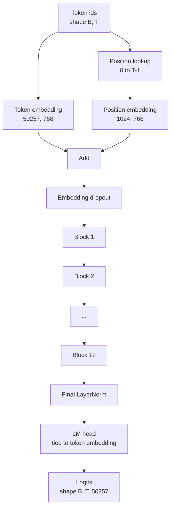
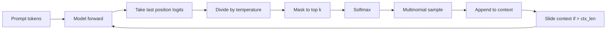

# Zespół modelu GPT

> Dwanaście ułożonych w stos bloków, osadzenie tokenu, osadzenie wyuczonej pozycji, ostateczna norma LayerNorm i powiązany nagłówek modelu językowego. To cały model GPT ze 124 milionami parametrów. Ta lekcja łączy te elementy w klasę robotniczą, liczy parametry, aby potwierdzić, że model odpowiada kształtowi referencyjnemu 124M, i generuje tekst z wielomianowym próbkowaniem, temperaturą i górnym współczynnikiem k.

**Typ:** Kompilacja
**Języki:** Python
**Wymagania wstępne:** Faza 19, lekcje od 30 do 34
**Czas:** ~90 minut

## Cele nauczania

- Złóż blok transformatora z lekcji 34 w pełny model GPT: osadzanie tokenów, osadzanie pozycji, N bloków, ostateczna LayerNorm, głowa modelu językowego.
- Odtwórz konfigurację 124 milionów parametrów: słownictwo 50257, kontekst 1024, osadzanie 768, dwanaście głów, dwanaście warstw.
- Powiąż wagi modelu języka z osadzeniem tokena i wyjaśnij, dlaczego pozwala to zaoszczędzić ~38 milionów parametrów w tej skali.
- Generuj tekst na podstawie podpowiedzi z próbkowaniem wielomianowym, skalowaniem temperatury i obcięciem górnego k, zachowując długość kontekstu za pomocą przesuwanego okna.
- Zmierz liczbę parametrów i koszt przejścia w przód w stosunku do docelowej wartości 124M.

## Problem

Blok transformatora sam w sobie nic nie robi. Musisz zamienić identyfikatory tokenów na wektory, wymieszać informacje o pozycji, przepuścić je przez stos i wyświetlić z powrotem do logitów słownictwa. Zapomnij o którymkolwiek z tych czterech kroków, a model albo nie przejdzie do przodu, będzie dryfował w informacjach o pozycji, albo nie będzie mógł mówić.

Kształt modelu również ma znaczenie. Referencyjny mały GPT-2 ma 124 miliony parametrów przy dokładnie takiej konfiguracji jak powyżej. Liczby nie są magiczne. Vocab 50257 razy osadzający 768 to tabela tokenów. Pozycja 1024 razy 768 to tabela pozycji. Dwanaście bloków z około 7 milionami parametrów każdy to 84 miliony. Ostatnia głowa ponownie wykorzystuje stół z żetonami, wiążąc wagę. Zsumuj kawałki, a otrzymasz 124 miliony. Budowanie modelu, którego liczba parametrów nie jest zgodna z wartością referencyjną, oznacza, że ​​coś zostało źle podłączone.

## Koncepcja



Identyfikatory tokenów stają się wektorami tokenów. Identyfikatory pozycji stają się wektorami pozycji. Obydwa są dodawane i przesyłane przez stos. Ostateczna LayerNorm to jedyny element poza blokami, który przetrwa każdy nowoczesny wariant. Głowica LM ponownie wykorzystuje matrycę osadzania tokenów, co oznacza wiązanie wag.

### Wiązanie ciężarów

Osadzenie tokenu ma kształt `(vocab, d_model)`. Głowa modelu języka musi wyświetlać obraz od `d_model` z powrotem do `vocab`. To są wzajemne transpozycje. Wiązanie tych dwóch oznacza dosłownie ten sam tensor parametrów, użyty dwukrotnie. W vocab 50257 i d_model 768 macierz ma 38 milionów parametrów. Niewiązany, płacisz za to dwa razy. Związany, płacisz za to raz, a także otrzymujesz nieco czystszy sygnał gradientowy, ponieważ osadzanie i aktualizacja głowicy odbywają się razem.

### Osadzenie pozycji zostało wyuczone, a nie sinusoidalne

GPT-2 dostarcza osadzanie wyuczonej pozycji. Tabela pozycji jest tensorem jednoparametrowym o kształcie `(1024, 768)`. Model wyszukuje pozycje od 0 do T-1 przy każdym ruchu do przodu i dodaje to wyszukiwanie do osadzania tokenu. Jest to najprostszy ze schematów pozycjonowania (alternatywy to względne odchylenie RoPE, ALiBi, T5) i to właśnie wykorzystuje model odniesienia 124M.

### Generacja: temperatura, top-k, wielomian

Pokolenie jest autoregresyjne. Na każdym kroku model zwraca logity z całego słownictwa w każdej pozycji. Bierzesz tylko ostatnią pozycję, dzielisz przez temperaturę, opcjonalnie maskujesz wszystkie logity z wyjątkiem górnego k do ujemnej nieskończoności, stosujesz softmax, aby uzyskać prawdopodobieństwa i pobierasz jeden token z wynikowego rozkładu.



Trzy pokrętła, trzy różne zachowania. Temperatura bliska zeru spada do zachłanności. Temperatura pierwsza odpowiada naturalnemu rozkładowi modelu. Top-k jest chciwy. Top-k czterdzieści filtruje długi ogon. Kombinacje mają znaczenie; Następna lekcja poświęcona szkoleniu wykorzystuje generowanie jako jakościowy sygnał ewaluacji.

## Zbuduj to

`code/main.py` implementuje:

- klasa danych `class GPTConfig` z wartościami domyślnymi 124M: `vocab_size=50257`, `context_length=1024`, `d_model=768`, `num_heads=12`, `num_layers=12`, `mlp_expansion=4`, `dropout=0.1`, `use_bias=True`, `weight_tying=True`.
- `class GPTModel` z osadzaniem tokenów, osadzaniem pozycji, porzucaniem osadzania, dwunastoma `TransformerBlock`, końcową normą LayerNorm i `lm_head` powiązanym z osadzaniem tokenu po ustawieniu flagi.
- Pomocnik `count_parameters`, który zwraca unikalną liczbę parametrów (więc w zliczaniu uwzględniane jest wiązanie wag).
- Funkcja `generate`, która uwzględnia kontekst temperatury, górnego k, wielomianu i okna przesuwnego.
- Wersja demonstracyjna, która buduje model, drukuje liczbę parametrów obok wartości referencyjnej 124M i generuje krótką sekwencję ze stałego monitu, aby pokazać końce potoku.

Uruchom to:

```bash
python3 code/main.py
```

Dane wyjściowe: liczba parametrów wraz z referencją 124M, wygenerowane identyfikatory tokenów na podstawie losowego monitu oraz potwierdzenie, że nagłówek LM i token osadzający współdzielą pamięć, gdy wiązanie jest włączone.

Aby demonstracja była szybka, skrypt uruchamia również niewielką konfigurację (`d_model=64`, `num_layers=2`) od początku do końca i drukuje wygenerowaną sekwencję tokenów w tekście. Konfiguracja 124M jest zbudowana, ale wykonywana jest tylko liczba parametrów i jedno przejście w przód.

## Stos

- `torch` dla matematyki tensorowej, autogradu i hydrauliki modułów.
- `code/main.py` ponownie implementuje lokalnie ten sam wzorzec blokowy z lekcji 34.

## Wzorce produkcji na wolności

Trzy wzorce odróżniają model, który działa, od modelu, który jest dostarczany.

**Zainicjuj małe projekcje resztkowe.** Wyjściowa projekcja uwagi i druga liniowa MLP zasilają bezpośrednio dodaną resztę. Inicjowanie tych z tym samym odchyleniem standardowym co inne liniowe daje strumień resztkowy, który rośnie wraz z głębokością i przesuwa ostateczną LayerNorm w tryb gorący. Skaluj standard o `1 / sqrt(2 * num_layers)` dla tych dwóch rzutów; strumień resztkowy pozostaje w rozsądnym zakresie przez dwanaście warstw.

**Zapisz tensor identyfikatora pozycji w pamięci podręcznej, nie obliczaj go ponownie.** `torch.arange(T)` przydziela świeżą pamięć przy każdym przesyłaniu dalej. Przydziel raz w `__init__`, aby uzyskać maksymalny kontekst, podziel pierwsze T wpisy na wywołanie i pomiń podróż w obie strony alokatora.

**Powiąż wagi na poziomie parametrów, a nie tylko poprzez kopiowanie.** Ustawienie `lm_head.weight = token_embedding.weight` ma ten sam tensor; kopiowanie nie. Optymalizator musi zaktualizować jeden parametr, a wykres autogradu wymaga jednej kumulacji. Jeśli kopiujesz, głowica odsuwa się od osadzania, a wiązanie ciężarków nic ci nie daje.

## Użyj tego

- Klasa modelowa z tej lekcji ma taki sam kształt jak klasa z następnej lekcji.
- Zastąpienie osadzania wyuczonej pozycji RoPE zapewnia rodzinę LLaMA bez dotykania bloku lub głowy.
- Zastąpienie GELU przez SiLU i LayerNorm przez RMSNorm pozwala uzyskać resztę zmian w rodzinie LLaMA.
- Funkcja generowania działa z dowolnym źródłem logitów, nie tylko z tym modelem. Możesz pobrać logity z wstępnie wyszkolonego pliku GPT-2 w lekcji 37 i ponownie wykorzystać tę samą pętlę generowania.

## Ćwiczenia

1. Odłącz głowicę LM od parametrów osadzania tokena i przeliczania. Sprawdź, czy delta wynosi 50257 razy 768 = 38 milionów.
2. Zastąp osadzenie wyuczonej pozycji tabelą sinusoidalną obliczoną na etapie konstrukcji. Potwierdź, że model nadal działa, a liczba parametrów spadnie o 786 432.
3. Dodaj do generacji flagę `greedy=True`, która pomija próbkowanie i wybiera argmax. Potwierdź, że sekwencja jest deterministyczna w różnych seriach.
4. Dodaj pokrętło `repetition_penalty`, które dzieli logit dowolnego tokena w podpowiedzi lub wygenerowanej historii przez stałą przed softmax. Pokaż w stałym podpowiedzi, że wartości powyżej jednego zmniejszają liczbę powtórzeń na wyjściu.
5. Dodaj próbkowanie `top_p` (jądro) obok `top_k`. Dwuwierszowe sprawdzenie, czy suma prawdopodobieństw przechowywanych tokenów przekracza `top_p`.

## Kluczowe terminy

| Termin | Co ludzie mówią | Co to właściwie oznacza |
|------|-----------------|--------------------------------------|
| Wiązanie ciężarów | „Wiązane osadzania” | Głowica LM i osadzanie tokenu mają ten sam tensor parametrów; zapisuje parametry vocab razy d_model i dopasowuje odwołanie do GPT-2 |
| Osadzanie pozycji | „Wyuczone stanowiska” | Dodana osobna tabela kształtów (długość kontekstu, d_model) do wektorów tokenów; nauczyłem się od końca do końca |
| Kontekst przesuwanego okna | „Zakręt kontekstowy” | Gdy znak zachęty i wygenerowane tokeny przekroczą długość kontekstu, upuść najstarsze tokeny, tak aby aktywne okno zmieściło się w |
| Próbkowanie top-k | „Obcięcie K” | Zachowaj logity K o najwyższych wartościach, resztę zamaskuj do ujemnej nieskończoności, softmax na resztę |
| Temperatura | „Temperatura pobierania próbek” | Podziel logity przez T przed softmax; T mniejsze niż 1 wyostrza, T równe 1 utrzymuje rozkład naturalny, T większe niż 1 spłaszcza |

## Dalsze czytanie

- Faza 19, lekcja 34 dotycząca bloku, który układa ten model.
- Faza 19, lekcja 36 dotycząca pętli treningowej napędzającej ten model z krzyżową utratą entropii.
- Faza 19, lekcja 37 dotycząca ładowania wstępnie wyszkolonych wag GPT-2 do tej dokładnej architektury.
- Lekcja 07 fazy 7 (modelowanie języka przyczynowego GPT) dotycząca matematyki przewidywania następnego tokena.
- Lekcja 04 fazy 10 (szkolenie wstępne mini GPT) dotycząca oryginalnej procedury szkoleniowej na tej samej architekturze.