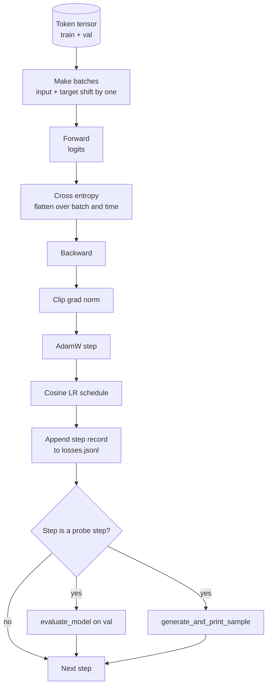

# Pętla szkoleniowa i ocena

> Pętla, która nie mierzy, to pętla, która kłamie. Ta lekcja buduje pętlę treningową napędzającą model GPT: AdamW z podziałem na spadek masy, rozgrzewka i harmonogram szybkości uczenia się cosinusa, pomocnik `calc_loss_batch`, `evaluate_model` przekazywanie wstrzymanych danych, sonda jakościowa `generate_and_print_sample` co K kroków i dziennik strat JSONL możesz knuć później. Ten sam szkielet szkoli każdy dekoder LLM, jaki kiedykolwiek zbudujesz.

**Typ:** Kompilacja
**Języki:** Python
**Wymagania wstępne:** Faza 19, lekcje od 30 do 35
**Czas:** ~90 minut

## Cele nauczania

- Zbuduj pętlę treningową, która oblicza stratę entropii krzyżowej przy prawidłowych danych wejściowych i wyrównaniu celu w celu przewidywania następnego tokena.
- Skonfiguruj AdamW z zanikiem wagi zastosowanym do tensorów wagi, a nie do tensorów LayerNorm lub bias.
- Wdrożyć harmonogram szybkości uczenia się z liniowym nagrzewaniem i zanikiem cosinusa i odczytać wynikowy LR w czasie.
- Oceń na przedłużonym podziale za pomocą `evaluate_model`, aby strata ewaluacji była porównywalna w różnych seriach.
- Generuj próbkę jakościową co K kroków za pomocą `generate_and_print_sample`, aby wychwycić rozbieżność, zanim zrobi to krzywa straty.
- Utrzymuj utratę danych krokowych w formacie JSONL, dzięki czemu możesz ponownie załadować, wykreślić i wysłać dziennik szkoleniowy jako element dostarczany.

## Problem

Skrypt szkoleniowy, który drukuje stratę, ale nie robi nic więcej, zawodzi na trzy sposoby. Nie może stwierdzić, czy strata maleje z właściwego powodu (model może przesadzić ze zbiorem treningowym i nigdy się nie uczyć). Nie jest w stanie stwierdzić, czy zaczyna się rozbieżność (strata może gwałtownie wzrosnąć o jeden krok i odzyskać siły, lub o jeden krok i ulec awarii). Nie może powiedzieć, czego nauczył się model (strata jest skalarem; wygenerowana próbka to akapit). Wszystkie trzy awarie zostaną ukryte, chyba że pętla dokona pomiaru.

Pętla pokazana w tej lekcji mierzy trzy sposoby. Straty na partii treningowej na każdym kroku. Strata w wstrzymanej partii co K kroków. Wygenerowana kontynuacja ze stałego monitu co K kroków. Dziennik treningowy trafia do JSONL, więc artefakt jest świadectwem pętli.

## Koncepcja



Dwa nieoczywiste elementy to wyrównanie strat i podział rozpadu AdamaW.

### Wyrównanie strat

Model przewiduje następny token na każdej pozycji. Jeśli partia wejściowa to tokeny `[t0, t1, t2, t3]`, partią docelową musi być `[t1, t2, t3, t4]`. Entropię krzyżową oblicza się dla płaskiego kształtu `(batch * seq, vocab)` względem płaskiego celu `(batch * seq,)`. Zapomnij o przesunięciu i trenuj model, aby przewidywał sam siebie, co zbiega się do zerowej straty, nie ucząc się niczego przydatnego.

### Rozszczepienie rozpadu AdamaW

Zanik masy reguluje tensory wagi, ale nie skale normalizacyjne ani błędy systematyczne. Umieszczenie zaniku na skali LayerNorm powoli doprowadza skalę do zera i przerywa normalizację. Narzucanie rozkładu na stronniczość jest matematycznie nieszkodliwe, ale jest stratą cykli. Standardowy podział to: tensory w kształcie macierzy (wagi liniowe, tabele osadzania) ulegają zanikowi, wszystko, co wygląda jak skala lub przesunięcie, nie.

### Rozgrzewka plus harmonogram cosinus

Rozgrzewka zwiększa szybkość uczenia się od zera do wartości docelowej w ciągu kilkuset kroków, aby stan optymalizatora miał czas na wypełnienie. Zanik cosinusa zmniejsza szybkość uczenia się z powrotem do zera w pozostałych krokach, więc w fazie końcowej dostraja się wagi przy małym rozmiarze kroku. Ta kombinacja jest najczęstszym harmonogramem w treningu LLM z otwartymi ciężarami, ponieważ usuwa większość kruchych momentów w pierwszym i ostatnim tysiącu kroków.

### Wstrzymanie oceny

`evaluate_model` uruchamia stałą liczbę partii z podziału walidacyjnego, kumuluje straty, dzieli przez liczbę partii i zwraca. Brak gradientu. Żadnego odpadania. Liczba jest powtarzalna w różnych seriach, przy tym samym materiale siewnym i tym samym podziale. Zgłaszanie przetrzymanej straty obok straty w treningu pozwala wykryć nadmierne dopasowanie.

### Próbkowanie jakościowe jako wczesny sygnał

Model, którego straty w treningu ładnie spadają, ale których wygenerowane próbki mają ten sam token, jest uszkodzony. Model, którego krzywa strat wygląda płasko, ale którego wygenerowane próbki wyostrzają się w spójne słowa, uczy się. Sonda jakościowa działa szybciej niż odczyt pełnej krzywej i wychwytuje mody, które pomija skalar.

## Zbuduj to

`code/main.py` implementuje:

- `make_batches(token_ids, batch_size, context_length)`, który dzieli długi tensor tokena na pary wejściowe i docelowe.
- `calc_loss_batch(model, inputs, targets)`, który przekazuje, spłaszcza i zwraca skalarną entropię krzyżową.
- `evaluate_model(model, val_loader, max_batches)`, który iteruje stałą liczbę partii walidacyjnych bez gradowania i zwraca średnią stratę.
- `generate_and_print_sample(model, prompt, max_new_tokens)`, który uruchamia funkcję generowania lekcji 35 w stałym wierszu zachęty i wypisuje wynik.
- `build_param_groups(model, weight_decay)`, który tworzy dwugrupową listę parametrów AdamW.
- `cosine_with_warmup(step, warmup_steps, total_steps, max_lr, min_lr)`, która zwraca LR w danym kroku.
- `train(...)`, który uruchamia pętlę, utrwala `outputs/losses.jsonl` i wypisuje stratę ewaluacyjną oraz próbkę co `eval_every` kroki.
- Demo, które trenuje mały model na danych syntetycznych w niewielkiej liczbie kroków, zapisuje dziennik JSONL i drukuje stratę ewaluacyjną oraz próbkę w punktach sondy. Demo działa na procesorze w niecałą minutę.

Uruchom to:

```bash
python3 code/main.py
```

Dane wyjściowe: na linię utraty kroku, strata ewaluacyjna na każdym kroku sondy, wygenerowana próbka na każdym kroku sondy i końcowy `outputs/losses.jsonl`, który możesz załadować za pomocą `json.loads` na linię.

## Stos

- `torch` dla autogradu, optymalizatora i modułów.
- `main.py` ponownie implementuje lekcję 35 `GPTModel` i moduły pomocnicze lokalnie.

## Wzorce produkcji na wolności

Trzy wzorce zmieniają podręcznikową pętlę w coś, co możesz zostawić uruchomione na noc.

**Obcięcie normy gradientu nie podlega negocjacjom.** Zła partia (anomalne dane, skok LR, numeryczny przypadek krawędziowy) powoduje powstanie ogromnego gradientu, który wymazuje godziny treningu. `torch.nn.utils.clip_grad_norm_(params, max_norm=1.0)` po `backward` i przed `step` utrzymuje optymalizator w bezpiecznym zakresie. Wartość obcinająca jest parametrem dowolnym; jeden jest ustawieniem domyślnym, które przetrwa większość konfiguracji.

** Rejestrowanie JSONL z możliwością wznawiania, stan nie zamarynowany.** Rekordy utraty danych na krok, ponieważ linie `{"step": int, "train_loss": float, "lr": float}` w JSONL są trwałe: każda awaria pozostawia czytelny artefakt, można używać grep, można kreślić za pomocą trzydziestu linii Pythona i można wznowić szkolenie, czytając ostatni krok. Stan wytrawiony wiąże cię z dokładnym układem modułu, który wygenerował plik, który jest kruchy w przypadku refaktorów.

**Ewaluacyjne partie pobierane z ustalonego wycinka.** Tokeny walidacyjne są dzielone na partie na początku skryptu, a nie w locie. Powtarzalność zależy od tego, czy ewaluacyjne partie są identyczne w kolejnych seriach; w przeciwnym razie porównanie strat ewaluacyjnych między dwoma seriami mierzy przetasowanie wsadowe w takim samym stopniu, jak model.

## Użyj tego

— Pętla opisana w tej lekcji to ten sam szkielet, który trenuje model 124M na rzeczywistych danych. Zamień tensor tokena syntetycznego na moduł ładujący w stylu `datasets`, a pętla będzie działać bez zmian.
— Dziennik JSONL to element, który zamienia przebieg szkolenia w dowód. Następna lekcja używa jednego do porównania świeżo wytrenowanego punktu kontrolnego z wcześniej wytrenowanym.
- Sonda do pobierania próbek jakościowych to narzędzie, którego nie zastąpi strata skalarna.

## Ćwiczenia

1. Dodaj `weight_decay_groups()` testy jednostkowe, które potwierdzają, że parametry skali i odchylenia znajdują się w grupie bez rozpadu, a wagi liniowe i osadzania w grupie rozpadu.
2. Zastąp syntetyczne losowe tokeny bajtami z małego pliku tekstowego, aby demonstracja trenowała na czymś czytelnym. Sprawdź, czy wygenerowana próbka wykorzystuje znaki obecne w pliku.
3. Dodaj `min_lr` próg wynoszący 10 procent `max_lr` do zestawienia cosinus i wykreśl ponownie.
4. Oprócz dziennika JSONL zapisz punkt kontrolny co `eval_every` kroki. Dodaj flagę `resume_from`, która ponownie ładuje stan modelu i stan optymalizatora.
5. Zarejestruj przepustowość kroku (tokeny na sekundę) obok straty i potwierdź, że utrzymuje się na stałym poziomie.

## Kluczowe terminy

| Termin | Co ludzie mówią | Co to właściwie oznacza |
|------|-----------------|--------------------------------------|
| Wyrównanie strat | „Przesuń o jeden” | Żetony wejściowe na pozycjach 0..T-1, żetony celu na pozycjach 1..T; entropia krzyżowa jest obliczana na spłaszczonych kształtach |
| Rozpad rozpadu | „Dwie grupy” | AdamW otrzymuje tensory w kształcie macierzy z zanikiem masy i tensorami skali lub tensorami obciążenia bez |
| Rozgrzewka | „Rampa” | Szybkość uczenia wzrasta od zera do wartości docelowej w ustalonej liczbie kroków, tak aby stan optymalizatora mógł zostać wypełniony |
| Partie ewaluacyjne | „Wytrzymane partie” | Stały wycinek tensora tokena walidacyjnego, przecięty raz na początku skryptu, używany identycznie przez każdą sondę |
| Sonda jakościowa | „Przykładowy wydruk” | Krótka generacja ze stałego monitu drukowanego co K kroków w celu wykrycia utraty trybów awaryjnych ukrywa |

## Dalsze czytanie

- Faza 19, lekcja 35 dla modelu napędów pętlowych.
- Faza 19, lekcja 37 dotycząca ładowania wstępnie wytrenowanych ciężarów do tego samego modelu.
- Faza 10, lekcja 04 (przedtreningowa mini GPT) dotycząca procedury na rzeczywistych danych.
- Faza 10, lekcja 10 (ocena) dla szerszej powierzchni ewaluacyjnej poza krzyżową utratą entropii.