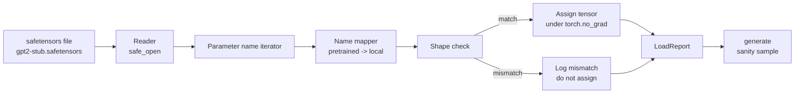

# Ładowanie wstępnie wytrenowanych ciężarów

> Uczenie od podstaw modelu zawierającego 124 miliony parametrów to decyzja budżetowa; ładowanie opublikowanego punktu kontrolnego przypada na wtorek. Ta lekcja ładuje wstępnie wytrenowane wagi w stylu GPT-2 z pliku Safetensors do dokładnej architektury z lekcji 35, kawałek po kawałku przechodzi przez mapowanie nazw parametrów, a rozsądek generuje kontynuację, aby udowodnić, że obciążenie zadziałało. Żadnej sieci, żadnych zewnętrznych programów ładujących, żadnej nieprzejrzystej magii.

**Typ:** Kompilacja
**Języki:** Python
**Wymagania wstępne:** Faza 19, lekcje od 30 do 36
**Czas:** ~90 minut

## Cele nauczania

- Przeczytaj plik Safetensors z biblioteką Pythona `safetensors` i sprawdź nazwy i kształty tensorów.
- Odwzoruj każdą nazwę wstępnie przeszkolonego parametru na parametr w modelu GPT z lekcji 35.
- Obsługa dwóch konwencji nazw, które różnią się między opublikowanymi wagami GPT-2 a modelem w tej ścieżce: `wte/wpe/h.N.attn.c_attn/c_proj` i `mlp.c_fc/c_proj` w porównaniu z lokalnie nazwanymi `tok_embed/pos_embed/blocks.N.attn.qkv/out_proj` i `mlp.fc1/fc2`.
- Wykryj i odrzuć niezgodność kształtu z wyraźnym błędem, zanim nastąpi jakiekolwiek przypisanie wagi.
- Wygeneruj krótką kontynuację z załadowanymi wagami i potwierdź, że tokeny pochodzą z załadowanej dystrybucji, a nie losowo zainicjowanej.

## Problem

Opublikowane wagi nie są spakowane dla Twojej architektury. Noszą nazwy używane w oryginalnej implementacji. Wstępnie wyszkolony plik ma `transformer.h.0.attn.c_attn.weight` kształt `(2304, 768)`; Twój model oczekuje `blocks.0.attn.qkv.weight` kształtu `(2304, 768)` (która jest tą samą macierzą w innej konwencji układu) lub Twój model używa `nn.Linear`, która przechowuje transponowaną macierz. Ten sam parametr pojawia się z trzema nieznacznie różnymi tożsamościami (nazwa, kształt, układ bajtów) i moduł ładujący musi pogodzić wszystkie trzy.

Program ładujący, który kopiuje na ślepo, umieszcza właściwy tensor w niewłaściwym miejscu i otrzymujesz model, który generuje nonsens. Program ładujący, który odmawia kopiowania, gdy kształt się różni, ale nic nie rejestruje, nie pozostawia zgadnięcia, który tensor nie wylądował. Program ładujący w tej lekcji jest jednoznaczny: każde zadanie jest rejestrowane, każdy kształt jest sprawdzany, a `LoadReport` podsumowuje trafienia, chybienia i niedopasowania kształtów, dzięki czemu możesz przeczytać, co się stało.

## Koncepcja



Maper nazw jest po prostu funkcją przechodzącą z ciągu na ciąg. Kontrola kształtu to jedno, jeśli. Przypisanie odbywa się wewnątrz `torch.no_grad()`, więc autograd nie śledzi obciążenia. Raport zawiera wyniki każdego nazwiska.

### Konwencja nazewnictwa GPT-2

Opublikowane wagi GPT-2 występują pod nazwami takimi jak:

| Wstępnie wytrenowana nazwa | Kształt | Znaczenie |
|----------------|-------|--------|
| `wte.weight` | (50257, 768) | Osadzanie tokena |
| `wpe.weight` | (1024, 768) | Osadzanie pozycji |
| `h.N.ln_1.weight` | (768,) | Skala LayerNorm 1 w bloku N |
| `h.N.ln_1.bias` | (768,) | Przesunięcie LayerNorm 1 w bloku N |
| `h.N.attn.c_attn.weight` | (768, 2304) | Odważnik liniowy topiony QKV |
| `h.N.attn.c_attn.bias` | (2304,) | Skondensowane odchylenie liniowe QKV |
| `h.N.attn.c_proj.weight` | (768, 768) | Uwaga projekcja wyjściowa |
| `h.N.attn.c_proj.bias` | (768,) | Uwaga błąd projekcji wyników |
| `h.N.ln_2.weight` | (768,) | Skala LayerNorm 2 |
| `h.N.ln_2.bias` | (768,) | Przesunięcie LayerNorm 2 |
| `h.N.mlp.c_fc.weight` | (768, 3072) | MLP fc1 waga |
| `h.N.mlp.c_fc.bias` | (3072,) | Stronniczość MLP fc1 |
| `h.N.mlp.c_proj.weight` | (3072, 768) | Waga MLP FC2 |
| `h.N.mlp.c_proj.bias` | (768,) | Stronniczość MLP FC2 |
| `ln_f.weight` | (768,) | Ostateczna skala LayerNorm |
| `ln_f.bias` | (768,) | Końcowe przesunięcie normy warstwy |

Dwie niespodzianki do zaplanowania. Linie liniowe `c_attn`, `c_proj`, `c_fc` są przechowywane z macierzą transponowaną względem oczekiwań `nn.Linear.weight`. Program ładujący dokonuje transpozycji podczas przypisywania. Głowy LM w ogóle nie ma w aktach; model opiera się na wiązaniu ciężarów za pomocą `wte`, więc głowa jest ustawiana poprzez aliasowanie po wylądowaniu `wte`.

### Lokalna konwencja nazewnictwa

Modelka w tym ścieżce używa nazw opisowych:

| Nazwa lokalna | Znaczenie |
|------------|------------|
| `tok_embed.weight` | Osadzanie tokena |
| `pos_embed.weight` | Osadzanie pozycji |
| `blocks.N.ln1.scale` | Skala LayerNorm 1 w bloku N |
| `blocks.N.ln1.shift` | LayerNorm 1 przesunięcie |
| `blocks.N.attn.qkv.weight` | Skondensowany QKV |
| `blocks.N.attn.qkv.bias` | Połączone odchylenie QKV |
| `blocks.N.attn.out_proj.weight` | Uwaga projekcja wyjściowa |
| `blocks.N.attn.out_proj.bias` | Odchylenie projekcji wyjściowej |
| `blocks.N.ln2.scale` | Skala LayerNorm 2 |
| `blocks.N.ln2.shift` | Przesunięcie LayerNorm 2 |
| `blocks.N.mlp.fc1.weight` | MLP fc1 |
| `blocks.N.mlp.fc1.bias` | Stronniczość MLP fc1 |
| `blocks.N.mlp.fc2.weight` | MLP FC2 |
| `blocks.N.mlp.fc2.bias` | Stronniczość MLP FC2 |
| `final_ln.scale` | Ostateczna skala LayerNorm |
| `final_ln.shift` | Końcowe przesunięcie normy warstwy |

Mapowanie jest funkcją stałą. Lekcja przedstawia to jako dyktando, które moduł ładujący powtarza.

### Element mocujący

Prawdziwe wagi GPT-2 wynoszą 0,5 GB. Demo ich nie pobiera; generuje przy pierwszym uruchomieniu małe urządzenie zabezpieczające, z dokładną konwencją nazewnictwa GPT-2 i kształtami odpowiednimi dla 12-blokowego modelu w d_model 192 zamiast 768. Urządzenie ma odpowiednią strukturę do wykonywania każdej ścieżki kodu w programie ładującym. Zamień urządzenie na prawdziwy plik, a moduł ładujący będzie działał bez modyfikacji.

## Zbuduj to

`code/main.py` implementuje:

- Mała replika lekcji 35 `GPTModel`, więc ta lekcja jest samodzielna.
- `make_pretrained_to_local(num_layers)`, który rozszerza wpisy dla poszczególnych warstw.
- `load_safetensors(model, path)`, który iteruje nazwy, odwzorowuje je, sprawdza kształt, transponuje wagi w stylu conv1d i przypisuje pod `torch.no_grad()`. Zwraca wartość `LoadReport`.
- `make_stub_safetensors(path, cfg)`, który generuje plik urządzenia z dokładnie wytrenowaną konwencją nazewnictwa.
- Wersja demonstracyjna, która przy pierwszym uruchomieniu tworzy `outputs/gpt2-stub.safetensors`, buduje nowy model, przechwytuje jedną wygenerowaną kontynuację z losowego inicjowania, ładuje kod pośredniczący, przechwytuje kolejną kontynuację, drukuje oba i sprawdza, czy oba są różne (obciążenie faktycznie zmieniło model).

Uruchom to:

```bash
python3 code/main.py
```

Dane wyjściowe: ścieżka urządzenia, dziennik ładowania według nazwy, podsumowanie `LoadReport`, kontynuacja przed obciążeniem, kontynuacja po załadowaniu oraz niedopasowanie kształtu na pojedynczym celowo złym tensorze wprowadzonym do urządzenia, aby ćwiczona była ścieżka awarii.

## Stos

- `safetensors` dla formatu na dysku i czytnika strumieniowego.
- `torch` dla modelu i matematyki przypisania.
- Nie `transformers`, nie `huggingface_hub`, brak połączeń sieciowych.

## Wzorce produkcji na wolności

Trzy wzory sprawiają, że ładowarka przetrwa kontakt z ciężarkami, których nie stworzyłeś.

**Zawsze sprawdzaj plik przed jakimkolwiek przypisaniem.** Otwórz plik, wypisz każdą nazwę tensora z jego typem i kształtem, uruchom pełne mapowanie ze sprawdzeniem kształtu i dopiero po pomyślnym rozpoczęciu przypisywania. Modele z połowicznym obciążeniem to ciche maszyny, które powodują awarie.

** Rejestruj każde zadanie, podając nazwę źródła i nazwę miejsca docelowego.** Kiedy coś wygląda nieprawidłowo, dziennik informuje, który tensor gdzie wylądował; alternatywą jest czytanie zrzutów hexowych. Klasa danych `LoadReport` w tej lekcji śledzi `loaded`, `missing`, `unexpected` i `shape_mismatch` wyświetla i drukuje listę podsumowanie na końcu.

**Główka LM jest aliasem wiązania ciężarów, a nie oddzielną kopią.** Ustawienie `model.lm_head.weight = model.tok_embed.weight` po załadowaniu `tok_embed` jest wzorcem kanonicznym. Kopiowanie macierzy osadzania do nowego parametru `lm_head.weight` przerywa wiązanie i po cichu podwaja liczbę parametrów.

## Użyj tego

- Program ładujący działa dla dowolnego pliku Safetensors, który używa wstępnie wyuczonej konwencji nazewnictwa. Prawdziwe pliki GPT-2 (małe / średnie / duże / xl) działają bez zmian w kodzie; różni się tylko konfiguracją modelu.
- Ten sam wzór dotyczy ciężarów LLaMA, Mistral, Qwen po zaktualizowaniu mapy nazw. Kontrole kształtu i raport pozostają identyczne.
- Generowanie poprawności po załadowaniu to szybka bramka: jeśli próbki po załadowaniu wyglądają jak próbki przed załadowaniem, obciążenie nie zmieniło modelu, co oznacza, że ​​mapowanie po cichu pominęło każdy tensor.

## Ćwiczenia

1. Dodaj argument `dtype` do programu ładującego, który podczas przypisania rzutuje każdy tensor na docelowy typ dtype (`bfloat16`, `float16`, `float32`). Potwierdź, że model `float32` można przenieść do `bfloat16` i nadal generować.
2. Dodaj argument `expected_layers`, który odmawia załadowania punktu kontrolnego, którego indeksy `h.N` nie odpowiadają indeksom `num_layers` modelu.
3. Podłącz moduł ładujący do funkcji generowania lekcji 35 i wygeneruj dwie próbki obok siebie: jedną z losowego inicjatora, jedną z załadowanego urządzenia.
4. Dodaj ścieżkę eksportu: zapisz bieżący stan modelu w nowym pliku Safetensors, stosując wstępnie wyszkoloną konwencję nazewnictwa. Obróć ładowarkę w obie strony i potwierdź, że raport nie zawiera żadnych niezgodności kształtu.
5. Rozszerz `NAME_MAP`, aby obsługiwał konwencję nazewnictwa LLaMA (bez odchyleń, RMSNorm, układ zespolonego qkv) i ponownie uruchom moduł ładujący na wygenerowanym urządzeniu pośredniczącym LLaMA.

## Kluczowe terminy

| Termin | Co ludzie mówią | Co to właściwie oznacza |
|------|-----------------|--------------------------------------|
| Mapa nazw | „Ponowne przypisanie klawiszy” | Funkcja ze wstępnie wytrenowanych nazw tensorów na lokalne nazwy parametrów; zwykle dosłowny dyktando z jednym wpisem na indeks warstwy rozwinięty w pętli |
| Niedopasowanie kształtu | „Zły kształt” | Wstępnie wyszkolony tensor istnieje pod mapowaną nazwą, ale jego wymiary nie zgadzają się z parametrem lokalnym; moduł ładujący odmawia przypisania i rejestruje parę |
| Transpozycja przy ładowaniu | „Układ Conv1d” | Opublikowany GPT-2 przechowuje uwagę i projekcje MLP w transpozycji tego, czego oczekuje nn.Linear; moduł ładujący transponuje podczas przypisywania |
| Alias ​​wiązania wagi | „Wspólna głowa LM” | Ustawianie model.lm_head.weight = model.tok_embed.weight tak, aby nagłówek i osadzanie współdzieliły pamięć; z tego powodu głowy nie ma w pliku |
| Załaduj raport | „Podsumowanie zasięgu” | Mała klasa danych śledząca listy załadowane, brakujące, nieoczekiwane i listy niedopasowania kształtu; drukowanie to sposób, w jaki można stwierdzić, czy ładowanie się powiodło |

## Dalsze czytanie

- Faza 19, lekcja 35 dla architektury, która otrzymuje wagi.
- Faza 19, lekcja 36 dla pętli treningowej, która tworzy punkt kontrolny o tym samym kształcie.
- Faza 10, lekcja 11 (kwantyzacja), co zrobić z załadowanymi ciężarkami, gdy pamięć jest ograniczona.
- Faza 10, lekcja 13 (budowanie kompletnego potoku LLM) dla pełnego cyklu życia wokół obciążenia i wnioskowania.