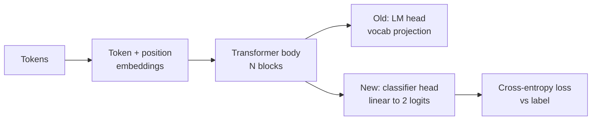
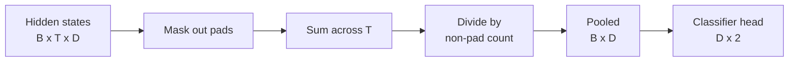
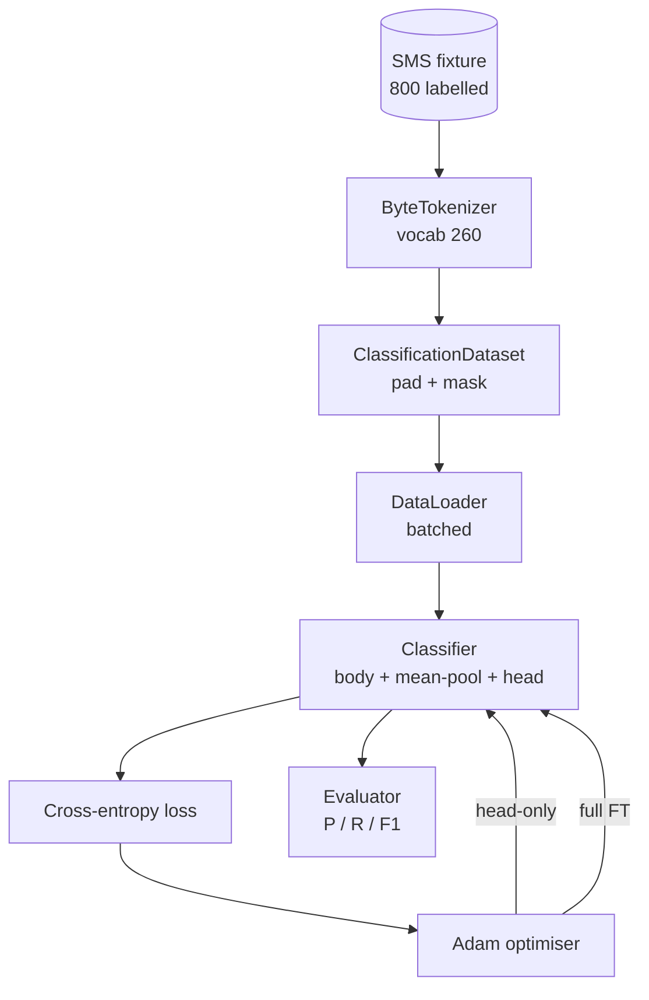

# Capstone Lekcja 38: Dostrajanie klasyfikatora poprzez zamianę głowicy

> Pierwsze zwieńczenie ścieżki B. Wstępnie wytrenowany model języka to stos bloków samouważności zakończony nagłówkiem przewidującym token. Kiedy wolisz spam kontra szynkę, głowa się myli, ale ciało ma przeważnie rację. Ta lekcja odrywa głowę, przykleja dwuklasową warstwę liniową do zbiorczej reprezentacji i uczy klasyfikatora na dwa różne sposoby: tylko ostateczna warstwa i pełne dostrajanie. Ocena to precyzja, przywołanie i F1 w przypadku wstrzymanego podziału. Dowiesz się, co daje Ci każda strategia i ile kosztuje.

**Typ:** Kompilacja
**Języki:** Python (torch, numpy)
**Wymagania wstępne:** Faza 19, lekcje 30-37 (ścieżka NLP LLM: tokenizator, tabela osadzania, blok uwagi, korpus transformatora, pętla przedtreningowa, punkt kontrolny, generowanie, zakłopotanie)
**Czas:** ~90 minut

## Cele nauczania

- Zamień głowicę modelu językowego na głowicę klasyfikacyjną bez ponownej inicjalizacji treści.
- Wdrożyć dwa reżimy treningowe: zamrożone ciało (tylko głowa) i pełne dostrojenie, dzieląc jedną pętlę treningową.
- Zbuduj potok danych obsługujący tokenizator, który uzupełnia, maskuje dopełnienie i łączy dane wyjściowe uwagi.
- Oblicz precyzję, przywołanie, F1 i macierz zamieszania na podstawie surowych logitów.
— Powód kompromisu między liczbą parametrów, czasem szkolenia i zapasem mocy.

## Problem

Wstępnie wytrenowałeś mały transformator na ogólnym korpusie. Głowica wyjściowa wyświetla ostatni ukryty stan w słowniku zawierającym 1000 znaków. Masz teraz 800 wiadomości SMS oznaczonych jako spam lub szynka i potrzebujesz klasyfikatora binarnego. Istnieją trzy opcje.

Niewłaściwą opcją jest wytrenowanie nowego klasyfikatora od podstaw na 800 przykładach. Ciało wstępnie wyszkolonego modelu koduje już użyteczną strukturę: tożsamość słowa, pozycja, proste współwystępowanie. Wyrzucenie go marnuje obliczenia, które go zbudowały.

Dwie właściwe opcje to zamiana głowy z zamrożonym ciałem i zamiana głowy z ciałem nadającym się do treningu. Trening wyłącznie na głowie jest szybki, prawie wolny w pamięci i rzadko przerasta tak małą ilość danych. Pełne dostrajanie jest wolniejsze, może powodować nadmierne dopasowanie w przypadku małych danych, ale osiąga większą dokładność, gdy domena niższa odbiega od korpusu przedtreningowego.

W tej lekcji omówiono oba rozwiązania, więc można je porównać na tym samym urządzeniu.

## Koncepcja

Model jest funkcją `f_theta(tokens) -> hidden_states`. Głowa jest funkcją `g_phi(hidden) -> logits`. Zamiana głowic oznacza pozostawienie `theta` i wymianę `g_phi`. Parametry organizmu są najdroższą częścią. Głowa jest pojedynczą warstwą liniową.

Liczą się dwa możliwe do wytrenowania zestawy parametrów:

- `theta` (ciało): dziesiątki tysięcy ciężarów na blok uwagi.
- `phi` (głowa): wagi `hidden_dim * num_classes` plus odchylenie.

W treningu typu head-only obliczasz gradienty względem `phi` i zerujesz je względem `theta`. PyTorch pozwala to zrobić, ustawiając `requires_grad=False` na parametrach treści. Optymalizator widzi wtedy tylko głowę, a ciało pozostaje zamrożone.

W przypadku pełnego dostrojenia pozwalasz, aby gradienty przepływały z powrotem przez cały stos. Masy ciała dryfują, aby dopasować się do celu klasyfikacji. Zapomnienie o małych danych wiąże się z katastrofalnym skutkiem: hałas przedtreningowy organizmu zostaje zniweczony przez hałas związany z nadmiernym dopasowaniem.

## Pytanie dotyczące łączenia

Klasyfikator potrzebuje jednego wektora na sekwencję, a nie jednego wektora na token. Trzy częste wybory:

- **Średnia pula**: średnia ukrytych stanów w sekwencji, ważona maską uwagi.
- **Pula CLS**: dodaj specjalny token i używaj tylko jego danych wyjściowych. To właśnie robi BERT.
- **Pula ostatniego tokenu**: użyj ostatniego tokena bez wypełnienia. To właśnie robią klasyfikatory klasy GPT.

W tej lekcji wykorzystano łączenie średnich z wyraźnym ważeniem maski uwagi. Jest to najprostszy sposób, zapewnia stabilny sygnał na całej długości sekwencji i nie wymaga wstępnego uczenia tokena CLS.

## Dane

Osiemset wiadomości SMS, zbilansowanych 400 spamu i 400 szynek, jest generowanych deterministycznie w `code/main.py`. Generator wykorzystuje stały materiał siewny, wybiera szablony i zastępuje wypełniacze slotów oraz emituje komunikaty o długości od 5 do 25 tokenów. Prawdziwe zbiory danych zawierają szum, którego nie ma to urządzenie. Istotą tego urządzenia jest powtarzalność.

Dane dzielą się 80/20: 640 pociągów, 160 testów. Podziały są warstwowe, więc zbiór testowy utrzymuje równowagę 50/50. Wyciągnięty zestaw ze znaną równowagą pozwala na odczytanie precyzji i zapamiętywania jako uczciwych liczb.

## Metryki

Klasyfikacja binarna z klasą 1 jako klasą pozytywną (spam). Liczba to:

- `TP`: przewidywany spam, był spamem.
- `FP`: przewidywany spam, to była szynka.
- `FN`: przewidywana szynka, okazała się spamem.
- `TN`: przewidywana szynka, była szynka.

Trzy główne wskaźniki:

- `precision = TP / (TP + FP)`. Jaka część wiadomości oznaczonych jako spam jest w rzeczywistości?
- `recall = TP / (TP + FN)`. Jaka część rzeczywistego spamu została oznaczona przez model?
- `F1 = 2 * P * R / (P + R)`. Średnia harmoniczna z tych dwóch.

Macierz zamieszania drukuje cztery zliczenia jako siatkę 2x2. Demo zapisuje to na standardowe wyjście dla obu systemów treningowych.

## Architektura

Korpus to celowo mały transformator: słownictwo 260, ukryte 64, 4 głowice, 2 bloki, maksymalna sekwencja 32. Jest wystarczająco małe, aby wytrenować oba systemy do osiągnięcia zbieżności w ciągu dziewięćdziesięciu sekund na procesorze. Nie jest to wcześniej omawiane na lekcji; zamiast tego pomocnik `pretrain_quick` wykonuje pięć epok treningu LM na tekście tego samego urządzenia, aby dać ciału nietrywialny punkt wyjścia. Dzięki temu lekcja jest samodzielna.

## Co zbudujesz

Implementacja obejmuje jeden `main.py` plus jeden moduł testowy (`code/tests/test_main.py`).

1. `ByteTokenizer`: mapuje bajty na identyfikatory, rezerwuje identyfikator padu.
2. `Block`: blok transformatora z uwagą wielogłowicową i warstwą wyprzedzającą. Wstępnie norma.
3. `LMBody`: token + osadzenie pozycji plus stos bloków. Zwraca ukryte stany.
4. `MeanPool`: średnia ważona maską na osi sekwencji.
5. `Classifier`: korpus, basen, głowica liniowa. Ciało jest tą samą instancją w różnych reżimach.
6. `freeze_body` i `unfreeze_body`: przełączanie `requires_grad` parametrów treści.
7. `train_classifier`: jedna współdzielona pętla. Akceptuje model i optymalizator skonfigurowany dla dowolnej grupy parametrów, którą można przeszkolić.
8. `evaluate`: uruchamia zestaw testowy i zwraca `Metrics(precision, recall, f1, confusion)`.
9. `run_demo`: krótko trenuje ciało, następnie trenuje i ocenia tylko głowę, następnie wykonuje pełny trening, drukuje oba raporty i wychodzi zerem.

## Dlaczego porównanie ma znaczenie

Reżim „tylko na głowę” zwykle trenuje szybciej, a niedobory odbywają się z większym wdziękiem. Na tym urządzeniu zwykle widzisz precyzję w pobliżu 0,9 i przypominasz sobie około 0,85 po dwudziestu okresach treningu wyłącznie na głowę. Pełne dostrojenie trwa około trzy razy dłużej i w obu przypadkach mieści się w granicach kilku punktów, w zależności od losowego materiału siewnego.

Lekcja nie wyłoni zwycięzcy. Uczy czytać liczby i koszty. W przypadku 800 egzemplarzy i małego korpusu właściwym wyborem jest tylko głowa. Przy 80 000 egzemplarzy i większym korpusie pełne dostrojenie zaczyna się opłacać. Kontrakt, który wyciągniesz z tej lekcji, to interfejs API: ta sama funkcja `train_classifier` obsługuje oba, a przełącznik to jedno wywołanie.

## Rozciągnij cele

- Dodaj trzeci tryb, który odmraża tylko ostatni blok. Nazywa się to czasem częściowym dostrojeniem. Kosztuje mniej niż pełny FT i uczy się więcej niż tylko na głowę.
- Dodaj harmonogram szybkości uczenia się. Harmonogram cosinus na głowie plus mniejsza stała szybkość na ciele to powszechna konfiguracja produkcyjna.
- Zastąp średnie łączenie wyuczoną pulą uwagi: małą warstwę uwagi jednym wyuczonym zapytaniem. Często bije to średnią pulę w dłuższych sekwencjach.

Implementacja zapewnia haczyki. Testy podbijają umowę. Liczby należą do Ciebie.