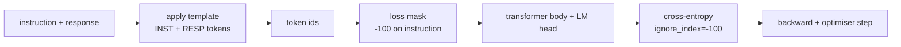
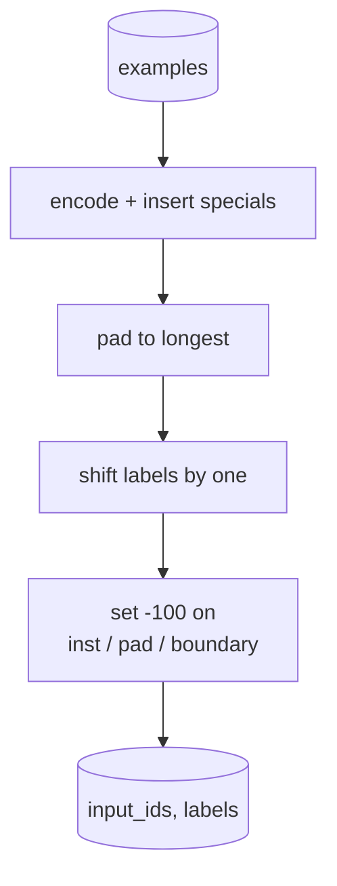
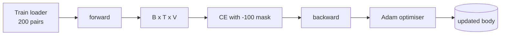

# Capstone Lekcja 39: Strojenie instrukcji poprzez nadzorowane dostrajanie

> Wstępnie wyszkolony model podstawowy może rozszerzyć sekwencję, ale nie może postępować zgodnie z instrukcjami. Nadzorowane dostrajanie to najmniejsza zmiana, która rozwiązuje ten problem: podaj modelowi sparowane przykłady instrukcji i pożądanej reakcji oraz wytrenuj ciało, aby przewidywało tokeny odpowiedzi. Sztuka polega na tym, że chcesz, aby strata liczyła się tylko z odpowiedzią, a nie instrukcją. W tej lekcji budujemy pętlę SFT w stylu alpaki z niestandardową funkcją sortowania, która maskuje tokeny instrukcji za pomocą `ignore_index=-100`, trenuje na 200 parach instrukcja-odpowiedź i ocenia wstrzymany podział przy użyciu dokładnego dopasowania.

**Typ:** Kompilacja
**Języki:** Python (torch, numpy)
**Wymagania wstępne:** Faza 19, lekcje 30-37 (ścieżka NLP LLM: tokenizator, tabela osadzania, blok uwagi, korpus transformatora, pętla przedtreningowa, punkt kontrolny, generowanie, zakłopotanie)
**Czas:** ~90 minut

## Cele nauczania

- Sformatuj sparowane dane instrukcja-odpowiedź w pojedynczą sekwencję przyczynową z wyraźnymi tokenami granicznymi.
- Zbuduj funkcję sortowania, która maskuje tokeny instrukcji, aby entropia krzyżowa zliczała tylko tokeny odpowiedzi.
- Wytrenuj mały korpus transformatora pod celem SFT i obserwuj ruch metryki eval.
- Zaimplementuj generowanie zachłanne i próbkowane temperaturowo, które przestrzega granicy odpowiedzi-startu.
- Oblicz wstrzymane dokładne dopasowanie wygenerowanych uzupełnień.

## Problem

Model podstawowy wyszkolony w zakresie przewidywania następnego tokenu nie ma pojęcia, czym jest instrukcja. Pokaż mu ciąg `"What is the capital of France?"`, a będzie on kontynuował pytanie lub wymyśli nowe zdanie. Model ma język, ale nie kontrakt w formacie.

Umowa SFT jest szablonem ciągu znaków. Każdy przykład szkoleniowy staje się pojedynczą sekwencją z trzema regionami:

```text
<INST> What is the capital of France? <RESP> The capital of France is Paris.
```

Żetony graniczne to specjalne żetony zarezerwowane na czas szkolenia. Model dowiaduje się, że wszystko po `<RESP>` jest odpowiedzią, a odpowiedź jest tym, co jest oceniane. Cel następnego żetonu modelu podstawowego nadal obowiązuje; jest po prostu trenowany na korpusie, w którym każdy przykład ma ten kształt.

Ale jest pewien haczyk. Jeśli doprowadzisz całą sekwencję do zwykłej utraty entropii krzyżowej, trenujesz model, aby przewidywał również tokeny instrukcji. Instrukcja jest podana. Chcesz zerowego gradientu w tych pozycjach. Rozwiązaniem jest maska.

## Koncepcja



`ignore_index` to funkcja `torch.nn.functional.cross_entropy`. Każda pozycja docelowa równa `ignore_index` powoduje zerową stratę i zerowy gradient. Konwencja w PyTorch to `-100`. Funkcja sortowania tworzy na przykład dwa tensory: `input_ids` (pełna sekwencja) i `labels` (kopia `input_ids` z pozycjami instrukcji nadpisanymi przez `-100`).

Model widzi całą sekwencję podczas podania w przód; uwaga może skupić się na instrukcji. Do straty zaliczają się tylko żetony odpowiedzi. To jest dokładnie to, czego chcesz: warunek w instrukcji, przewidywanie odpowiedzi.

## Dane

Dwieście par instrukcja-odpowiedź jest generowanych deterministycznie w `main.py`. Obejmują sześć typów zadań:

- faktyczny pojedynczy strzał (duża litera X)
- arytmetyka
- ekstrakcja listy
- podsumowanie w jednym zdaniu
- kod (drukowanie, sortowanie)
- definicja

Każde zadanie ma szablonową instrukcję i deterministyczną odpowiedź. To jest celowo proste. Dopasowanie dokładne jest kruche, a lekcja wykorzystuje urządzenie, w którym właściwą odpowiedzią jest jeden konkretny ciąg. Prawdziwe zbiory danych SFT wymagają rozmytych metryk; zasada jest identyczna.

Podziały to 160 pociągów, 40 testowych. Zestaw testowy obejmuje wszystkie sześć typów zadań, dzięki czemu można zgłosić dokładne dopasowanie według kategorii.

## Tokenizacja i dopełnienie

Tokeniser jest na poziomie bajtów z trzema zarezerwowanymi ofertami specjalnymi:

- `INST_ID = 256`: zaznacza początek obszaru instrukcji.
- `RESP_ID = 257`: wyznacza granicę pomiędzy instrukcją i odpowiedzią.
- `PAD_ID = 258`: dopełnienie dla partii o zmiennej długości.

Sekwencja to `[INST] inst_bytes [RESP] resp_bytes [PAD]*`. Funkcja sortowania:

1. Tokenizuje każdy przykład.
2. Dopasowuje każdy przykład w partii do najdłuższej sekwencji w partii.
3. Kompilacje `labels` = `input_ids` przesunięte o jeden (przyczynowy cel LM), przy czym:
   - Region instrukcji zastąpiony przez `-100`.
   - Region dopełnienia zastąpiony przez `-100`.
   - Sama pozycja graniczna `RESP_ID` została zastąpiona przez `-100` (nie szkolisz modelu, aby przewidywał token granicy; przewiduje on, co nastąpi dalej).



Przesunięcie to standardowa sztuczka przyczynowa: pozycja `i` z `input_ids` przewiduje pozycję `i+1`, więc `labels[i] = input_ids[i+1]` (z końcową pozycją odrzuconą z danych wejściowych i pierwszą odrzuconą z celu). Maskę nakłada się po przesunięciu, aby wylądować na właściwych pozycjach.

## Szkolenie



Pętla jest standardową pętlą PyTorch SFT. Adam, tempo uczenia się około 3e-4 do 1e-3, dziesięć do dwudziestu epok na tym urządzeniu, bez harmonogramu. Model jest wystarczająco mały (ukryty 96, 2 bloki, maksymalna długość 64), aby wytrenować konwergencję na procesorze w ciągu dwóch minut.

Co piątą epokę pętla wykonuje mały ewaluacyjny przebieg na zatrzymanym zestawie i wypisuje dokładne dopasowanie. Obserwowanie, jak dopasowanie dokładne zmienia się od 0,0 w pierwszej epoce do około 0,85 w piętnastej epoce, to lekcja, która wyciągnęła wnioski: możesz zobaczyć, jak model uczy się formatu i odpowiedzi w tym samym czasie.

## Pokolenie

W momencie eval model otrzymuje przedrostek instrukcji `[INST] inst_bytes [RESP]` i generuje tokeny do momentu, aż:

- sekwencja sięga `max_len`, lub
- model emituje specjalną heurystykę stopu: dwa kolejne bajty kończące zdanie (`.`, `!`, `?`).

Lekcja zawiera zachłanne dekodowanie oraz opcjonalny próbnik temperatury. Dopasowanie dokładne wykorzystuje zachłanność, ponieważ temperatura spowodowałaby, że metryka byłaby stochastyczna. Prawdziwe systemy często pobierają próbki, a następnie niejasno oceniają; ten rurociąg to lekcja 41.

## Ocena dokładnego dopasowania

Dopasowanie ścisłe to najbardziej rygorystyczna metryka tekstu. Przewidywany ciąg odpowiedzi jest normalizowany (małe litery, usuwanie białych znaków, zwijanie podwójnych spacji) i porównywany z odpowiedzią odniesienia, normalizowany w ten sam sposób. Metryka wynosi 1 lub 0 na przykład. Agregat jest średnią.

Prawdziwe potoki SFT uzupełniają dokładne dopasowanie za pomocą F1 na poziomie tokena (lekcja 41) i modelu sędziego. Dokładne dopasowanie pozostaje przydatne, ponieważ jest jednoznaczne; jeśli jest napisane 0,7, dokładnie 70 procent instrukcji testowych dało złoty znak odpowiedzi dla znaku.

## Co zbudujesz

Implementacja obejmuje jeden `main.py` plus testy.

1. `InstructionTokenizer`: koder na poziomie bajtów z zarezerwowanymi znakami specjalnymi. Koduje przedrostek instrukcji lub pełną parę.
2. `make_dataset`: generuje 200 par dla sześciu typów zadań ze stałym ziarnem.
3. `SFTDataset`: zwraca `(input_ids, labels)` na przykład, już przygotowaną maską.
4. `sft_collate`: dynamiczne dopełnienie, buduje tensor wsadowy, ustawia `-100` pozycje instrukcji i padów.
5. `TinyGPT`: korpus transformatora plus związana lub odwiązana głowica LM.
6. `train_sft`: pętla SFT z hakami ewaluacyjnymi dla poszczególnych epok.
7. `generate`: dekodowanie przyczynowe z przedrostka, zachłanne lub próbkowane, z heurystyką zatrzymania.
8. `exact_match`: znormalizowane porównanie ciągów, zwraca wartość zmiennoprzecinkową w `[0, 1]`.
9. `run_demo`: buduje dane, trenuje przez dwadzieścia epok, ocenia, drukuje podział na kategorie, w przypadku powodzenia kończy zerem.

## Dlaczego maska ma znaczenie

Bez maski strata traktuje żetony instrukcji jako cele. Model uczy się przewidywać instrukcje. Jest to inny cel i prowadzi do gorszego modelu pod dwoma względami. Po pierwsze, marnuje się pojemność modelu na rekonstrukcję danych wejściowych, które zawsze dostarcza użytkownik. Po drugie, utrata odpowiedzi jest mniejsza w sumie gradientu, ponieważ w większości partii żetonów instrukcji jest więcej niż żetonów odpowiedzi; Efektywna szybkość uczenia się optymalizatora w części, na której Ci zależy, jest niższa niż zamierzono. Maska nie jest pastą do polerowania; to jest cel.

## Rozciągnij cele

- Dodaj rozgrzewkę związaną z szybkością uczenia się, po której następuje rozpad cosinusa. SFT jest bardziej wrażliwy na LR niż trening przedtreningowy.
- Dodaj rejestrację strat dla każdego tokena i wykreśl krzywą strat w trakcie treningu. Zauważ, że wczesne epoki są zdominowane przez tokeny szablonów (`<RESP>`, popularne przedrostki), a późniejsze epoki są zdominowane przez rzeczywiste tokeny odpowiedzi.
- Rozszerz eval na BLEU-1 lub chrF. Dopasowanie dokładne powoduje niedoszacowanie modeli, które tworzą parafrazę z tą samą odpowiedzią.
- Dodaj szablon czatu z formatowaniem wieloobrotowym i trenuj na spotkaniu obejmującym dalsze działania.

Implementacja zapewnia kontrakt formatu, maskę i pętlę. Celowa zmiana z modelu podstawowego na podążający za instrukcją to jedna funkcja sortowania.