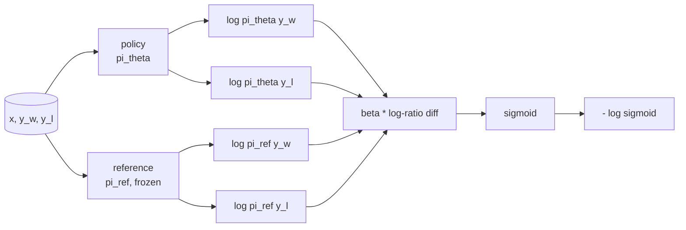
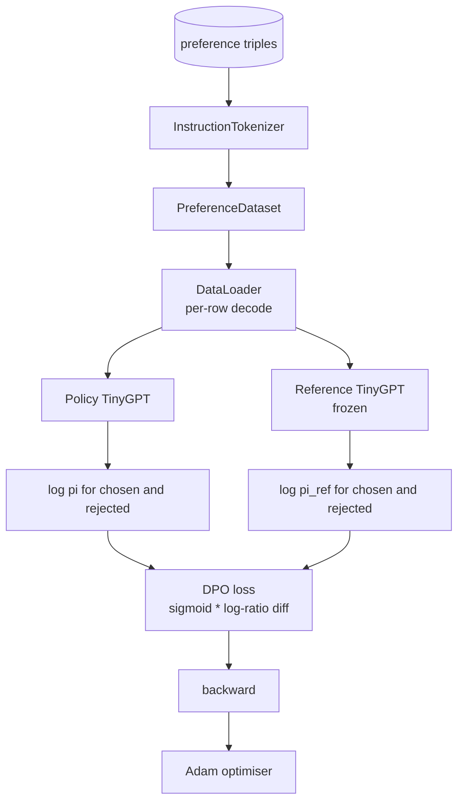

# Capstone Lekcja 40: Bezpośrednia optymalizacja preferencji od podstaw

> Modele nagród i PPO to klasyczny stos RLHF. DPO łączy ten stos w jedną nadzorowaną stratę, która pasuje bezpośrednio do polityki względem par preferencji. W tej lekcji wyprowadzamy stratę DPO z tożsamości różnicy nagród, dostarczamy działający model referencyjny oraz model zasad, obliczamy logarytmiczne prawdopodobieństwa dla każdego tokenu i trenujemy mały transformator na urządzeniu preferencji wybranych i odrzuconych uzupełnień. Testy ustalają obliczenia strat i kierunek gradientu, dzięki czemu wiesz, że implementacja pasuje do papieru.

**Typ:** Kompilacja
**Języki:** Python (torch, numpy)
**Wymagania wstępne:** Faza 19, lekcje 30-37 (ścieżka NLP LLM: tokenizator, tabela osadzania, blok uwagi, korpus transformatora, pętla przedtreningowa, punkt kontrolny, generowanie, zakłopotanie)
**Czas:** ~90 minut

## Cele nauczania

- Wyprowadź stratę DPO jako sigmoidę na podstawie skalowanej różnicy współczynnika logarytmicznego i połącz ją z ukrytą nagrodą.
- Zbuduj parę model referencyjny + model polityki z zamrożonym odniesieniem i polityką, którą można wyszkolić.
- Oblicz prawdopodobieństwa logarytmiczne na poziomie sekwencji w obu modelach, maskując tokeny podpowiedzi.
- Trenuj politykę dotyczącą `(prompt, chosen, rejected)` trójek i obserwuj wzrost wybranego log-prawdopodobieństwa w stosunku do odrzuconego.
- Zachowanie pinów z testami matematyki strat, znaku gradientu i niezmienności odniesienia.

## Problem

Masz model SFT. Postępuje zgodnie z instrukcjami, ale jego wyniki są nierówne; niektóre uzupełnienia są jasne, inne są rozwlekłe lub błędne. Masz także mały zbiór danych par preferencji: w przypadku tego samego monitu człowiek oznaczył jedno ukończenie jako wybrane, a drugie jako odrzucone.

Klasyczna odpowiedź RLHF to rurociąg dwuetapowy. Trenuj model nagrody na podstawie preferencji. Zoptymalizuj politykę pod kątem nagrody dzięki PPO. To działa, ale jest kosztowne: dwa modele w pamięci podczas PPO, kontrola KL w celu utrzymania polityki blisko odniesienia, hackowanie nagród, gdy model nagród jest kruchy.

DPO zastępuje oba etapy jedną nadzorowaną stratą. Model nagrody nigdy nie istnieje jawnie. Polityka jest trenowana bezpośrednio na parach preferencji, z wyraźną karą KL w stosunku do odniesienia do SFT. To samo optymalne rozwiązanie w modelu preferencji Bradleya-Terry'ego, znacznie mniej kodu.

## Koncepcja

Zacznij od modelu Bradleya-Terry’ego. Biorąc pod uwagę zachętę `x` i dwa uzupełnienia `y_w` (wybrane) i `y_l` (odrzucone), prawdopodobieństwo, że człowiek preferuje `y_w` wynosi

```text
P(y_w > y_l | x) = sigmoid( r(x, y_w) - r(x, y_l) )
```

gdzie `r` jest jakąś ukrytą funkcją nagrody. RLHF najpierw dopasowuje `r` z preferencji, a następnie uczy zasady `pi`, aby zmaksymalizować `r` za pomocą kotwicy KL:

```text
max_pi   E_{x, y~pi} [ r(x, y) ] - beta * KL(pi || pi_ref)
```

Wyprowadzenie DPO zauważa, że optymalna polityka `pi*` w ramach tego celu ma formę zamkniętą w kategoriach `r`:

```text
pi*(y | x) = (1/Z(x)) * pi_ref(y | x) * exp( r(x, y) / beta )
```

Zmień aranżację dla `r`:

```text
r(x, y) = beta * ( log pi*(y | x) - log pi_ref(y | x) ) + beta * log Z(x)
```

Termin `log Z(x)` jest taki sam zarówno dla `y_w`, jak i `y_l` (zależy od `x`, a nie od `y`), więc to anuluje się, gdy obliczysz różnicę preferencji:

```text
r(x, y_w) - r(x, y_l) = beta * ( log pi_theta(y_w|x) - log pi_ref(y_w|x)
                                - log pi_theta(y_l|x) + log pi_ref(y_l|x) )
```

Zastąp sigmoidę Bradleya-Terry'ego i weź logarytm prawdopodobieństwa ujemnego dla par preferencji:

```text
L_DPO(theta) = - E_{(x, y_w, y_l)} [
  log sigmoid( beta * ( log pi_theta(y_w|x) - log pi_ref(y_w|x)
                       - log pi_theta(y_l|x) + log pi_ref(y_l|x) ) )
]
```

To jest strata. Jest to sigmoida na pojedynczym skale na przykład, obliczona na podstawie czterech logarytmów prawdopodobieństwa. Brak oddzielnego modelu nagrody. Żadnego PPO. Brak terminu KL w stracie; ograniczenie KL jest wstawiane do wyprowadzenia w formie zamkniętej.



## Znak gradientu

Przydatna kontrola zdrowia psychicznego przed jakimkolwiek treningiem. Weź gradient względem `log pi_theta(y_w | x)`:

```text
d L_DPO / d log pi_theta(y_w | x) = - beta * (1 - sigmoid(z))
```

gdzie `z` jest argumentem sigmoidy. Jest to ujemne dla wszystkich `z`, co oznacza: zwiększenie logarytmicznego prawdopodobieństwa wybranego zakończenia zmniejsza stratę. Symetrycznie gradient względem `log pi_theta(y_l | x)` jest dodatni: zwiększenie odrzuconego logarytmicznego prawdopodobieństwa zwiększa stratę. Trening spycha wybranych w górę, a odrzuconych w dół. Odniesienie jest zamrożone; nie porusza się.

## Dane

Lekcja zawiera dwanaście trójek preferencji. Każdy z nich to `(prompt, chosen, rejected)`. Wybrane uzupełnienie jest krótkie i precyzyjne. Odrzucona jest rozwlekła, nie na temat lub błędna. Pary obejmują te same grupy zadań, co lekcja 39 (kapitał, arytmetyka, lista), zatem polityka rozpoczęta od bazy SFT ma rozsądny punkt wyjścia.

Oprawa jest celowo mała. DPO pracuje nad dziesiątkami tysięcy par będących w produkcji; w tym przypadku chodzi o to, że obliczenia strat i pętla przebiegają od końca do końca na małym zbiorze danych, a różnica logarytmów wybranych i odrzuconych wyraźnie rośnie.

## Niezmienność odniesienia

Implementacja DPO musi ostrożnie obchodzić się z modelem referencyjnym. Odniesieniem jest zamrożony w miejscu model SFT. Muszą zachodzić trzy właściwości:

- Parametry odniesienia nigdy nie otrzymują gradientów.
- Prawdopodobieństwa logu odniesienia nigdy nie zmieniają się pomiędzy epokami.
- Polisa zaczyna się od tych samych wag co referencja. (Optymalny `theta` to odniesienie plus wyuczona aktualizacja; inicjowanie polityki jako kopia odniesienia to dobrze zdefiniowany początek).

Implementacja wymusza je poprzez:

- Zawijanie odniesienia w `torch.no_grad()` podczas przejść do przodu.
- Ustawienie `requires_grad=False` dla każdego parametru odniesienia.
- Konstruowanie polityki poprzez `policy.load_state_dict(reference.state_dict())` po zbudowaniu odniesienia.

## Architektura



Model jest tym samym TinyGPT, którego użyto w lekcji 39 (tylko dekoder, przyczynowy, tokenizator bajtów). Odniesienie i polityka mają tę samą architekturę; wagi polityki odchylają się od wartości odniesienia w trakcie szkolenia, podczas gdy odniesienie pozostaje stałe.

## Co zbudujesz

Implementacja obejmuje jeden `main.py` plus testy.

1. `InstructionTokenizer`: tokenizer bajtowy ze specjalnościami `INST` i `RESP`. Taki sam kształt jak w lekcji 39.
2. `TinyGPT`: transformator przeznaczony wyłącznie do dekodera. Taki sam kształt jak lekcja 39, więc lekcja jest samodzielna, nawet jeśli pominiesz 39.
3. `make_preferences`: zwraca dwanaście `(prompt, chosen, rejected)` trójek.
4. `sequence_log_prob`: biorąc pod uwagę model, przedrostek podpowiedzi i zakończenie, zwraca sumę prawdopodobieństw logarytmicznych następnego tokenu po zakończeniu (bez udziału pozycji podpowiedzi).
5. `dpo_loss`: pobiera cztery logarytmiczne prawdopodobieństwa i `beta` zwraca tensor straty dla każdego przykładu i ukrytą deltę nagrody dla rejestrowania.
6. `train_dpo`: pętla dla poszczególnych epok, która oblicza wybrane i odrzucone log-proby zgodnie z zasadami i referencjami, stosuje stratę i wykonuje kroki Adama.
7. `evaluate_margins`: zwraca średni wybrany-odrzucony logarytm prawdopodobieństwa marginesu prawdopodobieństwa zgodnie z polityką w dowolnym momencie.
8. `run_demo`: buduje odniesienia i zasady na podstawie małego wstępnego treningu na rozgrzewkę, kopiuje ciężary, trenuje trzydzieści kroków, drukuje stratę i margines na krok, a po pomyślnym zakończeniu kończy zerem.

## Dlaczego DPO działa

DPO jest matematycznym odpowiednikiem RLHF w modelu preferencji Bradleya-Terry'ego, aż do parametryzacji nagrody. Ukrytą nagrodę `r(x, y) = beta * (log pi(y|x) - log pi_ref(y|x))` można zidentyfikować na podstawie preferencji aż do funkcji `x`, która znosi różnicę. Polityka zamkniętej formy pozwala pominąć jawny model nagrody. Ograniczenie KL jest wymuszane strukturalnie: każde odchylenie `pi` od `pi_ref` powoduje zwiększenie współczynnika logarytmicznego i nasycenie esicy, co tłumi gradient, gdy polityka posunie się za daleko. Punkt odniesienia to Twoja sieć bezpieczeństwa.

## Rozciągnij cele

- Dodaj normalizację długości do sumy logarytmicznej prawdopodobieństwa: podziel przez długość zakończenia. Błąd związany z długością jest znanym trybem awarii DPO, w którym model preferuje krótsze uzupełnienia, ponieważ ich logarytmiczne prawdopodobieństwa są większe w wartościach bezwzględnych.
- Dodaj wariant IPO straty: zamień sigmoid + log na `(z - 1)^2`. Porównaj zbieżność na urządzeniu.
- Dodano parametr wygładzający etykietę, który interpoluje pomiędzy mocno wybraną i odrzuconą etykietą a jednolitą wartością 0,5.
- Zamień referencję na mniejszy, tańszy model (smak destylacji wiedzy).

Implementacja daje stratę, niezmienność odniesienia i pętlę treningową. Matematyka jest lekcją. Kod sprawia, że ​​matematyka staje się konkretna.