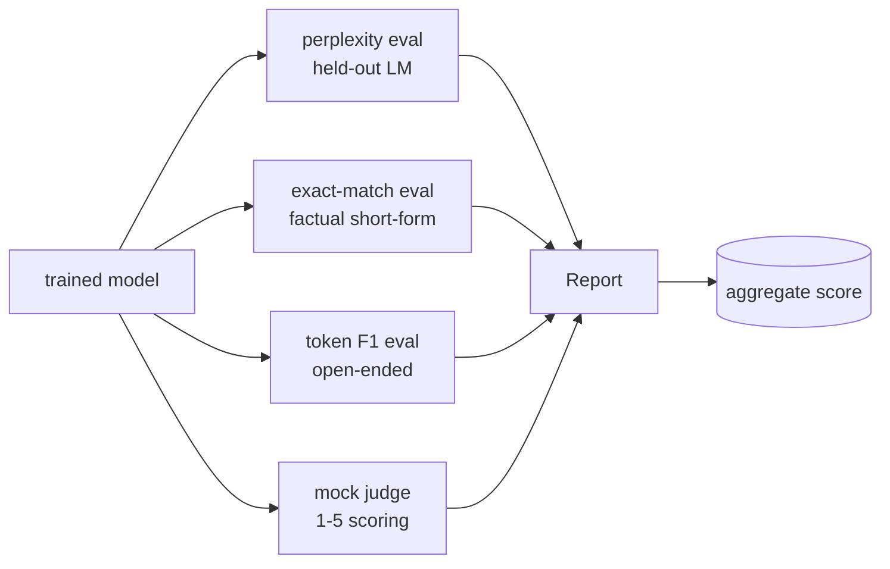
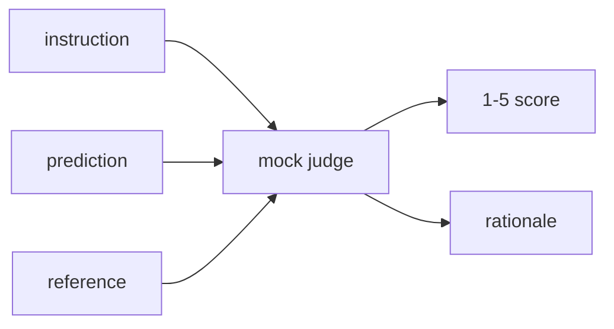
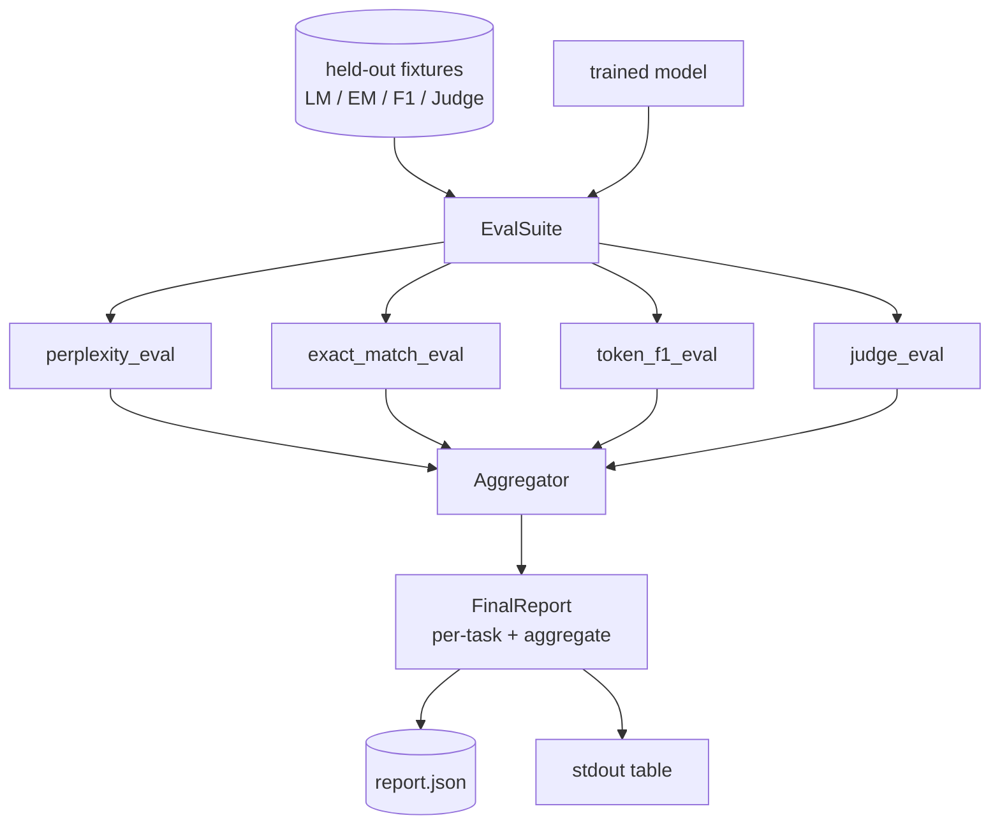

# Capstone Lekcja 41: Pełny rurociąg oceny

> Trening to część, którą możesz monitorować za pomocą krzywych strat. Ocena to część, którą musisz zaprojektować. W tej lekcji budujemy ujednolicony potok eval, który przyjmuje dowolny wyszkolony model języka, uruchamia na nim cztery heterogeniczne ewaluacje, agreguje wyniki w raport dotyczący poszczególnych zadań i dostarcza lokalny próbny LLM-as-sędzia, dzięki czemu pętla działa bez sieci. Cztery oceny obejmują wymiary potrzebne każdemu modelowi wysyłki: modelowanie języka (zakłopotanie), poprawność krótkiej formy (dokładne dopasowanie), podobieństwo w formie otwartej (token F1) i punktacja jakościowa (ocena).

**Typ:** Kompilacja
**Języki:** Python (torch, numpy)
**Wymagania wstępne:** Faza 19, lekcje 30-37 (ścieżka NLP LLM: tokenizator, tabela osadzania, blok uwagi, korpus transformatora, pętla przedtreningowa, punkt kontrolny, generowanie, zakłopotanie)
**Czas:** ~90 minut

## Cele nauczania

- Oblicz utrzymujące się zakłopotanie za pomocą rachunku zamaskowanego tokena na małym transformatorze.
- Przeprowadź ocenę dokładnego dopasowania w krótkich komunikatach opartych na faktach.
- Oblicz F1 na poziomie tokena pomiędzy ciągami przewidywanymi i referencyjnymi z normalizacją.
- Zbuduj lokalną próbną wersję LLM jako sędziego, która ocenia wyniki modelu w skali 1-5.
- Zagreguj cztery ewaluacje w jeden ważony raport z podziałem na zadania.

## Problem

Pojedyncza metryka nigdy nie opisuje modelu języka. Zagubienie mówi, jak dobrze model pasuje do dystrybucji języka, ale nie mówi nic o tym, czy odpowiada na pytania. Dokładne dopasowanie mówi, czy model tworzy złoty sznur, ale karze prawidłowe parafrazy. Token F1 wybacza parafrazę, ale daje się oszukać nałożeniem leksykalnym z niewłaściwą treścią. LLM-as-sędzia uwzględnia wymiary jakościowe, ale jest kosztowny i stochastyczny.

Potok, którego faktycznie potrzebujesz, ma wszystkie cztery. Każda ewaluacja obejmuje wymiar, który umyka innym. Każdy z nich działa na innym podzbiorze przechowywanych danych ukształtowanych dla tej metryki. Raport końcowy przedstawia liczby poszczególnych zadań obok siebie oraz dane zbiorcze, dzięki czemu recenzent może od razu zobaczyć, jakie kompromisy przynosi model.

W tej lekcji cały potok zostanie zbudowany w jednym pliku.

## Koncepcja

Każda eval jest funkcją z `(model, dataset) -> EvalResult`. Wynik zawiera wartość metryki, szczegóły dotyczące poszczególnych przykładów do kontroli oraz nazwę agregatu. Potok składa je z konfiguracją, która mówi, które ewaluacje mają zostać uruchomione i jak je ważyć.

## Zakłopotanie, właściwie policzone

Zakłopotanie to `exp(mean negative log-likelihood per token)`. Implementacja ma dwie pułapki:

- Średnia musi przekraczać rzeczywiste pozycje tokenów, a nie sekwencję partii *. Tokeny dopełniające należy wykluczyć z mianownika, w przeciwnym razie zakłopotanie będzie wyglądać lepiej niż jest.
- Model przewiduje następny token, więc logity na pozycji `i` przewidują token na pozycji `i+1`. Nie ma tu mowy o błędach pojedynczych: strata nadal jest widoczna, ale metryka staje się bez znaczenia.

Funkcja eval oblicza sumy `-log p(token)` na partię dla pozycji innych niż podkładki i liczbę żetonów na partię, a następnie dzieli na końcu. Jest to numerycznie bezpieczniejsze niż uśrednianie trudności w partii (które nie docenia krótkich sekwencji) i jest zgodne z definicją podręcznikową.

## Dokładne dopasowanie, z normalizacją

Uprząż normalizuje zarówno przewidywanie, jak i odniesienie przed porównaniem:

- Małe litery.
- Usuń otaczające białe znaki.
- Zwiń wewnętrzne białe znaki do pojedynczej spacji.
- Usuń końcową interpunkcję końcową (`.`, `!`, `?`), jeśli obie strony różnią się jedynie interpunkcją.

Normalizacja sprawia, że ​​dokładne dopasowanie jest przydatne w praktyce. Model, który mówi, że `"Paris"` jest słuszny; ten, który mówi, że `"Paris."` również ma rację; ten, który mówi, że `"  paris  "` również ma rację. Metryka nadal wymaga, aby odpowiedź była tym samym ciągiem po normalizacji.

## Token F1, we właściwy sposób

Token F1 to średnia harmoniczna precyzji i zapamiętywania obliczona na podstawie worka żetonów. Kroki:

1. Normalizuj przewidywanie i odniesienie (te same zasady, co w przypadku dopasowania dokładnego).
2. Podziel każdy na listę tokenów (tokenizacja białych znaków).
3. Policz przecięcie wielu zbiorów.
4. Precyzja = `intersection_count / len(pred_tokens)`. Przywołanie = `intersection_count / len(ref_tokens)`. F1 = średnia harmoniczna.

Jeśli zarówno przewidywanie, jak i odniesienie są puste, F1 wynosi 1 (puste dopasowanie). Jeśli tylko jeden jest pusty, F1 wynosi 0. Ten wzorzec pasuje do odniesienia do oceny SQuAD i tworzy stabilne liczby w parafrazach.

## Lokalny żart LLM jako sędzia

Prawdziwy sędzia to pionierski model stojący za API. Na potrzeby tej lekcji sędzia musi działać w trybie offline. Próbny sędzia to deterministyczny punktator, który pobiera instrukcję, przewidywanie modelu i odniesienie, a następnie zwraca wynik w `{1, 2, 3, 4, 5}` plus jednowierszowe uzasadnienie. Zasady punktacji są jasne:

- 5, jeśli znormalizowane przewidywanie jest równe znormalizowanemu odniesieniu.
- 4 jeśli znacznik F1 pomiędzy przewidywaniem a odniesieniem wynosi co najmniej 0,8.
- 3 jeśli token F1 znajduje się w `[0.5, 0.8)`.
- 2 jeśli token F1 znajduje się w `[0.2, 0.5)`.
- 1 inaczej.

To nie jest prawdziwy sędzia, ale ma odpowiedni interfejs. Zamień prawdziwy model później, zmieniając jedną funkcję. Rurociągu to nie obchodzi.

## Agregacja

Agregat jest średnią ważoną znormalizowanych wyników ewaluacji. Każda ewaluacja zgłasza swój własny numer w `[0, 1]`:

- Zakłopotanie: normalizuj jako `1 / (1 + log(perplexity))`. Zakłopotanie 1 przekłada się na 1, nieskończoność przekłada się na 0.
- Dokładne dopasowanie: już w `[0, 1]`.
- Token F1: już w `[0, 1]`.
- Sędzia: podziel przez 5.

Wagi można konfigurować. Domyślna mieszanka to 0,2 zakłopotania, 0,3 dokładnego dopasowania, 0,3 tokena F1, 0,2 sędziego. Wybór ciężarków jest decyzją produktową; lekcja przedstawia pokrętło, dzięki czemu możesz eksperymentować.

## Architektura

`EvalSuite` to cienki orkiestrator. Każda pojedyncza eval jest bezpłatną funkcją, która pobiera `(model, tokenizer, dataset, config)` i zwraca `EvalResult`. `Aggregator` zbiera wyniki i tworzy raport końcowy. Wersja demonstracyjna drukuje tabelę i zapisuje kopię JSON, którą dalszy element CI może pozyskać.

## Co zbudujesz

Implementacja obejmuje jeden `main.py` plus testy.

1. `TinyGPT`: ta sama architektura zawierająca wyłącznie dekoder, co w lekcjach 38–40, uwzględniona, aby lekcja była odrębna.
2. `InstructionTokenizer`: tokenizer bajtowy ze specjalnościami INST / RESP / PAD.
3. Cztery mecze: korpus LM, zestaw EM, zestaw F1 i zestaw sędziowski. Po dwadzieścia przykładów każdy, deterministyczny.
4. `perplexity_eval`: zwraca `EvalResult` z wartością zakłopotania i histogramem strat na token.
5. `exact_match_eval`: zwraca średnie rekordy EM i rekordy według przykładu.
6. `token_f1_eval`: zwraca średni token F1 i rekordy według przykładu.
7. `mock_judge` i `judge_eval`: wynik i uzasadnienie dla każdego przykładu, średni wynik w całym zestawie.
8. `Aggregator.normalise`: reguła normalizacji dla każdej oceny.
9. `Aggregator.aggregate`: średnia ważona i złożony raport.
10. `run_demo`: krótko trenuje mały model, wykonuje wszystkie cztery ewaluacje, drukuje tabelę raportu i zapisuje kod JSON, po pomyślnym zakończeniu kończy pracę z zerem.

## Czytanie raportu

Raport składa się z trzech warstw. Najwyższy wynik to łączny wynik. Poniżej znajdują się cztery liczby przypadające na ewaluację. Poniżej znajdują się przykładowe zestawienia diagnostyczne. Nieudany przebieg CI zazwyczaj wymaga sumy, ale recenzent dążący do regresji chce podziału na przykład, aby zobaczyć, które dane wejściowe model się pomyliły.

Zrzut JSON wykorzystuje stabilne klucze, dzięki czemu pulpit nawigacyjny CI może wykreślać linie trendów w różnych wersjach. Ładnie wydrukowany stół jest przeznaczony dla ludzi wpatrujących się w terminal po treningu.

## Rozciągnij cele

- Dodaj ocenę kalibracji: czy prawdopodobieństwa softmax modelu odpowiadają jego dokładności? Prognozy segmentów według pewności i raportowanie dokładności empirycznej dla każdego segmentu.
- Dodaj ocenę solidności: oznacz każdy przykład zaburzeniem (literówka, parafraza, rozpraszacz) i zgłoś spadek metryki na każde zaburzenie.
- Zamień fałszywego sędziego na prawdziwy model stojący za wywołaniem HTTP. Sygnatura funkcji nie ulega zmianie.
- Dodaj uczenie się wag dla każdego zadania: zamiast stałych wag, dopasuj wagi do docelowej kolejności preferencji zamiast modeli.

Implementacja zapewnia cztery wartości ewaluacyjne, agregator i raport. Prawdziwe potoki ewaluacji nakładają na siebie znacznie więcej wymiarów; wzór pozostaje ten sam: jedna funkcja na eval, jeden agregator, jeden raport.