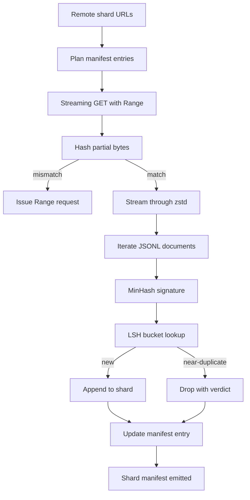

# Duży program do pobierania korpusów

> Trening modelu językowego rozpoczyna się na długo przed pierwszym podaniem w przód. Korpus musi wylądować na dysku, zdekompresowany, zdeduplikowany i adresowalny, a jego historia jest już opracowana, zanim obciążenie sieci spadnie do 4 procent. W tej lekcji budujemy narzędzie do pobierania strumieniowego, które pobiera skompresowane fragmenty, dekompresuje je w locie za pomocą Zstandardu, tworzy odciski palców prawie zduplikowane za pośrednictwem MinHash oraz hashowanie uwzględniające lokalizację i zapisuje manifest fragmentu, któremu może zaufać reszta potoku.

**Typ:** Kompilacja
**Języki:** Python
**Wymagania wstępne:** Faza 19, lekcje 30-37
**Czas:** ~90 minut

## Cele nauczania

- Przesyłaj strumieniowo zdalne fragmenty za pomocą `urllib` i dekompresuj za pomocą `zstandard` bez buforowania całego pliku w pamięci.
- Wznów częściowe pobieranie, wysyłając żądania HTTP `Range` względem zweryfikowanego przesunięcia bajtów.
- Zbuduj podpis MinHash dla każdego dokumentu i połącz go z LSH, aby prawie duplikaty kolidowały.
- Wyemituj manifest fragmentu ze skrótem zawartości, rozmiarem bajtów, liczbą dokumentów i werdyktem deduplikacji.

## Problem

Kiedy po raz pierwszy ćwiczysz na korpusie 200 GB, prędkość sieci spada o 41 procent, a skrypt kończy działanie z wyjątkiem `urllib`. Za drugim razem spada do 78 procent. Do 99 procent przepisano pętlę trzy razy. Dwie awarie, na które musisz się przygotować od pierwszej minuty, to wznowienie częściowego pobierania i usunięcie zduplikowanych dokumentów. Obydwa mają dobrze znane rozwiązania; oba są rutynowo pomijane, ponieważ potok zaczyna się jako jednowierszowe wywołanie `requests.get`, które rozwinęło się.

Wznów jest problemem związanym z HTTP. Serwer musi honorować `Range`, klient musi śledzić zweryfikowane przesunięcie względem rekordu na dysku, a zweryfikowane przesunięcie musi przetrwać śmierć procesu. Jeśli przesunięcie i plik różnią się choćby o jeden bajt, wznowione pobieranie zapisuje śmieci, a korpus jest uszkodzony w sposób, który pojawia się tylko podczas tokenizacji.

Deduplikacja to problem z sygnaturami. Dokładna deduplikacja skrótu pomija prawie duplikaty: ten sam artykuł w Wikipedii pojawia się z trzema różnymi stopkami, tym samym plikiem kodu z innym nagłówkiem licencji, tym samym postem na blogu z parametrem śledzenia przy każdym łączu. MinHash plus LSH wychwytują je po koszcie subliniowym. Koszt to jeden podpis na dokument i jedno wyszukiwanie segmentu na podpis.

## Koncepcja



### Przesyłanie strumieniowe za pomocą `urllib`

Biblioteka standardowa `urllib.request.urlopen` zwraca obiekt przypominający plik. Zawiń go w `zstandard.ZstdDecompressor().stream_reader`, a bajty przepływają z sieci przez dekompresor do iteratora dokumentu bez materializowania skompresowanego lub zdekompresowanego fragmentu w pamięci. Jedynym kosztem pamięci jest bufor linii, podpis MinHash dla bieżącego dokumentu i indeks LSH.

### Wznów za pomocą `Range`

Moduł pobierania zapisuje dwa pliki na każdy fragment: sam fragment i punkt kontrolny `.partial.json`. Punkt kontrolny rejestruje `verified_bytes`, `expected_size`, `sha256_prefix` (obliczone na podstawie pierwszych `verified_bytes` bajtów) i źródłowy adres URL. Podczas uruchamiania moduł pobierający odczytuje punkt kontrolny, ponownie oblicza `sha256_prefix` na podstawie bajtów na dysku i wznawia działanie tylko wtedy, gdy ponownie obliczony skrót jest zgodny. Jeśli skrót jest nieprawidłowy, część jest odrzucana, a pobieranie rozpoczyna się od bajtu zerowego. Ciche uszkodzenie jest niemożliwe, ponieważ zweryfikowane bajty są sprawdzane, a nie zakładane.

### MinHash plus LSH

MinHash szacuje podobieństwo Jaccarda dwóch zbiorów w ustalonej przestrzeni. W przypadku dokumentu zestawem są gonty (nakładające się n-gramy) jego tekstu. Podpis to `k` minimalne wartości skrótu, po jednej na niezależną funkcję skrótu. W przypadku dwóch dokumentów o podobieństwie Jaccarda `s` prawdopodobieństwo `s` zgadza się co do dowolnego elementu podpisu.

Następnie LSH grupuje komponenty `k` w `b` pasma zawierające `r` wierszy każdy, gdzie `k = b * r`. Dwa dokumenty kolidują w co najmniej jednym paśmie z prawdopodobieństwem `1 - (1 - s^r)^b`, które stanowi ostry próg wokół wartości `s`, do której dostrajasz `(b, r)`. Próg typowego deduplikacji korpusu wynosi `s = 0.8`, który literatura badawcza LSH osiąga z `k = 128`, `b = 32`, `r = 4`.

### Manifest fragmentu jako kontrakt

Jedynym trwałym wyjściem modułu pobierającego jest manifest. Manifest zawiera, na fragment, adres URL, liczbę zdekompresowanych bajtów, liczbę dokumentów, liczbę unikalnych dokumentów po deduplikacji oraz sha256 końcowego pliku fragmentu. Tokenizacja podrzędna odczytuje manifest, a nie listę katalogów. Jeśli brakuje fragmentu lub jego sha256 jest nieprawidłowy, manifest informuje następny etap o odmowie rozpoczęcia. Manifest stanowi decydującą przewagę pomiędzy „dane są pobierane” a „dane są pobierane i weryfikowalne”.

## Zbuduj to

`code/main.py` implementuje:

- `ShardPlanner` — odczytuje listę adresów URL fragmentów i tworzy zaplanowane wpisy manifestu.
- `StreamingDownloader` - otwiera strumień `urllib` z opcjonalnym `Range`, zapisuje do pliku tymczasowego, aktualizuje punkt kontrolny `.partial.json` na każdym fragmencie i weryfikuje prefiks sha256 po wznowieniu.
- `ZstdDocIterator` – zawija strumień plikowy w `zstandard.ZstdDecompressor` i daje jeden dokument w każdej linii.
- `MinHasher` — tworzy sygnaturę komponentu `k` dla ciągu znaków przy użyciu ustalonej rodziny nasion skrótu.
- `LSHIndex` – grupuje podpisy według pasma i raportuje kolizje.
- `Dedup` — łączy hasher i indeks, aby oznaczyć każdy dokument `keep` lub `near_duplicate` wraz z pasującym identyfikatorem fragmentu.
- `ManifestWriter` – zbiera statystyki poszczególnych fragmentów i zapisuje `manifest.json`.

Wersja demonstracyjna na dole pliku tworzy mały syntetyczny korpus na dysku, kompresuje go za pomocą `zstandard`, pobiera go za pośrednictwem adresu URL `file://`, deduplikuje i drukuje manifest.

Uruchom to:

```bash
python3 code/main.py
```

Skrypt wychodzi z zera i drukuje podsumowanie manifestu.

## Wzorce produkcyjne

Cztery wzorce skalują tę lekcję do prawdziwych korpusów.

**Punkt kontrolny przed zapisem.** Wartość `.partial.json` musi zostać poddana `fsync`, zanim bajty zostaną dodane do fragmentu. W przeciwnym razie utrata zasilania odwraca kolejność: fragmenty bajtów na dysku, punkt kontrolny bez nich, przy następnym wznowieniu uważa się, że ma mniej zweryfikowanych bajtów niż w rzeczywistości, zduplikowane bajty sufiksu uszkadzają plik. Najpierw sprawdź, potem pisz. Jest to ta sama dyscyplina, co dziennik zapisu z wyprzedzeniem.

**Indeks LSH podzielony na fragmenty.** Pojedynczy indeks LSH w całym korpusie nie mieści się w pamięci RAM w skali 200 GB. Podziel indeks LSH według skrótu pierwszego pasma, przechowuj partycje na dysku i sprawdzaj tylko partycję, na której wyląduje nowy podpis. Koszt to jeden dodatkowy odczyt dysku na dokument; zaletą jest to, że indeks LSH nie jest już twardym pułapem pamięci.

**Nagrobek, nie usuwanie.** Upuszczone duplikaty są rejestrowane w manifeście z werdyktem `near_duplicate` i identyfikatorem fragmentu dokumentu, z którym doszło do kolizji. Usunięcie ich powoduje utratę połączenia między duplikatem a jego opiekunem. Tombstoning zachowuje ścieżkę audytu i pozwala osobie przechodzącej z niższego szczebla zmienić zdanie na temat progu.

**Na fragment sha256 w manifeście plus manifest sha256.** Sam manifest otrzymuje skrót treści. Etapy niższego szczebla weryfikują skrót manifestu, zanim zaufają wpisom poszczególnych fragmentów. Bez tego manifest staje się powierzchnią cichego ataku: osoba atakująca, która może edytować pojedynczy plik, może uszkodzić cały potok.

## Użyj tego

Wzory produkcyjne:

- **Wznawiaj przy każdym biegu CI.** Biegacze CI są ulotni. Osoba pobierająca musi przy każdym uruchomieniu zakładać nowy dysk i odzyskiwać dane z pamięci podręcznej lub zdalnie. `--cache-dir` to flaga najwyższej klasy.
- **Dedup przed tokenizacją.** Tokenizacja jest kosztowna. Dwukrotne uruchomienie go na tym samym dokumencie jest dwukrotnie droższe w przypadku tej samej krzywej strat. Dedup odbywa się przed tokenizacją, a nie poniżej.
- **Manifest jako bramka scalająca.** Przebieg szkoleniowy odczytuje manifest sha256 z przypiętego zatwierdzenia. Nowa wersja zestawu danych wymaga nowego zatwierdzenia manifestu. Połączeniem między kodem a danymi jest git, a nie folklor.

## Wyślij to

`outputs/skill-corpus-downloader.md` w prawdziwym projekcie opisałby, które adresy URL zasilają program pobierający, jak ułożony jest katalog punktów kontrolnych, jaka szerokość gontu i `(k, b, r)` trzykrotne użycie deduplikacji oraz gdzie manifest znajduje się w kontroli wersji. Ta lekcja dotyczy silnika.

## Ćwiczenia

1. Dodaj flagę `--shingle-width` i zmierz, jak zmienia się werdykt deduplikacji przy szerokościach 3, 5, 9. Broń wybranej wartości domyślnej.
2. Dodaj obsługę gzip obok zstd, wąchając magiczne bajty. Program pobierający nie powinien wymagać od osoby wywołującej określenia kodeka.
3. Dodaj tryb `--resume-only`, który odmawia rozpoczęcia nowego pobierania, jeśli nie zostanie znaleziony żaden punkt kontrolny. Przydatne w CI, aby zapobiec przypadkowemu ponownemu pobraniu 200 GB w jednym uruchomieniu.
4. Przenieś indeks LSH do pliku półki lub sqlite i zmierz przepustowość w porównaniu z wariantem w pamięci.
5. Dodaj manifest sha256 podczas uruchamiania. Zamknięcie modułu pobierania powinno zakończyć się niepowodzeniem, jeśli manifest na dysku nie zgadza się ze skrótem manifestu w `manifest.lock`.

## Kluczowe terminy

| Termin | Co ludzie mówią | Co to właściwie oznacza |
|------|-----------------|--------------------------------------|
| Odłamek | „Plik” | Samodzielny wycinek korpusu z własnym sha256, używany jako jednostka wznowienia i deduplikacji |
| Podpis MinHash | „Odcisk palca” | `k`-komponentowy szkic zbioru, gdzie każdy komponent jest co najmniej jednym niezależnym skrótem w zbiorze |
| Zespół LSH | „Wiadro” | Grupa `r` komponentów podpisu używanych jako pojedynczy klucz segmentu do wykrywania kolizji |
| Zweryfikowane bajty | „Wznów przesunięcie” | Bajty na dysku, których przedrostek sha256 odpowiada punktowi kontrolnemu; jedyne bezpieczne przesunięcie, które można wznowić od |
| Manifest | „Indeks” | Pojedynczy trwały zapis tego, co wygenerował moduł pobierający, w tym skróty zawartości |

## Dalsze czytanie

- [RFC 7233](https://datatracker.ietf.org/doc/html/rfc7233) - Żądania zakresu HTTP, protokół wznowienia
- [Specyfikacja formatu Zstandard](https://datatracker.ietf.org/doc/html/rfc8478) - format ramki zapewniający bezpieczną dekompresję strumieniową
- [MinHash](https://en.wikipedia.org/wiki/MinHash) – rodzina podpisów używana w tej lekcji
- [Haszowanie zależne od lokalizacji](https://en.wikipedia.org/wiki/Locality-protection_hashing) – schemat pasmowania za progiem deduplikacji
- Faza 19 · 43 - tokenizowany korpus HDF5, który zasila downloader
- Faza 19 · 44 - harmonogram cosinus, który trenuje w korpusie
- Faza 19 · 45 - pętla AMP zużywająca harmonogram