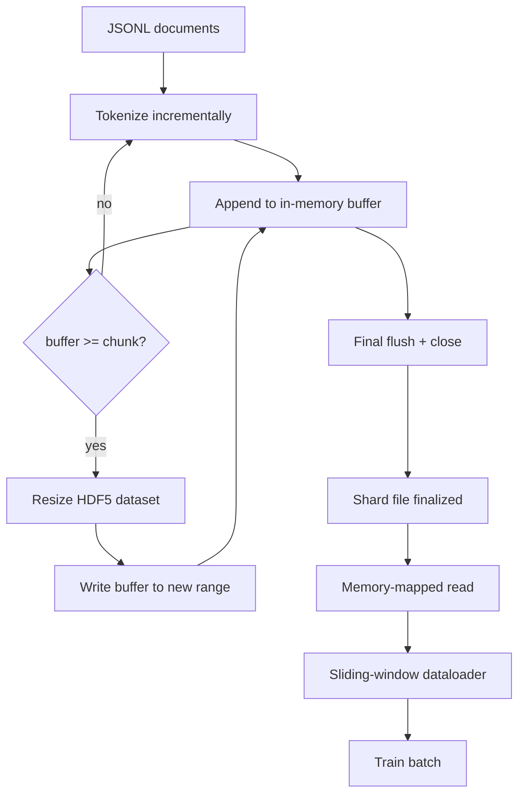

# Tokenizowany korpus HDF5

> Pobrany korpus musi wylądować w układzie, z którego trener może przesyłać strumieniowo z szybkością łącza. JSONL na dysku nie przetrwa 16 procesów roboczych modułu ładowania danych. HDF5 ze zmiennym, podzielonym na kawałki zbiorem danych całkowitych tak. Ta lekcja łączy tokenizację strumieniową w zbiór danych HDF5 o zmiennym rozmiarze, zapis fragmentowany w wielu plikach, odczyt mapowany w pamięci w czasie szkolenia oraz moduł ładowania danych z przesuwanym oknem, który tworzy sekwencje o stałej długości z odpowiednim upakowaniem.

**Typ:** Kompilacja
**Języki:** Python
**Wymagania wstępne:** Faza 19, lekcje 30-37
**Czas:** ~90 minut

## Cele nauczania

- Przesyłaj strumieniowo dokumenty do zbioru danych HDF5 w postaci liczb całkowitych o zmiennym rozmiarze z deterministycznym fragmentowaniem.
- Podziel zapis na wiele plików HDF5, aby ograniczyć awarie i umożliwić równoległość.
- Odczytuj tokeny z powrotem przez fragmentaryczny układ HDF5 oparty na pamięci podręcznej stron, dzięki czemu moduł ładujący dane kopiuje do buforów wsadowych tylko w czasie wsadowym.
- Zaimplementuj moduł ładujący dane z przesuwanym oknem, który emituje sekwencje szkoleniowe o stałej długości z wyraźnymi regułami pakowania.

## Problem

Przebieg szkolenia w nowoczesnym modelu językowym odczytuje tokeny z szybkością setek tysięcy próbek na sekundę u dziesiątek pracowników. JSONL na dysku umiera przy pierwszym błędzie strony zimnej pamięci podręcznej: parser JSON jest powolny, granice dokumentu nie są adresowalne, a próba uzyskania „próbki 4 217 884” wymaga przeskanowania pliku. Nawet parkiet, który dobrze się ściska, jest słabo dopasowany, ponieważ trener nie chce kolumn; chce płaskiego strumienia tokenów z losowym dostępem O(1).

HDF5 pasuje, ponieważ oferuje podzielony na porcje zestaw danych o zmiennym rozmiarze, składający się wyłącznie z liczb całkowitych, którego fragmenty są przyjazne dla pamięci podręcznej strony w czasie odczytu. Trener prosi o fragment `tokens[3,200,000 : 3,200,8192]`, a HDF5 kopiuje żądany hiperslab z pamięci podręcznej strony do świeżo przydzielonej tablicy NumPy. Koszt to jeden otwarty uchwyt pliku i wielkość pamięci podręcznej strony wielkości fragmentu na pracownika, co jest nieistotne w porównaniu z kosztem dekodowania JSONL.

Problem z kompilacją polega na tym, że strona zapisu jest uczciwa. Zbiory danych o zmiennym rozmiarze są łatwe do niewłaściwego użycia: napisz jeden dokument na raz, a plik HDF5 zostanie pofragmentowany do tego stopnia, że ​​stanie się bezużyteczny. Zapisz wszystkie dokumenty w jednej zmianie rozmiaru, a śmierć procesu spowoduje utratę całego fragmentu. Właściwą dyscypliną jest buforowanie, a następnie rozszerzanie, z rozmiarem bufora odpowiadającym rozmiarowi porcji i zapisem podzielonym na fragmenty, który dzieli obciążenie między plikami, tak aby awaria utraciła co najwyżej jeden fragment.

## Koncepcja



### Możliwość zmiany rozmiaru HDF5, zrobione dobrze

Zbiór danych tokenu jest tworzony za pomocą `maxshape=(None,)` i stałego `chunks=(chunk_size,)`. Zapisywanie odbywa się poprzez buforowanie tokenów w tablicy NumPy o długości `chunk_size`. Po zapełnieniu bufora rozmiar zbioru danych jest zmieniany dokładnie o `chunk_size`, a bufor jest zapisywany w nowym zakresie. Na końcu fragmentu bufor resztkowy jest zapisywany w końcowym zakresie częściowym. Każdy zapis jest ciągły i wyrównany do fragmentów, z wyjątkiem ostatniego, który czytelnik ma obciąć w zarejestrowanym `token_count` w atrybutach HDF5 fragmentu.

### Zapis podzielony na fragmenty

Pojedynczy plik HDF5 to pojedynczy punkt awarii. Potok zapisuje fragmenty równolegle: każdy fragment wejściowy z lekcji 42 fazy 19 tworzy jeden fragment wyjściowy HDF5. Indeks `shards.json` rejestruje (na fragment) ścieżkę pliku, liczbę tokenów, liczbę dokumentów i sha256 na tokenach. Trener czyta `shards.json`, aby obliczyć globalne przesunięcia i sprawdzić poprawność korpusu.

### Odczyt mapowany w pamięci

W czasie szkolenia każdy pracownik otwiera swój udział w plikach HDF5 w trybie `swmr=True` i prosi o `tokens[start:stop]`. Układ porcji HDF5 sprawia, że ​​jest to odczyt z pamięci podręcznej strony, gdy porcja jest gorąca. Pracownik nigdy nie materializuje całego pliku: wycinek jest kopiowany do bufora wsadowego modułu ładującego dane, który moduł ładujący dane następnie kopiuje do tensora szkoleniowego przypiętej pamięci w czasie wsadowym. Ścieżka gorąca ma jedno wywołanie systemowe na przejście fragmentu; wszystko inne to dostęp do pamięci RAM.

### Moduł ładowania danych z przesuwanym oknem

Moduł ładowania danych to jedyny etap, który wie o długości sekwencji szkoleniowej. Wybiera losowy indeks początkowy w globalnym strumieniu tokenów, odczytuje tokeny `window_size + 1` i zwraca `(input, target) = (tokens[:-1], tokens[1:])`. Granice dokumentu nie są wymuszane: okno może znajdować się na dwóch dokumentach, z wyraźnym `boundary_token_id` pomiędzy nimi, dzięki czemu model uczy się używać separatora. Jest to standardowa zasada pakowania; jest to również zasada, o której zapomina początkujący, a ostatecznie otrzymuje korpus składający się w 8% z żetonów granic szkoleniowych i w 92% z tekstu naturalnego.

## Zbuduj to

`code/main.py` implementuje:

- `Tokenizer` - deterministyczny tokenizer na poziomie bajtów, wystarczająco dobry dla wersji demonstracyjnej. Interfejs to `encode(text) -> list[int]` i `vocab_size`.
- `HDF5ShardWriter` — otwiera zbiór danych w postaci liczb całkowitych o zmiennym rozmiarze, buforuje tokeny do rozmiaru fragmentu, zmienia rozmiar i zapisuje w krokach o stałym rozmiarze, rejestruje `token_count` i `sha256` jako atrybuty HDF5 po zamknięciu.
- `ShardedTokenizationPipeline` - iteruje dokumenty wejściowe, kieruje je do autora i emituje indeks `shards.json`.
- `MmapTokenStore` — otwiera pliki fragmentu dla odczytów mapowanych w pamięci, oblicza globalne przesunięcia, udostępnia pojedynczy interfejs API `get_slice(start, stop)`.
- `SlidingWindowDataloader` - wybiera losowe okna ze strumienia globalnego i wyświetla `(input_ids, target_ids)` tablice NumPy.

Demo na dole pliku buduje niewielki korpus w pamięci, dzieli się na dwa fragmenty, otwiera je za pomocą mapy pamięci, uruchamia moduł ładujący dane dla 10 partii i drukuje kształt każdej partii oraz sumę kontrolną.

Uruchom to:

```bash
python3 code/main.py
```

Skrypt wychodzi z zera i drukuje wsadowe sumy kontrolne.

## Wzorce produkcyjne

Cztery wzorce skalują tę lekcję do prawdziwego biegu treningowego.

**Rozmiar porcji jest równy typowemu odczytowi.** Trener odczytuje `window_size + 1` tokeny na próbkę. Ustaw fragment HDF5 na wielokrotność `window_size`, a odczyty zostaną dopasowane do pamięci podręcznej strony. Niedopasowane fragmenty zmniejszają przepustowość o połowę, ponieważ każda próbka dotyka dwóch kawałków.

**Liczba tokenów w atrybutach, a nie w zbiorze danych.** Końcowy fragment zbioru danych może być częściowo pełny, ponieważ rozmiar fragmentu nie dzieli granicy dokumentu. Zapisz prawdziwy `token_count` jako atrybut HDF5 w zestawie danych i poproś czytnik o obcięcie tej wartości. Bez tego czytelnik schodzi z końca do tokenów wypełnionych zerami, a model uczy się przewidywać zero.

**Sharded sha256 z weryfikacją równoległą.** Każdy fragment ma swój własny sha256 w bajtach tokenu. Trener może zweryfikować wszystkie fragmenty równolegle przed rozpoczęciem szkolenia. Niewłaściwy sha256 nie przejdzie testu wcześniej, a nie w trzeciej epoce po szesnastu godzinach.

**`swmr=True` po obu stronach, z `libver="latest"` na składniku zapisującym.** Tryb pojedynczego zapisu-wielu czytników wymaga, aby moduł zapisujący otworzył się za pomocą `libver="latest"`, utwórz każdy zestaw danych z góry, a następnie ustaw `file.swmr_mode = True`. Następnie autor musi wywołać `dataset.flush()` po każdej zmianie rozmiaru, aby czytelnicy (otwierani za pomocą `swmr=True`) zobaczyli spójne dane. Pomijanie `libver="latest"` lub włączanie SWMR po zmianach strukturalnych jest częstym źródłem błędów typu „plik jest zablokowany”.

## Użyj tego

Wzory produkcyjne:

- **Jeden HDF5 na fragment źródłowy.** Moduł pobierania (lekcja 42) emituje jeden fragment na każdy adres URL; tokenizacja (ta lekcja) emituje jeden HDF5 na fragment źródłowy. Mapowanie 1:1 sprawia, że ​​wznawianie pracy i odzyskiwanie po częściowej awarii jest proste.
- **Identyfikator tokenu granicznego.** Token graniczny jest częścią słownika tokenizatora i jest jedynym tokenem wprowadzanym przez moduł ładujący dane. Strata w treningu maskuje żeton granicy, jeśli model ma go zignorować; w przeciwnym razie nauczy się go używać jako separatora sekwencji.
- **`shards.json` jako źródło prawdy.** Dodanie nowego fragmentu oznacza napisanie HDF5, obliczenie jego sha256 i dodanie wpisu. Trainer czyta plik raz przy uruchomieniu i nigdy nie dotyka listy katalogów.

## Wyślij to

`outputs/skill-hdf5-tokenized-corpus.md` w prawdziwym projekcie opisałby, który tokenizer zasila potok, jaki rozmiar fragmentu odpowiada oknie trenera, gdzie `shards.json` znajduje się w kontroli wersji oraz w jaki sposób procesy robocze modułu ładowania danych są dzielone na pliki. Ta lekcja dotyczy silnika.

## Ćwiczenia

1. Dodaj flagę `--compression gzip` do modułu zapisującego HDF5 i zmierz koszt przepustowości w korpusie demonstracyjnym. Broń wybranego ustawienia domyślnego.
2. Dodaj deterministyczne ziarno do modułu ładującego dane z przesuwanym oknem i sprawdź, czy dwa uruchomienia z tym samym ziarnem dają identyczne partie.
3. Dodaj tryb `--validate`, który odczytuje każdy fragment, ponownie oblicza sha256 na podstawie jego tokenów i porównuje z `shards.json`. CI powinien to uruchomić przed rozpoczęciem szkolenia.
4. Porównaj przepustowość modułu ładującego dane przy rozmiarach porcji równych, połowie i dwukrotności rozmiaru okna. Zgłoś efekt buforowania strony.
5. Dodaj flagę `--max-document-tokens`, która obcina bardzo długie dokumenty w czasie zapisu. Broń kompromisu przed podjęciem decyzji w czasie odczytu.

## Kluczowe terminy

| Termin | Co ludzie mówią | Co to właściwie oznacza |
|------|-----------------|--------------------------------------|
| Zestaw danych o zmiennym rozmiarze | „Tylko dołączanie” | Zbiór danych HDF5 zawierający `maxshape=(None,)`, który rośnie poprzez wywołania `resize` małymi porcjami |
| Układ fragmentaryczny | „Jak HDF5 to przechowuje” | Strony na dysku o stałym rozmiarze, które jądro może mapować w pamięci, a moduł ładujący dane może czytać w sposób ciągły |
| `swmr` tryb | „Czytaj podczas zapisu” | Tryb pojedynczego zapisu i wielu czytników, który umożliwia pracownikom modułu ładowania danych bezpieczne udostępnianie pliku |
| Indeks fragmentu | „shards.json” | Trwały indeks wszystkich fragmentów tokenów z przesunięciami i skrótami treści |
| Przesuwane okno | „Próbka treningowa” | Wycinek globalnego strumienia tokenów o stałej długości, który trener łączy z celem z przesunięciem o jeden |

## Dalsze czytanie

– [Dokumentacja HDF5 dotycząca fragmentowania](https://docs.hdfgroup.org/hdf5/v1_14/) – podzielony na kawałki układ zbioru danych o zmiennym rozmiarze, z którego korzysta ta lekcja
- [podręcznik użytkownika h5py](https://docs.h5py.org/en/stable/) - Powiązania Pythona dla HDF5
- [Mapowanie pamięci NumPy](https://numpy.org/doc/stable/reference/generated/numpy.memmap.html) - prymitywny HDF5 po stronie odczytu udostępniany przez h5py
- Faza 19 · 42 - moduł pobierający, którego dane wyjściowe tej lekcji tokenizują
- Faza 19 · 44 - harmonogram cosinus zużywający ten moduł ładowania danych
- Faza 19 · 45 – pętla AMP kończąca etap treningowy