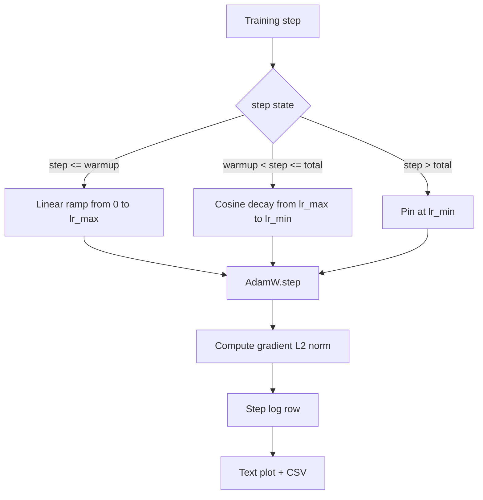

# Cosinus LR z rozgrzewką liniową

> Harmonogram szybkości uczenia się jest drugą najważniejszą decyzją po funkcji straty. AdamW z rozpadem cosinusowym i rozgrzewaniem liniowym jest nowoczesnym rozwiązaniem domyślnym w przypadku uczenia modelu językowego, ponieważ pozwala modelowi zobaczyć mały efektywny rozmiar kroku podczas pierwszych tysięcy aktualizacji kruchych, narastać do skonfigurowanego szczytu i płynnie zanikać z powrotem do zera. Ta lekcja buduje ten harmonogram, wykreśla krzywą poszczególnych etapów treningu, rejestruje normy gradientu obok harmonogramu i udowadnia, że ​​harmonogram uwzględnia granice rozgrzewki, szczytu i zaniku.

**Typ:** Kompilacja
**Języki:** Python
**Wymagania wstępne:** Faza 19, lekcje 30-37
**Czas:** ~90 minut

## Cele nauczania

- Zaimplementuj optymalizator AdamW podłączony do harmonogramu cosinusowej szybkości uczenia się z liniowym rozgrzewaniem.
- Oblicz dokładną wartość harmonogramu na dowolnym etapie bez dryftu zmiennoprzecinkowego pomiędzy przebiegami.
- Rejestruj gradient normy L2 obok tempa uczenia się, aby można było obserwować stan treningu.
- Renderuj harmonogram do postaci tekstu, który może odczytać oko, i pliku CSV, który może wykorzystać dowolne narzędzie.

## Problem

Najgłośniejsze są pierwsze tysiące aktualizacji treningowych. Wagi modelu są nadal bliskie inicjalizacji. Bieżące szacunki optymalizatora w drugiej chwili nie ustabilizowały się. Norma gradientu jest duża i głośna. Jeśli tempo uczenia się osiąga najwyższy poziom podczas tych aktualizacji, model albo całkowicie się odbiega, albo ustala plateau strat, którego nigdy nie ucieknie. Dwie dobrze znane poprawki to obcinanie gradientu, które jest tematem lekcji 45 fazy 19, oraz harmonogram tempa uczenia się, który zaczyna się od małych i wzrasta.

Harmonogram cosinus z rozgrzewką obejmuje trzy regiony. Od kroku zerowego do kroku `warmup_steps` szybkość uczenia się skaluje się liniowo od zera do skonfigurowanego szczytu `lr_max`. Od kroku `warmup_steps` do kroku `total_steps` szybkość uczenia się przebiega zgodnie z górną połową krzywej cosinus, opadając od `lr_max` do `lr_min`. Po `total_steps` tempo uczenia się jest przypinane na poziomie `lr_min`, więc źle skonfigurowany trenażer, który przekracza limit, nie opuszcza po cichu harmonogramu.

Problem z kompilacją polega na tym, że harmonogramy można łatwo pomylić o jeden. Różnica między wartościami pojawia się po sześciu godzinach treningu jako współczynnik uczenia się, który jest o 1 procent za wysoki lub za niski w momencie, gdy model zaczyna się nadmiernie dopasowywać, co jest niewidoczne, chyba że harmonogram zostanie wyczerpująco przetestowany na granicach.

## Koncepcja



### Formuła na rozgrzewkę

W przypadku `step` w `[0, warmup_steps]` z `warmup_steps > 0` współczynnik uczenia się wynosi `lr_max * step / warmup_steps`. Zdegenerowany przypadek `warmup_steps = 0` jest traktowany jako „bez rozgrzewki”: harmonogram rozpoczyna się bezpośrednio w `lr_max` w kroku zerowym i natychmiast przechodzi w rozpad cosinus. Niektóre wiązki testowe przechodzą pomyślnie `warmup_steps = 0`, aby sprawdzić, czy harmonogram nadal tworzy użyteczną krzywą.

### Wzór na cosinus

Dla `step` w `(warmup_steps, total_steps]` współczynnik uczenia się wynosi `lr_min + 0.5 * (lr_max - lr_min) * (1 + cos(pi * progress))` gdzie `progress = (step - warmup_steps) / max(1, total_steps - warmup_steps)`. W `step = warmup_steps` cosinus ma wartość `cos(0) = 1`, co daje `lr_max`, dokładnie pasujący do punktu końcowego rozgrzewki. W `step = total_steps` cosinus ma wartość `cos(pi) = -1`, co daje `lr_min`, dokładnie pasujący do punktu końcowego rozpadu.

Ciągłość w obu punktach końcowych nie jest przypadkowa. Z tego powodu harmonogram jest zaimplementowany jako pojedyncza funkcja w `step`, a nie jako trzy różne funkcje sklejone ze sobą. Sklejone zestawienie traci jedną granicę przy pierwszej zmianie `lr_max`.

### Piętro po sumie kroków

Dla `step > total_steps` współczynnik uczenia się pozostaje na poziomie `lr_min`. Umowa jest jasna: harmonogram nie zawiera błędów i nie ekstrapoluje; przypina się do podłogi i pozwala trenerowi zapisać ostrzeżenie. Trenerzy, którzy muszą wydłużyć trening, zmieniają `total_steps` harmonogram, a nie pętlę.

### Rejestrowanie norm gradientu wraz z szybkością

Harmonogram to połowa zdrowia treningowego. Norma gradientu to druga połowa. Pętla treningowa rejestruje oba etapy. Rozbieżny przebieg treningowy pokazuje skok normy gradientu przed stratą; dobrze dostrojona rozgrzewka sprawia, że ​​norma rośnie liniowo wraz z tempem; zbyt agresywny szczyt jest normą, która utrzymuje się na wysokim poziomie po rozgrzewce. Zbiór danych na dysku to `step, lr, grad_l2_norm, loss`. CSV to jedyny trwały zapis.

## Zbuduj to

`code/main.py` implementuje:

- `CosineWithWarmup` – funkcja bezstanowa `lr(step) -> float` w ramach skonfigurowanego harmonogramu.
- `TrainState` — łączy model, optymalizator `AdamW` i harmonogram w funkcję jednoetapową.
- `TrainState.step` - uruchamia jeden przebieg do przodu, jeden przebieg do tyłu, rejestruje normę gradientu L2 i stosuje `lr(step)` do optymalizatora.
- `plot_schedule_ascii` — renderuje harmonogram jako wykres tekstowy, który może odczytać oko.
- `write_schedule_csv` – emituje jeden wiersz na krok z szybkością uczenia się.

Demo na dole pliku buduje mały model `nn.Linear`, trenuje przez 20 kroków w oparciu o stałą partię danych wejściowych i drukuje szybkość uczenia się na krok, normę gradientu i stratę. Harmonogram jest również renderowany jako wykres tekstowy w celu wizualnej kontroli poprawności.

Uruchom to:

```bash
python3 code/main.py
```

Skrypt wychodzi z zera i drukuje dziennik treningu dla poszczególnych kroków oraz wykres harmonogramu.

## Wzorce produkcyjne

Cztery wzorce podnoszą harmonogram do rangi artefaktu produkcyjnego.

**Harmonogram znajduje się w konfiguracji, a nie w kodzie.** Trener czyta `warmup_steps`, `total_steps`, `lr_max`, `lr_min` z konfiguracji YAML lub JSON, która jest zatwierdzona git. Harmonogram jest odtwarzalny, ponieważ konfiguracja jest adresowana pod względem treści; harmonogram podlega audytowi, ponieważ konfiguracja jest częścią różnicy PR.

**Licznik kroków jest monotoniczny i oddzielony od epok.** Niektóre frameworki mylą krok z epoką, gdy zbiór danych jest dzielony na fragmenty lub restartowany jest moduł ładujący dane. Harmonogram odczytuje `global_step` z punktu kontrolnego trenera, a nie z lokalnego licznika. Wznowiony bieg jest kontynuowany we właściwej pozycji harmonogramu, ponieważ licznik kroków stanowi trwałą oś.

**Zaplanuj wykres w katalogu uruchomieniowym.** Każde uruchomienie szkoleniowe zapisuje `outputs/lr_schedule.png` (lub w tej lekcji wykres tekstowy) do swojego katalogu uruchomieniowego. Recenzent, który przegląda katalog, może sprawdzić harmonogram bez konieczności ponownego uruchamiania czegokolwiek. Wychwytuje to klasę błędów źle skonfigurowanego harmonogramu w czasie PR.

**Schemat wierszy dziennika został naprawiony.** `step, lr, grad_l2_norm, loss` w tej kolejności. Dalszy notatnik lub pulpit nawigacyjny odczytuje schemat; zmiana nazwy kolumny bez zmiany wersji unieważnia każdy istniejący pulpit nawigacyjny.

## Użyj tego

Wzory produkcyjne:

- **Przemiataj szczyt, zanim przemiatasz cokolwiek innego.** `lr_max` to najbardziej czułe pokrętło. Najpierw zamiataj go na małym modelu; optymalny `lr_max` skaluje się słabo wraz z rozmiarem modelu, więc przeszukiwanie małych modeli jest zdecydowanie ważniejsze.
- **Rozgrzewka to ułamek wszystkich kroków, a nie liczba bezwzględna.** Bieg składający się z 200 milionów kroków i 2000 kroków rozgrzewkowych rozpoczyna się niemal natychmiast; bieg na 20 000 kroków z tą samą liczbą rozgrzewa się o 10 procent. Skonfiguruj rozgrzewkę jako ułamek (typowo: 1-3 procent), aby harmonogram skalował się wraz z czasem trwania treningu.
- **`lr_min` jest celowo niezerowe.** Minimalna wartość wynosząca 10 procent `lr_max` pozwala optymalizatorowi uczyć się podczas długiego ogona. Harmonogram `lr_min = 0` tworzy krzywą uczenia, która świetnie wygląda na wykresie, oraz model, który w rzeczywistości nie zakończył uczenia się.

## Wyślij to

`outputs/skill-cosine-warmup.md` w prawdziwym projekcie opisałby, która konfiguracja zawiera harmonogram, z którego kroku trenera odczytywany jest licznik globalny i jakie przemiatanie `lr_max` wygenerowało wdrożoną wartość. Ta lekcja dotyczy silnika.

## Ćwiczenia

1. Dodaj wariant harmonogramu z odwrotnym pierwiastkiem kwadratowym i porównaj go z 200-etapowym przebiegiem treningowym z zabawką. Która krzywa generuje niższą stratę końcową?
2. Dodaj flagę `--restart`, która dodaje drugą rozgrzewkę w `total_steps / 2`. Broń się, czy ciepłe ponowne uruchomienie poprawia się, czy szkodzi podczas biegu zabawki.
3. Dodaj test jednostkowy, aby sprawdzić, czy harmonogram jest ciągły: dla każdego kroku w `[0, total_steps]` różnica `|lr(step+1) - lr(step)|` jest ograniczona przez `lr_max / warmup_steps`.
4. Podłącz harmonogram do `torch.optim.lr_scheduler.LambdaLR`, tak aby komponował się z kodem frameworka. W lekcji wykorzystano prostą funkcję kroku; co zmienia opakowanie?
5. Dodaj flagę `--plot-png`, która zapisuje rzeczywisty wykres poprzez `matplotlib`. Obroń, czy w przypadku przebiegów CI lepszym domyślnym ustawieniem jest wykres tekstu lekcji czy plik PNG.

## Kluczowe terminy

| Termin | Co ludzie mówią | Co to właściwie oznacza |
|------|-----------------|--------------------------------------|
| Rozgrzewka | „Powolny start” | Liniowa rampa od zera do `lr_max` w ciągu pierwszych `warmup_steps` aktualizacji |
| Rozpad cosinusa | „Gładki spadek” | Krzywa cosinus górnej połowy od `lr_max` do `lr_min` na pozostałych etapach |
| Piętro | „Po treningu” | Stała `lr_min` wartość pinów harmonogramu w przeszłości `total_steps` |
| Norma gradientu | „L2 absolwentów” | Norma euklidesowa połączonego wektora gradientu, zarejestrowana w każdym kroku |
| Globalny krok | „Oś harmonogramu” | Monotoniczny licznik kroków, który przetrwa ponowne uruchomienie i steruje harmonogramem |

## Dalsze czytanie

- [Loshchilov i Hutter, SGDR: Stochastic Gradient Descent with Warm Restarts (arXiv 1608.03983)](https://arxiv.org/abs/1608.03983) – dokument referencyjny harmonogramu cosinus
- [Loshchilov i Hutter, Decoupled Weight Decay Regularization (arXiv 1711.05101)](https://arxiv.org/abs/1711.05101) - artykuł referencyjny AdamW
- [PyTorch torch.optim.lr_scheduler](https://docs.pytorch.org/docs/stable/optim.html#how-to-just-learning-rate) - jak funkcje krokowe łączą się z programami planującymi framework
- Faza 19 · 42 - moduł pobierający, którego korpus wykorzystuje ten harmonogram
- Faza 19 · 43 - moduł ładowania danych, z którym harmonogram współpracuje
- Faza 19 · 45 - obcinanie gradientu i AMP, kolejna warstwa w pętli