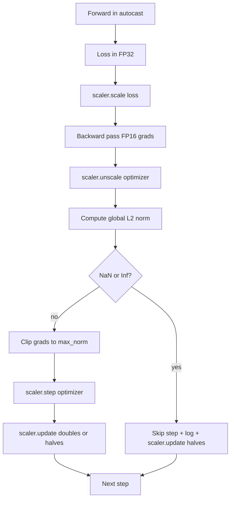

# Przycinanie gradientu i mieszana precyzja

> Optymalizator i harmonogram z poprzedniej lekcji zakładają, że gradienty są rozsądne. Zwykle tak nie jest. Pojedyncza zła partia może podnieść normę gradientu o trzy rzędy wielkości. Trening o mieszanej precyzji wzmacnia to, wprowadzając przepełnienie FP16 po stronie strat. W tej lekcji omówiono dwa pasy bezpieczeństwa, bez których nie można obejść się w szkoleniu produkcyjnym: przycinanie gradientu zgodnie ze skonfigurowaną globalną normą L2 oraz pętlę o mieszanej precyzji z funkcją automatycznego rzutowania i narzędziem GradScaler, które wykrywa NaN i Inf, pomija ten krok i rejestruje współczynnik skalowania na potrzeby kryminalistyki.

**Typ:** Kompilacja
**Języki:** Python
**Wymagania wstępne:** Faza 19, lekcje 30-37
**Czas:** ~90 minut

## Cele nauczania

- Oblicz globalną normę L2 dla wszystkich gradientów parametrów i przyciśnij ją, gdy przekroczy skonfigurowany próg.
- Zawiń krok treningowy w autocastie i GradScaler, aby przejścia do przodu i do tyłu FP16 przetrwały przepełnienie.
- Wykryj NaN i Inf w stracie lub gradiencie, pomiń krok optymalizatora i zarejestruj pominięcie.
- Zgłaszaj współczynnik skalowania GradScaler na każdym kroku, aby długa sekwencja pominięć była natychmiast widoczna.

## Problem

Wczorajszy przebieg treningowy przebiegł bez zakłóceń, a krzywa strat ma charakter pionowy w kroku 8217. Winowajcą jest pojedyncza partia, której norma gradientu wynosi 4200, czyli dwadzieścia razy więcej niż poprzedni szczyt. Bez przycinania optymalizator stosuje krok, który resetuje wszystkie nauki, których model dokonał w ciągu poprzedniej godziny. W przypadku globalnego klipu L2 w normie 1.0 ta sama partia wnosi aktualizację normy jednostkowej; strata utrzymuje się na linii trendu; bieg przetrwa.

Trening o mieszanej precyzji zwiększa przepustowość 2–3 razy, obliczając przebieg do przodu i większość przejść do tyłu w 16. PR. Kosztem jest to, że FP16 ma wąski zakres wykładników. Typowy gradient, który przekracza FP16, wyznacza Inf, który rozprzestrzenia się przez kolejne warstwy jako NaN, co ustawia każdą wagę na NaN w następnym kroku optymalizatora. GradScaler firmy PyTorch rozwiązuje ten problem, mnożąc stratę przez duży współczynnik skalowania przed przejściem wstecz i dzieląc gradienty przez ten sam współczynnik przed krokiem optymalizatora. Jeśli jakikolwiek gradient ma wartość Inf lub NaN w momencie przeskalowania, moduł skalujący pomija krok i zmniejsza o połowę współczynnik skalowania; jeśli poprzednie N kroków było czystych, skaler podwaja współczynnik. W trakcie treningu współczynnik znajduje najwyższą wartość, na jaką pozwala zakres FP16.

Problem z kompilacją polega na prawidłowym podłączeniu tych dwóch elementów. Przytnij przed przeskalowaniem, a próg znajduje się na skalowanych gradientach; klip po przeskalowaniu i kolejność operacji na GradScaler ma znaczenie. Prawidłowa kolejność to: `scaler.scale(loss).backward()`, następnie `scaler.unscale_(optimizer)`, następnie `clip_grad_norm_`, następnie `scaler.step(optimizer)`, następnie `scaler.update()`. Każda inna kolejność powoduje cichą przerwaną pętlę.

## Koncepcja



### Globalna norma L2

Globalna norma L2 jest normą euklidesową połączonego wektora gradientu, a nie normą dla poszczególnych parametrów. PyTorch implementuje to jako `torch.nn.utils.clip_grad_norm_(parameters, max_norm)`. Funkcja zwraca normę przed obcięciem, dzięki czemu lekcja może rejestrować zarówno wartość naturalną, jak i obciętą, co jest niezbędne do diagnozy „obcinamy na każdym kroku”.

### autocast i GradScaler

`torch.amp.autocast(device_type)` to menedżer kontekstu, który selektywnie uruchamia kwalifikujące się operacje (większość operacji na klasie matmul) w 16PR. `torch.amp.GradScaler(device_type)` to moduł pomocniczy, który skaluje stratę przed cofnięciem i odwrotnie skaluje gradienty przed krokiem optymalizatora. Oba zostały zaprojektowane razem; używanie jednego bez drugiego jest błędem konfiguracyjnym, który powinien wychwycić test.

Lekcja wykorzystuje autocastowanie procesora, ponieważ to właśnie działa w CI; ten sam wzorzec przenosi dosłownie do CUDA, zmieniając `device_type="cpu"` na `device_type="cuda"`. GradScaler na procesorze to fragment (automatyczne przesyłanie procesora działa już domyślnie w BF16 i nie wymaga skalowania strat), ale lekcja zawiera strony wywołań, więc okablowanie jest identyczne jak w pętli GPU.

### Wykrywanie NaN i Inf

Wykrywanie odbywa się w dwóch miejscach. Najpierw sprawdzana jest sama strata za pomocą `torch.isfinite` przed cofnięciem; utrata Inf lub NaN nie powoduje powstania użytecznych gradientów i jest pomijana bez wchodzenia do optymalizatora. Po drugie, po `scaler.unscale_(optimizer)` lekcja skanuje nieskalowane gradienty za pomocą `has_non_finite_grad(...)` i traktuje dowolny Inf lub NaN jako pominięcie. Te dwie kontrole łącznie obejmują zarówno tryby awaryjnego przejścia do przodu, jak i przejścia do tyłu.

### Diagnostyka współczynnika skalującego

Współczynnik skalowania to stan wewnętrzny GradScaler. Na każdym kroku lekcji pojawia się komunikat `scaler.get_scale()` i zapisywany obok tempa uczenia się i normy gradientu. Prawidłowy przebieg pokazuje, że współczynnik skalowania rośnie w potęgach dwóch, aż osiągnie nasycenie w pobliżu `2^17` lub `2^18`. Nieprawidłowo wykonany przebieg pokazuje współczynnik oscylujący pomiędzy wartościami wysokimi i niskimi, co jest sygnałem, że gradienty modelu czasami mieszczą się w zakresie, a czasami nie. Diagnostyka jest niewidoczna bez logowania.

## Zbuduj to

`code/main.py` implementuje:

- `clip_global_l2_norm` – opakowanie wokół `torch.nn.utils.clip_grad_norm_`, które zwraca zarówno normę przed i po klipie.
- `has_non_finite_grad` - pomocnik skanujący gradienty w poszukiwaniu NaN i Inf.
- `AmpTrainState` — otacza model, optymalizator `AdamW`, GradScaler i urządzenie do automatycznego rzutowania. Udostępnia `step(inputs, targets)`, który uruchamia pełny potok przycinania, skalowania i pomijania NaN.
- `StepLog` i `SkipLog` - rekordy uporządkowane według kroków.
— Wersja demonstracyjna, która szkoli mały model `nn.Linear` przez 20 kroków, wstrzykuje Inf do gradientu w kroku 5, aby przetestować ścieżkę pomijania, i drukuje wynikowy dziennik.

Uruchom to:

```bash
python3 code/main.py
```

Skrypt kończy działanie zerem i drukuje dziennik poszczególnych kroków, w którym każdy wiersz jest oznaczony tagiem `STEP` lub `SKIP`; co najmniej jeden wiersz to `SKIP`.

## Wzorce produkcyjne

Cztery wzorce przenoszą pętlę do etapu szkolenia produkcyjnego.

**Pomiń licznik jako alert, a nie linię dziennika.** Kilka pominiętych kroków na bieg treningowy jest dobrym rozwiązaniem. Setki pominięć na epokę stanowią poważny sygnał ostrzegawczy: model znajduje się w reżimie, którego 16 PR nie jest w stanie utrzymać, a pętla po cichu przestaje działać. Lekcja śledzi kroczący współczynnik pominięć wynoszący 1000 kroków, a w środowisku produkcyjnym strona będzie wyświetlana ze współczynnikiem powyżej 5 procent.

**Próg klipu jest zapisany w konfiguracji.** `max_norm = 1.0` to współczesna wartość domyślna w przypadku uczenia na podstawie modelu języka. Najpierw zamiataj go na małym modelu; większe progi pozwalają modelowi odzyskać siły po naprawdę trudnych partiach; mniejsze progi ograniczały najgorszy przypadek kosztem bardziej zaszumionej krzywej strat. Próg należy do tej samej konfiguracji YAML lub JSON, co harmonogram z lekcji 44.

**Dziennik normy trafia do pliku CSV z harmonogramem.** Kolumny CSV to `step, lr, grad_l2_pre_clip, grad_l2_post_clip, loss, skipped, skip_reason, scaler_scale`. Recenzent otwierający plik widzi harmonogram, historię gradientu, współczynnik skalowania i wynik pominięcia (wraz z przyczyną) w jednym wierszu. Dzielenie kolumn na pliki to przepis na źle dopasowane analizy.

**`scaler.update()` uruchamia każdy krok, nawet przy pominięciu.** Przy czystym kroku skaler odczytuje licznik braku informacji, zwiększa go i prawdopodobnie podwaja współczynnik. W przypadku pominiętego kroku skaler zmniejsza współczynnik o połowę i resetuje licznik. Zapomnienie `update()` w ścieżce pominięcia to błąd, który powoduje, że „współczynnik skalowania nigdy się nie zmieniał”.

## Użyj tego

Wzory produkcyjne:

- **Urządzenie Autocast pasuje do urządzenia optymalizującego.** `torch.amp.autocast(device_type="cuda")` do szkolenia GPU; `torch.amp.autocast(device_type="cpu")` dla procesora. Mieszanie urządzeń powoduje cichy błąd typu, który pojawia się w postaci krzywej strat, która wygląda dobrze, ale model się nie uczy.
- **Sprawdzenie strat przed cofnięciem.** `torch.isfinite(loss).all()` to redukcja o jeden tensor; koszt jest znikomy, a oszczędności na stracie NaN to cały etap szkolenia. Zawsze go uruchamiaj.
- **`set_to_none=True` w `zero_grad`.** Ustawia gradienty na `None` zamiast na zero, co pozwala optymalizatorowi pominąć obliczenia dla niezmiennych grup parametrów. Ustawienie polega na bezpłatnej poprawie przepustowości i niewielkim zmniejszeniu powierzchni błędów.

## Wyślij to

`outputs/skill-clip-amp.md` w prawdziwym projekcie opisałby, jakiego progu klipu i urządzenia automatycznego przesyłania używa dany etap szkolenia, gdzie plik CSV na krok znajduje się w kontroli wersji oraz jaki jest próg alertu szybkości pominięć w produkcji. Ta lekcja dotyczy silnika.

## Ćwiczenia

1. Zastąp syntetyczny zastrzyk Inf skokiem rzeczywistej straty (pomnóż cel jednej partii przez 1e8) i sprawdź wyzwalacze ścieżki pominięcia.
2. Dodaj tryb `--bf16`, który przełącza automatyczne przesyłanie na BF16 zamiast FP16. BF16 ma szerszy zakres wykładników niż FP16 i rzadko wymaga skalowania strat; sprawdź, czy współczynnik pomijania spada do zera w tym samym demo.
3. Dodaj test jednostkowy sprawdzający, czy opakowanie z klipem gradientowym prawidłowo zwraca normę przed i po klipie, gdy nie występuje obcinanie.
4. Dodaj obliczenia szybkości pomijania w oknie kroczącym i flagę CLI, która powoduje niepowodzenie przebiegu, jeśli szybkość przekracza skonfigurowany próg przez 100 kolejnych kroków.
5. Połącz pętlę, aby zapisać kanoniczny plik CSV (`step, lr, grad_l2_pre_clip, grad_l2_post_clip, loss, skipped, skip_reason, scaler_scale`) i potwierdź, że plik przetrwa naciśnięcie Ctrl-C, opróżniając każdy wiersz.

## Kluczowe terminy

| Termin | Co ludzie mówią | Co to właściwie oznacza |
|------|-----------------|--------------------------------------|
| Globalna norma L2 | „Cel klipu” | Norma euklidesowa połączonego wektora gradientu dla wszystkich możliwych do wytrenowania parametrów |
| autocast | „Mieszana precyzja” | Selektywne wykonanie kwalifikujących się operacji FP16 (lub BF16) w bloku `with` |
| GradScaler | „Skalowanie strat” | Pomocnik, który mnoży stratę przed cofaniem i odwrotnie skaluje gradienty przed krokiem optymalizatora |
| Pomiń | „Zły krok” | Krok optymalizatora został odrzucony, ponieważ gradient lub strata nie były skończone; skaler zmniejsza o połowę współczynnik |
| Współczynnik skalowania | „Stan skalera” | Bieżący mnożnik GradScaler; podwaja się po czystych odcinkach i połówkach przy każdym przeskoku |

## Dalsze czytanie

- [Micikevicius i in., Mixed Precision Training (arXiv 1710.03740)](https://arxiv.org/abs/1710.03740) – oryginalna propozycja skalowania strat
- [Pascanu, Mikolov, Bengio, O trudnościach w szkoleniu rekurencyjnych sieci neuronowych (arXiv 1211.5063)](https://arxiv.org/abs/1211.5063) – dokument referencyjny dotyczący obcinania gradientu
– [PyTorch torch.amp.GradScaler](https://docs.pytorch.org/docs/stable/amp.html) – interfejs API skalera, który opisuje ta lekcja
- [PyTorch torch.nn.utils.clip_grad_norm_](https://docs.pytorch.org/docs/stable/generated/torch.nn.utils.clip_grad_norm_.html) – element podstawowy obcinania, którego używa ta lekcja
- Faza 19 · 42 - downloader, którego korpus zasila pętlę
- Faza 19 · 43 - moduł ładujący dane zużywany przez pętlę
- Faza 19 · 44 - harmonogram, z którego składa się ta pętla