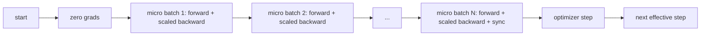
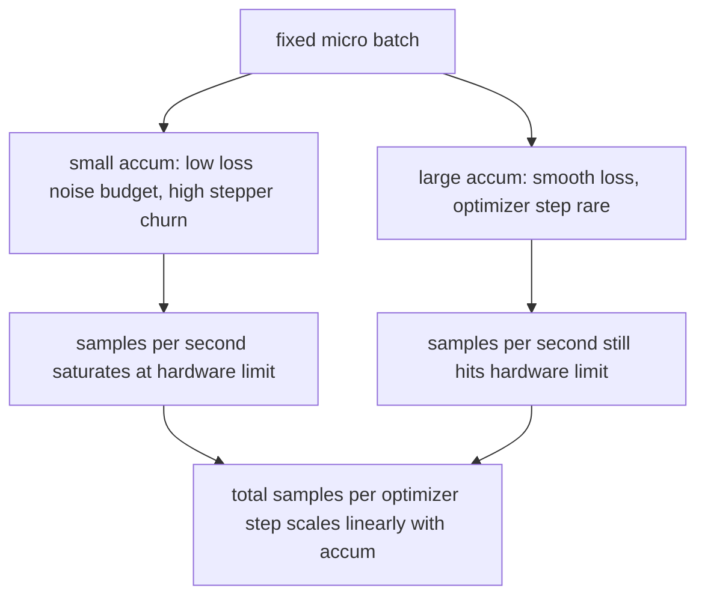

# Akumulacja gradientu

> Trenuj z efektywną partią, na którą Cię nie stać, jedną mikropartią na raz. Skaluj stratę, przytrzymaj krok optymalizatora i pozwól, aby gradienty się piętrzyły.

**Typ:** Kompilacja
**Języki:** Python
**Wymagania wstępne:** Faza 19, lekcje od 42 do 45
**Czas:** ~90 minut

## Cele nauczania

- Uzyskaj efektywną tożsamość partii: `effective_batch = micro_batch * accum_steps`.
- Zaimplementuj skalowanie strat na mikropartię, tak aby skumulowany gradient odpowiadał pojedynczej pełnej partii wstecz.
- Pomiń synchronizację optymalizatora do ostatniej mikropartii (synchronizacja w ostatnim kroku).
- Odczytaj przepustowość w porównaniu z efektywną krzywą wsadu i wyjaśnij malejący zwrot.

## Problem

Chcesz trenować na efektywnej partii 512, ponieważ krzywa straty jest gładsza, a krok optymalizatora ma większy sens w tej skali. Akcelerator na biurku mieści 32 przykłady, zanim zabraknie mu pamięci. Podwojenie partii nie wchodzi w grę. Podzielenie modelu o połowę nie wchodzi w grę. Sztuczka, po którą sięgnięto w 2017 r. i której nigdy nie przestawano stosować, polega na wykonaniu 16 przejść wstecz, umożliwieniu nagromadzenia gradientów w buforach parametrów i przekroczeniu optymalizatora dopiero wtedy, gdy liczba osiągnie wartość docelową.

Istnieje ryzyko, że strata nie będzie już taka sama jak w przypadku większej partii. Entropia krzyżowa 16 mini-partii zsumowana naiwnie jest 16-krotnością utraty jednej pełnej partii. Bez skalowania kierunek gradientu jest prawidłowy, ale wielkość jest nieprawidłowa, a krok optymalizatora jest 16 razy za duży. Poprawka to jeden podział. Naprawę można również łatwo zapomnieć.

## Koncepcja



Umowa jest krótka:

- Strata każdej mikropartii jest dzielona przez `accum_steps` przed `backward()`. PyTorch domyślnie sumuje gradienty w `param.grad`; dzielenie przesuwa sumę bieżącą z powrotem na właściwą skalę.
- Krok optymalizatora jest uruchamiany raz na efektywną partię, po cofnięciu ostatniej mikropartii. Kroki w połowie akumulacji zniekształcają każdy parametr, od którego zależy reszta przebiegu.
- Stan optymalizatora (bufory pędu, momenty Adama) zmienia się raz na efektywny krok, a nie raz na mikropartię. W przeciwnym razie wykładnicze średnie kroczące wykryłyby niewłaściwą częstotliwość i przepaliłyby harmonogram.
- Na jednym urządzeniu jest to księgowość. W klastrze z wieloma rangami ten sam wzorzec otacza niekońcowe mikropartie w kontekście `no_sync`, który pomija gradient all-reduce; ostatnia mikropartia zmniejsza cały skumulowany gradient w jednym przebiegu, zamiast płacić N-krotność kosztów sieci.

### Dowód równoważności w kodzie

```python
loss = criterion(model(x_full), y_full)
loss.backward()
opt.step()
```

jest równoważne

```python
for x, y in chunks(x_full, y_full, n):
    scaled = criterion(model(x), y) / n
    scaled.backward()
opt.step()
```

aż do kolejności sumowania zmiennoprzecinkowego. Skumulowany bufor gradientu na końcu pętli jest tym samym tensorem, jaki wytworzyłby pojedynczy pełny wsad wstecz. Kod lekcji potwierdza to z różnicą max-abs poniżej 1e-4 w `equivalence_check`.

### Gdzie idą koszty

Każda mikropartia kosztuje jedną w przód i jedną w tył. Dzięki akumulacji zamieniasz pamięć na czas. Krzywa przepustowości w `outputs/accum-curve.json` pokazuje, co się dzieje, gdy efektywna partia rośnie przy stałej mikropartii:



Nie ma darmowego lunchu. Podwojenie `accum_steps` podwaja czas ściany na krok optymalizatora. Jakie zmiany powoduje wariancja oszacowania gradientu: przy tym samym budżecie ściany wykonano mniej kroków optymalizatora, ale każdy z nich został uśredniony dla większej liczby próbek. W literaturze dużą i małą partię traktuje się jako różne problemy optymalizacyjne; lekcja ma charakter mechaniczny, a nie statystyczny.

## Zbuduj to

`code/main.py` to artefakt, który można uruchomić. Robi trzy rzeczy.

### Krok 1: sprawdzenie równoważności

`equivalence_check()` tworzy dwie kopie tej samej sieci z tym samym ziarnem. W jednym przejściu do przodu można zobaczyć partię zawierającą 16 próbek. Drugi widzi cztery fragmenty po 4 próbki ze stratą podzieloną przez cztery. Funkcja porównuje bufory gradientu przed krokiem optymalizatora i parametry po. Twierdzenie to `max_abs_diff < 1e-4`.

### Krok 2: wzorzec synchronizacji w ostatnim kroku

`train_one_optimizer_step` przegląda mikropartie. Dla każdej mikropartii z wyjątkiem ostatniej wpisuje się `no_sync_context(model)`. W przypadku pojedynczego procesu kontekst jest niemożliwy; w DDP jest to miejsce, w którym pomijane jest całkowite zmniejszenie gradientu. Niezależnie od tego, księgowość jest taka sama. `sync_counter` rejestruje, ile razy opuściliśmy zakres no_sync; w przypadku N mikropartii liczba wynosi jeden na efektywny krok, a nie N.

### Krok 3: krzywa przepustowości

`sweep_effective_batches` uruchamia ten sam model ze stałą mikropartią i listą etapów akumulacji. Dla każdego ustawienia rejestruje:

- `samples_per_sec`: całkowita liczba obejrzanych próbek podzielona przez czas trwania ściany
- `median_step_ms`: 50. percentyl na efektywny krok
- `sync_calls`: zdobyte punkty zbiorcze
- `avg_loss`: średnia dla kroków optymalizatora przemiatania

Dane wyjściowe trafiają do `outputs/accum-curve.json` i można je ponownie wykorzystać w notatniku.

Uruchom to:

```bash
python3 code/main.py
```

Skrypt drukuje różnicę równoważności, następnie tabelę przeciągnięcia, a następnie ścieżkę JSON. Kod wyjścia zero.

## Użyj tego

W szkoleniu produkcyjnym akumulacja gradientów odbywa się za jednym pokrętłem. Wzorzec PyTorcha to `accumulation_steps = effective_batch // (micro_batch * world_size)`. Frameworki, których nie wolno tutaj używać, zawijają tę samą pętlę, ale kroki są takie same: skaluj stratę, pomiń synchronizację na niekońcowych mikrokrokach, akumuluj, wykonaj krok raz.

Trzy wzory na wolności:

- Rozmiar mikropartii dobierany jest tak, aby zapełnić pamięć urządzenia. Wszystko mniejsze marnuje cykle akceleratora. Wszystko większe ulega awarii.
- Efektywna partia jest wybierana z harmonogramu szybkości uczenia się. Duże efektywne partie wymagają skalowanego tempa uczenia się i rozgrzewki; jest to reguła skalowania liniowego, o której mówi się od 2017 roku.
- Liczba akumulacji jest pomostem pomiędzy nimi i jedynym pokrętłem, które można dowolnie dostrajać w czasie wykonywania bez konieczności przepisywania modułu ładującego dane.

## Wyślij to

`outputs/skill-gradient-accumulation.md` przechwytuje przepis, aby partner mógł go wrzucić do nowego repozytorium: utrata skali o `accum_steps`, pomiń synchronizację optymalizatora na niekońcowych mikroprocesorach, wykonaj krok optymalizatora raz na efektywną partię, zaloguj przepustowość względem efektywnej partii jako JSON, aby transakcja była widoczna.

## Ćwiczenia

1. Uruchom ponownie przemiatanie za pomocą `--num-steps 100` i wykreśl próbki na sekundę w porównaniu z partią efektywną. Gdzie krzywa się spłaszcza?
2. Dodaj błędny wariant skalowania (bez podziału) i pokaż różnicę parametru w kroku 1 względem odniesienia.
3. Zamień SGD na AdamW i potwierdź postęp stanu optymalizatora raz na efektywny krok, a nie raz na mikropartię.
4. Wprowadź prawdziwe opakowanie `DistributedDataParallel` i skieruj `no_sync_context` do jego metody. Potwierdź spadek sync_calls o N-1 na efektywną partię.
5. Zmodyfikuj kontrolę równoważności, aby porównać dwa różne mikropodziały (2 na 8 vs 4 na 4) i wyjaśnij tolerancję, którą musisz rozluźnić.

## Kluczowe terminy

| Termin | Co ludzie mówią | Co to właściwie oznacza |
|------|-----------------|--------------------------------------|
| Mikro partia | Partia, którą przekazujesz | Kawałek mieszczący się w pamięci jednym przejściem do przodu |
| Kroki Acum | Przejścia do tyłu na krok | Liczba wstecz zsumowanych przed jednym krokiem optymalizatora |
| Efektywna partia | Partia | Czasy mikropartii sumują się kroki razy wielkość świata równoległego |
| Skalowanie strat | Podziel przez N | Podział na mikropartie, tak aby zsumowane gradienty odpowiadały pełnej partii |
| Synchronizuj ostatni | Pomiń resztę | Uruchom kolektyw gradientowy tylko na ostatnim końcu okna |

## Dalsze czytanie

- Dokumentacja PyTorch na temat `DistributedDataParallel.no_sync` dotycząca produkcyjnej wersji sztuczki z synchronizacją w ostatnim kroku.
- Goyal i in., 2017, na temat skalowania liniowego w przypadku uczenia dużych partii, kanoniczny powód dbania o efektywną partię.
- Śledzenie problemów PyTorch w interakcjach z akumulacją gradientów z mieszaną precyzją nieskalowania.
- Lekcje od 42 do 45 fazy 19 omawiają model, moduł ładujący dane, optymalizator i szkielet trenera, jaki zakłada ta lekcja.
- Lekcja 47 fazy 19 obejmuje punkt kontrolny i wznowienie, dzięki czemu długi cykl akumulacji przetrwa zatrzymanie zegara ściennego.