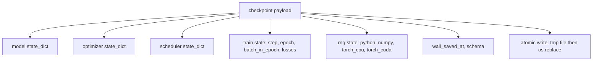
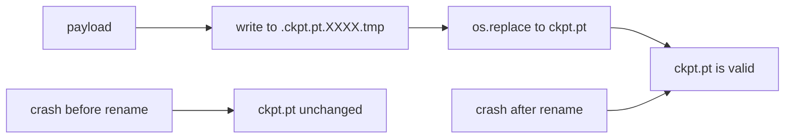
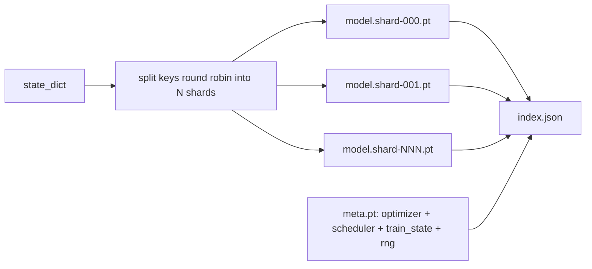

# Punkt kontrolny Zapisz i wznów

> Pociąg przerywa przejazdy zabójcze; punkty kontrolne pozwalają im kontynuować. Zapisz model, optymalizator, harmonogram, historię strat, licznik kroków i stan RNG, atomowo, aby zabicie w dowolnym momencie pozostawiło prawidłowy plik na dysku.

**Typ:** Kompilacja
**Języki:** Python
**Wymagania wstępne:** Faza 19, lekcje od 42 do 45
**Czas:** ~90 minut

## Cele nauczania

— Przechwyć pełny stan szkolenia w pojedynczym ładunku, który można ponownie załadować do nowego procesu.
- Zaimplementuj zapis atomowy z zapisem do tempa, a następnie zmień nazwę, aby awaria nigdy nie pozostawiła w połowie zapisanego pliku.
- Przywróć stan RNG dla Pythona, NumPy i PyTorch, aby strata po wznowieniu odpowiadała nieprzerwanej linii bazowej.
- Zbuduj podzielony na fragmenty układ punktu kontrolnego dla modeli, które nie mieszczą się już w jednym pliku, z fragmentami zweryfikowanymi pod kątem skrótu i ​​indeksem JSON.

## Problem

Ustalasz zadanie szkoleniowe na 18 godzin. Czapka zegara ściennego ma 4 godziny. Klaster uruchamia się ponownie o godzinie 11, ponieważ osoba powyżej Twojego poziomu wynagrodzenia zatwierdziła aktualizację jądra. Bez punktów kontrolnych zaczynasz od nowa. Bez wznowienia tracisz także stan optymalizatora, którego nauka zajmowała pierwsze 11 godzin, więc nawet jeśli wagi modelu przetrwały, momenty AdamW minęły, a następny krok zmierza w kierunku, który minął już trajektoria uczenia.

Właściwy artefakt to pojedynczy plik zawierający wszystko, co potrzebne do kontynuowania: parametry modelu, stan optymalizatora, stan harmonogramu, historię strat dla wykresów, bieżący krok i liczniki epoki oraz partii w epoce, a także stan RNG dla każdego źródła losowości. Bez stanu RNG krzywa wznowionej straty jest inną krzywą. Ten sam model, te same dane, inne przetasowania, inna maska ​​porzucenia, inny numer na desce rozdzielczej.

Atomowe oszczędzanie to druga połowa kontraktu. Zapisanie końcowej nazwy pliku oznacza, że ​​awaria w trakcie zapisu powoduje pozostawienie uszkodzonego pliku; w CV widnieje bzdura. Zapisanie do pliku tymczasowego w tym samym katalogu, a następnie zmiana nazwy oznacza awarię w trakcie zapisu, pozostawiając poprzedni dobry plik nietknięty. Zmiana nazwy jest niepodzielna w systemach plików POSIX.

## Koncepcja



### Pięć segmentów stanu

| Wiadro | Dlaczego to ma znaczenie |
|------------|----------------|
| Modelka | Odważniki i bufory; jaki to model. |
| Optymalizator | Pęd i momenty adaptacyjne; bez nich następnym krokiem będzie inny problem optymalizacyjny. |
| Harmonogram | Gdzie tempo uczenia się jest na krzywej; harmonogramy cosinus w szczególności opieki. |
| Liczniki pociągów | Krok, epoka, partia w epoce oraz historia strat, która rysuje pulpit nawigacyjny. |
| Stan RNG | Determinizm dotyczący porzucania, tasowania danych i dowolnego próbkowania wewnątrz modelu. |

### Atomowy zapis



Dwie zasady. Po pierwsze, plik tymczasowy znajduje się w tym samym katalogu co plik docelowy, więc zmiana nazwy pozostaje w tym samym systemie plików; zmiany nazw na różnych urządzeniach nie są atomowe. Po drugie, tymczasowa nazwa jest unikalna przy każdej próbie, więc dwóch autorów nie tupie.

### Podzielone punkty kontrolne

Kiedy model staje się duży, ładunek jednoplikowy staje się zbyt duży, aby można go było szybko załadować, zbyt duży, aby można go było sprawdzić i zbyt bolesny, gdy udział sieciowy ulega czkawce w połowie odczytu. Rozwiązaniem jest podzielenie stanu parametrów na fragmenty i napisanie małego indeksu, który je łączy.



Indeks rejestruje liczbę fragmentów, sha256 każdego fragmentu i sha256 metapliku. Program ładujący kończy się głośnym niepowodzeniem, gdy jakikolwiek skrót jest niezgodny. Odłamki mogą wylądować na różnych dyskach fizycznych; meta jest mała i czyta jako pierwsza.

### Wznów kontynuację w połowie epoki

CV, które przeskakuje do początku następnej epoki, powoduje stratę od kilku minut do jednego dnia. Poprawka to `(epoch, batch_in_epoch)` plus stan RNG. Po załadowaniu pętla szkoleniowa szybko przewija generator liczb losowych poza partie już wykorzystane w bieżącej epoce i kontynuuje od `batch_in_epoch`. Kod lekcji robi to dokładnie; założenie jest takie, że trajektoria straty po wznowieniu odpowiada nieprzerwanej linii bazowej w ciągu 1e-4.

## Zbuduj to

`code/main.py` udostępnia cztery elementy podstawowe i sterownik demonstracyjny.

### Krok 1: przechwyć i przywróć stan RNG

`capture_rng_state` zwraca dict zawierający bajty `random.getstate` Pythona, `np.random.get_state` NumPy oraz procesor PyTorch i bajty CUDA RNG. `restore_rng_state` odwraca to. Tensor procesora to bufor uint8-bajtowy, który RNG PyTorch wie, jak wykorzystać.

### Krok 2: zapis atomowy

`atomic_save` zapisuje ładunek do pliku tymczasowego w katalogu docelowym, a następnie `os.replace` zamienia go na ostateczną nazwę. `atomic_write_json` robi to samo dla indeksu podzielonego na fragmenty.

### Krok 3: pełna podróż do punktu kontrolnego w obie strony

`save_checkpoint` pakuje model, optymalizator, harmonogram, stan pociągu i RNG w jeden plik. `load_checkpoint` odwraca to i zwraca `TrainState`. Pole schematu jest punktem zaczepienia do aktualizacji: przyszłe zmiany formatu wpływają na ciąg wersji i wywołania modułu ładującego.

### Krok 4: wariant podzielony na fragmenty

`save_sharded_checkpoint` wykonuje okrężne działanie kluczy parametrów w N fragmentach, zapisuje każdy fragment z własnym zapisem atomowym, zapisuje metaplik z optymalizatorem i harmonogramem oraz stanem pociągu oraz zapisuje indeks JSON za pomocą fragmentu sha256s. `load_sharded_checkpoint` weryfikuje każdy fragment przed połączeniem.

### Krok 5: wznów demonstrację

`run_resume_demo` trenuje mały model dla `total_steps`, zapisuje punkt kontrolny w `interrupt_at`, a następnie kontynuuje. Drugi proces przywraca punkt kontrolny i wykonuje pozostałe kroki. Funkcja zwraca maksymalną różnicę bezwzględną pomiędzy dwiema trajektoriami strat po punkcie przerwania. Po przywróceniu RNG różnica wynosi zero lub szum zmiennoprzecinkowy.

Uruchom to:

```bash
python3 code/main.py
```

Zarówno wersje demonstracyjne jednoplikowe, jak i podzielone na fragmenty zapewniają maksymalną różnicę w zakresie 1e-4. Podsumowanie znajduje się w `outputs/resume-demo.json`.

## Użyj tego

Szkolenie produkcyjne obejmuje punkty kontrolne statku w ramach trenera. Kształt jest taki sam: model + optymalizator + harmonogram + liczniki + RNG, zapisane atomowo, nazwane krok po kroku, aby łatwo było znaleźć najnowszy. Układy podzielone na fragmenty umożliwiają ładowanie dużych modeli przy odczytach równoległych; Dzięki indeksowi.json to działa.

Trzy wzorce do egzekwowania:

- **Schemat to ciąg znaków w ładunku.** Znajdująca się na nim gałąź migracji. Bez tego nie można ewoluować formatu bez przerywania starych przebiegów.
- **Sha256 w każdym odłamku.** Cicho obcięte pobieranie to najgorszy rodzaj błędu; moduł ładujący ulega awarii szybko lub kończy się z opóźnieniem.
- **Zachowaj uczciwy rytm punktu kontrolnego.** Zapisz każde N kroków i każdą minutę zegara ściennego, w zależności od tego, który z nich jest krótszy. W przeciwnym razie długi krok, który się zawiesza, marnuje całe okno pracy.

## Wyślij to

`outputs/skill-checkpoint-save-resume.md` to przepis na dowolny nowy skrypt szkoleniowy: kształt ładunku, zapis atomowy, przechwytywanie RNG, indeks podzielony na fragmenty. Wrzuć umiejętność do repozytorium, podłącz `save_checkpoint` w witrynie okresowego zapisu, podłącz `load_checkpoint` przy uruchomieniu, a przebieg przetrwa zabójstwa.

## Ćwiczenia

1. Zamień sharding okrężny na sharding według grupy parametrów (warstwy kończące się na `.weight` vs `.bias`). Kiedy każdy układ jest preferowany?
2. Rozszerz pętlę zapisu, aby zachować K ostatnich punktów kontrolnych i usuń starsze. Jakie jest właściwe K, gdy dysk jest mały?
3. Dodaj flagę `--ckpt-every-seconds`, która wyzwala zapisywanie interwału zegara ściennego, a nie tylko liczby kroków.
4. Dodaj ścieżkę weryfikacji sumy kontrolnej, która uruchamia się przy uruchomieniu, skanuje każdy punkt kontrolny w katalogu i raportuje, które z nich są uszkodzone.
5. Zaimplementuj funkcję `migrate_v1_to_v2`, która dodaje nowe pole do ładunku i podbija ciąg schematu. Spraw, aby obciążenie tolerowało obie wersje.

## Kluczowe terminy

| Termin | Co ludzie mówią | Co to właściwie oznacza |
|------|-----------------|--------------------------------------|
| Atomowy zapis | „Pisz i módl się” | Zapisz do pliku tymczasowego w tym samym katalogu, a następnie os.replace na nazwę docelową |
| Stan dykt | „Wagi” | Parametry modelu i bufory, oznaczone nazwą parametru |
| Rozdrobniony punkt kontrolny | „Duży plik modelu” | Wiele plików, po jednym na fragment, a także metaplik i indeks JSON z sha256s |
| Stan RNG | „Losowe ziarno” | Przechwycony stan dla Pythona Random, numpy, Torch CPU, Torch CUDA; nie tylko nasiona |
| CV z połowy epoki | „Uruchom ponownie” | Przewiń RNG do przodu i kontynuuj od następnej partii w tej samej epoce |

## Dalsze czytanie

- Semantyka POSIX `rename` dla twierdzenia o atomowości, na którym opiera się `os.replace`.
- Dokumentacja PyTorch dotycząca `torch.save` i `torch.load`, w tym `map_location` do przywracania na różnych urządzeniach.
- Lekcja 46 z fazy 19 obejmuje akumulację gradientów, przez którą przechodzi ładunek punktu kontrolnego z tej lekcji.
- Lekcja 48 z fazy 19 dotyczy rozproszonych opakowań, których format stanu jest obsługiwany w tym schemacie.
- Dokumentacja jądra Linux `fsync` zapewniająca gwarancję trwałości związaną z atomową zmianą nazwy.