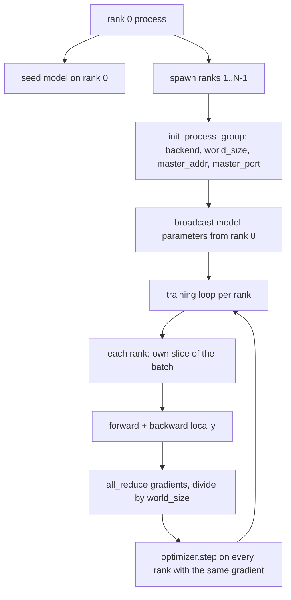
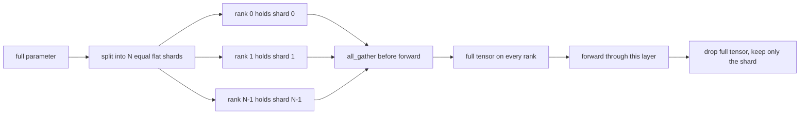

# Równoległa dystrybucja danych i FSDP od podstaw

> Szkolenie wielostopniowe to dwa kolektywy i jedna zasada. Rozgłaszaj parametry przy uruchomieniu, uśredniaj gradienty po cofnięciu się, nigdy nie pozwól, aby szeregi nie zgadzały się co do tego, na którym etapie się znajdują.

**Typ:** Kompilacja
**Języki:** Python
**Wymagania wstępne:** Faza 19, lekcje od 42 do 45
**Czas:** ~90 minut

## Cele nauczania

- Utwórz grupę procesów o N rangach za pomocą zaplecza `gloo`, bez specjalnego sprzętu.
- Zaimplementuj minimalne opakowanie DDP, które rozgłasza parametry podczas budowy i całkowicie zmniejsza gradienty po cofnięciu.
- Udowodnić, że całkowita redukcja gradientów na rangę odpowiada gradientowi pojedynczego procesu na połączonych danych wejściowych.
- Fragmentowanie parametrów szkicu FSDP: każda ranga zawiera wycinek, pełny tensor jest zbierany dla przejścia w przód i usuwany później.

## Problem

Model mieści się na jednym urządzeniu. Zbiór danych nie. Budżet optymalizacyjny mówi, że chcesz zobaczyć N razy więcej przykładów na sekundę zegara ściennego. Pierwsza dźwignia jest równoległa do danych: każda ranga uruchamia ten sam model na innym wycinku partii, a następnie uśrednia gradienty przed krokiem optymalizatora. Drugą dźwignią jest FSDP: model również nie mieści się na jednym urządzeniu, więc każda ranga przechowuje ułamek każdego parametru i rekonstruuje pełne tensory warstwa po warstwie podczas przejścia do przodu.

Bólem jest księgowość. Jeżeli parametry dryfują pomiędzy szeregami, przebieg jest dyskretnie uszkodzony. Jeśli uśrednisz gradienty, ale nie straty, deska rozdzielcza leży. Jeśli zbiorowy backend nie może zgodzić się na topologię, uruchomienie zawiesza się na zawsze. Rozwiązanie polega na tym, aby raz napisać kolektywy ręcznie i nigdy nie ufać opakowaniu, którego nie można odtworzyć.

Ta lekcja działa na procesorze. Nie zakłada się CUDA. Backend `gloo` jest dostarczany z każdą kompilacją PyTorch i akceptuje pracowników `torch.multiprocessing`; ten sam kod przełącza się na `nccl` w węźle z wieloma procesorami graficznymi bez zmiany struktury.

## Koncepcja



### Dwa kolektywy, które się liczą

| zbiorowe | Co to robi | Kiedy |
|------------|------------|------|
| `broadcast` | Skopiuj tensor z jednej rangi do wszystkich pozostałych | Inicjacja parametru, stan harmonogramu, dowolna synchronizacja „jeden do wszystkich” |
| `all_reduce` | Sumując (lub średnią lub maksymalną) tensor na wszystkich rangach, każda ranga otrzymuje wynik | Uśrednianie gradientu po odwróceniu |
| `all_gather` | Każda ranga wnosi tensor, każda ranga otrzymuje konkatenację | Kolekcja logitów, parametr FSDP unshard |

Kontrakt DDP ma wartość `broadcast` w fazie budowy i `all_reduce` po okresie wstecznym. Szkic FSDP dodaje `all_gather` przed przejściem do przodu każdej warstwy.

### Uśrednianie gradientu odpowiada gradientowi pojedynczego procesu

Model wyszkolony na partii przykładów B w szeregach N musi generować ten sam gradient, co szkolenie pojedynczego procesu na partii N*B. Sztuczka polega na tym, że zsumowanie gradientów na rangę i podzielenie przez N daje średni gradient strat, czyli to, co wytworzyłaby entropia krzyżowa ze średnią redukcją w pełnej partii. Kod lekcji potwierdza to za pomocą `max-abs-diff < 1e-3` pomiędzy ręcznym gradientem all-reduce a referencyjnym gradientem jednoprocesowym.

### Szkic FSDP



Wygrana pamięci jest dokładna: pamięć na rangę dla parametrów spada do 1/N. Kosztem jest zebranie, które jest płacone za każde podanie do przodu. Produkcyjny FSDP pokrywa się z obliczeniami poprzedniej warstwy, więc koszt zegara ściennego jest znacznie mniejszy, niż przewiduje naiwna rachunkowość. Lekcja obejmuje każdy parametr w obie strony i zapewnia, że ​​rekonstrukcja jest w bitach równa oryginałowi.

### Procesor i backend Gloo

CUDA jest celem produkcyjnym, ale na procesorze istnieją te same ścieżki kodu. `gloo` to zbiorczy backend procesora. Jest o rzędy wielkości wolniejszy niż `nccl` na procesorach graficznych, ale powierzchnia API jest identyczna. Grupa procesów lekcji jest inicjowana przez `backend="gloo"`, a rangi są tworzone przez `torch.multiprocessing` zamiast `torchrun`; oba kończą się tymi samymi wywołaniami `torch.distributed`. W węźle z wieloma procesorami graficznymi jedyne zmiany to `backend="nccl"`, tensory urządzeń i uruchomienie `torchrun`.

## Zbuduj to

`code/main.py` to artefakt, który można uruchomić.

### Krok 1: wywołaj grupę procesów

```python
os.environ["MASTER_ADDR"] = "127.0.0.1"
os.environ["MASTER_PORT"] = str(port)
dist.init_process_group(backend="gloo", rank=rank, world_size=world_size)
```

`MASTER_ADDR` i `MASTER_PORT` to miejsce spotkania: każdy stopień wybiera ten sam port na tym samym hoście. Lekcja wybiera wolny port za pomocą sztuczki wiązania i zamykania, aby uniknąć kolizji, gdy kilka przebiegów współdzieli maszynę.

### Krok 2: transmisja na budowie

`MinimalDDP.__init__` przegląda każdy parametr i bufor i wywołuje funkcję `dist.broadcast(tensor, src=0)`. Wartości rangi 0 stają się kanonicznym initem. Bez tego każda ranga inicjuje się z własnego materiału siewnego, a rangi różnią się od kroku pierwszego.

### Krok 3: całkowicie zmniejsz gradienty po przejściu do tyłu

```python
def all_reduce_grads_(module, world_size):
    for p in module.parameters():
        if p.grad is None:
            p.grad = torch.zeros_like(p.data)
        dist.all_reduce(p.grad.data, op=dist.ReduceOp.SUM)
        p.grad.data.div_(world_size)
```

Każda ranga kończy się tym samym uśrednionym gradientem. Krok optymalizatora jest teraz funkcją tych samych danych wejściowych na każdym poziomie, dlatego też parametry pozostają zsynchronizowane w całym przebiegu.

### Krok 4: udowodnij równoważność

`manual_all_reduce_matches_single_process` buduje ten sam model na poziomie 0 i porównuje gradient po całkowitej redukcji z gradientem, który pojedynczy proces obliczyłby na połączonych danych wejściowych. Maksymalna różnica abs wynosi około 1e-8.

### Krok 5: Podróż w obie strony w ramach FSDP

`fsdp_round_trip_sketch` spłaszcza każdy parametr, uzupełnia do wielokrotności `world_size`, wycina, gromadzi i usuwa. Rekonstrukcja każdej rangi jest zgodna z oryginałem. To jest nietrudny krok; odwrotność (re-shard po forwardze) to jeden wycinek zebranego tensora.

Uruchom to:

```bash
python3 code/main.py
```

Domyślny rozmiar świata to 2. Tworzą się dwa procesy procesora, komunikują się ze sobą poprzez `gloo` i wychodzą zerem. Dane wyjściowe `outputs/ddp-demo.json` przechwytują sumy parametrów na rangę, normę gradientu po całkowitej redukcji, wynik w obie strony FSDP oraz różnicę gradientu ręcznego i referencyjnego.

## Użyj tego

Stosy szkoleniowe produkcji wywołują te same prymitywy. `DistributedDataParallel` PyTorch dodaje: haki gradientu po wstecznym, które nakładają się na funkcję all-reduce z wsteczną, segmentową funkcją all-reduce, która łączy kilka małych gradientów w jeden zbiorowy oraz wykorzystano lekcję kontekstową `no_sync` 46.

FSDP PyTorch dodaje: płaski widok parametrów na warstwę, dzięki czemu każda ranga przechowuje jeden ciągły bufor, nakładanie się unsharda następnej warstwy na obliczenia bieżącej warstwy oraz opcjonalne odciążanie procesora dla fragmentów.

Kształt pozostaje ten sam: emituj przy uruchomieniu, zmniejszaj po cofnięciu, parametry fragmentu, gdy już nie pasują.

## Wyślij to

`outputs/skill-distributed-fsdp-ddp.md` zawiera przepis na nowy skrypt szkoleniowy: rozkręć grupę procesów za pomocą `gloo` dla procesora i `nccl` dla GPU, zawiń model w powłokę DDP, która rozgłasza podczas budowy i redukuje po cofnięciu, opcjonalnie parametry shard ze wzorcem all_gather z Szkic FSDP.

## Ćwiczenia

1. Uruchom z `--world-size 4` i potwierdź, że rozpiętość parametrów pozostaje poniżej 1e-3 w całym przebiegu.
2. Zastąp ręczne uśrednianie wartością `dist.all_reduce(op=dist.ReduceOp.AVG)` i określ czas różnicy.
3. Dodaj haczyk do tyłu do owijki DDP, tak aby cała redukcja zachodziła na resztę tyłu; zmierzyć poprawę zegara ściennego.
4. Zaimplementuj krok ponownego fragmentu FSDP: po przejściu w przód ponownie zastąp pełny tensor lokalnym fragmentem. Potwierdź spadek pamięci na rangę.
5. Przełącz backend na `nccl` na urządzeniu CUDA. Zwróć uwagę, które zmienne środowiskowe zmieniają się, a które pozostają takie same.

## Kluczowe terminy

| Termin | Co ludzie mówią | Co to właściwie oznacza |
|------|-----------------|--------------------------------------|
| Zaplecze | „gloo lub nccl” | Biblioteka realizująca operacje zbiorowe; gloo to procesor, nccl to GPU |
| Rozmiar świata | „Rangi ogółem” | Liczba procesów w grupie; grupa to jednostka, na której działają kolektywy |
| Ranga | „Identyfikator pracownika” | Identyfikator procesu w grupie, indeksowany zerem |
| Wszystko-redukuj | „Podsumuj oceny” | Zsumuj tensor na wszystkich rangach, każda ranga kończy się tym samym wynikiem |
| Odłamek | „Zbierz parametry” | Zrekonstruuj pełny tensor z wycinków według rang za pomocą all_gather |

## Dalsze czytanie

- Dokumentacja PyTorch `torch.distributed` dotycząca semantyki zbiorowej, na której opiera się ta lekcja.
- Zbiorcza lista biblioteki `gloo`, identyczna pod względem kształtu z prymitywami `nccl` wspieranymi przez CUDA.
- Faza 19, lekcja 46 dotycząca wzorca akumulacji gradientu, który otacza DDP all-reduce w `no_sync`.
- Faza 19, lekcja 47 dotycząca układu punktu kontrolnego, który przetrwa przebiegi DDP i FSDP.
- Dokumentacja PyTorch FSDP dotycząca produkcyjnej implementacji szkicowanego tutaj fragmentowania parametrów.