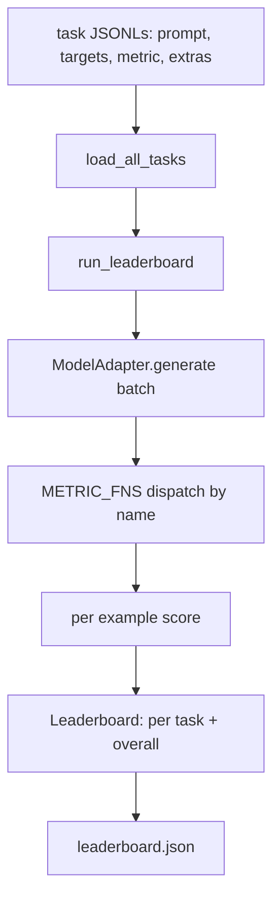
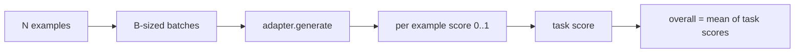

# Uprząż do oceny modelu języka

> Model, który dobrze radzi sobie z zadaniem, którego nie można zdefiniować, to model, który radzi sobie dobrze przez przypadek. Uprząż to definicja zadania, metryka, biegacz i tabela wyników w jednym krótkim, wymiennym kształcie.

**Typ:** Kompilacja
**Języki:** Python
**Wymagania wstępne:** Faza 19, lekcje od 42 do 45
**Czas:** ~90 minut

## Cele nauczania

- Zdefiniuj zadanie jako plik JSONL z `prompt`, `targets`, `metric` i opcjonalnym `extras` na przykład.
- Zaimplementuj pięć metryk: dokładne dopasowanie, rouge-l F1, sprawdzenie pliku wykonywalnego, wielokrotny wybór i zawartość podciągu.
- Zbuduj moduł uruchamiający, który grupuje przykłady według zadania i wysyła je do wymiennego adaptera modelu.
- Emituj tabelę wyników JSON z wynikami poszczególnych zadań, opóźnieniami i powtarzalną średnią ogólną.

## Problem

Co tydzień pojawia się nowy model językowy. Marketing twierdzi, że radzi sobie dobrze. Szczere pytanie brzmi: w czym? Szczerą odpowiedzią jest tabela wyników, którą sam napisałeś, ponieważ tabela wyników dostawcy jest tą, do której się dostosował.

Bez uprzęży w repozytorium porównujesz dwa modele według wibracji. Za pomocą uprzęży porównujesz je według wyniku w ustalonym zestawie zadań ze stałą metryką, na wyjściu JSON możesz porównywać. Uprząż stanowi połączenie wczorajszego biegu z dzisiejszym biegiem. Bez tego nastąpi regresja.

Pułapka powoduje nadmierne dopasowanie uprzęży do jednego modelu. Rozwiązaniem jest ta sama pułapka w odwrotnej kolejności: wiązka przewodów jest na tyle mała, że ​​można ją przeczytać w piętnaście minut, zadania są na tyle małe, że można je umieścić w repozytorium, metryki są pisane od podstaw, aby współpracownik mógł je sprawdzić, a adapter to jedyne miejsce, w którym żyje kod specyficzny dla modelu. Zmień adapter, tabela wyników się poruszy; zamień zadania, tabela wyników się poruszy. Nic więcej nie powinno się ruszać.

## Koncepcja



### Specyfikacja zadania

Każdy przykład to jedna linia JSONL:

```json
{"id": "arith-00", "prompt": "compute: 2 + 2", "targets": ["4"], "metric": "exact_match"}
```

W przypadku metryk wymagających pomocy w ocenianiu `extras` przenosi ładunek boczny:

```json
{
  "id": "code-00",
  "prompt": "python: write a function f that doubles its input",
  "targets": ["ok"],
  "metric": "code_exec",
  "extras": {"io_pairs": [[1, 2], [3, 6]]}
}
```

Zadaniem jest plik `.jsonl` w lokalizacji `outputs/tasks/`. Nazwa pliku jest nazwą zadania. Wszystkie przykłady w pliku mają wspólną metrykę.

### Pięć zadań związanych z urządzeniami

| Zadanie | Metryczne | Co testuje |
|------|------------|--------------|
| arytmetyka | dokładne_dopasowanie | Poprawność na poziomie tokena w odpowiedzi deterministycznej |
| podsumowanie | różowy_l | Najdłuższy wspólny podciąg F1 w porównaniu z jednowierszowym podsumowaniem odniesienia |
| wykonanie kodu | kod_exec | Test wykonywalny: przewidywana funkcja musi spełniać listę par wejście-wyjście |
| wielokrotnego wyboru | wybór_wielokrotny | Pierwsza litera przewidywania musi odpowiadać dozwolonej literze |
| pokolenie | podciąg_zawiera | Tekst w dowolnej formie musi zawierać co najmniej jeden podciąg docelowy |

### Kontrakt metryczny

Każda metryka jest funkcją z `(prediction, targets, extras) -> float in [0.0, 1.0]`. Uprząż uśrednia wyniki poszczególnych przykładów, aby uzyskać wynik zadania, a następnie uśrednia wyniki zadań, aby uzyskać wynik ogólny. Funkcje metryczne są małe:

- `exact_match`: małe litery, zwijanie białych znaków, równość.
- `substring_contains`: ta sama normalizacja, test podciągu.
- `multiple_choice`: pierwszy znak pisany wielkimi literami.
- `rouge_l`: długość LCS podzielona przez długość przewidywania i odniesienia, F1 precyzji i przypominania.
- `code_exec`: wykonaj przewidywanie w ograniczonej przestrzeni nazw, wywołaj `f(x)` na każdej parze wejście-wyjście, zlicz dopasowania.

Metryka code_exec uruchamia przewidywanie w pozbawionej wbudowanej przestrzeni nazw. Test z lekcji potwierdza, że ​​`import os` wybucha, ponieważ `os` nie znajduje się w przestrzeni nazw; nie można dotrzeć do systemu plików na podstawie przewidywania kodu.

### Adapter modelu

```python
class ModelAdapter(Protocol):
    def generate(self, prompts: Sequence[str]) -> List[str]: ...
    @property
    def name(self) -> str: ...
```

Adapter to szew. Lekcja zawiera `ToyAdapter`, deterministyczny moduł dopasowujący wzorce, który zwraca właściwą odpowiedź na każdy monit w pięciu zadaniach dotyczących urządzeń. Prawdziwy adapter wywołuje model i zwraca jego wynik. Uprząż nie ma znaczenia, która.

### Biegacz

`run_task` wsadowo `batch_size` wyświetla monity na raz i wysyła je do funkcji metryki. `run_leaderboard` przechodzi przez każde zadanie i podaje średnie. `write_leaderboard` emituje kod JSON z ciągiem schematu, aby przyszłe zmiany formatu nie powodowały cichego zakłócania pulpitów nawigacyjnych.



## Zbuduj to

`code/main.py` to artefakt, który można uruchomić.

### Krok 1: zadania mocowania nasion

`seed_fixture_tasks(target_dir)` zapisuje pięć plików `.jsonl`. Pierwsze uruchomienie `main.py` inicjuje je, gdy katalog jest pusty.

### Krok 2: załaduj zadania

`load_all_tasks(task_dir)` odczytuje co `.jsonl` i zwraca dyktando z nazwy zadania do listy `Example` rekordów. Linie komentarza zaczynające się od `#` i puste linie są pomijane, aby współautorzy mogli dodawać adnotacje do plików.

### Krok 3: wdrożenie wskaźników

Każda metryka jest małą funkcją z testem jednostkowym. Zestaw testów zawartych w lekcji obejmuje 13 przypadków obejmujących normalizację, częściowe nakładanie się, wykonanie kodu i odrzucenie niebezpiecznego kodu.

### Krok 4: napisz biegacza

`run_task` iteruje partie i tworzy `TaskResult` z wynikiem, poprawną liczbą, całkowitą liczbą i opóźnieniem. `run_leaderboard` wykonuje wszystkie zadania i generuje `Leaderboard` z ogólną średnią.

### Krok 5: wyemituj JSON

`write_leaderboard` serializuje płytkę. Flaga `--include-per-example` zrzuca rekordy dla poszczególnych przykładów, dzięki czemu można porównać przewidywania z poprzednim przebiegiem, gdy wyniki się zmieniają.

Uruchom to:

```bash
python3 code/main.py
```

Skrypt inicjuje urządzenia przy pierwszym uruchomieniu, ocenia je za pomocą adaptera zabawek (który obsługuje każde urządzenie poprawnie) i zapisuje `outputs/leaderboard.json`. Ogólny wynik to 1,0 z adapterem do zabawek; test adaptera odgałęzionego w `test_main.py` pokazuje, że ta sama wiązka daje 0,0, gdy adapter nie może odpowiedzieć.

## Użyj tego

Aby podłączyć prawdziwy model napisz adapter. Kształt:

```python
class HttpAdapter:
    name = "vendor.v1"

    def __init__(self, endpoint, api_key):
        self.endpoint = endpoint
        self.api_key = api_key

    def generate(self, prompts):
        out = []
        for prompt in prompts:
            response = http_post(self.endpoint, prompt, self.api_key)
            out.append(response["text"])
        return out
```

Zamień `ToyAdapter` na `HttpAdapter` na górze `main()`. Uprząż, zadania, wskaźniki i tabela wyników pozostają takie same.

Trzy wzory do egzekwowania przy wysyłce uprzęży w prawdziwym projekcie:

- **Przypnij pliki zadań.** Plik liderów.json zawiera przypiętą do skrótu treść zadania lub obok plików JSONL; w przeciwnym razie wynik przesunie się wraz z plikiem zadania i nie będzie można stwierdzić który.
- **Różnij prognozy, a nie tylko wyniki.** Flaga `--include-per-example` pozwala zobaczyć, co powiedział model w dniu spadku wyniku.
- **Ogranicz rozmiar partii.** Prawdziwe adaptery mają ograniczenia szybkości. Mały rozmiar partii zapewnia kompatybilność uprzęży u różnych dostawców.

## Wyślij to

`outputs/skill-lm-eval-harness.md` zawiera przepis: specyfikacja zadania JSONL, pięć metryk, wymienny adapter, moduł wsadowy, tabela wyników JSON z ciągiem schematu. Pliki zadań w `outputs/tasks/` to elementy wyposażenia; skopiuj je do prawdziwego projektu jako początek.

## Ćwiczenia

1. Dodaj szóste zadanie z niestandardową metryką, którą piszesz od zera (nakładanie się na wzór BLEU, punktacja referencyjna na wzór BLEURT, wszystko z jasnym kontraktem).
2. Rozszerz `code_exec`, aby przechwycić standardowe wyjście i zaakceptować listę oczekiwanych standardowych wyjść jako cele.
3. Dodaj polecenie porównania tabeli liderów: biorąc pod uwagę dwa pliki `leaderboard.json`, wypisz, które zadania zostały przeniesione i o ile.
4. Przykład ograniczenia opóźnienia. Zawiń wywołanie adaptera w limit czasu; umieść osobną `timeouts` kolumnę w tabeli liderów.
5. Przypnij treść zadania za pomocą sha256 w tabeli liderów, aby przyszły czytelnik mógł sprawdzić, czy zdobył te same zadania.

## Kluczowe terminy

| Termin | Co ludzie mówią | Co to właściwie oznacza |
|------|-----------------|--------------------------------------|
| Specyfikacja zadania | „Format ewaluacyjny” | Plik JSONL z podpowiedzią, celami, metryką i opcjonalnymi dodatkami na przykład |
| Metryczne | „Jak zdobywasz punkty” | Funkcja od (prognozy, wartości docelowe, dodatki) do wartości zmiennoprzecinkowej w [0, 1] |
| Adapter | „Klient modelowy” | Obiekt z metodą generate(prompts) -> list[str]; jedyny kod specyficzny dla modelu |
| Tabela liderów | „Tabela wyników” | JSON z wynikami poszczególnych zadań, całkowitą liczbą, opóźnieniami i ogólną średnią |
| Metryka wykonania kodu | „Uruchom i sprawdź” | Wykonaj przewidywanie w ograniczonej przestrzeni nazw, porównaj z parami wejście-wyjście |

## Dalsze czytanie

- Oryginalna uprząż oceniająca LM dla odniesienia produkcyjnego, znacznie większa, ale o tym samym kształcie.
- Światło HuggingFace dotyczące alternatywnej realizacji tego samego kontraktu.
- Lekcja 46 z fazy 19 obejmuje wzorce akumulacji gradientu stosowane w stosie treningowym oceniającym uprząż.
- Lekcja 47 z fazy 19 omawia format punktu kontrolnego, w odniesieniu do którego zdobywasz punkty; przypnij skrót punktu kontrolnego w tabeli liderów.
- Lekcja 48 fazy 19 obejmuje rozproszony stos szkoleniowy, który wygenerował testowany model.