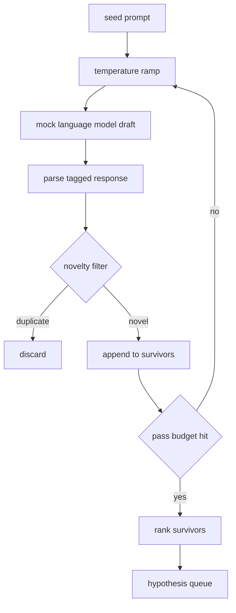

# Generator hipotez

> Agent badawczy, który zadaje dwa razy to samo pytanie, marnuje tokeny. Sztuka polega na tym, aby każdy projekt wylądował w nowym miejscu.

**Typ:** Kompilacja
**Języki:** Python
**Wymagania wstępne:** Faza 19, ścieżka A, lekcje 20–29
**Czas:** ~90 minut

## Cele nauczania
- Uruchom próbnik z podpowiedzi i zamień jego wyniki w zapisane na maszynie zapisy hipotez.
- Zwiększaj temperaturę próbnika przy każdym przejściu, tak aby następny ciąg dryfował dalej od poprzedniego.
- Filtruj w pobliżu duplikatów za pomocą małego modelu osadzania i progu odległości cosinus.
- Oceń ocalałych za pomocą funkcji punktacji, która łączy w sobie nowość, specyficzność i testowalność.
- Utrzymuj determinizm każdego kroku, aby to samo ziarno zawsze tworzyło tę samą kolejkę.

## Po co generować, a potem filtrować

Planista, który raz zadaje jednemu modelowi pytanie, otrzymuje jedną hipotezę. To jest w porządku dla działającego przykładu. Dla pętli badawczej jest to niewłaściwy kształt. Pętla wymaga kolejki rankingowej z głębokością, więc gdy pierwsza hipoteza zawiedzie, biegacz przygotowuje następną, nie płacąc za kolejne pełne przejście próbkowania.

Łączą się dwa pomysły, aby stworzyć tę kolejkę. Pierwszym z nich jest wzrost temperatury: każde przejście przez próbnik podnosi temperaturę o jeden stopień, więc późniejsze przeciągi zachęcają do wędrówek. Drugim jest filtrowanie nowości: po każdym przeciągu generator mierzy odległość osadzania od każdego poprzedniego ocalałego i odrzuca wszystko, co znajduje się w klastrze.

Lekcja zawiera próbny model języka, który zwraca sekwencje tokenów skryptowych dla stałych podpowiedzi. Próba wystarczy, aby wykonać pełną ścieżkę: wprowadzenie monitu o wysiew, zastosowanie rampy temperatury, przeanalizowanie kandydatów, uruchomienie filtra nowości, wystawienie kolejki rankingowej.

## Kształt hipotezy

```text
Hypothesis
  id             : int           (monotonic within a run)
  text           : str           (the claim)
  variables      : list[str]     (what changes between conditions)
  metric         : str           (what the runner will measure)
  baseline_ref   : str | None    (which paper or run the comparison cites)
  draft_pass     : int           (which sampler pass produced this)
  temperature    : float         (the sampler setting at draft time)
  novelty_score  : float         (distance from prior survivors, 0..1)
  rank_score     : float         (weighted sum used for ordering)
```

`variables` i `metric` nie są tekstem dowolnym. Parser pobiera je z otagowanej odpowiedzi. Moduł uruchamiający z lekcji pięćdziesiątej drugiej odczytuje te pola bezpośrednio podczas tworzenia konfiguracji eksperymentu.

Wartość `baseline_ref` jest opcjonalna, ale zalecana. Osoba oceniająca z lekcji pięćdziesiątej trzeciej potrzebuje punktu odniesienia, z którym będzie mogła porównać. Jeśli hipoteza pomija jedną z nich, oceniający wraca do poprzedniego badania tego samego miernika.

## Architektura



Pętla jest prosta. Interesujące jest to, że każde pudełko ma twardą umowę.

## Rampa temperatury

Zacznij od `t_min`, zakończ o `t_max`, krok `(t_max - t_min) / (n_passes - 1)`. Każde przejście wywołuje próbnik w bieżącej temperaturze, uzyskując `n_passes` równomiernie rozmieszczone wartości z `GeneratorConfig.schedule()`. Model próbny uwzględnia temperaturę poprzez przełączanie między małym zestawem odpowiedzi skryptowych wpisanych na `(prompt, temp_bucket)`. Wiadra są otwarte w odstępach czasu, więc niewielka zmiana temperatury powoduje wybranie innego wiadra i wytwarza inny ciąg. W produkcji próbnik byłby prawdziwym modelem, przez który przeszedł `temperature=t`.

Domyślny harmonogram obejmuje sześć przebiegów od `0.2` do `1.2`. Sześć wystarczy, aby zapełnić kolejkę bez płacenia za próbki, które i tak filtr nowości odrzuci. Poniżej `0.2` model powtarza ziarno. Powyżej `1.2` odpowiedzi zwykle odbiegają od tematu i zawodzą analizator składni.

## Nowatorski filtr

Po przeanalizowaniu każdej wersji roboczej generator osadza tekst i porównuje go z każdą zaakceptowaną hipotezą. Osadzanie to mały, zaszyfrowany woreczek zawierający tokeny słów, znormalizowany do długości jednostkowej. Odległość cosinus między dwoma wektorami jednostkowymi wynosi `1 - dot(a, b)`. Projekt zostaje uznany, jeśli minimalna odległość od poprzedniego ocalałego przekracza `novelty_threshold`. Wartość domyślna to `0.25`.

Osadzanie skrótów nie jest wyszukane. Jest deterministyczny, ma zerowe zależności i wystarczy, aby uchwycić oczywisty przypadek: dwie wersje robocze, które mają większość rzeczowników wspólnych. Wdrożenie produkcyjne zamieniłoby się w model małych zdań. Interfejs pozostaje taki sam.

## Wynik w rankingu

```text
rank_score = w_novelty * novelty_score
           + w_specificity * specificity_score
           + w_testability * testability_score
```

Trzy oceny cząstkowe. `novelty_score` to minimalna odległość osadzenia od poprzednich ocalałych. `specificity_score` to liczba konkretnych zmiennych w hipotezie podzielona przez liczbę docelową. `testability_score` wynosi jeden, jeśli hipoteza określa zarówno metrykę, jak i linię bazową, połowę, jeśli zawiera tylko metrykę, zero w przeciwnym razie.

Domyślne wagi to `0.4`, `0.3`, `0.3`. Wagi znajdują się w konfiguracji generatora, więc lekcja dalsza może je przesunąć bez rozwidlania kodu.

## Próbny model języka

```python
class MockLLM:
    def sample(self, prompt: str, temperature: float, seed: int) -> str:
        ...
```

Próbnik jest deterministyczny, biorąc pod uwagę potrójną `(prompt, temperature, seed)`. W makiecie skryptowa tabela odpowiedzi jest ustawiona na `(prompt_signature, temperature_bucket)`. Jeśli w tabeli nie ma wpisu dla klucza, próbnik zwraca wartość rezerwową, która nie sprawdza parsera. Ścieżkę rezerwową realizuje jeden z testów.

Materiał siewny jest mieszany z odpowiedzią, więc ta sama para `(prompt, temperature)` z różnymi nasionami tworzy różne wersje robocze. W testach przypinamy nasiona, aby zapewnić powtarzalność wyników. W prawdziwym wdrożeniu ziarno pochodziłoby z zegara systemowego lub licznika.

## Kolejka wyjściowa

Wynikiem jest lista `Hypothesis` rekordów posortowana malejąco `rank_score`. Biegacz z lekcji pięćdziesiątej drugiej podnosi głowę, przeprowadza eksperyment, a oceniający z lekcji pięćdziesiątej trzeciej zapisuje werdykt. Jeżeli werdykt stwierdza, że ​​hipoteza była błędna, biegacz wybiera następną.

Kolejka jest skończona. Gdy jest pusty, koordynator może albo rozszerzyć monit inicjujący i ponownie uruchomić generator, albo zatrzymać się i zgłosić wyczerpanie budżetu.

## Jak odczytać kod

`code/main.py` definiuje `Hypothesis`, `MockLLM`, `HypothesisGenerator` i wersję deterministyczną. Generator udostępnia pojedynczą metodę `run(seed_prompt)`, która zwraca posortowaną kolejkę; liczba przejść jest odczytywana z `GeneratorConfig.n_passes`, a nie przekazywana jako argument. Osadzanie to zaszyfrowany worek tokenów. Filtr nowości to pojedyncza funkcja. Wynik rangi jest pojedynczą funkcją. Nic nie zależy od `numpy`; matematyka dotycząca osadzania jest oparta na czystym stdlib, więc lekcja pozostaje przenośna.

`code/tests/test_generator.py` obejmuje ścieżkę liniową, ścieżkę odrzucenia duplikatów, ścieżkę awarii analizatora składni, granice rampy temperatury i kolejność rang.

## Gdzie to pasuje

Lekcja pięćdziesiąta tworzy kolejkę. Lekcja pięćdziesiąta pierwsza zajmuje czołową pozycję w kolejce i przeszukuje literaturę, aby ją potwierdzić lub obalić. Lekcja pięćdziesiąta druga podejmuje tę samą decyzję i przeprowadza rzeczywisty eksperyment. Lekcja pięćdziesiąta trzecia odczytuje oba wyniki i zapisuje werdykt. Cztery lekcje tworzą pętlę badawczą, w której nie ma człowieka; człowiek może wkroczyć na dowolną granicę.