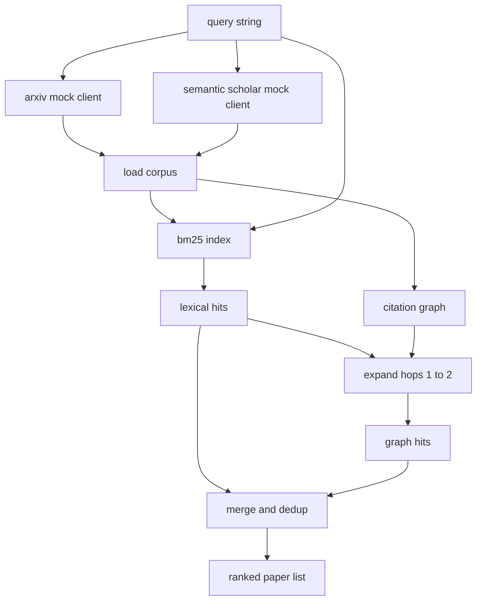

# Wyszukiwanie literatury

> Hipoteza jest tania. Wiedza o tym, czy ktoś już to udowodnił, jest kosztowna. Zbuduj warstwę odzyskiwania, która odpowie na to pytanie, zanim biegacz uruchomi piaskownicę.

**Typ:** Kompilacja
**Języki:** Python
**Wymagania wstępne:** Faza 19, ścieżka A, lekcje 20–29
**Czas:** ~90 minut

## Cele nauczania
- Modeluj mały zapis papierowy z polami, które pętla będzie czytać w dalszej części.
- Zbuduj indeks BM25 na podstawie abstraktów wyłącznie ze strukturami danych stdlib.
- Przejdź po wykresie cytowań, aby znaleźć artykuły, które przeoczyły wyszukiwanie leksykalne.
- Deduplikacja trafień w leksyce i wykresie przechodzi przez stabilny identyfikator papieru.
- Umieść dwa próbne zewnętrzne interfejsy API w jednym kliencie, aby strona wywołań nadrzędnych pozostała taka sama, gdy wylądują prawdziwe punkty końcowe.

## Po co dwa przepustki odzyskiwania

Wyszukiwanie słów kluczowych w abstraktach zwraca artykuły, których słownictwo jest takie samo jak w zapytaniu. Zajmuje to większą część powierzchni. Pomija dwie sprawy. Po pierwsze, w artykule podstawowym używa się innego słownictwa; na przykład zapytanie o „rzadką uwagę” pomija artykuł zatytułowany „wybór bloków w routingu transformatora”. Po drugie, odpowiedni artykuł jest kontynuacją i cytuje znaną kotwicę; skuteczniej jest znaleźć kotwicę i iść naprzód, niż brutalnie wymuszać pulę abstrakcyjną.

Lekcja buduje oba przejścia. BM25 nad abstrakcjami łapie hity leksykalne. Przechodzenie przez wykres cytowań rozszerza zbiór nasion do przodu i do tyłu o jeden lub dwa przeskoki. Związek jest deduplikowany według identyfikatora papierowego i klasyfikowany według małego łącznego wyniku.

## Kształt papieru

```text
Paper
  id          : str           (stable identifier, "p001" for the mock corpus)
  title       : str
  abstract    : str
  year        : int
  authors     : list[str]
  references  : list[str]     (paper ids this paper cites)
  citations   : list[str]     (paper ids that cite this paper)
  source      : str           (which mock api supplied it, "arxiv" or "s2")
```

Pola odnośników i cytatów tworzą ukierunkowany wykres cytowań. Obydwa fałszywe interfejsy API zwracają nakładające się, ale nie identyczne pola, więc moduł ładujący korpus łączy je w `id`.

## Architektura



Klient pobierania jest właścicielem zarówno przebiegów, jak i połączenia. Osoba wywołująca wysyła zapytanie i otrzymuje listę rankingową, na której każdy wpis zawiera pola punktacji w wersji papierowej (`bm25_score`, `graph_distance`, `recency_score`, `final_score`), które wyjaśniają ranking.

## BM25 od podstaw

Implementacją jest standardowy Okapi BM25 z domyślnymi parametrami `k1=1.5`, `b=0.75`. Indeks to dwa słowniki: `term -> doc_frequency` i `term -> list of (doc_id, term_count)`. Długość dokumentu to liczba tokenów streszczenia. Średnia długość dokumentu jest obliczana jednorazowo podczas tworzenia indeksu. Punktacja zapytania to suma terminów zapytania `idf * tf_norm`, gdzie `tf_norm` to standardowa częstotliwość terminów o znormalizowanej długości BM25.

Tokenizer to `lower`, a następnie podzielony na elementy inne niż alfanumeryczne. Nie jest łodygą. System produkcyjny zamieniłby się na małą łodygę. Interfejs pozostaje taki sam.

```text
idf(t)      = log((N - df + 0.5) / (df + 0.5) + 1.0)
tf_norm(t)  = (f * (k1 + 1)) / (f + k1 * (1 - b + b * dl / avgdl))
score(d, q) = sum over t in q of idf(t) * tf_norm(t)
```

## Przechodzenie przez wykres cytatów

Wykres budowany jest raz z korpusu. Przednie krawędzie przechodzą od papieru do jego odniesień. Tylne krawędzie prowadzą od artykułu do jego cytatów. Przechodzenie jest wyszukiwaniem wszerz, na podstawie którego znajdują się najlepsze trafienia BM25, ograniczone do dwóch przeskoków.

Dwa przeskoki to celowy sufit. Jeden przeskok jest za płytki; agent często chce bezpośredniego przodka lub potomka. Trzy przeskoki zwiększają rozmiar wyniku na połączonym wykresie i mają tendencję do odbiegania od tematu. Lekcja przedstawia limit przeskoków jako pokrętło konfiguracyjne, dzięki czemu pętla poniżej może go zawęzić.

## Deduplikacja i ranking

Dwa przebiegi zwracają nakładające się zestawy. Klucze scalające na identyfikatorze papierowym. Dla każdego artykułu końcowy wynik jest mieszanką ważoną.

```text
final_score = w_bm25 * bm25_score_norm
            + w_graph * graph_score
            + w_recency * recency_score
```

`bm25_score_norm` to wynik BM25 podzielony przez maksymalny wynik BM25 w scalonym zestawie (więc pole ma stosunek zero do jednego). `graph_score` to jeden dla bezpośrednich trafień leksykalnych, następnie `0.6` dla jednego przeskoku, `0.3` dla dwóch przeskoków, w przeciwnym razie zero. `recency_score` to liniowa rampa od zera w minimalnym roku korpusu do jednego w maksymalnym roku.

Domyślne wagi to `0.5`, `0.3`, `0.2`. Wagi są konfigurowane; nieaktualny temat może zmniejszyć aktualność, podczas gdy szybko poruszający się temat ją podnosi.

## Próbny korpus

Korpus składa się ze stu artykułów wygenerowanych przez `build_corpus()`. Każdy artykuł ma odręcznie napisany tytuł i streszczenie dotyczące jednego z pięciu tematów: rzadkość uwagi, zwiększanie wyszukiwania, adaptery niskiej rangi, destylacja zbioru danych i uprzęże ewaluacyjne. Odniesienia i cytaty są ze sobą powiązane, więc każdy temat tworzy połączony podwykres z kilkoma krawędziami przecinającymi się z tematami.

Dwóch fałszywych klientów API (`ArxivMockClient`, `SemanticScholarMockClient`) odczytuje z tego samego korpusu, ale udostępnia różne pola. Arxiv zwraca tytuł, streszczenie, rok i autorów. Semantic Scholar dodaje odniesienia i cytaty. Unie klienta pobierania na id; Rozwiązywanie sporów między klientami w terenie zostaje odłożone na lekcję uzupełniającą.

## Co czytają lekcje 52 i 53

Osoba biegająca w lekcji pięćdziesiątej drugiej czyta `paper.id`, `paper.title` i trzy górne zdania streszczenia jako kontekst eksperymentu. Oceniający w lekcji pięćdziesiątej trzeciej czyta `paper.year` i `paper.references`, aby przypisać punkt odniesienia do konkretnego artykułu.

Klient pobierania zwraca `RetrievalResult` zarówno z listą rankingową, jak i metrykami na zapytanie: liczba trafień, średni wynik, najlepszy wynik, całkowity czas trwania ściany. Biegacz rejestruje je, aby późniejsza obserwacja mogła określić jakość w czasie.

## Jak odczytać kod

`code/main.py` definiuje `Paper`, `ArxivMockClient`, `SemanticScholarMockClient`, `BM25Index`, `CitationGraph`, `RetrievalClient` i demonstracja deterministyczna. Próbni klienci i korpus znajdują się w tym samym pliku, więc lekcja pozostaje przenośna. Implementacja BM25 to jedna klasa, sześćdziesiąt linii. Jedną z metod jest przechodzenie przez graf.

`code/tests/test_retrieval.py` obejmuje ścieżkę leksykalną, ścieżkę wykresu, scalanie, deduplikację i puste zapytanie.

## Gdzie to pasuje

Lekcja pięćdziesiąta stawia hipotezę. W lekcji pięćdziesiątej pierwszej przeszukano literaturę, aby sprawdzić, czy hipoteza ta została już potwierdzona. Lekcja pięćdziesiąta druga przeprowadza eksperyment, jeśli tak nie jest. W lekcji pięćdziesiątej trzeciej czytamy zarówno wyniki wyszukiwania, jak i metryki eksperymentu, aby napisać werdykt. Klient pobierania jest najtańszym z czterech etapów i działa jako pierwszy w programie Orchestrator.