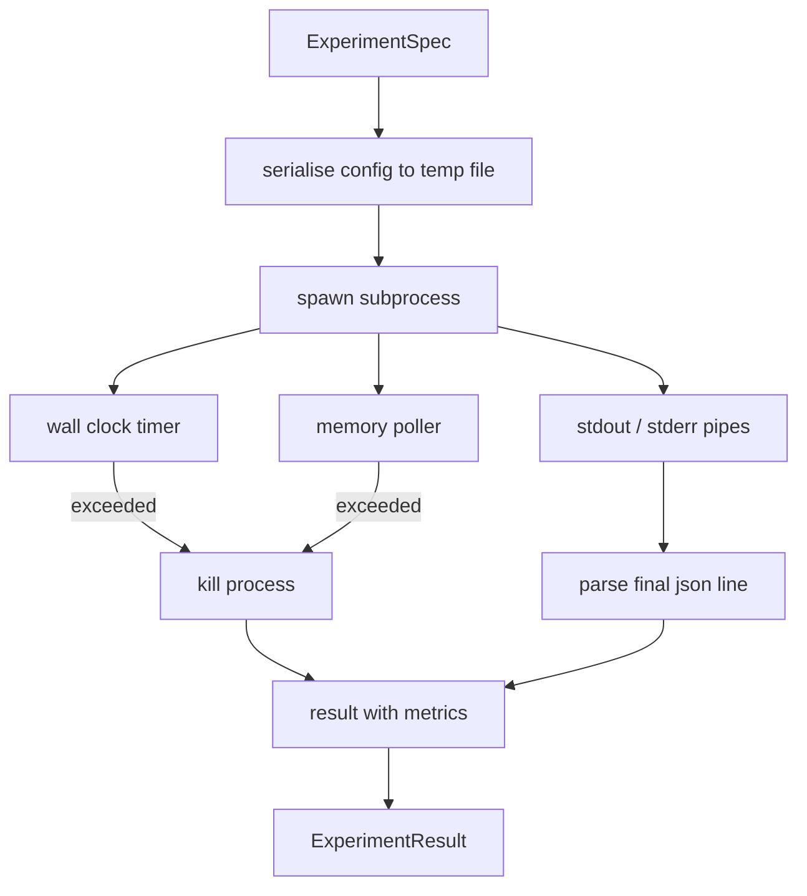

# Biegacz eksperymentów

> Pętla jest tak uczciwa, jak jej pomiary. Zbuduj moduł uruchamiający, który pobiera specyfikację, wykonuje ją w podprocesie w trybie piaskownicy i emituje obiekt blob metryk JSON, któremu osoba oceniająca może zaufać.

**Typ:** Kompilacja
**Języki:** Python
**Wymagania wstępne:** Faza 19, ścieżka A, lekcje 20–29
**Czas:** ~90 minut

## Cele nauczania
- Zakoduj eksperyment jako wpisaną specyfikację, którą uruchamiający może serializować do podprocesu.
- Uruchom podproces z limitem czasu twardego zegara ściennego i miękkim limitem pamięci, a następnie wykaż oba jako warunki końcowe.
- Przechwytuj stdout, stderr i ustrukturyzowany obiekt metryki w pojedynczy rekord wyniku.
- Zbuduj tabelę ablacji, która przesuwa jedno pokrętło konfiguracyjne na raz w oparciu o stałą specyfikację podstawową.
- Staraj się, aby każdy wynik był deterministyczny, biorąc pod uwagę materiał siewny, aby osoba oceniająca widziała te same liczby w różnych seriach.

## Dlaczego podproces

Pętla badawcza uruchamia niezaufany kod. Hipoteza pochodzi od próbnika, scenariusz eksperymentu pochodzi z tej samej ścieżki; traktowanie któregokolwiek z nich jako bezpiecznego w procesie powoduje awarię, która powoduje wyłączenie orkiestratora. Podprocesy to najprostsza izolacja dostarczana przez język: oddzielny proces, niezależna przestrzeń adresowa, uchwyt sygnału po stronie nadrzędnej.

Runner tutaj nie implementuje pełnego sandboxingu. Nie ma cgroup, nie ma filtra seccomp, nie ma ponownego mapowania przestrzeni nazw. To, co ma, to limit czasu zegara ściennego, pętla odpytywania w celu zwiększenia pamięci i ścieżka zabicia, która kończy proces na dowolnym limicie. Jest to kontrakt wykonawczy, który rozszerza każda bardziej rozbudowana piaskownica. Lekcja sprawia, że ​​umowa jest na tyle mała, że ​​można ją przeczytać na jednym posiedzeniu.

## Kształt Specyfikacja eksperymentu

```text
ExperimentSpec
  spec_id        : str            (stable id, "exp_001")
  hypothesis_id  : int            (link back to the queue from lesson 50)
  script_path    : str            (path to the python script to run)
  config         : dict           (passed to the script as one json arg)
  seed           : int            (deterministic seed for the experiment)
  wall_timeout_s : float          (hard timeout, killed on exceed)
  memory_cap_mb  : int            (soft cap, polled; killed on exceed)
  metric_keys    : list[str]      (which fields the evaluator will read)
```

Skrypt znajduje się na dysku; biegacz zapisuje konfigurację w ścieżce pliku tymczasowego, którą czyta skrypt. Oczekuje się, że skrypt wypisuje na standardowe wyjście pojedynczą linię JSON, której klucze stanowią nadzbiór `metric_keys`. Wszystko inne na stdout jest przechwytywane, ale ignorowane przez parser metryk.

## Architektura



Biegacz to jedna klasa z jedną główną metodą. Poller to mały wątek, który budzi się raz na każdy interwał odpytywania i odczytuje odpowiednik podprocesu `psutil` z systemu plików proc, jeśli jest dostępny, i powraca do braku op, gdy platforma go nie ujawnia.

## Dlaczego miękka osłona pamięci

Twarde limity pamięci wymagają `resource.setrlimit` i działają tylko w systemie POSIX. Lekcja dotyczy podejścia przenośnego: odpytuj ustawiony rozmiar rezydenta z platformy i zakończ podproces, jeśli przekroczy limit. Czapka jest miękka, ponieważ ankieter ma interwał niezerowy; proces może wzrosnąć powyżej limitu pomiędzy sondażami, a następnie spaść. Biegacz rejestruje maksymalną zaobserwowaną wartość RSS, dzięki czemu oceniający może zobaczyć, jak blisko limitu był bieg.

W systemach bez obsługi inspekcji procesów moduł odpytujący rejestruje jednorazowe ostrzeżenie i wyłącza się. Limit czasu zegara ściennego nadal obowiązuje. Testy lekcyjne obejmują obie ścieżki.

## Przechwytywanie stdout i stderr

Biegacz odczytuje, że obie rury zostały opróżnione po zakończeniu. Stdout jest skanowany linia po linii; ostatni wiersz analizowany jako plik json ze wszystkimi wymaganymi `metric_keys` jest traktowany jako obiekt blob metryk. Wcześniejsze linie JSON są zachowywane w wyniku jako `intermediate_metrics`; osoba oceniająca może je wykorzystać do krzywych uczenia się.

Stderr jest dosłownie przechwytywany w wyniku. Biegacz nigdy nie podbija przy niezerowym kodzie wyjścia; zamiast tego rejestruje kod w wyniku. Każde niezerowe wyjście jest oznaczone etykietą `"crash"`, nawet jeśli skrypt wydrukował metryki, więc osoba oceniająca domyślnie traktuje częściowe przebiegi jako niepowodzenia.

## Tabela ablacji

```python
def ablate(base: ExperimentSpec, knob: str, values: list[Any]) -> list[ExperimentSpec]:
    ...
```

Biorąc pod uwagę specyfikację podstawową i nazwę pokrętła, pomocnik zwraca jedną specyfikację na wartość z zastąpionym `config[knob]`. Każda specyfikacja otrzymuje pochodną `spec_id` (`f"{base.spec_id}_{knob}_{value}"`). Biegacz wysyła `AblationRunner`, który uruchamia je w określonej kolejności i zwraca `AblationTable` kluczowaną wartością pokrętła.

Po co jedno pokrętło na raz. Pełne przemiatanie silniowe zwiększa się wykładniczo i daje wyniki, których osoba oceniająca nie jest w stanie zinterpretować. Jedno pokrętło na raz tworzy czystą oś, którą oceniający może wykreślić. Lekcja obsługuje przemiatanie wieloma pokrętłami tylko jako powtarzające się ablacje jednym pokrętłem, skomponowane przez dzwoniącego.

## Determinizm

Każda specyfikacja niesie w sobie ziarno. Program uruchamiający przekazuje materiał siewny do skryptu za pomocą polecenia konfiguracyjnego (`config["__seed"] = spec.seed`). Skrypty próbnych eksperymentów w `code/experiments/` honorują materiał siewny i generują identyczne dane w każdym przebiegu. Od tego zależy oceniający z lekcji pięćdziesiątej trzeciej; bez determinizmu „regresja” może być inną losową inicjalizacją.

## Skrypt próbnego eksperymentu

Lekcja zawiera jeden skrypt eksperymentu: `code/experiments/sparsity_experiment.py`. Jest to prawdziwy skrypt, który odczytuje swój plik konfiguracyjny, symuluje mały przebieg szkoleniowy z losowym przebiegiem numpy i drukuje obiekt typu blob z danymi JSON. Skrypt wykorzystuje pokrętło `sleep_s` do testowania przekroczeń limitu czasu oraz pokrętło `allocate_mb` do testowania modułu odpytującego pamięć.

Symulacja nie uczy niczego prawdziwego. Jest to obliczenie numeryczne, które naśladuje kształt pętli treningowej: krzywa straty, końcowe zakłopotanie, czas na ścianie. Celem lekcji jest biegacz, a nie symulacja. Prawdziwy skrypt eksperymentu importowałby model.

## Kształt wyniku

```text
ExperimentResult
  spec_id              : str
  hypothesis_id        : int
  exit_code            : int
  terminal             : "ok" | "timeout" | "oom" | "crash"
  wall_time_s          : float
  peak_rss_mb          : float | None
  metrics              : dict
  intermediate_metrics : list[dict]
  stdout_tail          : str
  stderr_tail          : str
```

Osoba oceniająca najpierw czyta `metrics` i `terminal`. Jeśli terminal jest inny niż `"ok"`, eksperyment liczy się jako nieudany, a werdykt osoby oceniającej jest automatyczny. W przeciwnym razie metryki przechodzą test istotności.

## Jak odczytać kod

`code/main.py` definiuje `ExperimentSpec`, `ExperimentResult`, `ExperimentRunner`, `AblationRunner` i wersję deterministyczną. Zarządzanie podprocesami to jedna klasa. Moduł odpytujący pamięć to mały wątek. Pomocnik ablacyjny to pojedyncza funkcja.

`code/experiments/sparsity_experiment.py` to próbny eksperyment używany w testach. Odczytuje ścieżkę pliku konfiguracyjnego z argv i po zakończeniu zapisuje pojedynczą linię metryk JSON.

`code/tests/test_runner.py` obejmuje ścieżkę powodzenia, ścieżkę przekroczenia limitu czasu, ścieżkę awarii, tabelę ablacji i kontrolę determinizmu w dwóch seriach.

## Gdzie to pasuje

Lekcja pięćdziesiąta generuje hipotezę. Lekcja pięćdziesiąta pierwsza odfiltrowuje wszystko, co zostało już ustalone w literaturze. Lekcja pięćdziesiąta druga przedstawia eksperyment dotyczący tego, co pozostało. Lekcja pięćdziesiąta trzecia odczytuje wynik, przeprowadza test istotności i zapisuje werdykt przechowywany przez koordynatora w odniesieniu do identyfikatora hipotezy.