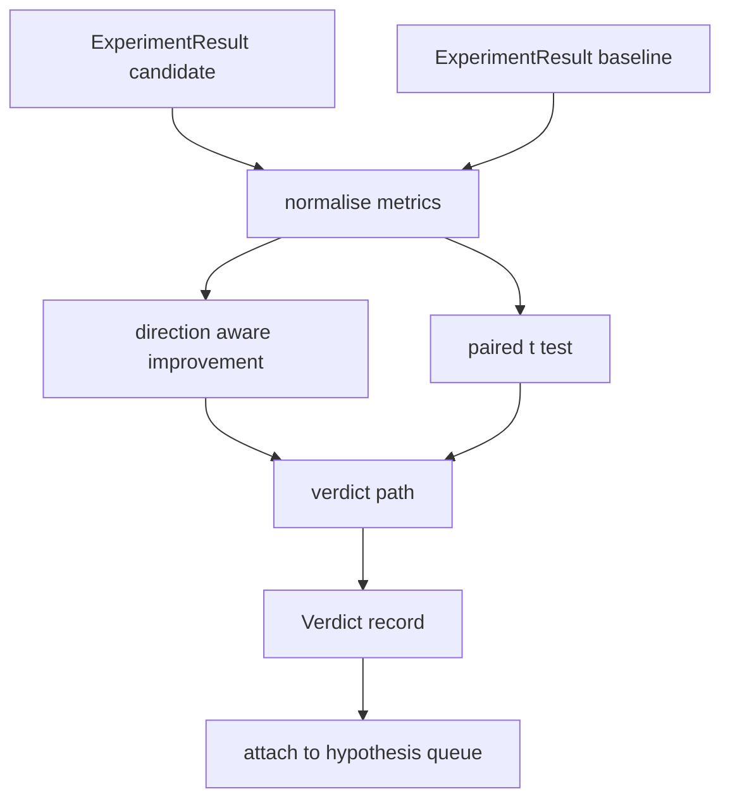

# Oceniający wynik

> Biegacz podał liczby. Oceniający decyduje, czy te liczby stanowią poprawę, regresję czy szum. Zbuduj ścieżkę werdyktu, która zamieni metryki w jednowierszowy wniosek.

**Typ:** Kompilacja
**Języki:** Python
**Wymagania wstępne:** Faza 19, ścieżka A, lekcje 20–29
**Czas:** ~90 minut

## Cele nauczania
- Porównaj przebieg kandydata z wartością bazową, korzystając z ulepszeń uwzględniających kierunek i stałego progu.
- Przeprowadź od podstaw sparowany test t dla poszczególnych parametrów nasion i odczytaj wynikową wartość p.
- Normalizuj metryki skalowane logicznie, aby raport końcowy mógł łączyć je z metrykami liniowymi.
- Wydaj werdykt na podstawie hipotezy, który orkiestrator może dołączyć do kolejki z lekcji pięćdziesiątej.
- Dbaj o czystość każdego kroku, aby te same dane wejściowe zawsze dawały ten sam werdykt.

## Dlaczego test w parach

Pojedynczy numer biegacza nie mówi, czy zmiana jest realna. Ta sama konfiguracja z innym ziarnem powoduje inne zakłopotanie. Zmiana może dotyczyć hałasu. Prawidłowe porównanie odbywa się w parach: te same nasiona z tymi samymi danymi, przeprowadzone raz z kandydatem i raz z wartością bazową. Każde ziarno wnosi różnicę. Średnią tych różnic jest efekt. Błąd standardowy tych różnic to poziom szumów.

Lekcja realizuje test od podstaw. Nie ma `scipy.stats`. Dane matematyczne są na tyle małe, że można je odczytać na jednym ekranie.

```text
diffs    = [a_i - b_i for i in seeds]
mean     = sum(diffs) / n
variance = sum((d - mean) ** 2 for d in diffs) / (n - 1)
t_stat   = mean / sqrt(variance / n)
df       = n - 1
p_value  = two_sided_p(t_stat, df)
```

Dwustronna wartość p wykorzystuje uregulowaną niekompletną funkcję beta. Lekcja zawiera małą implementację wykorzystującą ułamek ciągły Lentza. Całość składa się z sześćdziesięciu linii matematyki stdlib.

## Poprawa świadomości kierunku

Niektóre wskaźniki poprawiają się wraz ze wzrostem (dokładność, przepustowość). Inni poprawiają się, gdy spadają (strata, zakłopotanie, czas spędzony na ścianie). Osoba oceniająca zawiera pole `direction` dla każdej metryki.

```text
if direction == "higher_is_better":
    improvement = (candidate - baseline) / abs(baseline)
elif direction == "lower_is_better":
    improvement = (baseline - candidate) / abs(baseline)
```

Poprawa jest podpisana. Ujemna poprawa w przypadku wskaźnika „wyższy jest lepszy” oznacza, że ​​kandydat jest gorszy. Ścieżka werdyktu odczytuje znak i wielkość razem.

Płaski próg (`improvement_threshold=0.02`, dwa procent) decyduje, czy zmiana jest wystarczająco duża, aby ją wywołać. Poniżej werdykt brzmi „szum” niezależnie od wartości p; pętla nie jest zainteresowana zmianami, których użytkownik nie może zmierzyć.

## Architektura



Oceniający przeprowadza trzy niezależne obliczenia i łączy je w ścieżce werdyktu. Każde obliczenie jest czystą funkcją bez wspólnego stanu.

## Normalizacja dziennika

Zakłopotanie jest wykładnicze w przypadku straty. Spadek straty o 0,1 oznacza znacznie większy spadek zakłopotania. Porównanie niepewności bezpośrednio w dwóch konfiguracjach jest w porządku, ale połączenie go z metrykami liniowymi w jednym raporcie wymaga normalizacji.

Lekcja normalizuje każdą metrykę, której pole `scale` ma wartość `"log"` poprzez obliczenie logarytmu naturalnego przed obliczeniem poprawy. Próg jest następnie stosowany w przestrzeni dziennika. Spadek zakłopotania z 32 do 28 to `log(28) - log(32) = -0.133` w przypadku niższej i lepszej metryki, która znacznie przekracza próg dwóch procent.

```text
if scale == "log":
    a = log(candidate)
    b = log(baseline)
else:
    a = candidate
    b = baseline
```

Metryki z `scale="linear"` (domyślnie) pomijają transformację. Ta sama ścieżka kodu obsługuje oba.

## Test par nasion

Biegacz z lekcji pięćdziesiątej drugiej emituje jedną końcową kroplę metryk na bieg. W przypadku testu w parach oceniający potrzebuje jednej kropli na ziarno dla kandydata i jednego na ziarno dla linii bazowej. Koordynator przeprowadza ten sam eksperyment w obu konfiguracjach na liście nasion i przekazuje oceniającemu dwie listy rekordów `ExperimentResult`.

Osoba oceniająca łączy je w pary według materiału siewnego (nasiono znajduje się w `result.metrics["seed"]`) i przegląda żądaną metrykę. Jeśli nasiona nie pasują na obu listach, osoba oceniająca zgłasza `PairingError`. Program Orchestrator powinien zostać uruchomiony ponownie.

## Kształt Werdyktu

```text
Verdict
  hypothesis_id          : int
  metric                 : str
  direction              : "higher_is_better" | "lower_is_better"
  scale                  : "linear" | "log"
  candidate_mean         : float
  baseline_mean          : float
  improvement            : float       (signed, fraction; see direction rules)
  p_value                : float | None  (None if n < 2)
  significance_threshold : float
  improvement_threshold  : float
  verdict                : "improved" | "regressed" | "noise" | "failed"
  rationale              : str
```

Ścieżka werdyktu to mała tabela decyzyjna:

```text
1. If any candidate result has terminal != "ok": verdict = "failed"
2. else if |improvement| < improvement_threshold:  verdict = "noise"
3. else if p_value is None or p_value > significance: verdict = "noise"
4. else if improvement > 0:                          verdict = "improved"
5. else:                                             verdict = "regressed"
```

Uzasadnienie to jednowierszowe zdanie czytelne dla człowieka, które koordynator może zarejestrować w odniesieniu do identyfikatora hipotezy.

## Jak odczytać kod

`code/main.py` definiuje `MetricSpec`, `Verdict`, `Evaluator`, statystykę t i niekompletne pomocniki beta oraz demo deterministyczne. Test t jest zaimplementowany w czystej matematyce stdlib; numpy służy tylko do odczytywania listy metryk oraz obliczania średnich i wariancji.

`code/tests/test_evaluator.py` obejmuje ścieżkę ulepszoną, ścieżkę z regresją, ścieżkę szumu (mała poprawa), ścieżkę szumu (niskie n), ścieżkę z uszkodzonym terminalem, ścieżkę znormalizowaną logarytmicznie, test t względem znanej wartości odniesienia i błąd parowania.

## Gdzie to pasuje

Lekcja pięćdziesiąta stworzyła kolejkę hipotez. Lekcja pięćdziesiąta pierwsza odfiltrowała wszystko, co ustaliła literatura. Lekcja pięćdziesiąta druga przeprowadziła eksperyment w konfiguracjach kandydujących i wyjściowych dla nasion. Lekcja pięćdziesiąta trzecia czyta te przebiegi i zapisuje werdykt. Orkiestrator łączy cztery razem:

```text
for hypothesis in queue:
    literature = retrieval.search(hypothesis.text)
    if literature_settles(hypothesis, literature):
        attach(hypothesis, verdict="settled")
        continue
    candidates = runner.run_all(specs_for(hypothesis))
    baselines  = runner.run_all(baseline_specs_for(hypothesis))
    metric_spec = MetricSpec("perplexity", direction=LOWER, scale=LOG)
    verdict = evaluator.evaluate(hypothesis.id, metric_spec, candidates, baselines)
    attach(hypothesis, verdict)
```

Tego orkiestratora nie ma na tej lekcji; cztery lekcje składają się na nią bez żadnego kleju poza klasami danych zdefiniowanymi przez każdą z nich.