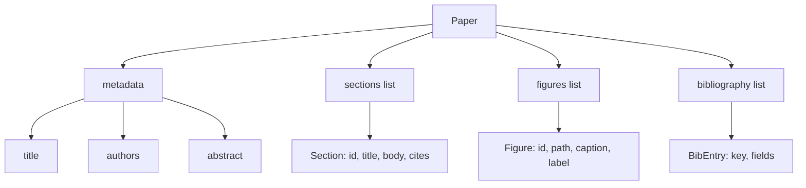
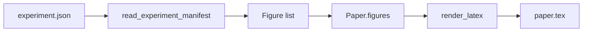
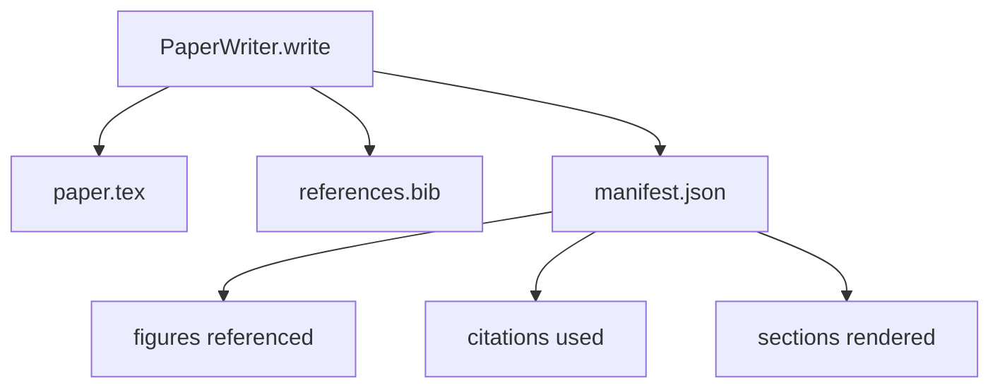

# Pisarz papierowy

> Szkielet LaTeX-owy to umowa pomiędzy badaczem a zecerem. Jeśli umowa zostanie zerwana, dokument się nie skompiluje, a awaria będzie głośna. Najpierw zbuduj szkielet, a następnie go wypełnij.

**Typ:** Kompilacja
**Języki:** Python
**Wymagania wstępne:** Faza 19, lekcje 50-53
**Czas:** ~90 minut

## Cele nauczania

- Traktuj artykuł badawczy jak ustrukturyzowany artefakt ze znanym wykresem przekrojowym, a nie dokument o dowolnym kształcie.
- Wygeneruj szkielet LaTeX, który deklaruje abstrakty, sekcje, miejsca na ryciny i klucze bibliograficzne przed napisaniem jakiejkolwiek prozy.
- Wstrzyknij dane z wyników eksperymentu (ścieżki i podpisy) do szkieletu za pomocą deterministycznego mechanizmu szczelinowego.
- Podłącz generator fałszywej prozy, który wypełnia każdą sekcję na podstawie ustrukturyzowanego konturu, tak aby wiązkę można było testować bez modelu.
- Wyemituj pojedynczy `paper.tex`, `references.bib` i manifest zawierający listę wszystkich przywołanych liczb i każdego użytego cytatu.

## Dlaczego najpierw szkielet

Szkic, który zaczyna się jako proza, kumuluje dług strukturalny. Wprowadzenie powiększa się o trzy akapity, które powinny znaleźć się w powiązanej pracy. Przed zdefiniowaniem figury zostaje utworzone odniesienie. Bibliografię zamykają trzy klucze do tego samego artykułu. Zanim autor zauważy, koszt przerobienia jest wyższy niż koszt napisania.

Szkielet odwraca tę sytuację. Struktura jest zadeklarowana z góry jako dane. Sekcje to miejsca z nazwami i kolejnością. Ryciny to miejsca z identyfikatorami i podpisami. Klucze bibliograficzne deklarowane są na górze wraz z wpisami, na które wskazują. Proza jest generowana w tych gniazdach pojedynczo. Uprząż może potwierdzić, zanim zostanie napisana jakakolwiek proza, że ​​każda ilustracja ma miejsce, każdy cytat ma wpis, a każda sekcja pojawia się w spisie treści.

Jest to ta sama dyscyplina, którą stosowano we wcześniejszych lekcjach w przypadku planów, wywołań narzędzi i śladów. Struktura to umowa.

## Kształt papieru

Każde pole to zwykłe dane Pythona. Moduł renderujący to czysta funkcja z `Paper` na ciąg LaTeX. Zespół może przeprowadzić introspekcję papieru przed renderowaniem: policzyć sekcje, wyświetlić listę brakujących plików rysunków, sprawdzić, czy każdy `\cite{key}` ma pasujący `BibEntry`.

## Umowa renderowania

Mechanizm renderujący gwarantuje trzy właściwości. Po pierwsze, każde miejsce na figurę w szkielecie emituje blok `\begin{figure}` ze stabilną etykietą w postaci `fig:<id>`. Po drugie, każda sekcja emituje `\section{}` ze stabilną etykietą w postaci `sec:<id>`, więc odsyłacze działają. Po trzecie, bibliografia generuje blok `\bibliography`, którego `references.bib` zawiera dokładnie te pozycje zadeklarowane na papierze, ani więcej, ani mniej.

Naruszenie któregokolwiek z nich oznacza błąd renderowania, a nie ostrzeżenie. Szkielet jest umową; renderowanie, które po cichu obniża liczbę, jest zerwaniem umowy.

## Wstrzyknięcie postaci z eksperymentów

Wcześniejsze lekcje w tej ścieżce dały wyniki eksperymentu w postaci manifestów JSON. Każdy manifest zawiera listę artefaktów ze ścieżkami i krótkimi podpisami. Autor artykułu czyta ten manifest i tworzy `Figure` rekordy.

Wstrzyknięcie jest deterministyczne. Identyfikatory figur pochodzą z nazwy eksperymentu i licznika monotonicznego. Podpisy pochodzą z manifestu. Ścieżki są znormalizowane względem katalogu wyjściowego artykułu, więc LaTeX kompiluje się nawet wtedy, gdy wyniki eksperymentu znajdują się gdzie indziej na dysku.

## Wyśmiewany generator prozy

Lekcja nie wywołuje modelu. `MockProseGenerator` odczytuje kształt konturu i deterministycznie emituje prozę. Kształt konturu to jeden krótki ciąg na sekcję. Generator rozwija ten ciąg znaków na dwa krótkie akapity z wplecionym tytułem sekcji. Wygenerowana nazwa prozatorska zawiera liczby i cytaty dokładnie wtedy, gdy je deklaruje konspekt.

To wystarczy, aby przetestować każde zachowanie pisarza. Prawdziwa implementacja zamieniłaby generator na wywołanie modelu. Uprząż wokół niego nie zmienia się. Taka jest wartość zadeklarowania generatora prozy jako wywoływalnego: test zastępuje generator deterministyczny, produkcja zastępuje modelowy, reszta potoku jest identyczna.

## Wynik manifestu

Moduł zapisujący emituje trzy pliki do katalogu wyjściowego.

Manifest jest tym, co czyta dalszy oceniający lub pętla krytyczna. Nie analizuje LaTeX-a; czyta manifest. Następna lekcja, pętla krytyczna, przyjmuje ten manifest jako dane wejściowe i tworzy listę opinii. Dlatego manifest jest częścią umowy, a LaTeX nie.

## Bramki walidacyjne

Program piszący uruchamia cztery bramki przed zapisaniem dowolnego pliku.

1. Każdy identyfikator figury jest unikalny w papierze.
2. Pole `cites` każdej sekcji odwołuje się do klucza bibliograficznego zadeklarowanego w artykule.
3. Streszczenie nie jest puste.
4. Tytuł nie jest pusty.

Nieudana bramka podnosi `PaperValidationError` z dokładnego powodu. Wiązka przewodów wskazuje na przyczynę jako tryb awarii. Nie ma zapisu częściowego: emitowane są wszystkie trzy pliki lub żaden.

## Jak odczytać kod

`code/main.py` definiuje `Paper`, `Section`, `Figure`, `BibEntry`, `PaperValidationError`, `MockProseGenerator`, `PaperWriter` i funkcję `render_latex`. Metoda `write` pobiera katalog wyjściowy i emituje `paper.tex`, `references.bib` i `manifest.json`. Pomocnik `read_experiment_manifest` konwertuje listę manifestów eksperymentów na rekordy `Figure`.

`code/tests/test_paper_writer.py` obejmuje: renderowanie szkieletowe bez sekcji, pełne renderowanie z dwiema sekcjami i dwiema figurami, bramkę brakujących cytatów, bramkę identyfikatora zduplikowanej figury, treść manifestu i kontrakt LaTeX-string (każda sekcja emituje `\section{}`, każda figura emituje `\begin{figure}`).

## Idziemy dalej

Dwa rozszerzenia, których będzie potrzebować prawdziwa implementacja. Po pierwsze, renderowanie wieloformatowe: ten sam kształt `Paper` kompiluje się do Markdown w przypadku postów na blogu i HTML do podglądów. Moduł renderujący staje się strategią w `Paper`. Po drugie, wzbogacanie cytatów: autor pobiera wpisy BibTeX z klucza cytatu, biorąc pod uwagę lokalną pamięć podręczną DOI. Obydwa dodają wartość, obydwa można dodać bez naruszania szkieletowego kontraktu.

Szkielet jest zakładem. Sekcje, rysunki i cytaty zadeklarowane jako dane, proza ​​wygenerowana w szczelinach, manifest emitowany wraz z LaTeX-em. Każde inne ulepszenie składa się na wierzch.