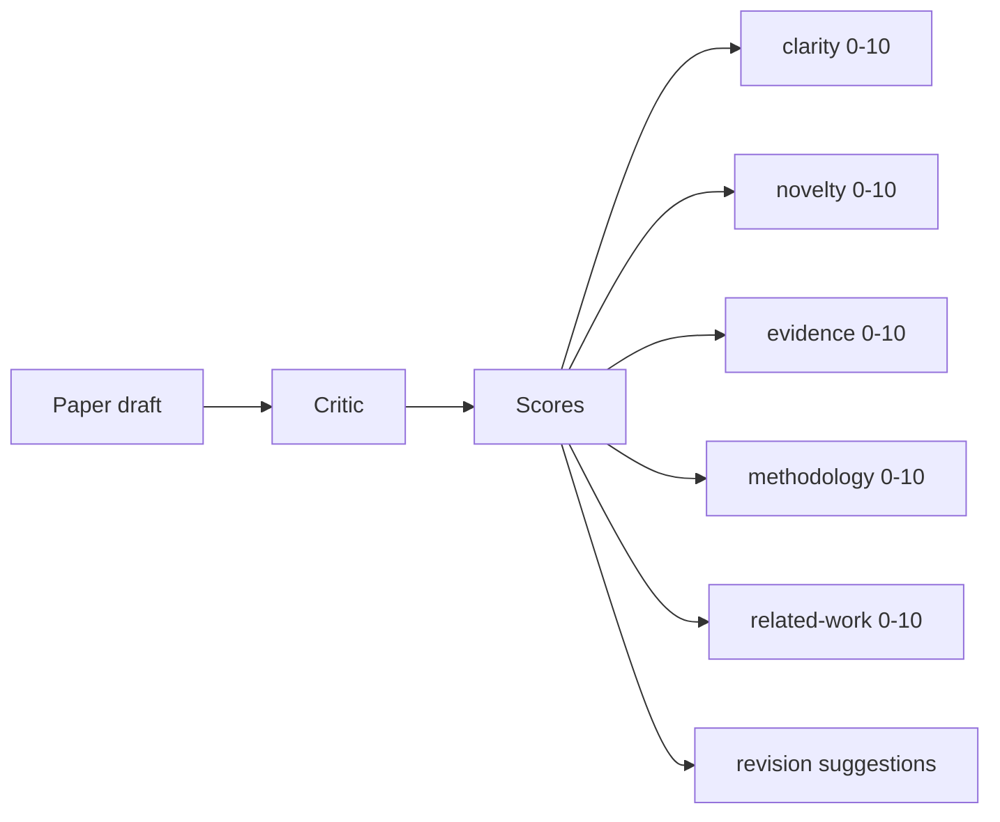
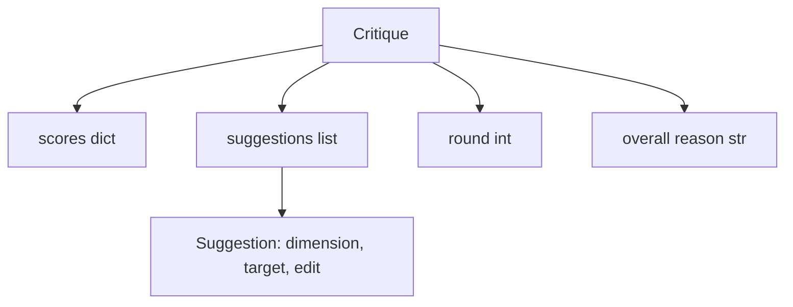
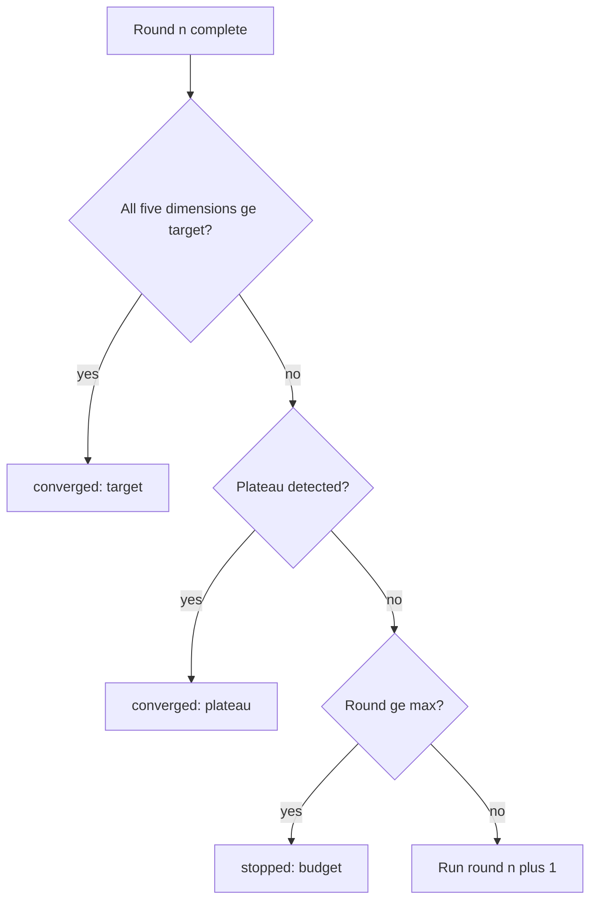
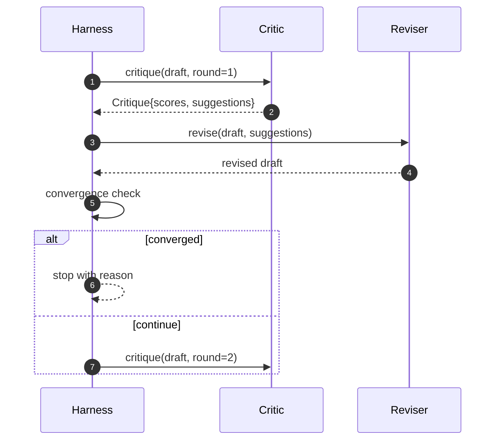

# Pętla krytyczna

> Krytyk, który za pierwszym razem zwraca „wygląda dobrze”, jest zepsuty. Krytyk, który zawsze powraca „potrzebuje pracy”, jest zepsuty. Interesujący krytyk to ten, który jest zbieżny, a konwergencję trzeba zaprojektować.

**Typ:** Kompilacja
**Języki:** Python
**Wymagania wstępne:** Faza 19, lekcje 50-53
**Czas:** ~90 minut

## Cele nauczania

- Oceń wersję roboczą artykułu w pięciu ustalonych wymiarach: przejrzystość, nowość, dowody, metodologia, powiązane prace.
- Zastosuj krytykę każdej rundy jako ustrukturyzowaną różnicę wersji, a nie dowolne przepisanie.
- Wykryj zbieżność, porównując wyniki w rundach; zatrzymanie na plateau, osiągnięcie celu lub wyczerpanie budżetu.
- Limit rund z maksymalnym budżetem iteracji, więc niezbieżny krytyk nie będzie działał wiecznie.
- Emituj ślad dla każdej rundy, aby pulpit nawigacyjny lub następny etap mógł renderować trajektorię wyniku.

## Po co pięć stałych wymiarów

Krytyk swobodny to model, który zwraca akapit z sugestiami. W kolejnej rundzie rewizja traktuje akapit jako kontekst otoczenia. Nie da się zweryfikować, czy przepisanie odnosi się do krytyki, ponieważ krytyka nigdy nie miała struktury.

Pięć wymiarów nadaje uprzęży kontrakt.



Wynik jest wektorem. Uprząż obserwuje każdy wymiar w rundach. Korekta, która zwiększa przejrzystość, ale podważa dowody, stanowi regresję w zakresie dowodów, co widać w wyniku kontroli zbieżności. Krytyk-tylko model nie może dać tej gwarancji.

## Kształt Krytyki



Każda sugestia niesie ze sobą wymiar, który poprawia, sekcję, do której jest skierowana, oraz instrukcję `edit`, którą może zastosować weryfikator. Weryfikator jest również osobą wymagającą wezwania. Lekcja zawiera deterministyczny korektor, który interpretuje instrukcję edycji jako operację dołączania do sekcji. Weryfikator oparty na modelu zinterpretowałby to samo pole jako podpowiedź. Umowa się nie zmienia.

## Reguły zbieżności, w kolejności

Pętla krytyczna kończy się, gdy wystąpi którykolwiek z trzech warunków.



Cel jest najbardziej rygorystycznym przypadkiem: każdy z pięciu wymiarów (przejrzystość, nowość, dowody, metodologia, powiązane_prace) musi trafić w `>= target_score` (domyślnie `8.0`), zanim pętla zwróci sukces. Wysoka średnia z jednym słabym wymiarem nie wystarczy. Wykrywanie plateau porównuje średnią bieżącej rundy ze średnią z poprzedniej rundy. Jeśli poprawa jest poniżej `plateau_epsilon` (domyślnie `0.1`) przez dwie kolejne rundy, pętla kończy się z `plateau`. Budżet to sztywny limit rund (domyślnie `5`) i kończy się z `budget`.

Kolejność ma znaczenie. Cel wygrywa nad plateau wygrywa nad budżetem. Jeśli runda trzecia trafi w cel w tej samej iteracji, która również wywołałaby plateau, wynikiem jest `target`, a nie `plateau`.

## Dlaczego wykrywanie plateau trwa przez dwie rundy

Jednookrągły plateau to hałas. Prawdziwy krytyk zwraca nieco inną ocenę w każdej iteracji, nawet w przypadku ustalonej wersji roboczej, ponieważ deterministyczna punktacja nadal zależy od tego, które sugestie zostały zastosowane i w jakiej kolejności. Wymaganie dwóch kolejnych rund plateau odfiltrowuje ten szum. Jeśli uprząż zgłasza plateau, przeciąg rzeczywiście przestał się poprawiać.

## Deterministyczny krytyk w tej lekcji

Lekcja nie wywołuje modelu. Dostarczony krytyk to obiekt, który ocenia wersję roboczą na podstawie trzech sygnałów: średniej długości treści sekcji (przejrzystość), liczby ilustracji i liczby cytowań (dowód) oraz pola `originality_tag` w metadanych papierowych (nowość). Weryfikator wie, jak podnieść każdą ocenę w górę.

```text
clarity      grows when the average section body length increases
novelty      grows when originality_tag is set to "high"
evidence     grows when a section's figure_refs is non-empty
methodology  grows when a section titled "Method" exists with body
related-work grows when a section titled "Related Work" exists with body
```

Weryfikator interpretuje każdą sugestię jako ukierunkowany dodatek. Po pierwszej rundzie uprząż może obserwować wzrost wyniku. Testy wykorzystują tę właściwość, aby potwierdzić, że pętla zmniejsza przerwę.

## Umowa z pełną pętlą



Uprząż posiada licznik rund, ślad i kontrolę zbieżności. Krytyk jest właścicielem partytury. Weryfikator jest właścicielem różnicy. Żaden z trzech nie dotyka stanu pozostałych.

## Dane wyjściowe śledzenia

Każda runda generuje jedno zdarzenie śledzenia z numerem rundy, wektorem wyniku, liczbą sugestii i werdyktem zbieżności. Pełny ślad jest zwracany wraz z końcową wersją roboczą. Dalszy pulpit nawigacyjny może renderować wykres wyników na rundę. Następna lekcja, planista iteracji, odczytuje ślad, aby zdecydować, czy warto zachować gałąź.

## Budżety chroniące przed złymi krytykami

Krytyk, który przedstawia sugestie, które nigdy nie poprawią wyniku, zablokuje pętlę w pułapie maksymalnej iteracji. Ślad to pokazuje: pięć rund, bez zmian, werdykt `budget`. Użytkownik odczytuje to jako błąd krytyczny, a nie błąd wersji roboczej. Alternatywa, która pojawia się dopiero w wersji ostatecznej, ukrywa diagnozę. Wyłania się na nim projekt oparty na technologii Trace-First.

## Jak odczytać kod

`code/main.py` definiuje protokół `Critique`, `Suggestion`, `Critic`, protokół `Reviser`, `CriticLoop` i fabrykę `make_deterministic_critic_pair`, która zwraca deterministyczny krytyk i pasujący weryfikator. Uwzględniono minimalny kształt `Paper`, dzięki czemu lekcja stanowi samodzielną lekcję.

`code/tests/test_critic_loop.py` obejmuje: monotoniczną poprawę po pierwszej rundzie, zbieżność celów w dostrojonym projekcie, wykrywanie plateau po dwóch płaskich rundach, wyczerpanie budżetu w przypadku braku poprawy sugestii, zastosowanie sugestii przez weryfikatora i kształt śladu.

## Idziemy dalej

Dwa rozszerzenia, których będzie potrzebować prawdziwa implementacja. Po pierwsze, wagi wymiarowe: praca warsztatowa waży nowość wyżej niż metodologia; dziennik waży odwrotnie. Kontrola zbieżności staje się średnią ważoną. Po drugie, krytycy w parach: jeden krytyk ocenia sugestie, drugi krytyk je ocenia, zanim recenzent je zobaczy. Obydwa dodają wartość, oba komponują w tym samym kształcie `Critique`.

Zakład jest wektorem wyniku. Gdy krytyka jest już ustrukturyzowana, każde inne ulepszenie, zasada zbieżności, pulpit nawigacyjny, sparowany krytyk pojawiają się bez zmiany pętli.