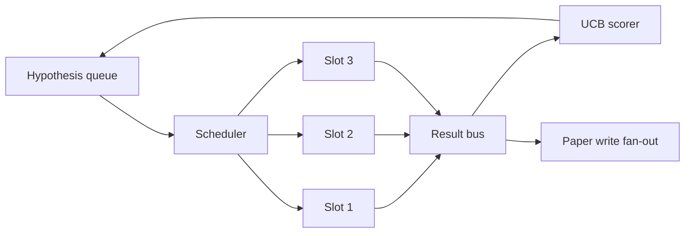
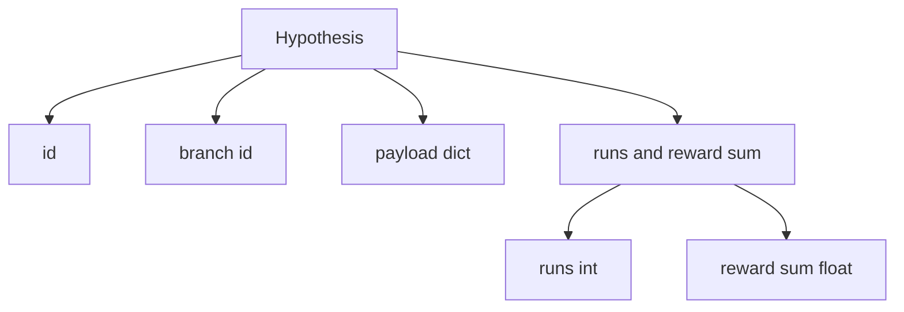
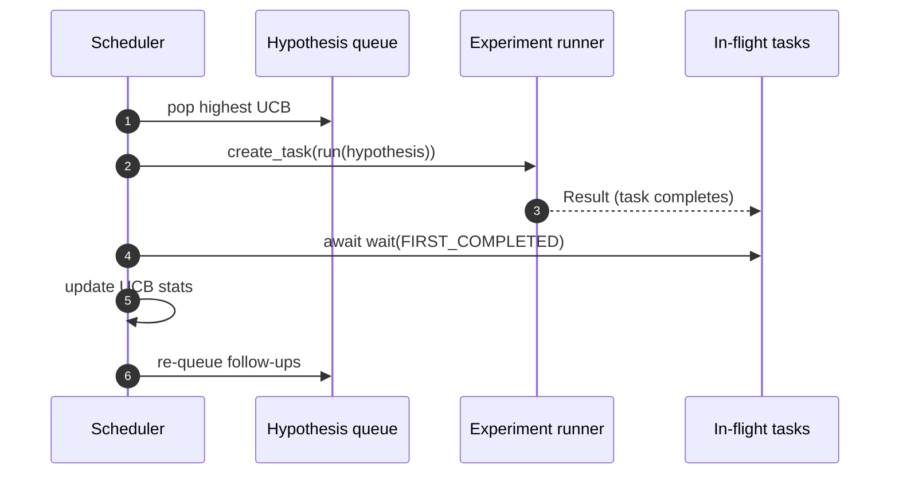

# Harmonogram iteracji

> Pętla badawcza bez harmonogramu to kolejka z urojeniami. Harmonogram to miejsce, w którym pętla decyduje, czego przestać eksplorować, i ta decyzja ma wpływ na całą grę.

**Typ:** Kompilacja
**Języki:** Python
**Wymagania wstępne:** Faza 19, lekcje 50-53
**Czas:** ~90 minut

## Cele nauczania

- Modeluj przepływ pracy badawczej jako kolejkę hipotez zasilającą równoległe przedziały eksperymentów, których wyniki ponownie się nakładają.
- Przeprowadzaj wiele eksperymentów jednocześnie z asyncio, aby program planujący mógł zająć wszystkie przedziały.
- Oceń każdą gałąź hipotezy za pomocą UCB, aby osoba planująca mogła przyciąć gałęzie o niskim plonie bez przerywania eksploracji.
- Podziel gotowe wyniki na etap pisania na papierze i etap ponownego umieszczenia w kolejce, aby gałąź o wysokiej wydajności zrodziła dalsze hipotezy.
- Wyświetl ślad per iteracji z wynikami gałęzi, zajętością gniazd i decyzjami o przycinaniu.

## Dlaczego harmonogram, a nie lista robocza

Płaska lista robocza uruchamia zadania w kolejności przesyłania. Nie ma problemu, gdy każde zadanie jest niezależne. Badanie nie jest niezależne: odkrycie z eksperymentu trzeciego zmienia priorytet eksperymentów czwartego i piątego. Harmonogram, który odczytuje wyniki i zmienia kolejność kolejki, wykonuje bardziej użyteczną pracę na jednostkę obliczeniową.

Ciekawym wyborem projektu jest zasada punktacji. Chciwy strzelec zawsze wybiera aktualnego lidera i nigdy nie eksploruje sytuacji. Jednolity strzelec nigdy nie wykorzystuje. UCB (górna granica ufności) to środkowa ścieżka: wykorzystaj lidera, rezerwując pojemność dla gałęzi, które były mniej wypróbowane.

## Kształt systemu



W kolejce znajdują się hipotezy. Osoba planująca wybiera hipotezę o najwyższym UCB, gdy zwalnia się miejsce. W każdym slocie przeprowadzany jest eksperyment asynchronicznie. Zakończone eksperymenty przesyłają swoje wyniki do autobusu. Magistrala aktualizuje statystyki UCB dotyczące gałęzi inicjującej i rozszerza do etapu zapisu papierowego, gdy wydajność gałęzi przekracza próg.

## Kształt hipotezy



`branch` jest kluczem do statystyk UCB. Wiele hipotez może mieć wspólną gałąź (gałąź jest kierunkiem badań, hipoteza jest w jej ramach jedną próbą). `runs` to liczba ukończonych eksperymentów dla tej branży, `reward_sum` to skumulowana nagroda. UCB czyta oba.

## Punktacja UCB

Formuła UCB używana w tej lekcji to klasyczna formuła UCB1.

```text
ucb(branch) = mean_reward(branch) + c * sqrt( ln(total_runs) / runs(branch) )
```

`total_runs` to liczba wszystkich eksperymentów zakończonych we wszystkich gałęziach. `c` to waga eksploracji; lekcja domyślnie ma wartość `sqrt(2)`. Gałąź z zerową liczbą przebiegów otrzymuje `+inf`, więc niewypróbowane gałęzie są zawsze planowane jako pierwsze. Oddział z wysoką średnią nagrodą utrzymuje wysoki wynik, dopóki inne gałęzie nie nadrobią zaległości; gałąź, która działa wiele razy bez dużej nagrody, zostaje przyćmiona przez mniej uruchamiane alternatywy.

Brama przycinająca jest oddzielona od zbieracza. Czyszczenie usuwa gałąź z przyszłego harmonogramu, gdy jej średnia nagroda spadnie poniżej bezwzględnego minimalnego poziomu (domyślnie `0.2`) po co najmniej `prune_after_runs` próbach (domyślnie `3`). Dzięki temu kolejka jest ograniczona.

## Równoległe sloty z asyncio

Harmonogram steruje eksperymentami z `asyncio.create_task`. Każde zadanie uruchamia moduł eksperymentalny (wywoływalny `async def`), który zwraca wartość `Result`. Główna pętla czeka na zestaw zadań w trakcie wykonywania z `asyncio.wait(..., return_when=asyncio.FIRST_COMPLETED)` i uruchamia aktualizację punktacji po każdym ukończeniu.



Trzy sloty działają jednocześnie. Główna pętla nigdy nie blokuje pojedynczego eksperymentu. Osoba planująca rozpoczyna nowe zadania, gdy tylko zwolni się miejsce, aż kolejka będzie pusta i żadne zadania nie będą w trakcie wykonywania.

## Fan-out: wyzwalacze papieru

Kiedy średnia nagroda oddziału przekroczy `paper_threshold` (domyślnie `0.7`), a oddział nie wygenerował jeszcze artykułu, osoba planująca umieszcza zdarzenie `paper.trigger` na liście wyjściowej. Podchwyciłby to pisarz gazetowy z lekcji pięćdziesiątej czwartej. W tej lekcji wyzwalacz jest przechwytywany w postaci listy, dzięki czemu testy mogą go potwierdzić.

## Fan-out: hipotezy uzupełniające

Kiedy pojawi się wynik o dużej wydajności, osoba planująca może wywołać dostarczony przez użytkownika `expander`, aby wygenerować jedną lub więcej hipotez uzupełniających w tej samej gałęzi. Ekspander to czysta funkcja od `Result` do `list[Hypothesis]`. Lekcja zawiera deterministyczny ekspander, który generuje dwie kontynuacje dla dowolnego wyniku, którego nagroda przekracza próg papierowy.

## Budżety

Dwa budżety chronią program planujący przed niekontrolowanymi pętlami.

```text
max_experiments    : total count of experiments run across all branches
max_seconds        : wall-clock cap (asyncio time)
```

Gdy którykolwiek z nich zostanie uruchomiony, program planujący przestaje planować nowe zadania, czeka na zadania w trakcie wykonywania i zwraca końcowy ślad. Ślad zawiera `stop_reason`.

## Ślad i raport końcowy

Każda decyzja dotycząca planowania (wybór, wysyłka, wynik, przycięcie, rozłożenie) generuje jedno zdarzenie. Raport końcowy podsumowuje statystyki poszczególnych oddziałów, całkowitą liczbę uruchomień, całkowity zegar ścienny i uruchomione wyzwalacze papierowe. Następna lekcja, kompleksowe demo, polega na przeczytaniu tego raportu, aby zainspirować autora artykułu.

## Jak odczytać kod

`code/main.py` definiuje `Hypothesis`, `Result`, `BranchStats`, `IterationScheduler` i `make_deterministic_runner` fabryka, która zwraca uruchamiającego eksperyment asyncio z przewidywalnymi nagrodami. Biegacz śpi przez ustaloną `delay_ms` (domyślnie `5ms`), więc współbieżność jest zauważalna.

`code/tests/test_scheduler.py` obejmuje: UCB wybiera najpierw niewypróbowane gałęzie, zajęcie równoległych gniazd, wyzwalanie papieru po przekroczeniu progu, przycinanie gałęzi po próbach o niskiej wydajności, hipotezy uzupełniające typu fan-out i wyjście z budżetu (zarówno liczba eksperymentów, jak i zegar ścienny).

## Idziemy dalej

Trzy rozszerzenia, których będzie potrzebować prawdziwa implementacja. Po pierwsze, trwałe statystyki UCB z sesji: aktualne statystyki są przechowywane w pamięci; prawdziwy planista umieściłby je w punktach kontrolnych, tak aby ponowne uruchomienie pozwoliło zachować już wydany budżet na poszukiwania. Po drugie, punktacja obejmująca wiele celów: zamiast nagrody skalarnej każdy wynik generuje wektor, a UCB staje się selekcjonerem w stylu Pareto. Po trzecie, bandyci kontekstowi: selekcjoner stawia warunki hipotezy (długość, złożoność), więc podobne hipotezy podlegają wspólnemu badaniu.

Harmonogram to miejsce, w którym badania stają się czymś więcej niż tylko listą zadań. Gdy UCB jest okablowany, a gniazda działają równolegle, wszystkie inne ulepszenia są na wierzchu.