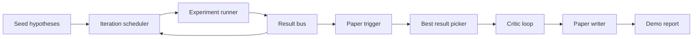
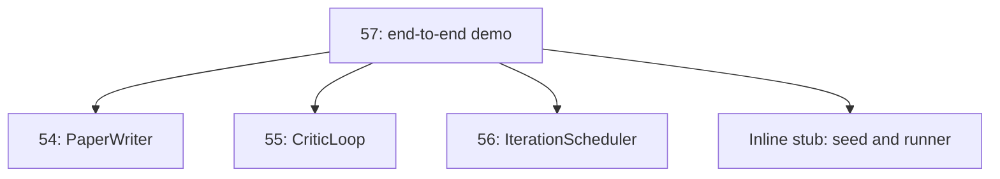
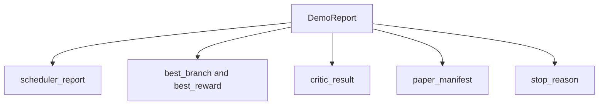

# Kompleksowe demo badawcze

> Demo to miejsce, w którym musi zostać skomponowana każda wcześniej napisana umowa. Jeśli którykolwiek z nich wycieknie, demonstracja jest lekcją, która to wyłapie.

**Typ:** Kompilacja
**Języki:** Python
**Wymagania wstępne:** Faza 19, lekcje 50-53
**Czas:** ~90 minut

## Cele nauczania

- Połącz pętlę automatycznego badania od końca do końca: ziarno hipotezy, osoba przeprowadzająca eksperyment, osoba planująca, pętla krytyczna, autor artykułu.
- Skomponuj elementy podstawowe z czterech wcześniejszych lekcji ścieżki D poprzez zwykły import Pythona, a nie framework.
- Uruchom pętlę do samokończącego się końca i wygeneruj pojedynczy raport demonstracyjny zawierający listę wyników każdego etapu.
- Zachowaj determinizm demo, aby zestaw testów mógł potwierdzić ostateczny kształt.
- W przypadku zerwania kontraktu na którymkolwiek etapie wykryj wyraźny tryb awarii, aby następny etap nie został uruchomiony z uszkodzonym wejściem.

## Co tu się składa



Pięć etapów. Ziarno to lista trzech hipotez. Osoba planująca przeprowadza na nich sześć eksperymentów w trzech równoległych przedziałach. Autobus zgłasza jeden lub więcej wyzwalaczy papieru. Selektor wybiera pojedynczy najlepszy wynik. Pętla krytyczna wykonuje iterację w oparciu o wersję roboczą zbudowaną na podstawie tego wyniku. Autor artykułu wysyła końcowy kod LaTeX, BibTeX i manifest.

## Po co importować, a nie kopiować

Każda wcześniejsza lekcja zawiera `main.py` z publicznymi klasami danych i funkcjami. Demo importuje je, dostosowując `sys.path` do katalogu nadrzędnego każdej lekcji. To nie jest okablowanie szkieletowe; jest to ten sam import plików testowych, z których korzystałeś już we wcześniejszych lekcjach.



Wbudowany kod pośredniczący zastępuje lekcje od pięćdziesiątego do pięćdziesiątego trzeciego: mały generator hipotez początkowych i synchronicznej funkcji nagrody. Użytkownik może zamienić fragment wbudowany na rzeczywiste elementy podstawowe z tych lekcji, dostosowując dwa importy.

## Gwarancje determinizmu

Demo jest deterministyczne ze względu na konstrukcję. Biegacz eksperymentu jest rozstawiony jako numpy. Weryfikator pętli krytycznej porusza się po ustalonych wymiarach w ustalonej kolejności. Generator prozy pisarza gazetowego to ten, który jest wyśmiewany z lekcji pięćdziesiątej czwartej. Selektor UCB planisty rozbija powiązania w kolejności iteracji, a nie w wyniku losowego wyboru.

Biorąc pod uwagę ten sam materiał siewny, wersja demonstracyjna generuje ten sam raport. Test potwierdza tę właściwość, uruchamiając wersję demonstracyjną dwukrotnie i porównując manifest.

## Kształt raportu demonstracyjnego



Każde pole pochodzi dosłownie z etapu poprzedzającego. Demo nie przekształca żadnego wyjścia; to je składa. To jest test, którym jest demo.

## Obsługa trybu awaryjnego

Każdy etap albo kończy się sukcesem, albo zgłasza błąd wpisany.

```text
Scheduler ........ returns SchedulerReport with stop_reason
                   in {queue_empty, max_experiments, deadline}
Best-result pick . raises NoTriggerError if no paper trigger fired
Critic loop ...... returns LoopResult with status converged or stopped
Paper writer ..... raises PaperValidationError on contract break
```

Awaria na którymkolwiek etapie powoduje zwarcie wersji demonstracyjnej z wpisanym wyjątkiem. Testy przypinają ten kontrakt: `test_no_triggers_raises_typed_error` i `test_best_picker_raises_when_no_triggers` potwierdzają, że selektor podnosi `NoTriggerError` / `BestResultError`, gdy żadna gałąź nie uruchomiła wyzwalacza, a moduł zapisujący nie jest nigdy wywoływany.

## Selektor najlepszych wyników

Harmonogram emituje wyzwalacze papieru dla każdej gałęzi. Osoba wybierająca wybiera gałąź z najwyższą średnią nagrodą ze wszystkich czynników wyzwalających. Remisy są rozdzielane alfabetycznie według identyfikatora oddziału, więc demo jest deterministyczne. Selektor jest małą, czystą funkcją; test przypina go do stałego raportu harmonogramu.

## Okablowanie pętli krytycznej

Pętla krytyczna z lekcji pięćdziesiątej piątej działa na `MiniPaper`. Demo buduje `MiniPaper` z wybranej gałęzi, wypełniając streszczenie identyfikatorem gałęzi, umieszczając dwie sekcje (Wprowadzenie i Wyniki) i ustawiając `originality_tag` na podstawie średniej nagrody gałęzi (wysoka, jeśli `>= 0.8`, średnia, jeśli `>= 0.6`, w przeciwnym razie niski).

Następnie weryfikator iteruje wersję roboczą w celu uzyskania zbieżności. Dane wyjściowe trafiają do urządzenia piszącego.

## Podłączanie modułu piszącego

Autor artykułu w lekcji pięćdziesiątej czwartej operuje pełnym kształtem `Paper` z ilustracjami i bibliografią. Demo aktualizuje zbieżny `MiniPaper` poprzez `mini_to_full_paper`, który dołącza jedną cyfrę dla wybranej gałęzi i małą syntetyczną bibliografię zbudowaną z połączenia kluczy cytowania sugerowanego przez krytyka. Każdy cytat dodany przez wersję demonstracyjną jest również dodawany do listy bibliografii, co oznacza, że ​​weryfikacja przebiega pomyślnie.

## Jak odczytać kod

`code/main.py` definiuje `BestResultError`, `NoTriggerError`, `DemoReport`, `pick_best_branch`, `build_mini_paper`, `mini_to_full_paper` i `run_demo`. Importy na górze dostosowują `sys.path` raz i pobierają `PaperWriter`, `CriticLoop` i `IterationScheduler` ze swoich lekcji.

`code/tests/test_e2e.py` obejmuje: demo działa od końca do końca i generuje raport z wypełnionymi wszystkimi pięcioma polami, determinizm w dwóch przebiegach, NoTriggerError, gdy żadna gałąź nie przekracza progu, PaperValidationError, gdy zerwie się umowa autora, manifest papierowy zawiera liczbę wybranej gałęzi, a powód zatrzymania programu planującego jest jedną z oczekiwanych wartości.

## Idziemy dalej

Trzy rozszerzenia warte okablowania, gdy wersja demonstracyjna będzie zielona. Po pierwsze, stan trwały: wynik każdego etapu jest zapisywany w małym magazynie JSON, dzięki czemu ponowne uruchomienie może zostać wznowione bez ponownego uruchamiania tanich etapów. Po drugie, pulpit nawigacyjny: zdarzenia śledzenia z harmonogramu i pętli krytycznej są renderowane jako pojedyncza oś czasu. Po trzecie, prawdziwe wywołania modeli: zamień wyśmiewany generator prozy i deterministycznego krytyka na te oparte na modelu; okablowanie się nie zmienia.

Zadaniem dema jest udowodnienie, że kompozycja to architektura. Pięć lekcji, cztery importy, jeden raport. Przy następnym dodaniu stopnia okablowanie wydłuża się dokładnie o jedną linię.