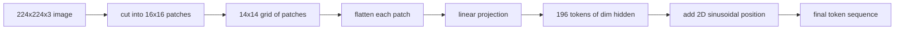

# Poprawki kodera wizyjnego

> Model wizji, który odczytuje piksele, potrzebuje tokenizatora dla pikseli. Osadzanie poprawek jest tym tokenizatorem. Wytnij obraz na siatkę kwadratów, spłaszcz każdy kwadrat, rzuć go na jedną warstwę liniową, a następnie dodaj sygnał położenia 2D, aby transformator wiedział, gdzie znajduje się każdy kwadrat na oryginalnym obrazie.

**Typ:** Kompilacja
**Języki:** Python
**Wymagania wstępne:** Faza 19, lekcje 30-37 (podstawy ścieżki B)
**Czas:** ~90 minut

## Cele nauczania

- Tokenizuj obraz w sekwencję osadzania łatek o stałej długości.
- Zaimplementuj projekcję łatki opartą na `Conv2d`, która odpowiada matematyce rozkładania-następnie-liniowego.
- Zbuduj deterministyczną pozycję sinusoidalną 2D, osadzając ją tak, aby porządek symboliczny kodował pozycję przestrzenną.
- Sprawdź liczbę poprawek, kształt osadzania i `Conv2d`/rozwiń równoważność na urządzeniu syntetycznym.

## Problem

Transformator zjada sekwencję wektorów. Obraz jest 3-kanałową siatką. Odczytanie każdego piksela jako tokena eksploduje długością sekwencji: obraz RGB o wymiarach 224x224 to 150 528 tokenów, na co 12-warstwowy transformator nie może sobie pozwolić. Odczytanie obrazu jako jednego gigantycznego płaskiego wektora wyrzuca lokalność, z której warstwa uwagi nie jest w stanie się otrząsnąć. Zadaniem interfejsu kodera jest skompresowanie siatki pikseli do kilkuset tokenów, z których każdy stanowi podsumowanie kwadratowego obszaru.

Osadzanie poprawek rozwiązuje ten problem za pomocą jednej projekcji liniowej. Obraz o wymiarach 224x224 pocięty na fragmenty o wymiarach 16x16 tworzy siatkę 14x14 składającą się ze 196 fragmentów. Każdy fragment jest spłaszczany z `(3, 16, 16) = 768` wartości pikseli do jednego wektora, a następnie warstwa liniowa odwzorowuje go na ukryty wymiar modelu. Transformator widzi 196 tokenów o wymiarze `hidden` (zwykle 768) plus token CLS. To sekwencja, którą może przeżuć reszta sieci.

## Koncepcja



### Dlaczego poprawki, a nie piksele

Uwaga ma kwadratową długość sekwencji. Sekwencja 196 żetonów kosztuje `196 * 196 = 38,416` punkty uwagi na głowę na warstwę; sekwencja zawierająca 150 528 tokenów kosztuje `150,528 * 150,528 = 22.6 billion`. Poprawki powodują zmniejszenie mocy obliczeniowej uwagi o 590 000 razy, a pojedynczy obszar 16x16 przenosi sygnał wystarczający do zadań związanych z widzeniem na wysokim poziomie. Kosztem jest utrata drobnoziarnistych szczegółów przestrzennych w obrębie jednej łaty, dlatego też stosy multimodalne znajdujące się poniżej często korzystają z drugiej gałęzi o wysokiej rozdzielczości, gdy liczy się dobra lokalizacja.

### Dlaczego wystarczy rzut liniowy

Każdy plaster jest traktowany jako niezależny wektor. Projekcja uczy się podstaw: detektorów krawędzi, filtrów kolorów, prostych tekstur. Pojedyncza warstwa liniowa jest mała (parametry `768 * 768 = 589,824` dla ViT-Base) i szybko się uczy. Istnieją głębsze trzony splotowe („hybrydowy” ViT), ale płaska projekcja liniowa jest standardem i większość nowoczesnych koderów o otwartej masie ma dokładnie taki kształt.

### Sztuczka `Conv2d`

`Conv2d(in_channels=3, out_channels=hidden, kernel_size=patch_size, stride=patch_size)` bez dopełnienia daje ten sam wynik liczbowy, co rozwinięcie-na-liniowe, ponieważ każda pozycja wyjściowa tworzy iloczyn skalarny pikseli plamy względem jednego filtra. Splotem jest projekcja łatki i większość produkcyjnych baz kodów dostarcza ją w ten sposób, ponieważ jest szybsza na GPU i wymaga jednego przekształcenia mniej.

### Pozycjonuj osady

Żetony nie przenoszą żadnego rozkazu poza projekcję. Osadzanie sinusoidalne 2D zapewnia każdemu tokenowi stały sygnał, który koduje jego pozycję `(row, col)`. Połowa wymiaru osadzania koduje pozycję wiersza z sin/cos przy wielu częstotliwościach; druga połowa koduje pozycję kolumny. Kodowanie jest deterministyczne, więc można zmieniać rozdzielczości bez ponownego uczenia, a także interpoluje w sposób czysty do siatek, których model nigdy nie widział w czasie szkolenia.

| Składnik | Kształt | Parametry |
|----------|-------|------------|
| Projekcja poprawki (`Conv2d`) | `(hidden, 3, patch, patch)` | `3 * P * P * hidden + hidden` |
| Osadzanie pozycji (stałe) | `(num_patches, hidden)` | 0 (obliczone, nie wyuczone) |
| Token CLS (nauczony) | `(1, hidden)` | `hidden` |

Dla ViT-Base/16 przy rozdzielczości 224: 590 592 parametrów w projekcji, 768 w tokenie CLS i zero dla pozycji sinusoidalnej. Następna lekcja (59) przedstawia 12-warstwowy transformator na wierzchu tego frontonu.

### Równoważność jako kontrola poprawności

Krok łatki ma dwie pisownie: projekcję `Conv2d` i jawną projekcję rozkładania-wtedy-liniową. Muszą dawać tę samą moc wyjściową przy tych samych ciężarach. Jeśli tego nie zrobią, matematyka rozwinięcia jest błędna i reszta kodera jest zbudowana na piasku. Testy z tej lekcji ćwiczą tę równoważność.

## Zbuduj to

`code/main.py` implementuje:

- `PatchEmbed`, opakowanie `nn.Module` `Conv2d` do projekcji łaty.
- `sinusoidal_2d(grid_h, grid_w, dim)`, funkcja bezstanowa budująca tabelę pozycji 2D.
- `VisionFrontEnd`, który obejmuje osadzanie poprawek, dodawanie CLS i dodawanie pozycji w jednym przebiegu do przodu.
- Pomocnik `synthesize_image(seed)`, który buduje deterministyczne urządzenie o wymiarach 224x224x3 z `numpy.random`.
- Demo, które uruchamia jeden obraz urządzenia przez interfejs i drukuje kształt wyjściowy, normę tokena CLS i jeden wiersz osadzania pozycji.

Uruchom to:

```bash
python3 code/main.py
```

Dane wyjściowe: urządzenie 224x224 jest tokenizowane do sekwencji kształtu `(1, 197, 768)`. Pierwszym tokenem jest CLS; kolejne 196 to żetony poprawek. Normy osadzania pozycji są jednolite w obrębie rzędu, co jest sygnaturą sinusoidalną.

## Użyj tego

Ten sam interfejs łaty pojawia się w każdym nowoczesnym modelu języka wizyjnego: CLIP ViT-L/14, SigLIP, DINOv2, rodzina Qwen-VL i stos InternVL, wszystkie zaczynają się od projekcji łaty `Conv2d` plus sygnał pozycji. Różnice między rodzinami żyją w dalszej części łańcucha (łączenie CLS i brak CLS, tokeny rejestrów, różne rozmiary poprawek 14 i 16, dynamiczna rozdzielczość poprzez interpolowane pozycje). Frontend w tej lekcji to podłoże, na którym stoi każdy z tych modeli.

## Testy

`code/test_main.py` obejmuje:

- liczba poprawek pasuje `(image_size / patch_size) ** 2`
- kształt wyjściowy odpowiada `(batch, num_patches + 1, hidden)`
- projekcja `Conv2d` jest równa ręcznemu rozkładaniu, a następnie liniowemu na małym urządzeniu
- tabela pozycji sinusoidalnych jest deterministyczna dla wszystkich wywołań
- Rozgłaszanie tokenu CLS w całym wsadowym przyciemnieniu bez wycieków

Uruchom je:

```bash
python3 -m unittest code/test_main.py
```

## Ćwiczenia

1. Zastąp pozycję sinusoidalną wyuczoną wartością `nn.Parameter` i porównaj stratę z pierwszej epoki w małym zadaniu klasyfikacji syntetycznej. Wyuczone pozycje wygrywają przy stałej rozdzielczości; sinusoidalny wygrywa, gdy zmienisz rozdzielczość po treningu.

2. Zamień `Conv2d` na jawne `nn.Unfold` plus `nn.Linear` i sprawdź, czy dane wyjściowe mieszczą się w tolerancji float. Ta sama matematyka, dwa sposoby jej przeliterowania.

3. Dodaj obsługę rozmiarów fragmentów innych niż kwadratowe (np. 32x16 dla wejść szerokokątnych) i sprawdź, czy tabela pozycji obsługuje siatki inne niż kwadratowe.

4. Sprofiluj etap łatki w seriach o wielkości 1, 8, 64. Występ łatki rzadko jest wąskim gardłem; dominują niższe warstwy uwagi.

5. Wytrenuj interfejs jako zamrożony ekstraktor cech na 4-klasowym zestawie danych o syntetycznych kształtach (koła, kwadraty, trójkąty, gwiazdy). Dane wyjściowe tokenu CLS powinny być oddzielone liniowo.

## Kluczowe terminy

| Termin | Co to znaczy |
|------|----------------------------|
| Łatka | Kwadratowy podobszar obrazu, zwykle o wymiarach 14x14 lub 16x16 |
| Osadzanie poprawek | Projekcja liniowa jednej spłaszczonej plamy na ukryty półmrok |
| Długość sekwencji | Liczba tokenów po tokenizacji poprawki, zwykle plus CLS |
| Pozycja sinusoidalna | Naprawiono sygnał sin/cos, który koduje współrzędne siatki 2D |
| Token CLS | Wyuczony wektor dołączony do sekwencji jako głowa łącząca |

## Dalsze czytanie

— Obraz jest wart 16 x 16 słów (ViT, 2021) w przypadku oryginalnej ramki umieszczonej w łatce.
- Attention Is All You Need (2017) dla wzoru położenia sinusoidalnego dostosowanego tutaj do 2D.
- Papier DINOv2 na żetony rejestrowe, rozszerzenie, które możesz dodać w ćwiczeniu 6.