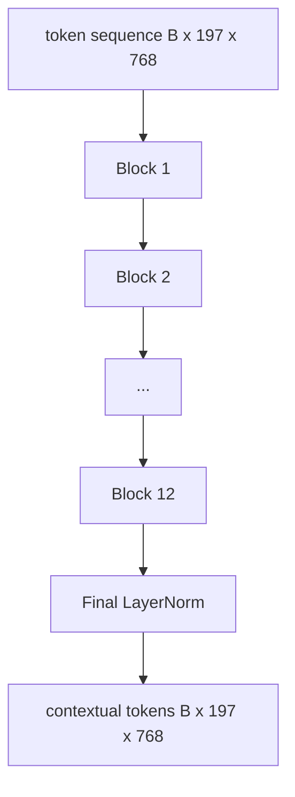
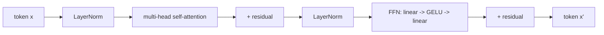

# Enkoder transformatora wizyjnego

> Same łatki nie widzą. 12-warstwowy transformator pre-LN z 12 głowicami uwagi zamienia sekwencję tokenów poprawek w sekwencję tokenów kontekstowych, przy czym token CLS łączy funkcje całego obrazu w ostatecznym stanie ukrytym. Ta lekcja jest maszynownią każdego współczesnego modelu języka wizyjnego.

**Typ:** Kompilacja
**Języki:** Python
**Wymagania wstępne:** Faza 19, lekcje 30-37 (podstawy ścieżki B)
**Czas:** ~90 minut

## Cele nauczania

- Zastosuj blok transformatora przed LN z wielogłowicową samouważnością i podwarstwą ze sprzężeniem zwrotnym.
- Ułóż 12 bloków z 12 głowicami, aby utworzyć koder ViT-Base.
- Podłącz przedni koniec patcha z lekcji 58 do kodera i wykonaj przejście do przodu.
- Sprawdź, czy token CLS agreguje informacje z każdej poprawki.

## Problem

Osadzanie łatki tworzy sekwencję 197 tokenów, każdy z nich jest wektorem, bez świadomości istnienia jakiejkolwiek innej łatki. Na zdjęciu kota każda plama musi wiedzieć, które plamy zawierają wąsy, które zawierają tło, a które oko. Transformator jest mechanizmem, który buduje tę świadomość, jedna warstwa uwagi na raz. Bez tego interfejs łatki jest sprytnym tokenizatorem bez zrozumienia.

Standardowa receptura ma głębokość dwunastu bloków, szerokość dwunastu głowic, z umieszczeniem przed LayerNorm, aktywacją GELU i czterokrotnym rozszerzeniem wyprzedzającym. Ta receptura stanowi podstawę CLIP ViT-L, SigLIP, DINOv2, rodziny Qwen-VL, InternVL i każdego innego kodera wizyjnego typu open-weight z lat 2025–2026. Przepis jest na tyle stabilny, że można przeczytać którykolwiek z tych artykułów i przyjąć ten kształt bloku, chyba że wyraźnie mówią inaczej.

## Koncepcja





### Przed LN vs. po LN

Oryginalny Transformer umieścił LayerNorm po reszcie. Pre-LN (LayerNorm przed każdą podwarstwą) to wersja używana przez każdy nowoczesny model języka wizyjnego, ponieważ trenuje stabilnie bez sztuczek rozgrzewających związanych z szybkością uczenia się. Różnica polega na jednej linii w przejściu do przodu, a przepływ gradientowy na głębokości 12+ to dzień i noc.

### Wielogłowa samouważność

Każda głowa wyświetla wektor tokenu na własną `(query, key, value)` trójkę o wymiarze `head_dim = hidden / num_heads`. W przypadku `hidden = 768` i `heads = 12` każda głowa ma `dim = 64`. 12 głowic pracuje równolegle, następnie ich wyjścia łączą się z powrotem do wymiaru 768 i przechodzą przez występ wyjściowy. Celem pracy wielogłowicowej jest to, że jedna głowa może nauczyć się „pilnowania kociego oka”, podczas gdy druga „opiekuje się gradientem tła” bez zakłóceń.

### Dlaczego 4-krotne rozszerzenie ze sprzężeniem do przodu

FFN to `hidden -> 4 * hidden -> hidden` z GELU pośrodku. Współczynnik 4 ma charakter empiryczny i sprawdza się w przypadku transformatorów językowych i wzrokowych od 2017 r. Mniejsze (2x) niedopasowania; większe (8x) przepełnienia przy stałym budżecie danych. MLP to miejsce, w którym model przechowuje większość wyuczonych faktów, a szerszy środek to miejsce, w którym się one znajdują.

| Składnik | Parametry w skali ViT-Base |
|---------------|--------------------------------------------|
| projekcja qkv na blok | `3 * 768 * 768 = 1.77M` |
| rzut wyjściowy na blok | `768 * 768 = 590K` |
| FFN na blok (4x rozszerzenie) | `2 * 768 * 4 * 768 = 4.72M` |
| LayerNorm na blok | `4 * 768 = 3K` |
| Razem na blok | około 7,1 mln |
| 12 bloków | około 85M |
| Plus przód | łącznie około 86 mln |

ViT-Base to enkoder o parametrach 86M. To niewiele jak na standardy z roku 2026 (SigLIP-So400M to 400M, Qwen-VL ViT to 675M), ale architektura jest identyczna pod względem szerokości i głębokości.

### Maska przyczynowa czy nie?

Transformatory wizyjne są przeznaczone tylko do kodera i dwukierunkowe: token `i` może obsługiwać token `j` dla dowolnej pary. Bez maski. Uwaga krzyżowa po stronie dekodera w lekcji 61 będzie wykorzystywać maskę przyczynową, ale wewnątrz kodera wizyjnego uwaga jest w pełni połączona.

### Czego uczy się token CLS

Token CLS zaczyna się jako wyuczony parametr, nie ma własnej zawartości poprawki i gromadzi informacje poprzez uwagę w każdym bloku. Na ostatniej warstwie wiersz CLS jest wektorowym podsumowaniem całego obrazu; Głowice niższego szczebla rzutują ten pojedynczy wektor na logity klasowe, kontrastowe osadzania lub klucze krzyżowej uwagi dla dekodera tekstu.

## Zbuduj to

`code/main.py` implementuje:

- `MultiHeadSelfAttention`, z `qkv` i prognozami wyjściowymi, matematyką uwagi iloczynu skalowanego i twierdzeń dotyczących kształtu.
- `FeedForward`, GELU MLP z 4-krotnym rozszerzeniem.
- `Block`, blok poprzedzający LN tworzący podwarstwy uwagi i sprzężenia zwrotnego z resztami.
- `ViT`, stos 12 bloków z końcową normą LayerNorm.
- `VisionEncoder`, który łączy `VisionFrontEnd` z lekcji 58 ze stosem `ViT` i udostępnia `forward()` zwracający sekwencję kontekstową i zbiorczy wektor CLS.
- Demo, które uruchamia zsyntetyzowany obraz urządzenia 224x224 przez pełny koder i drukuje kształt wejściowy, kształt wyjściowy, liczbę parametrów i normę CLS w każdej innej warstwie.

Uruchom to:

```bash
python3 code/main.py
```

Dane wyjściowe: urządzenie jest kodowane do tensora `(1, 197, 768)`. Norma CLS rośnie w miarę układania się warstw, a następnie stabilizuje się na poziomie końcowym LayerNorm. Całkowite parametry raportują na poziomie około 86M.

## Użyj tego

Zdefiniowany tutaj koder to, pod względem szerokości i głębokości, ten sam stos bloków, który będzie dostarczany w każdym otwartym VLM w latach 2025–2026. Różnice żyją w:

- **Szerokość i głębokość.** ViT-Large to `hidden=1024, depth=24, heads=16`; SigLIP So400M to `hidden=1152, depth=27, heads=16`. Ten sam blok.
- **Łączenie głowy.** Łączenie CLS (ta lekcja) vs średnie łączenie (SigLIP) vs łączenie uwagi (później VLM).
- **Obsługa pozycji.** Stała sinusoida (lekcja 58) vs wyuczona 1D vs ALiBi vs 2D RoPE. Matematyka bloków pozostaje niezmieniona.
- **Zarejestruj tokeny.** DINOv2 dodaje 4 dodatkowe wyuczone tokeny. Jedna linia kodu.

Ten stos bloków jest podłożem. Następne lekcje (60-63) stoją na tym szczycie.

## Testy

`code/test_main.py` obejmuje:

- pojedynczy blok zachowuje kształt i jest niezależny od wprowadzonej wielkości partii
- wyniki uwagi sumują się do jednego wzdłuż osi kluczowej (softmax zdrowy rozsądek)
- ścieżki resztkowe są okablowane (wejście zerowe nadal generuje niezerowe wyjście za pośrednictwem tokena CLS)
- 4-warstwowe podanie do przodu nadaje odpowiedni kształt
- gradienty płyną do projekcji patcha z wyjścia CLS

Uruchom je:

```bash
python3 -m unittest code/test_main.py
```

## Ćwiczenia

1. Dodaj tokeny rejestru (4 wyuczone wektory dołączone po CLS) i uruchom ponownie. Porównaj gładkość mapy uwagi poprzez entropię rozkładu softmax na ostatniej warstwie.

2. Zamień pre-LN na post-LN i trenuj dla jednej epoki na syntetycznym klasyfikatorze kształtu. Obserwuj, który z nich trenuje stabilnie bez rozgrzewki LR.

3. Zaimplementuj maskowanie przyczynowe jako argument `attn_mask`, aby ten sam blok mógł zostać ponownie użyty jako blok dekodera. Kształt maski to `(seq, seq)`, dolny trójkąt.

4. Sprofiluj podanie do przodu w partiach o wielkości 1, 8, 64 za pomocą `torch.profiler`. Warstwa MLP dominuje nad czasem na ścianie, a nie nad uwagą.

5. Wymień projekcje q-k-v jednej głowicy uwagi na adapter LoRA niskiej rangi, zamroź resztę i sprawdź, czy gradient przepływa tylko tam, gdzie się spodziewasz.

## Kluczowe terminy

| Termin | Co to znaczy |
|------|----------------------------|
| Przed LN | LayerNorm zastosowany przed każdą podwarstwą zamiast po |
| Samouważność | Każdy token dotyczy każdego innego tokena w tej samej kolejności |
| Wielogłowicowe | Ukryty półmrok jest rozdzielany pomiędzy `H` niezależne głowy uwagi |
| Ekspansja FFN | Warstwa wyprzedzająca rozszerza się do `4 * hidden` przed zwężeniem |
| Łączenie CLS | Użyj końcowego ukrytego stanu pierwszego tokena jako podsumowania obrazu |

## Dalsze czytanie

- Obraz jest wart 16x16 słów (ViT, 2021) dla przepisu na koder.
- DINOv2 (2023) dla tokenów rejestracyjnych i celu samonadzorowanego szkolenia wstępnego.
- SigLIP (2023) dla wariantu średniego łączenia i sigmoidalnej utraty kontrastowej użytej w lekcji 62.