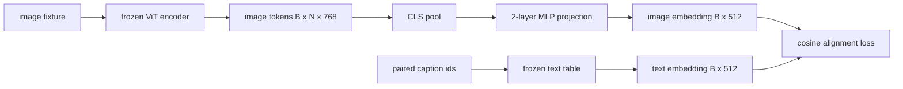

# Warstwa projekcyjna dla wyrównania modalności

> Koder wizyjny generuje tokeny obrazu. Dekoder tekstu zużywa tokeny tekstowe. Oboje żyją w różnych przestrzeniach wektorowych. Mały dwuwarstwowy system MLP wyświetla tokeny obrazu w przestrzeni zawierającej tekst, a utrata wyrównania cosinusa w stosunku do sparowanego podpisu powoduje zgodność obu przestrzeni. Ta projekcja jest najmniejszym elementem modelu wizjonersko-językowego i tym, który ma największe znaczenie w transferze.

**Typ:** Kompilacja
**Języki:** Python
**Wymagania wstępne:** Faza 19, lekcje 30-37 (podstawy ścieżki B)
**Czas:** ~90 minut

## Cele nauczania

- Zbuduj dwuwarstwową projekcję MLP, która odwzorowuje cechy obrazu w przestrzeń osadzania tekstu.
- Skonstruuj próbną tabelę do osadzania tekstu (bez wstępnie przeszkolonego tokenizera, bez prawdziwego korpusu).
- Oblicz utratę wyrównania cosinus między wyświetlanymi tokenami obrazu a osadzeniem sparowanego podpisu.
- Trenuj projekcję samodzielnie, korzystając z zamrożonego kodera wizyjnego i zamrożonej tabeli tekstowej.

## Problem

Masz koder wizyjny (lekcje 58-59) tworzący tokeny o wymiarze `vision_hidden = 768`. Masz dekoder tekstu, który chcesz przykręcić na górze z wymiarem osadzania `text_hidden = 512` (każda inna liczba jest równie prawdopodobna). Dekoder oczekuje tokenów w kształcie tekstu. Tokeny obrazów nie mają kształtu tekstu: działają w oparciu o podstawę, której koder nauczył się podczas wstępnego szkolenia polegającego wyłącznie na wizji, bez związku z wektorami słów dekodera.

Dwuwarstwowa projekcja MLP (liniowa, GELU, liniowa) wypełnia tę lukę. Jest wystarczająco mały (około `768 * 1024 + 1024 * 512 = 1.3M` parametrów), aby trenować w ciągu kilku minut na pojedynczym procesorze graficznym i jest to jedyny element, którego należy się uczyć podczas fazy wyrównywania. Koder wizyjny pozostaje zamrożony. Tabela osadzania tekstu pozostaje zamrożona. Porusza się tylko projekcja. To jest przepis LLaVA dostarczony w 2023 r., który BLIP-2 został przekształcony w Q-Former i który od tego czasu przyjął w jakiejś formie każdy VLM o otwartej masie.

## Koncepcja



### Łączenie przed projekcją

Koder wizyjny emituje 197 tokenów. Strona tekstowa zawiera pojedyncze osadzenie na poziomie podpisu. Aby je wyrównać, potrzebny jest jeden wektor na poziomie obrazu na próbkę. Łączenie CLS jest najprostsze: weź pierwszy token z kodera i wyświetl go. Łączenie średnich wszystkich 197 tokenów to kolejna opcja, z której korzysta SigLIP. Albo łączy 197 wektorów w jeden.

### Dlaczego dwie warstwy, a nie jedna

Pojedynczy rzut liniowy można obracać i zmieniać skalę, ale nie można ustalić podstawy, jeśli krzywizny obu przestrzeni są niedopasowane. GELU pomiędzy dwiema warstwami liniowymi daje projekcji jedno nieliniowe zagięcie, co z empirycznego punktu widzenia jest wystarczające, aby dopasować cechy stylu CLIP do osadzania modelu językowego. Głębsze projekcje (LLaVA-NeXT użyła GLU; Qwen-VL użyła stosu warstw uwagi) są rozszerzeniami; dwuwarstwowy MLP jest kanoniczną linią bazową i tym, co głowica projekcyjna Q-Former BLIP-2 jest dostarczana pod maską.

| Warstwa | Kształt | Parametry |
|-------|-------|------------|
| fc1 | `(vision_hidden, projection_hidden)` | `768 * 1024 + 1024` |
| aktywacja | ŻELU | 0 |
| fc2 | `(projection_hidden, text_hidden)` | `1024 * 512 + 512` |

Około 1,3 mln parametrów dla głowicy `768 -> 1024 -> 512`.

### Utrata wyrównania cosinusa

Wyrównanie nie oznacza `image_emb == text_emb`. Wyrównanie oznacza, że ​​`image_emb` wskazuje w tym samym kierunku, co `text_emb` we wspólnej przestrzeni. Strata cosinusa wynosi `1 - cos_sim(image, text)` i waha się od 0 (idealnie wyrównane) do 2 (przeciwnie). Trening prowadzi to do zera na parę. Lekcja 62 zawiera uogólnienie dotyczące partii kontrastowej (InfoNCE), w której każdy obraz musi znajdować się bliżej własnego podpisu niż jakiegokolwiek innego podpisu w grupie; w tej lekcji wykorzystano wersję na parę, więc dynamika jest widoczna.

### Zamrożony koder to trik

Enkoder wizyjny posiada parametry 86M. W tabeli tekstowej jest jeszcze kilka milionów. Szkolenie ich wszystkich z próbnego korpusu nie jest dobrym pomysłem. Zamrożenie obu oznacza, że ​​zmieniają się tylko parametry projekcji 1,3M, a kilkaset kroków na parach syntetycznych wystarczy, aby zmniejszyć stratę. Dokładnie taki jest operacyjny kształt każdego VLM opartego na adapterze: ciężkie części pozostają zamrożone, a lekkie pociągi mostowe.

## Zbuduj to

`code/main.py` implementuje:

- `MLPProjector(in_dim, hidden_dim, out_dim)`, dwuwarstwowy liniowy MLP z aktywacją GELU.
- `MockTextEmbedding(vocab_size, dim)`, zamrożona tabela do osadzania z deterministycznym inicjowaniem z zarodka.
- `make_pair(seed, vocab_size)`, który syntetyzuje jedną sparowaną próbkę (obrazek, podpis). Podpisy to krótkie sekwencje identyfikacyjne; osadzanie podpisów jest sumowane w oparciu o osadzanie tokenów.
- `cosine_alignment_loss(image_emb, text_emb)`, cel `1 - cos_sim` na parę.
- Pętla treningowa, która uruchamia projekcję dla 200 kroków na 32 parach syntetycznych (cyklicznie), z zamrożonym koderem wizyjnym i tabelą tekstową, i drukuje stratę co 25 kroków.

Uruchom to:

```bash
python3 code/main.py
```

Wynik: raporty szkoleniowe spadają z początkowej straty około 1,07 do około 0,80 w ciągu 200 kroków, co pokazuje, że sama projekcja może przyciągnąć tokeny obrazu do przestrzeni tekstowej. Drukowane jest również końcowe podobieństwo cosinusa na parę.

## Użyj tego

Ten sam wzór pojawia się w każdym VLM o otwartej wadze:

- **LLaVA 1.5.** Dwuwarstwowa projekcja GELU MLP z CLIP-ViT-L ukrytego do LLaMA z wyciemnieniem osadzającym. Zamrożony koder wizyjny, zamrożony LLM, trenuj tylko projekcję (następnie odmroź LLM w etapie drugim).
- **BLIP-2.** Q-Former pobiera 32 wyuczone tokeny zapytań poprzez krzyżową uwagę z tokenami obrazu, a następnie wyświetla obraz do osadzania LLM. Głowica projekcyjna na samym końcu Q-Formera jest analogiem MLP z tej lekcji.
- **MiniGPT-4.** Pojedyncza projekcja liniowa z wyjścia BLIP-2 Q-Former do wym. osadzania Vicuna.
- **Qwen-VL.** Adapter skupiający uwagę z kilkoma warstwami, ale ostatni element jest ponownie projekcją do przyciemnienia osadzającego LM.

Kształt jest różny, ale rola jest identyczna: łączenie tokenów obrazów, przyciemnianie projektu do osadzania tekstu, trenowanie samodzielnie.

## Testy

`code/test_main.py` obejmuje:

- kształt wyjściowy projektora odpowiada skonfigurowanemu `out_dim`
- tabela do osadzania zamrożonego tekstu ma zerowe parametry `requires_grad`
- strata cosinusa wynosi zero na identycznych wektorach i wynosi 2 na wektorach antyrównoległych
- gradient projektora przepływa po jednym przejściu wstecz
- pętla treningowa zmniejsza straty pomiędzy krokiem 0 a krokiem 200

Uruchom je:

```bash
python3 -m unittest code/test_main.py
```

## Ćwiczenia

1. Zastąp łączenie CLS średnim łączeniem ze 196 żetonów łatek i porównaj ostateczną stratę po 200 krokach. Łączenie średnich zwykle trenuje szybciej na danych syntetycznych; CLS jest bardziej wydajny w przypadku naturalnych obrazów.

2. Dodaj poznaną temperaturę skalarną do straty cosinusa (`cos / tau`) i obserwuj, co się stanie, gdy `tau` jest za mała (szum gradientowy) lub za duża (wysokie plateau strat).

3. Zamień dwuwarstwowy MLP na pojedynczą warstwę liniową i określ ilościowo lukę strat. Nieliniowość ma większe znaczenie w przypadku naturalnych cech obrazu, a mniej w przypadku syntetycznych.

4. Dodaj niewielką karę L2 do ciężarów projektora i obserwuj, jak współdziała ona z wyrównaniem cosinus (cosinus jest niezmienny względem skali, więc kara głównie zmniejsza nieużywane kierunki).

5. Utrzymuj ciężary projektora, następnie załaduj ponownie i przeprowadź wnioskowanie bez przejścia wstecznego kodera wizyjnego, aby sprawdzić, czy w momencie wdrożenia potrzebny jest tylko projektor.

## Kluczowe terminy

| Termin | Co to znaczy |
|------|----------------------------|
| Dopasowanie modalności | Akt zapewnienia porównywalności osadzania obrazów i tekstu w jednej wspólnej przestrzeni |
| Głowica projekcyjna | Mały moduł mapujący jedną przestrzeń na drugą, zwykle dwuwarstwowy MLP |
| Cosinus podobieństwo | Iloczyn skalarny podzielony przez iloczyn norm L2 |
| Zamrożony koder | Model wizji (lub tekstu) ma wszystkie parametry z `requires_grad=False` |
| Próbny korpus | Wykorzystano pary syntetyczne, więc szkolenie nie ma zależności pobierania zestawu danych |

## Dalsze czytanie

- Papier LLaVA dla pociągu dwustopniowego (projekt, następnie odmrożenie LM).
- Papier BLIP-2 dla Q-Former jako możliwa do nauczenia alternatywa projekcji.
- Raport techniczny Qwen-VL dotyczący adapterów typu cross-attention jako głębszych głowic projekcyjnych.