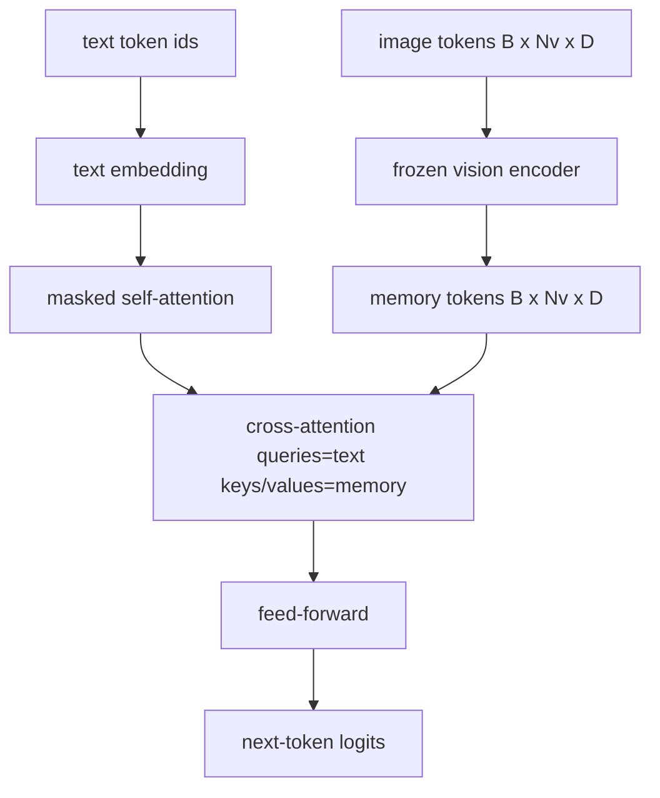
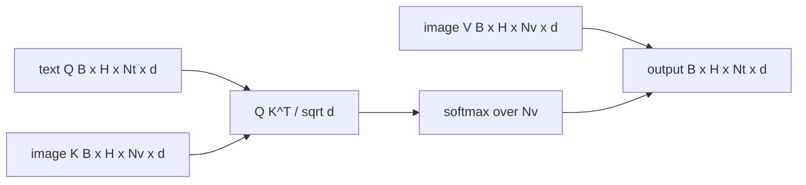

# Fuzja krzyżowo-uważności

> Warstwa projekcyjna wyrównuje jeden wektor obrazu z jednym wektorem podpisu. Prawdziwy dekoder języka wizyjnego potrzebuje każdego żetonu tekstu do obsługi każdego żetonu łaty, dzięki czemu model może ugruntować każde słowo w regionie. Wzajemna uwaga to sposób, w jaki następuje to uziemienie. Zapytania tekstowe; odpowiadają klucze i wartości wizji. Ta lekcja buduje blok wzajemnej uwagi, tekst przyczynowy – samouważność i kształty masek, które zapewniają, że oba są zgodne z prawem.

**Typ:** Kompilacja
**Języki:** Python
**Wymagania wstępne:** Faza 19, lekcje 30-37 (podstawy ścieżki B)
**Czas:** ~90 minut

## Cele nauczania

- Zaimplementuj wielostronną uwagę, w której strumień zapytań to tekst, a strumień klucz/wartość to wizja.
- Skomponuj blok dekodera: przyczynowa samouważność + uwaga krzyżowa + sprzężenie zwrotne.
- Ustaw odpowiedni kształt maski: maska ​​przyczynowa dla samouwagi, bez maski dla uwagi krzyżowej.
- Uruchom przepustkę do przodu ze zbiorczymi tokenami tekstowymi i stałą pulą tokenów graficznych.

## Problem

Łączenie żetonów obrazów i żetonów tekstu w jedną sekwencję to jedna z opcji fuzji (wczesna fuzja, ścieżka, którą podążają Chameleon i Emu3). Drugim jest przerzucanie uwagi (późna fuzja, ścieżka wprowadzona przez Flamingo i którą od tego czasu kopiuje każdy dekoder w kształcie Flaminga). W późnej fuzji dekoder tekstu działa na tokenach zawierających wyłącznie tekst i dociera do strumienia obrazu poprzez wzajemną uwagę na każdej warstwie.

Późna fuzja ma dwie zalety. Po pierwsze, strumień tekstowy pozostaje czysty, a model zachowuje możliwości wyłącznie tekstowe. Po drugie, strumień obrazu jest obliczany raz dla każdego obrazu i ponownie wykorzystywany na każdym etapie dekodowania, więc generowanie jest tanie nawet w przypadku długich podpisów. Koszt wynosi jedną dodatkową podwarstwę uwagi na blok.

## Koncepcja





### Kształty masek

Dwie uwagi wewnątrz bloku dekodera wymagają różnych masek:

| Uwaga | Długość zapytania | Długość klucza | Maska | Dlaczego |
|----------|-------------|------------|------|---------|
| Samouważność | `Nt` (tekst) | `Nt` (tekst) | Przyczynowy: trójkąt dolny `(Nt, Nt)` | Tokeny tekstowe mogą nie przewidywać przyszłości podczas autoregresji |
| Uwaga krzyżowa | `Nt` (tekst) | `Nv` (wizja) | Bez maski | Cały obraz jest widoczny w każdej pozycji tekstu |

Lekcja obejmuje jedną funkcję sprawdzania kształtu, więc błędem jest mieszanie ich powierzchni w postaci `ValueError` zamiast cicho przerywanej krzywej straty.

### Dlaczego bez maski przy wzajemnej uwadze

Obraz jest w pełni obserwowany przed wygenerowaniem tekstu. Token `t` podpisu może dotyczyć dowolnego fragmentu obrazu; na plamach obrazu nie ma porządku czasowego. Niektóre warianty Flamingo dodają wzór maskowania dla każdej próbki podczas przeplatania wielu obrazów i segmentów tekstu, ale w przypadku pojedynczego obrazu z podpisem uwaga krzyżowa widzi wszystko.

### Buforowanie kluczy/wartości

Klucze i wartości obrazów są obliczane jednorazowo na początku dekodowania i przechowywane w pamięci podręcznej. Każdy nowy token tekstowy korzysta z pamięci podręcznej bez ponownego obliczania. To właśnie sprawia, że ​​napisy są szybkie w wnioskowaniu: ciężki ViT działa raz; uwaga krzyżowa ponownie wykorzystuje swoje klucze i wartości na każdym kroku. Lekcja przedstawia pamięć podręczną i testuje ścieżkę trafienia w pamięć podręczną.

### Kompozycja blokowa

Blok dekodera przebiega: przed LN -> samouwaga -> resztkowa -> przed LN -> uwaga krzyżowa -> resztkowa -> przed LN -> sprzężenie zwrotne -> resztkowa. Trzy podwarstwy, każda z własną normą LayerNorm. W artykule Flamingo dodano wyuczoną bramkę dotyczącą wzajemnej uwagi, dzięki czemu model mógł zrezygnować ze ścieżki obrazu kosztem stabilności w czasie szkolenia; kanoniczna linia bazowa (użyta tutaj) nie ma bramki.

```python
class DecoderBlock:
  def forward(self, text_tokens, image_tokens, text_mask, cross_mask):
      text_tokens = text_tokens + self.self_attn(self.ln1(text_tokens),
                                                 mask=text_mask)
      text_tokens = text_tokens + self.cross_attn(self.ln2(text_tokens),
                                                  image_tokens,
                                                  mask=cross_mask)
      text_tokens = text_tokens + self.ffn(self.ln3(text_tokens))
      return text_tokens
```

## Zbuduj to

`code/main.py` implementuje:

- `CrossAttention(hidden, heads)`, wielogłowicowa uwaga krzyżowa z oddzielnymi projekcjami `q` i `kv`.
- `CausalSelfAttention(hidden, heads)`, zamaskowana samouważność ze standardowego dekodera.
- `DecoderBlock`, składający się z trzech podwarstw z pozostałościami sprzed LN.
- `VisionLanguageDecoder`, czterowarstwowy dekoder zasilany przez wyjście pozorowanego kodera wizyjnego i małą tabelę do osadzania tekstu.
- `causal_mask(length)` zwracający `(length, length)` tensor logiczny dolnego trójkąta.
- Wersja demonstracyjna, która zasila partię dwóch sekwencji tekstowych o długości 10 z pamięcią obrazu o długości 197 i drukuje kształt wyjściowy, kształt maski samouwagi i normę wyjściową wzajemnej uwagi na pozycję.

Uruchom to:

```bash
python3 code/main.py
```

Dane wyjściowe: dekoder generuje tensor logitowy `(2, 10, text_vocab)`. Kształt maski to `(10, 10)`. Kontrola ponownego wykorzystania pamięci podręcznej KV potwierdza identyczne logity między ścieżkami buforowanymi i niezapisanymi w pamięci podręcznej.

## Użyj tego

Wzajemna uwaga pojawia się w dwóch rodzinach produkcyjnych:

- **Flamingo i IDEFICS.** Wstaw podwarstwę wzajemnej uwagi w każdym bloku modelu języka K z zamrożonym LM. Adapter wzrokowo-językowy to blok przekierowywania uwagi i jego brama.
- **BLIP-2.** Q-Former wykorzystuje wzajemne uwagi ze stałego zestawu 32 tokenów zapytań do funkcji obrazu, a następnie wyświetla zapytania w przestrzeni osadzania LM.

Kształt bloku z tej lekcji jest bezpośrednio powiązany z obydwoma. Dyscyplina maski (przyczyna na sobie, brak na krzyżu) jest taka sama.

## Testy

`code/test_main.py` obejmuje:

- maska przyczynowa jest dolno-trójkątna i odpowiada oczekiwanemu kształtowi logicznemu
- kształt wyjściowy typu cross-attention to `(B, Nt, hidden)` niezależnie od długości klucza
- Ścieżka pamięci podręcznej KV dopasowuje ścieżkę niezapisaną w pamięci podręcznej do tolerancji float
- niedopasowanie kształtu pomiędzy strumieniami tekstu i obrazu powoduje wyraźne `ValueError`
- pełne przejście do przodu dekodera daje właściwy kształt partii i sekwencji

Uruchom je:

```bash
python3 -m unittest code/test_main.py
```

## Ćwiczenia

1. Dodaj wyuczoną bramkę Tanha do reszty uwagi krzyżowej (sztuczka Flamingo) i sprawdź, czy trening zbiega się z bramką początkową bliską zera. Bramka zaczyna się od 0; model odzyskuje zachowanie wyłącznie tekstowe przed zmieszaniem strumienia obrazu.

2. Zaimplementuj uwagę przeplataną, w której ten sam dekoder zużywa wiele obrazów i wiele segmentów tekstu. Zbuduj maskę wzajemnej uwagi dla każdej próbki, która uniemożliwia segmentowi tekstu 2 skupienie się na obrazie 1.

3. Skonfiguruj warstwę wzajemnej uwagi a warstwę samouważności w `Nt=64, Nv=576` (siatka 24x24 w wyższej rozdzielczości). Koszt wzajemnej uwagi wynosi `Nt * Nv` i dominuje przy wysokiej rozdzielczości obrazu.

4. Dodaj porzucenie po stronie zapytania na mapie krzyżowej uwagi i zmierz różnorodność napisów w wersji demonstracyjnej (wariancja próbki podpisu wzrasta wraz z porzuceniem na mapie krzyżowej).

5. Zamień warstwę wzajemnej uwagi na blok uwagi w stylu Q-Former, w którym stała pula zapytań składająca się z 32 tokenów obsługuje funkcje obrazu raz na warstwę.

## Kluczowe terminy

| Termin | Co to znaczy |
|------|----------------------------|
| Późna fuzja | Tekst i wizja pozostają w oddzielnych strumieniach; uwaga krzyżowa łączy je w każdym bloku |
| Uwaga krzyżowa | Q pochodzi z jednego strumienia, K i V z drugiego |
| Maska przyczynowa | Dolna trójkątna maska ​​boolowska zapobiegająca patrzeniu w przyszłość podczas autoregresji |
| Pamięć podręczna KV | Klucze obrazu i wartości przechowywane raz i ponownie wykorzystywane na każdym etapie dekodowania |
| żetony pamięci | Zamrożone tokeny obrazu, do których dekoder sięga |

## Dalsze czytanie

- Flamingo (2022) za kanoniczny projekt późnej fuzji z bramkowaną uwagą krzyżową.
- BLIP-2 (2023) dla Q-Former, który jest blokiem krzyżowej uwagi ubranym w wyuczoną pulę zapytań.
- IDEFICS (2023) za reprodukcję przepisu Flamingo w otwartej wadze.