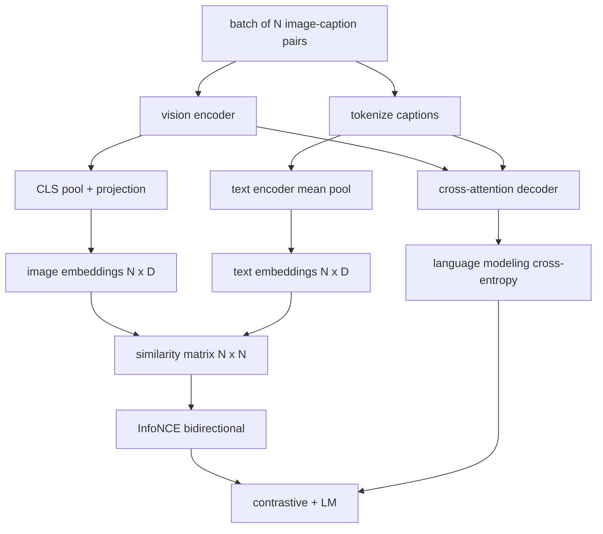

# Wstępny trening języka wizyjnego

> Koder, projekcja i dekoder są podłączone. Teraz trenujcie je razem. Uczeniu się sprzyjają dwa cele: kontrastowa utrata obrazu i tekstu (InfoNCE), która przyciąga pasujące pary razem we wspólnej przestrzeni osadzania, oraz utrata modelowania języka, która wymaga od dekodera podpisania każdego obrazu. Łącznie uczą sieć zarówno znajdowania odpowiedniego obrazu do podpisu, jak i pisania podpisu do obrazu.

**Typ:** Kompilacja
**Języki:** Python
**Wymagania wstępne:** Faza 19, lekcje 30-37 (podstawy ścieżki B)
**Czas:** ~90 minut

## Cele nauczania

- Zaimplementuj utratę kontrastu InfoNCE w grupie par obrazu-podpisu.
- Komponuj stratę kontrastową z utratą modelowania języka autoregresyjnego.
- Zsyntetyzuj 200 par próbnych korpusów podpisów obrazów bez pobierania rzeczywistego zestawu danych.
- Uruchom 50-etapową pętlę treningową demonstracyjną i obserwuj zmniejszanie się obu strat.

## Problem

Model języka wizyjnego wymaga dwóch umiejętności. Musi mieć rangę: mając podpis, znajdź odpowiedni obraz spośród wielu. Musi wygenerować: mając obraz, napisz podpis. Wstępne uczenie modelu tylko w oparciu o jedną umiejętność daje połowę systemu. CLIP uzyskał ranking, ale nie może opublikować podpisu. GPT-4V może podpisywać napisy, ale wykorzystuje oddzielną głowicę do wyszukiwania w celu rankingu. Wielocelowe szkolenie wstępne pozwala uzyskać oba te elementy w jednym przebiegu.

InfoNCE obsługuje połowę rankingu. W przypadku partii N par model traktuje N pasujących par jako dodatnie, a niedopasowane pary `N^2 - N` jako ujemne, a następnie oblicza utratę entropii krzyżowej na wynikowej macierzy podobieństwa `(N, N)`. Strata LM obsługuje połowę generacji: standardowe przewidywanie następnego tokena uwarunkowane obrazem. Obie straty są różnicowalne i mogą mieć wspólne wagi kodera, projektora i dekodera.

## Koncepcja



### InfoNCE w jednym akapicie

Ułóż N osadzonych obrazów jako wiersze, a N osadzonych tekstów jako wiersze. L2-normalizuj oba. Oblicz macierz `N x N` `S = I T^T / tau`, gdzie `tau` to wyuczona temperatura. Wpisy ukośne to pasujące pary; wpisy poza przekątną są negatywami. Zastosuj entropię krzyżową z celem `argmax` biegnącym wzdłuż przekątnej: wiersz `i` powinien mieć najwyższy wpis w kolumnie `i`. Zrób to samo symetrycznie wzdłuż kolumn. Suma jest średnią z tych dwóch. To jest strata CLIP w ośmiu liniach.

### Temperatura ma znaczenie

Temperatura `tau` kontroluje, jak wysoki jest softmax. Zbyt mały (np. `tau = 0.01`), a gradient pochodzi tylko od najtwardszego negatywu, trening jest hałaśliwy. Zbyt duży, softmax spłaszcza się, a gradient znika. CLIP uczy się `tau` jako parametru; demo tutaj robi to samo.

### Utrata modelowania języka

Dekoder zużywa tokeny pamięci obrazu poprzez wzajemne uwagi i przewiduje następny token tekstowy w każdej pozycji. Strata to standardowa entropia krzyżowa z celem na następnej pozycji. Pozycje dopełnienia są maskowane przed stratą.

### Łączenie strat

`total = contrastive + lm_weight * lm` gdzie `lm_weight` jest skalarem (często 1,0). Obie straty mają wspólne gradienty w koderze i projekcji; tylko dekoder odbiera gradient strat LM. Jest to wielozadaniowy przepis, z którego korzystają wszystkie modele w stylu CoCa, BLIP i SigLIP, z różnymi wagami.

| Składnik | Powierzchnia straty | Wpływa |
|----------|-------------|--------|
| InformacjeNCE | Ranking par we wspólnej przestrzeni | Koder + projekcja + głowica tekstowa |
| LM | Przewidywanie tokenów uwarunkowane obrazem | Koder + projekcja + dekoder |
| połączone | Wielozadaniowość | Cały stos |

### Dlaczego 50 kroków wystarczy na demonstrację

Korpus próbny to syntetyczny zestaw 200 par z losowymi obrazami i losowymi identyfikatorami podpisów. Po 50 krokach SGD przy wielkości partii 16 obie straty wyraźnie spadają, nawet jeśli wartości bezwzględne pozostają powyżej tego, co osiągnąłby model oparty na danych rzeczywistych. Celem demonstracji jest potwierdzenie, że prace hydrauliczne prowadzone są na nachyleniu od początku do końca oraz że dodanie straty LM nie zdestabilizuje celu kontrastowego.

## Zbuduj to

`code/main.py` implementuje:

- `MultimodalModel`, łączący mały koder ViT, projektor MLP, mały koder tekstowy (pula średnich na podstawie osadzonych identyfikatorów) i dekoder typu cross-attention z lekcji 61.
- `info_nce_loss(image_emb, text_emb, temperature)`, dwukierunkowa utrata kontrastu typu CLIP.
- `lm_loss(logits, target_ids, padding_id)`, zamaskowana entropia krzyżowa następnego tokenu.
- `make_mock_corpus(seed, n_pairs)`, zwraca 200 par deterministycznych (obraz, caption_ids).
- Pętla treningowa składająca się z 50 kroków z partią o wielkości 16, optymalizatorem Adama i wyuczonym parametrem log-temperatura. Obie straty są drukowane co 5 kroków.

Uruchom to:

```bash
python3 code/main.py
```

Wynik: strata kontrastowa spada z około `ln(16) = 2.77` do 2,4; Utrata LM spada z losowo jednolitej linii bazowej `ln(512) ≈ 6.24` do około 4,7. Obydwa spadki dowodzą, że gradient jest prawidłowo podłączony. Prawdziwe modele trenują miliony kroków; dynamika jest taka sama.

## Użyj tego

To jest ten sam przepis na stratę, który został przesłany w:

- **CLIP (2021).** Tylko obraz kontrastowy z tekstem, z oddzielną sondą podpisów zamrożonego kodera.
- **CoCa (2022).** Kontrast obrazu i tekstu oraz utrata LM w podpisach obrazów w jednym modelu. Dokładny wzór, jaki buduje ta lekcja.
- **BLIP (2022) i BLIP-2.** Kontrastowa plus LM plus głowica dopasowująca obraz i tekst. Trzy porażki razem wzięte.
- **SigLIP (2023).** Przełącza InfoNCE w przypadku utraty pary esicy; ta sama kontrastowa rola, inna forma funkcjonalna.
- **Rodzina LLaVA.** Trening dwuetapowy, gdzie etap pierwszy to wyrównanie (cosinus na zamrożonym LM), a etap drugi dodaje utratę LM z niezamrożonym LM. Lekcja 60 mapuje do etapu pierwszego; ta lekcja dotyczy etapu drugiego.

## Testy

`code/test_main.py` obejmuje:

- Strata InfoNCE jest symetryczna w wierszach obrazu/tekstu
- InfoNCE loss zwraca 0, gdy macierz podobieństwa jest idealną przekątną dużych liczb dodatnich
- Utrata LM poprawnie maskuje pozycje wypełnienia
- modelowe podanie w przód generuje obie straty bez błędów
- 5-stopniowa pętla treningowa zmniejsza łączną stratę

Uruchom je:

```bash
python3 -m unittest code/test_main.py
```

## Ćwiczenia

1. Zamień InfoNCE na utratę pary sigmoidalnej typu SigLIP i porównaj zbieżność na próbnym korpusie.

2. Dodaj etap wydobywania twardego-ujemnego: co drugą partię wybierz najtwardszą parę niediagonalną z poprzedniej partii i dołącz ją. Trenuj i sprawdzaj, czy strata kontrastowa spada szybciej.

3. Dodaj głowicę binarną dopasowującą obraz i tekst na wierzchu złącza (prawda/fałsz: czy pasują?), aby uzyskać trzecią stratę, replikując konfigurację trzech głowic BLIP.

4. Zamień korpus próbny na sekwencje identyfikatorów podpisów zaczerpnięte z łańcucha Markowa, którego macierz przejścia jest uwarunkowana hashem obrazu. Utrata napisów powinna jeszcze bardziej spaść, ponieważ istnieje sygnał, którego można się nauczyć.

5. Wytrenuj ten sam model za pomocą `lm_weight = 0` i ponownie za pomocą `lm_weight = 1`. Porównaj stratę kontrastową; strata LM nie powinna powodować regresji celu rankingowego.

## Kluczowe terminy

| Termin | Co to znaczy |
|------|----------------------------|
| InformacjeNCE | Estymacja kontrastowa szumu: entropia krzyżowa na macierzy podobieństwa |
| Temperatura | Skalar, który kontroluje, jak wysoki jest kontrastowy softmax |
| Twardy negatyw | Para niediagonalna, którą model uważa za zagmatwaną, przydatną do próbkowania |
| Strata LM | Standardowa entropia krzyżowa następnego tokenu po stronie podpisu |
| Wspólna przestrzeń osadzania | Wspólna przestrzeń, w której po projekcji żyją wektory obrazu i tekstu |

## Dalsze czytanie

- Papier CLIP do oryginalnej receptury kontrastowej.
- Papier CoCa do kontrastu i napisów w jednym modelu.
- Papier SigLIP dla wariantu utraty pary esicy i dlaczego lepiej się skaluje.