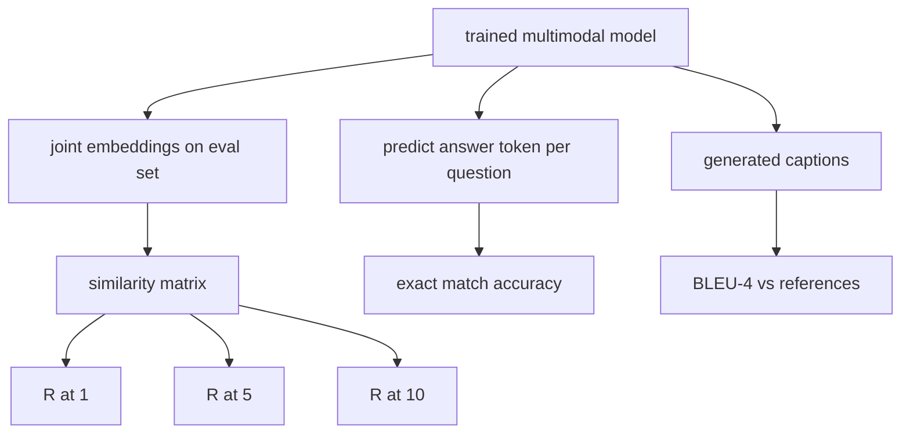

# Ocena multimodalna

> Szkolenie to połowa pętli. Druga połowa to pomiar. W tej lekcji z elementów podstawowych zbudowane są trzy powierzchnie ewaluacyjne: pobieranie podpisów obrazów zgłaszane jako R@1, R@5, R@10; Wizualna odpowiedź na pytanie raportowana jako dokładność dopasowania dokładnego; i podpisy zdjęć zgłoszone jako BLEU-4. Każda metryka jest funkcją na wynikach modelu i syntetycznym zestawem ewaluacyjnym, który działa w ciągu kilku sekund.

**Typ:** Kompilacja
**Języki:** Python
**Wymagania wstępne:** Faza 19, lekcje 58-62 (podstawy ścieżki E: koder, transformator, projekcja, fuzja krzyżowej uwagi, szkolenie wstępne)
**Czas:** ~90 minut

## Cele nauczania

- Oblicz Recall@K z macierzy podobieństwa pomiędzy osadzeniem obrazu i podpisu.
- Oblicz dokładność VQA dokładnie dopasowaną na podstawie modelu, który odwzorowuje pary (obraz, pytanie) na słownictwo o ustalonych odpowiedziach.
- Oblicz BLEU-4 na podstawie wygenerowanych i referencyjnych sekwencji tokenów bez żadnej zewnętrznej biblioteki.
- Przeprowadź wszystkie trzy ewaluacje w oparciu o zestaw syntetyczny zbudowany na bazie wytrenowanego modelu z lekcji 62.

## Problem

Istnieje pokusa uznania modelu multimodalnego za zakończony, gdy straty szkoleniowe ustabilizują się. Miary strat szkoleniowych pasują do rozkładu szkoleń; nie mierzy, czy model może uszeregować pary w zatrzymanej partii, odpowiedzieć na pytanie lub napisać podpis, który zaakceptowałby człowiek. W standardzie trzy powierzchnie ewaluacyjne:

- **Pobieranie (R@1, R@5, R@10).** Zbuduj wspólne osadzenie podpisu zapytania; uszereguj każdy obraz w puli eval według cosinusa; zgłoś, czy pasujący obraz znajdzie się w pierwszej 1, pierwszej piątce, pierwszej 10. Formularz symetryczny (obraz na tekst) działa w ten sam sposób.
- **Wizualna odpowiedź na pytanie (dokładne dopasowanie).** Biorąc pod uwagę (obraz, pytanie), model generuje token odpowiedzi. Dokładne dopasowanie wynosi jeden bit na próbkę: czy przewidywana odpowiedź była równa odpowiedzi referencyjnej? Średnia ze zbioru eval.
- **Napisy (BLEU-4).** Wygeneruj podpis. Oblicz średnią geometryczną z dokładnością od 1 grama do 4 gramów w odniesieniu do podpisów referencyjnych, z karą za zwięzłość. Standardową formą jest wieloodniesienie (jeden obraz, kilka podpisów referencyjnych).

Każda metryka jest cienką funkcją. Lekcja buduje je wszystkie w kodzie, więc matematyka jest konkretna, a powierzchnia pozostaje pod twoją kontrolą. Prawdziwe zestawy testów porównawczych (MS-COCO, VQA v2, GQA, OK-VQA) podłączają się do tych samych kształtów funkcji.

## Koncepcja



### Przywołaj@K z macierzy podobieństwa

Utwórz `(N, N)` macierz podobieństwa cosinus między osadzeniem obrazu i podpisu. Dla każdego wiersza posortuj kolumny według malejącego podobieństwa. Recall@K to ułamek wierszy, w którym indeks kolumny przekątnej mieści się w górnych pozycjach K. Symetryczne Recall@K (od podpisu do obrazu) jest obliczane na transponowanej matrycy. Obie liczby są zgłaszane. Dla wartości N=100 R@1 = 0,6 oznacza, że ​​60 ze 100 podpisów uzyskało prawidłowy obraz jako najlepiej dopasowany.

### Dokładne dopasowanie VQA

Dla każdego (obrazek, pytanie, odpowiedź) zakoduj obraz, osadź pytanie, połącz za pomocą dekodera i odczytaj kolejny token. Przewidywany identyfikator tokena jest porównywany z identyfikatorem referencyjnym; poprawne, jeśli równe. Średnia ze zbioru eval. Prawdziwe zbiory danych VQA są dostarczane z wieloma odpowiedziami z adnotacjami na każde pytanie i wykorzystują formułę miękkiej dokładności (1,0, jeśli co najmniej 3 z 10 komentatorów zgadza się, w skali poniżej); dla przejrzystości lekcja wykorzystuje dokładne dopasowanie jednej odpowiedzi.

### BLEU-4

```text
BLEU-4 = BP * exp(mean(log p1, log p2, log p3, log p4))
```

Gdzie `p_n` to zmodyfikowana precyzja w n-gramach (obcięta liczba wygenerowanych n-gramów, które pojawiają się w dowolnym odnośniku, podzielona przez całkowitą liczbę wygenerowanych n-gramów), a `BP` to kara za zwięzłość:

```text
BP = 1                if generated length > reference length
   = exp(1 - r/g)     otherwise, where r is reference length and g is generated
```

Wygładzanie jest potrzebne w przypadku małych próbek, w których część `p_n` wynosi zero. W implementacji zastosowano „metodę 1” Chena i Cherry’ego (dodaj 1 do licznika i mianownika dla dowolnej liczby zerowej), która jest najbezpieczniejszą metodą domyślną w przypadku reżimów o małej liczbie zliczeń.

### Syntetyczny zestaw ewaluacyjny

Zestaw ewaluacyjny składający się z 50 próbek jest tworzony w pamięci na podstawie tego samego próbnego wzorca korpusu, co w lekcji 62, z odsuniętym ziarnem. Zestaw składa się z trzech list:

- `pairs`: 50 par (image, caption_ids) do pobrania.
- `vqa`: 50 (obraz, identyfikatory pytań, identyfikator odpowiedzi) potrójnych.
- `caps`: 50 (obraz, [reference_caption_ids, ...]) wpisów z maksymalnie 3 odniesieniami na obraz.

Zestaw jest deterministyczny od samego początku i przechowywany poza korpusem szkoleniowym, zatem metryki są obliczane na podstawie danych, których model nigdy nie widział. Utrwalanie pakietu w formacie JSON pozostawia się jako ćwiczenie (patrz poniżej).

| Metryczne | Zakres | Losowa linia bazowa (N=50) |
|------------|-------|--------------------------------------|
| R@1 | 0 do 1 | 0,02 (1 / N) |
| R@5 | 0 do 1 | 0,10 |
| R@10 | 0 do 1 | 0,20 |
| VQA EM | 0 do 1 | 1 / słownictwo |
| BLEU-4 | 0 do 1 | mały, ale niezerowy |

W przypadku 50-etapowego szkolenia prowadzonego na danych syntetycznych nie oczekuje się, że wskaźniki będą wysokie; oczekuje się, że będą one powyżej losowej linii bazowej, co sprawdza demo.

## Zbuduj to

`code/main.py` implementuje:

- `recall_at_k(sim_matrix, k)`, zwracając wartość zmiennoprzecinkową w `[0, 1]` w obu kierunkach.
- `vqa_exact_match(predictions, references)`, zwraca średnią z równości `int`.
- `bleu4(generated, references, smoothing=True)`, z obsługą wielu odniesień.
- `build_eval_suite(seed, n_samples, vocab_size, max_len)`, zwracający trzy deterministyczne listy ewaluacyjne.
- `evaluate(model, suite)`, który uruchamia wszystkie trzy metryki i zwraca `dict` liczb.
- Demo, które ładuje świeżo zainicjowany model multimodalny z lekcji 62, ocenia go, następnie szkoli go przez 50 kroków i ponownie ocenia, drukując metryki przed/po.

Uruchom to:

```bash
python3 code/main.py
```

Dane wyjściowe: tabela metryczna przed/po pokazuje poprawę pobierania od niemal losowego do sygnału wyuczonego modelu, poprawę VQA powyżej losowego i poprawę BLEU-4 (struktura syntetyczna wystarcza do precyzyjnego podnoszenia o 4 gramy).

## Użyj tego

Każda metryka jest bezpośrednio odwzorowywana na benchmark produkcyjny:

- **Odzyskiwanie.** MS-COCO 5K val, Flickr30K, ImageNet zero-shot to problemy R@K na tej samej macierzy podobieństwa. Zastąp syntetyczny eval prawdziwymi plikami, a sygnatura funkcji pozostanie niezmieniona.
- **VQA.** VQA v2, GQA, OK-VQA używają tego samego kształtu dokładnego dopasowania (z miękkim acc zamiast EM z pojedynczą odpowiedzią dla VQA v2).
- **BLEU-4.** Napisy MS-COCO, NoCaps, Flickr30K, wszystkie korzystają z BLEU-4 plus CIDEr i METEOR. Dodanie CIDEra to jeszcze jedna funkcja.

Aby uzyskać prawdziwe testy porównawcze, zamień `build_eval_suite` na prawdziwy moduł ładujący i zachowaj treści funkcji. Matematyka jest niezależna od benchmarków.

## Testy

`code/test_main.py` obejmuje:

- przypomnieć@k zwraca 1,0 na macierzy podobieństwa doskonałej tożsamości i 0,0 na odwróconej dla k < N
- przypomnieć@k uwzględnia `k <= N` górną granicę
- bleu4 zwraca 1,0, gdy wygenerowane jest dokładnie równe jednej z referencji
- bleu4 zwraca 0,0 w przypadku słownika rozłącznego
- dokładne dopasowanie vqa jest równe ułamkowi równych par
- build_eval_suite zwraca oczekiwaną liczbę par, elementów vqa i wpisów podpisów

Uruchom je:

```bash
python3 -m unittest code/test_main.py
```

## Ćwiczenia

1. Dodaj CIDEr do metryk napisów. CIDEr używa ważenia TF-IDF w n-gramach, co nagradza tokenami informacyjnymi.

2. Zaimplementuj VQA o miękkiej dokładności: wiele odpowiedzi ludzkich na pytanie, dokładność wynosi `min(human_count / 3, 1)`, jeśli jakiekolwiek pasują. Replikuje VQA v2.

3. Dodaj bezpieczny dla NaN wariant `bleu4`, który obsługuje puste wygenerowane sekwencje bez awarii.

4. Oblicz średnią rangę odwrotną (MRR) wraz z R@K. MRR jest wrażliwy na to, gdzie właściwy element wyląduje poza górnym K; R@K jest wrażliwe na to, czy wyląduje w górnym K.

5. Przeprowadź ewaluację modelu w pięciu punktach kontrolnych podczas uczenia (kroki 0, 10, 20, 30, 40, 50) i wykreśl krzywą uczenia się. Potwierdź, że trajektorie metryczne śledzą trajektorię strat.

## Kluczowe terminy

| Termin | Co to znaczy |
|------|----------------------------|
| R@K | Część zapytań, w przypadku których prawidłowe dopasowanie pojawia się na pierwszych K wynikach |
| Dokładne dopasowanie | Najprostsza punktacja VQA: przewidywana odpowiedź równa się referencja |
| BLEU-4 | Średnia geometryczna z dokładnością od 1 do 4 gramów, z karą za zwięzłość |
| Wieloodniesienie | Metryka podpisów akceptuje kilka podpisów referencyjnych na obraz |
| Przetrzymywany | Zbiór ewaluacyjny jest próbkowany z rozłączenia nasion z korpusu szkoleniowego |

## Dalsze czytanie

- Dokument VQA v2 dotyczący formuły miękkiej dokładności i statystyk zbioru danych.
- Papier CIDEr do podpisów n-gramowych ważonych TF-IDF.
- oryginał BLEU (Papineni i in., 2002) dla wariantów wygładzających.
- Skrypty ewaluacyjne napisów MS-COCO dla implementacji odniesienia kanonicznego.