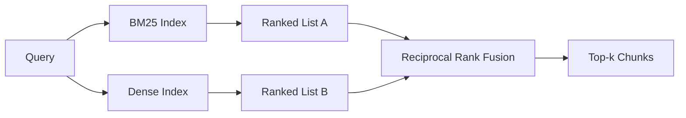

# Odzyskiwanie hybrydowe z BM25 i gęstym osadzeniem

> Wyszukiwanie leksykalne i semantyczne kończy się niepowodzeniem w przypadku przeciwnych rozkładów zapytań. Pobieranie hybrydowe z wzajemną fuzją rang nie interpoluje, lecz głosuje - a głos wygrywa w każdej klasie zapytań.

**Typ:** Kompilacja
**Języki:** Python
**Wymagania wstępne:** Faza 11, lekcje 04 (osadzenie), 06 (RAG); Faza 19 Podstawy ścieżki B (lekcje 20-29); Faza 19, lekcja 64 (strategie dzielenia)
**Czas:** ~90 minut

## Cele nauczania
- Zaimplementuj BM25 od podstaw na podstawie formuły Robertsona i Sparcka Jonesa, z ważeniem pól, normalizacją długości dokumentu i dostrajalnymi k1 i b.
- Zbuduj gęsty moduł pobierania na podstawie deterministycznego próbnego osadzania, aby pętla działała w trybie offline.
- Zastosuj wzajemną fuzję rang dokładnie w sposób, w jaki Cormack, Clarke i Buettcher opublikowali to w 2009 roku, i wyjaśnij, dlaczego dominuje ona w interpolacji ważonej punktacją.
- Dostrój stałą RRF k i wagi permodalności i odczytaj kompromisy na małym zbiorze urządzeń.

## Problem

Wyszukiwanie leksykalne wygrywa, gdy zapytanie zawiera dosłowny identyfikator, który korpus zawiera dosłownie. Zapytanie o `AbortMultipartOnFail` zwraca właściwą funkcję Go za pośrednictwem BM25 w mikrosekundach. To samo zapytanie, osadzone, znajduje się na granicy trzech klastrów podobieństwa, a gęsty moduł pobierania najpierw ocenia niewłaściwy plik.

Gęste wyszukiwanie wygrywa, gdy zapytanie jest parafrazowane w stosunku do dosłownych tokenów korpusu. Użytkownik pytający „jak sobie poradzimy z anulowaniem przesyłania” nigdy nie wpisał słowa przerwanie lub wieloczęściowe. BM25 zwraca fragment dokumentacji dotyczący „przesyłania dużych plików”, ponieważ ta strona zawiera słowo przesyłanie. Gęste pobieranie znajduje funkcję przerwania, której podsumowanie wspomina o anulowaniu.

Wybór pomiędzy nimi nie jest statyczny. Rozkład zapytań jest zmienną. Produkcyjny system RAG obsługuje obie klasy z tego samego punktu końcowego, więc pobieranie musi obsługiwać obie klasy jednocześnie. To jest pobieranie hybrydowe. Krok scalania to część, która musi być właściwa.

## Koncepcja



### BM25 w jednym akapicie

BM25 ocenia parę zapytanie-dokument poprzez zsumowanie, po terminach zapytania, odwrotnego współczynnika częstotliwości dokumentu pomnożonego przez nasycający współczynnik termin-częstotliwość, który obejmuje korekcję normalizacji długości. Dwa pokrętła. `k1` kontroluje nasycenie terminowo-częstotliwościowe; domyślna wersja 1.5 jest opublikowaną rekomendacją i nie należy jej przenosić bez testu porównawczego. `b` kontroluje, jak ważna jest długość dokumentu; domyślna wartość 0,75 oznacza, że ​​dłuższe dokumenty są karane, ale nie liniowo.

Formuła IDF wykorzystuje wygładzoną definicję Robertsona i Sparcka Jonesa, która ma postać `log((N - df + 0.5) / (df + 0.5) + 1)`. Plus jeden w dzienniku sprawia, że ​​IDF jest dodatni, gdy termin pojawia się w więcej niż połowie korpusu. Ma to znaczenie w małych korpusach, w których stopwordy są technicznie rzadkie.

Ważenie pola pozwala poinformować BM25, że dopasowanie nazwy symbolu liczy się bardziej niż dopasowanie w treści. Wdrożenie zwiększa liczbę terminów podczas indeksowania, a nie w momencie punktacji. Dzięki temu matematyka jest identyczna i pozwala uniknąć oddzielnego wyniku dla każdego pola.

### Gęste wyszukiwanie w jednym akapicie

Osadzaj każdy fragment w wektorze o stałym wymiarze z osadzanym modelem. W czasie wykonywania zapytania osadź zapytanie, uszereguj cosinus każdy fragment według podobieństwa i zwróć górne-k. Model jest zmienną decydującą o jakości. Sam algorytm wyszukiwania składa się z dwóch linii: iloczynu skalarnego i sortowania.

W tej lekcji zastosowano deterministyczne osadzanie oparte na skrótach, dzięki czemu można odczytać obliczenia fuzyjne bez połączenia sieciowego. Hash sumuje przesunięcia z kluczem tokenowym w 96-wymiarowym wektorze i normalizuje. Rangi cosinusa są deterministyczne w różnych seriach, czego wymaga zestaw testów.

### Fuzja rang wzajemnych, opublikowana formuła

Dwie listy rankingowe. Dla każdego kandydata, który pojawia się na którejkolwiek liście, zsumuj jego wzajemne wkłady. W artykule z 2009 roku zastosowano wartość domyślną `1 / (k + rank)` z k równym 60. Sortuj według całkowitego wyniku. To jest cały algorytm.

Opublikowana stała k = 60 nie jest przypadkowa. Przy k = 60 wkład rangi 1 wynosi 1/61, a wkład rangi 10 wynosi 1/70. Wkład maleje powoli, więc kandydaci z głębokim przekonaniem nadal głosują. Mniejsze k powoduje, że dominują najlepsze wyniki. Większe k spłaszcza krzywą wkładu.

W naszej realizacji dwa pokrętła przestrajalne. Stała `k`. Para odważników dla poszczególnych modalności, dzięki czemu możesz zwiększyć BM25 lub gęsty, jeśli masz wcześniejsze dowody, że jeden jest lepszy na twoim korpusie. Pomnożenie wkładu rangi przez wagę jest najprostszą realizacją zasad; zachowuje kształt zaniku rang i pozostaje wolny od łusek.

### Dlaczego fuzja przewyższa interpolację ważoną punktacją

Wyniki BM25 są nieograniczone i zależne od korpusu. Podobieństwa cosinus są ograniczone od -1 do 1. Kombinacja liniowa `alpha * bm25 + (1 - alpha) * cosine` wymaga strojenia alfa dla każdego korpusu i przerywa przy każdym ponownym indeksowaniu. Fuzja oparta na rangach nie. Dwie rangi są porównywalne pod względem modalności. Opublikowana wartość bazowa RRF przewyższa interpolację wyników w każdym publicznym ścieżce TREC od 2010 roku.

To ten sam argument, który słyszysz na temat RankFusion vs RRF w dokumentacji Vespa i Weaviate. Doszli do tego samego wniosku: pozostań w oparciu o rankingi, chyba że masz bardzo mocne dowody umożliwiające interpolację wyników.

## Zbuduj to

`code/main.py` implementuje:

- `tokenize(text)` – szybki tokenizator wyrażeń regularnych.
- `BM25Index` - ważone pola, z `add` i `search` oraz przestrajalnym k1, b.
- `mock_embed`, `DenseIndex` - to samo deterministyczne osadzanie jak w lekcji 64, więc fragmenty są porównywalne.
- `rrf(rankings, k, weights)` – opublikowana fuzja z wagami multimodalnymi.
- `HybridRetriever` – łączy w sobie BM25 i gęsty.
- Demo `main()`, które ładuje mały korpus urządzeń, uruchamia trzy zapytania sprawdzające siłę i słabość każdego aportera i drukuje rankingi wygenerowane przez każdą modalność wraz z połączoną listą.

Uruchom to:

```bash
python3 code/main.py
```

Przeczytaj wyniki demonstracji obok siebie. Zapytanie o dosłowny identyfikator trafia do BM25 o randze 1, gęstej o randze 4, RRF o randze 1. Sparafrazowane zapytanie trafia do BM25 o randze 6, gęstej rangi 1, RRF o randze 1. Niejednoznaczne zapytanie trafia do BM25 o randze 3, gęstej rangi 3, RRF o randze 1. Fuzja nie rozstrzyga remisu; jest to system, który wygrywa w każdej klasie zapytań.

## Strojenie pokręteł

| Pokrętło | Domyślne | Przesuń w górę, gdy | Przesuń go w dół, gdy |
|------|--------|----------------|--------------------------------|
| BM25 k1 | 1,5 | Terminy powtarzają się w dokumentach i chcesz, aby częstotliwość miała większe znaczenie | Dokumenty są krótkie, a ich powtarzanie to szum |
| BM25 b | 0,75 | Długie dokumenty naprawdę mówią mniej jednym słowem | Długość dokumentu nie jest powiązana z tematem |
| RRF k | 60 | Głęboko kandydaci powinni nadal głosować | Pierwsza 1 powinna dominować |
| Masa BM25 | 1,0 | Twój korpus zawiera dosłowne identyfikatory i zapytania do nich pasują | Twoje zapytania są parafrazowane przez użytkownika |
| Gęsta waga | 1,0 | Zapytania są parafrazowane | Zapytania są dosłowne |

Dostosuj, uruchamiając ponownie wiązkę eval z lekcji 68 na zatrzymanym zestawie zapytań, a nie intuicyjnie.

## Tryby awarii, które demo ukryje

**Tokeny poza słownikiem.** IDF BM25 jest obliczany na podstawie korpusu, więc tylko terminy w zapytaniu wnoszą zero. Gęste osadzenie wywołuje halucynacje wektora dla tego samego terminu. W przypadku identyfikatorów poza korpusem modalność gęsta zwraca wiarygodnie wyglądających, ale błędnych sąsiadów. Fuzja pochłania to, ponieważ BM25 nic nie zwraca, a wkład rangi spada, ale tylko wtedy, gdy deduplikujesz według dokumentu, a nie fragmentów.

**Dominacja żetonu stopu.** BM25 przeciwko słowu „the” daje jednolity ranking w korpusie. Filtruj tokeny zatrzymania w indeksatorze lub zaakceptuj naturalnie dominujące terminy o wysokim IDF.

**Identyczna zawartość w różnych modalnościach.** Jeśli Twój zbiór jest na tyle mały, że pierwsza pozycja w BM25 jest również pierwszą w kolejności gęstej, RRF daje Ci tę samą pierwszą pozycję z tymi samymi sąsiadami. Jest to prawidłowe zachowanie, a nie porażka, ale sprawia, że ​​fuzja wygląda na niewidoczną. Dodaj przeciwstawną parę zapytań do swojej ewaluacji, aby sprawdzić, czy fuzja rzeczywiście działa.

## Użyj tego

Wzory produkcyjne:

- Indeks BM25 w trakcie; wąskim gardłem jest słownik terminów-częstotliwości, a nie wektory.
- Indeksuj gęste wektory w osobnym magazynie (w tej lekcji używamy płaskiej listy; w produkcji użyłbyś HNSW).
- Uruchom oba zapytania równolegle; fuzja jest ciągłym połączeniem w ramach związku.
- Utrzymuj modalność każdego odzyskanego trafienia, aby osoba zajmująca się ponownym rankingiem mogła zobaczyć, która modalność na nie głosowała.

## Wyślij to

Lekcja 66 bierze połączone top-k z tej lekcji i zmienia rangę za pomocą kodera krzyżowego. Lekcja 68 ocenia cały rurociąg pod kątem precyzji, wycofania, MRR i nDCG. Hybrydowy retriever przedstawiony w tej lekcji jest pierwszym etapem kompleksowego systemu opisanego w lekcji 69.

## Ćwiczenia

1. Zastąp `mock_embed` prawdziwym modelem od swojego dostawcy. Uruchom ponownie demonstrację i zgłoś zmiany w rankingu dotyczącym tylko gęstego zapytania w przypadku sparafrazowanego zapytania.
2. Dodaj trzecią modalność: podsumowania fragmentów indeksowane oddzielnie i łączone w trzecią listę rankingową. Zmierz zysk.
3. Przeciągnij RRF k przez 10, 30, 60, 100, 200. Narysuj krzywą przypomnienia@k z lekcji 68. Podaj wartość k w miejscu, w którym krzywa osiąga szczyt w korpusie.
4. Zaimplementuj poprawnie BM25F (normalizacja długości pola, a nie sztuczka z mnożnikiem) i porównaj w korpusie, gdzie dopasowanie symboli ma największe znaczenie.

## Kluczowe terminy

| Termin | Co ludzie mówią | Co to właściwie oznacza |
|------|-----------------|--------------------------------------|
| BM25 | „Wyszukiwanie leksykalne” | Ranking probabilistyczny z idf x nasycającą tf x normalizacją długości |
| RRF | „Fuzja rang” | Suma 1 / (k + pozycja) z list rankingowych; k = 60 domyślnie |
| k1 | „Nasycenie TF” | Kontroluje, jak szybko powtarzany termin przestaje dodawać więcej punktów |
| b | „Kara za długość” | 0 oznacza ignorowanie długości dokumentu, 1 oznacza pełną normalizację |
| Ważenie pola | „Wzmocnienie symbolu” | Powtarzaj tokeny podczas indeksowania, aby zwiększyć dopasowanie w tym polu |
| Fuzja oparta na rankingach i wynikach | „Dlaczego RRF bije liniowość” | Rangi są porównywalne w różnych modalnościach; wyniki nie są |

## Dalsze czytanie

- Cormack, Clarke, Buettcher, „Reciprocal Rank Fusion przewyższa Condorcet i metody uczenia się według rang indywidualnych”, SIGIR 2009
- Robertson, Walker, Beaulieu, Gatford, Payne, „Okapi at TREC-3” (oryginalny artykuł BM25)
- [Vespa: pobieranie hybrydowe z BM25 i osadzaniem] (https://docs.vespa.ai/en/tutorials/hybrid-search.html)
- [Weaviate: Wyszukiwanie hybrydowe](https://weaviate.io/developers/weaviate/search/hybrid)
- Faza 11, lekcja 06 - Podstawy RAG
- Faza 19, lekcja 64 - chunkery, których dane wyjściowe są tutaj indeksowane
- Faza 19, lekcja 66 - narzędzie do zmiany rankingu kodera krzyżowego, które zużywa połączone top-k