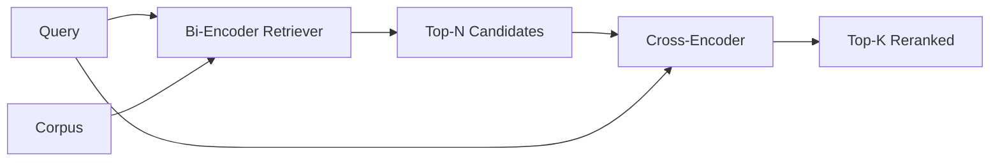

# Zmiana rankingu między koderami

> Dwuenkoder osadza zapytanie i dokument niezależnie. Koder krzyżowy łączy je i odczytuje oba na raz. Koder krzyżowy jest najmądrzejszym i najwolniejszym czytnikiem. Używany jako drugi stopień w top-k bi-enkodera, zwraca się sam.

**Typ:** Kompilacja
**Języki:** Python
**Wymagania wstępne:** Faza 11, lekcja 06 (RAG), Faza 11, lekcja 07 (zaawansowany RAG); Faza 19 Podstawy ścieżki B (lekcje 20-29); Faza 19, lekcja 65 (odzyskiwanie hybrydowe zasilające ten etap)
**Czas:** ~90 minut

## Cele nauczania
- Odróżnij moduł pobierania z dwoma koderami od narzędzia do zmiany rankingu z użyciem krzyżowego kodera na podstawie kształtu danych wejściowych, liczby parametrów i kosztu zapytania.
- Zaimplementuj od podstaw mały koder krzyżowy jako blok transformatora, który zużywa spakowaną sekwencję (zapytanie, dokument) i emituje pojedynczy skalar istotności.
- Podłącz dwuetapowy potok pobierania, a następnie zmiany rangi: odzyskaj górne N za pomocą taniego aportera, zmień rangę N na górne K za pomocą kodera krzyżowego, zwróć K.
- Zmierz kompromis między opóźnieniem a jakością na małym korpusie urządzeń i wybierz odpowiednie N dla danego budżetu opóźnień.

## Problem

Dwuenkoder mapuje zapytanie i dokument w tę samą przestrzeń wektorową i szereguje według cosinusa. Te dwa kodowania nigdy się nie widzą. Model musi skompresować wszystko, co przydatne w dokumencie, do jednego wektora, nie zwracając uwagi na zapytanie. Jest to szybkie rozwiązanie — jedno osadzanie na dokument w czasie indeksowania i jedno na zapytanie w czasie zapytania — i jest to jedyny sposób na ocenę w skali korpusu.

Kosztem jest precyzja. Dwa dokumenty o tym samym ogólnym temacie mogą mieć prawie identyczne osadzenie, nawet jeśli jeden z nich odpowiada na zapytanie, a drugi nie. Bi-enkoder nie jest w stanie ich rozróżnić.

Koder krzyżowy rozwiązuje ten problem, czytając jednocześnie zapytanie i dokument. Model otrzymuje `[query] [SEP] [document]` jako pojedynczą sekwencję, skupia całą uwagę na łączeniu i tworzy jeden skalar istotności. Każdy token dokumentu może obsługiwać każdy token zapytania. Model decyduje o wyniku w pełnym kontekście.

Kosztem jest przepustowość. Tam, gdzie dwukoder osadza raz i pyta w nieskończoność, koder krzyżowy działa raz na parę (zapytanie, dokument). W przypadku korpusu zawierającego 10 milionów dokumentów oznacza to 10 milionów przejść do przodu na zapytanie. Nie można uruchomić w budżecie żądań.

Rozwiązaniem jest inscenizacja. Użyj bi-enkodera, aby pobrać górne N. Użyj kodera krzyżowego, aby zmienić rangę N na górną K. N jest małe (50 do 200), a wzrost jakości cross-enkodera koncentruje się tam, gdzie ma to znaczenie. Całkowite opóźnienie pozostaje w budżecie żądań. Jakość całkowita to jakość cross-enkodera, ograniczona przez wycofanie bi-enkodera w N.

## Koncepcja



### Kształt wejściowy cross-enkodera

Standardowe opakowanie to `[CLS] query_tokens [SEP] document_tokens [SEP]`. Sygnał wyjściowy pozycji CLS jest podawany do pojedynczej głowicy liniowej, która generuje skalar istotności. Niektóre implementacje używają łączenia średnich zamiast CLS; różnica jest niewielka. Chodzi o to, że model generuje jedną liczbę na parę.

Typowym punktem produkcyjnym jest koder krzyżowy o parametrach 22M (opublikowana klasa wagowa `ms-marco-MiniLM-L-6-v2`). Mniejsze modele szybciej tracą jakość niż oszczędzają opóźnienia. Większe modele (np. `bge-reranker-v2-m3` przy parametrach 568M) są zarezerwowane do rerankingu offline lub do rerankingu na pierwszej stronie, gdzie K jest małe.

### Dlaczego ta lekcja uczy małego

Prawdziwy enkoder krzyżowy to precyzyjnie dostrojony transformator enkodera. W środowisku produkcyjnym ładujesz punkt kontrolny i uruchamiasz go. Celem tej lekcji jest pokazanie kształtu modelu i kształtu krzywej opóźnienia-jakości, a nie szkolenie najnowocześniejszego gracza rankingowego. Dlatego budujemy mały `nn.Module` z jednym blokiem transformatora, uwagą wielogłowicową (domyślnie 4 głowy) i jedną głową regresyjną. Jest inicjowany deterministycznie z nasion, więc demonstracja jest odtwarzalna bez ciężarów na dysku.

Model zabawki uczy się prawidłowego kształtu z korpusu urządzeń: odpowiednie pary zapytanie-dokument mają wyższe przewidywane wyniki niż pary nieistotne. Kompleksowy potok ponownie klasyfikuje dane wyjściowe dwuenkodera, a górne k zmiany rankingu koreluje ze złotymi etykietami.

### Opóźnienie a jakość

Dwuetapowy potok ma jeden przestrajalny: N. Przeciągnij N od 5 do 100 na wstrzymanym zestawie zapytań i otrzymasz krzywą.

| N | Przypomnij sobie@1 etap 2 | Przejścia do przodu między koderami na zapytanie | Opóźnienie |
|---|------|--------------------------------------|-------------|
| 5 | 0,62 | 5 | niski |
| 20 | 0,81 | 20 | średni |
| 50 | 0,86 | 50 | wysoki |
| 100 | 0,86 | 100 | bardzo wysoki |

Powyższe liczby ilustrują kształt, a nie wymiary tego urządzenia. Kształt jest prawdziwy. Zawsze jest kolano około 20 do 50 kandydatów, w którym następuje nasycenie wzrostu rerankingu. Za kolano płacisz za nic.

Wybierz N z krzywej eval plus budżet opóźnienia. Koder krzyżowy nie może podnieść poziomu przywołania powyżej przywołania bi-enkodera w N, więc jakość jest niska N, a nie tylko opóźnienie.

## Zbuduj to

`code/main.py` implementuje:

- `CrossEncoder` - mały `torch.nn.Module`: osadzanie tokenów, jeden blok transformatora z uwagą wielogłowicową i sprzężeniem zwrotnym, głowicą ze średnią pulą wytwarzającą jeden skalar.
- `tokenize_pair(query, document)` – pakuje dwa ciągi znaków w jedną sekwencję identyfikatorów z identyfikatorami typów wyznaczającymi granicę, deterministycznymi i stdlib.
- `train_tiny(pairs)` – jedno przejście nadzorowanego szkolenia na ręcznie oznaczonej potrójnej liście (zapytanie, dokument, trafność), dzięki czemu model generuje rozsądne wyniki na urządzeniu.
- `rerank(query, candidates, top_k)` – interfejs produkcyjny.
- `pipeline(query, retriever, top_n, top_k)` - przepływ dwuetapowy.
- Demo `main()`, które ładuje korpus z wzorca z lekcji 65, pobiera górne N, zmienia rangę do górnego K, drukuje obie listy obok siebie i raportuje opóźnienie każdego etapu.

Uruchom to:

```bash
python3 code/main.py
```

Dane wyjściowe pokazują górne N bi-enkodera, górne K cross-enkodera oraz podsumowanie taktowania. Koder krzyżowy trwa dłużej na połączenie, ale nie działa w pełnym korpusie. Suma dwuetapowa mieści się w budżecie żądań, wybierając odpowiedź, że bi-enkoder zajął drugie lub trzecie miejsce.

## Tryby awarii, które demo ukryje

**Kodownik krzyżowy nie jest symetryczny.** `rerank(q, d)` i `rerank(d, q)` to różne wyniki. Zawsze najpierw podaj zapytanie. Jeśli przypadkowo dokonasz zamiany, przywołanie załamie się.

**N jest zbyt niskie, aby ujawnić błąd.** Jeśli ustawisz N = K, koder krzyżowy nie będzie mógł zmienić kolejności; może jedynie ponownie nabrać wagi. Winda wygląda na zero. Wybierz N co najmniej trzy razy K.

**Dane szkoleniowe wyciekają do eval.** Jeśli ręcznie oznaczone pary treningowe zawierają zapytania eval, zmiana rangi wygląda magicznie. Ściśle oddzielaj pociąg od eval, nawet na urządzeniu.

**Wagi produkcyjne są gęste.** Koder krzyżowy o parametrach 22M zajmuje 88MB w float32. Zaplanuj pamięć modelu serwera przed obietnicą poniżej 100 ms p95.

**Działanie wsadowe ma znaczenie.** Prawdziwy cross-enkoder uruchamia N kandydatów w jednej partii. Ta lekcja robi to w `_batch_encode`, który buduje wsadowe tensory identyfikatora i identyfikatora typu za pomocą `torch.tensor(...)` i uruchamia jedno przejście w przód. Pomiń przetwarzanie wsadowe, a opóźnienie zostanie pomnożone przez N.

## Użyj tego

Wzory produkcyjne:

- Połącz ze sobą bi-enkoder, cross-enkoder i N. Zmiana któregokolwiek powoduje unieważnienie eval.
- Buforuj wyniki rerankera za pomocą skrótu (query, document_id). To samo zapytanie dotyczące stabilnego korpusu zostaje przeklasyfikowane do tej samej kolejności; trafienia w pamięci podręcznej zapewniają bezpłatną redukcję opóźnień.
- Zapisz wynik cross-enkodera rangi 1. Zapytanie, którego wynik na pierwszym miejscu jest niższy niż próg specyficzny dla korpusu, jest trafieniem poza domenę; wyjawić to LLM jako „nie jestem pewien”.

## Wyślij to

Lekcja 68 ocenia ten dwuetapowy rurociąg od końca do końca. Lekcja 69 łączy tego rerankera za hybrydowym retrieverem z lekcji 65 i przed generatorem odpowiedzi. Reranker to drugi etap kompleksowego systemu.

## Ćwiczenia

1. Przeciągnij N od 5 do 50 i wykreśl przywołanie @ 1 ponownie sklasyfikowanego wyniku. Znajdź kolano na tym urządzeniu.
2. Trenuj koder krzyżowy przez dziesięć epok zamiast jednej. Zmierz margines wyniku pomiędzy parami dodatnimi i ujemnymi w każdej epoce.
3. Zamień średnie łączenie na głowę tokena CLS. Porównaj zbieżność na tym urządzeniu.
4. Dodaj drugą głowicę cross-enkodera, która przewiduje binarną etykietę „czy ta odpowiedź jest w dokumencie”. Podczas wnioskowania użyj obu głów; jeden do rangi, drugi do progu.
5. Zamień deterministyczny próbny bi-enkoder na ten z lekcji 65 i połącz oba etapy w łańcuch. Zmierz zmianę w górnym K w porównaniu z samym bi-enkoderem.

## Kluczowe terminy

| Termin | Co ludzie mówią | Co to właściwie oznacza |
|------|-----------------|--------------------------------------|
| Bi-enkoder | „Aporter wektorowy” | Niezależnie koduje zapytanie i dokument; cosinus szereguje je |
| Koder krzyżowy | „Reranker” | Koduje (zapytanie, dokument) wspólnie; wyprowadza jeden skalar istotności |
| Gazociąg dwustopniowy | „Odzyskaj i zmień rangę” | Tani retriever zwraca N, drogi reranker zatrzymuje K |
| N (budżet kandydata) | „Ponowna ocena puli” | Liczba kandydatów, które cross-enkoder ocenia na zapytanie |
| Głowa łącząca średnie | „Średnia z ostatniego ukrytego” | Uśrednij dane wyjściowe ostatniej warstwy kodera w jeden wektor |

## Dalsze czytanie

– Nogueira, Cho, „Passage Re-ranking with BERT”, 2019 – kanoniczny artykuł rankingowy dla różnych koderów
– Reimers, Gurevych, „Sentence-BERT: Sentence Embeddings using Siamese BERT-Networks”, 2019 – na temat bi-enkoderów i cross-enkoderów
- [Dokumentacja SentenceTransformers Cross-Encoders] (https://www.sbert.net/examples/applications/cross-encoder/README.html)
- [Karta modelu BGE Reranker v2](https://huggingface.co/BAAI/bge-reranker-v2-m3)
- Faza 19, lekcja 65 - hybrydowy retriever karmiący ten etap zmiany rangi
- Faza 19, lekcja 68 - ewaluacja mierząca wzrost, jaki zapewnia ta zmiana rangi