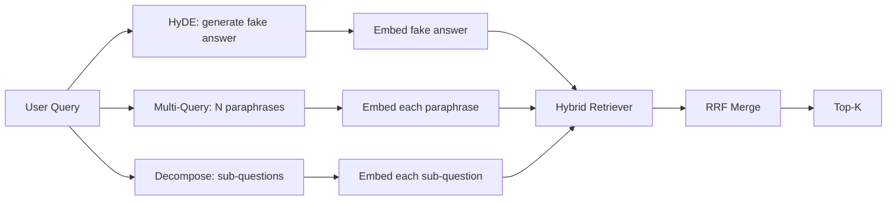

# Przepisywanie zapytań: HyDE, wiele zapytań i dekompozycja

> Zapytanie wpisywane przez użytkownika nie jest tym, którego chce Twój pies. Przepisanie wypełnia lukę przed pobraniem, więc indeks widzi coś bliższego temu, jak wygląda odpowiedź.

**Typ:** Kompilacja
**Języki:** Python
**Wymagania wstępne:** Faza 11, lekcje 04 (osadzenie), 06 (RAG); Faza 19 Podstawy ścieżki B (lekcje 20-29); Faza 19, lekcje 64 i 65
**Czas:** ~90 minut

## Cele nauczania
- Zaimplementuj hipotetyczne osadzanie dokumentów (HyDE): wygeneruj fałszywą odpowiedź, osadź ją, pobierz względem tego wektora zamiast wektora zapytania.
- Zaimplementuj ekspansję wielu zapytań: przepisz jedno zapytanie na N parafraz, odzyskaj każdą z nich, połącz unię poprzez wzajemną fuzję rang.
- Zaimplementuj dekompozycję zapytań: podziel złożone pytanie na pytania podrzędne, pobierz według pytania podrzędnego, połącz.
- Porównaj trzech redaktorów bezpośrednio podczas jednego spotkania i wyjaśnij, kiedy każda strategia wygrywa.
- Podłącz próbny LLM, który generuje deterministyczne dane wyjściowe na urządzeniu, tak aby pętla nagrywająca działała w trybie offline.

## Problem

Użytkownik wpisuje „co robi nasz zespół, gdy przesyłanie nie powiedzie się i budżet się skończy?”. Korpus zawiera dokument z informacją: „AbortMultipartOnFail przerywa przesyłanie wieloczęściowe S3 w locie i zmniejsza budżet ponownych prób na każdy zasobnik, gdy przesyłanie nie powiedzie się”. Zapytanie i dokument nie mają wspólnego wyrażenia rzeczownikowego. BM25 chybia. Bi-enkoder plasuje dokument na trzeciej lub czwartej pozycji, ponieważ wektor zapytania trafia do obszaru przestrzeni osadzania, który preferuje dokument dotyczący anulowanych zadań, a nie dokument dotyczący przerwanego przesyłania. Dwuetapowa reranking z lekcji 66 może uratować odpowiedź, jeśli znajduje się ona w górnym N, ale jeśli nawet nie dotrze do górnego N, osoba dokonująca rerankingu nigdy jej nie zobaczy.

Rozwiązanie polega na przepisaniu zapytania, zanim dotknie ono obiektu retriever. W artykule z 2023 r. „Precise Zero-Shot Dense Retrieval Without Relevance Labels” (Gao i in.) wprowadzono HyDE: poproś LLM o napisanie dokumentu, który odpowiedziałby na zapytanie, osadź ten hipotetyczny dokument i użyj jego osadzania jako wektora wyszukiwania. Hipotetyczny dokument znajduje się w prawym obszarze przestrzeni osadzania, ponieważ jest napisany głosem korpusu. Wektor zapytania nie.

Dwie techniki kuzynów łączą się z HyDE. Ekspansja wielu zapytań (używany termin GraphRAG firmy Microsoft) generuje N parafraz zapytania i pobiera każdą z nich, a następnie łączy. Dekompozycja (spopularyzowana jako „dekompozycja podzapytań” w pracy Stanford DSPy z 2024 r.) dzieli „co robi nasz zespół, gdy przesyłanie nie powiedzie się i budżet się skończy” na dwa pytania: „co się stanie, jeśli przesyłanie się nie powiedzie” i „co się stanie, gdy budżet na ponowne próby przepadnie”. Dwa wyszukiwania, jeden połączony wynik, obie części odpowiedzi osiągalne.

W tej lekcji zaimplementowano wszystkie trzy i porównano je z tym samym zestawem urządzeń.

## Koncepcja



### HyDE szczegółowo

HyDE zastępuje wektor zapytania użytkownika hipotetycznym wektorem dokumentu napisanym przez LLM. Podpowiedź jest krótka:

```
You are a domain expert. Write a one-paragraph passage that answers the question
below. Use the same vocabulary and phrasing the documentation in this domain would
use. Do not refuse. Do not say you do not know.

Question: {user_query}

Passage:
```

Odpowiedź LLM jest błędna jako odpowiedź oparta na faktach, ponieważ LLM nie zna twojego korpusu. To w porządku. Retrieverowi nie zależy na poprawności merytorycznej, tylko na dystrybucji tokenów. Hipotetyczny fragment zawiera słowa „przerwanie”, „wieloczęściowy”, „wiadro”, „budżet”, ponieważ tak właśnie brzmiałby fragment dokumentacji na ten temat. Osadź ten fragment. Wektor ląduje w pobliżu prawdziwego przejścia.

Na etapie produkcyjnym ograniczasz hipotetyczny dokument do dwóch lub trzech zdań. Dłuższe hipotezy zbierają więcej szumu. Krótsze tracą sygnał leksykalny, którego potrzebuje HyDE.

### Szczegóły rozwijania wielu zapytań

Wygeneruj N parafraz zapytania użytkownika. Najprostszy monit:

```
Rewrite the following question in {N} different ways. Each rewrite must preserve
the original intent. Number them 1 to {N}. Do not add explanations.
```

Pobierz top-k dla każdej parafrazy. Połącz listy rankingowe N z RRF (ten sam algorytm z lekcji 65). Tani, równoległy, deterministyczny.

Wielozapytanie wygrywa, gdy sformułowanie użytkownika jest jednym z wielu równie prawidłowych sposobów zadania pytania, a każdy z przepisanych pytań zadałby je lepiej. Przegrywa, gdy wszystkie przeróbki są równie złe, ponieważ oryginał był zły w ten sam sposób.

### Szczegółowy rozkład

Pojedyncze wyszukiwanie nie może odpowiedzieć na wieloaspektowe pytanie. Dekompozycja prosi LLM o podzielenie pytania na pytania podrzędne, a system pobiera każde pytanie podrzędne. Podpowiedź:

```
The following question may require information from multiple distinct topics.
Decompose it into a list of sub-questions. Each sub-question must be answerable
independently. If the question is already atomic, return it unchanged.

Question: {user_query}
```

Pobierz według pytania podrzędnego. Łączyć. Dekompozycja jest właściwym narzędziem w przypadku pytań zawierających spójniki, porównania wieloklauzulowe lub dwa niezwiązane ze sobą tematy. Złe narzędzie do pytań atomowych; zadaniem rozkładającego jest zwrócenie pojedynczego pytania, a nie wymyślanie fałszywych pytań podrzędnych.

### Dlaczego wszystkie trzy istnieją

Te trzy uzupełniają się. HyDE wypełnia lukę w tokenach korpusu zapytań. Wiele zapytań obejmuje wariancję parafrazy. Dekompozycja obejmuje zapytania wielotematyczne. System produkcyjny uruchamia wszystkie trzy i wybiera strategię na każde zapytanie (kompleksowy system z lekcji 69 pokazuje selektor).

## Próbny LLM

Lekcja odbywa się w trybie offline. Próbna LLM to mała tabela przeglądowa oparta na zapytaniu użytkownika, plus rezerwa dla zapytań, których nie widział. Tabela przeglądowa zawiera:

- Dla każdego zapytania o urządzenie: pisemny hipotetyczny fragment, trzy parafrazy i rozkład.
- W przypadku nieznanego zapytania: transformacja deterministyczna: weź słowa z treści zapytania, rozwiń je poprzez mapę synonimów i zwróć wynik.

Liczy się kształt makiety, a nie dane. Na etapie produkcyjnym zamieniasz makietę na prawdziwe wywołanie modelu. Retriever się nie zmienia.

## Zbuduj to

`code/main.py` implementuje:

- `MockLLM` – deterministyczne zastępstwo opisane powyżej.
- `HyDERewriter` — wywołuje LLM w celu napisania hipotetycznego dokumentu, zwraca wynik programu przepisywania jako `RewriteResult` z hipotetycznym tekstem i zapytaniem, którego powinien użyć moduł pobierający.
- `MultiQueryRewriter` - wywołuje LLM dla N parafraz, zwraca listę zapytań.
- `DecomposeRewriter` - wywołuje LLM do dekompozycji, zwraca pytania podrzędne.
- `retrieve_with_rewriter` - pobiera moduł zapisujący i moduł pobierający, wykonuje przepisywanie, łączy wyniki.
- Wersja demonstracyjna uruchamiająca trzy programy nagrywające na urządzeniu i wyświetlająca, która strategia jako pierwsza zwróciła złoty dokument odpowiedzi.

Kształt retrievera został ponownie wykorzystany z lekcji 65 (hybryda BM25 + gęsta). Fuzja to ten sam RRF. Jedynym nowym kształtem jest interfejs nagrywający, który jest niewielki.

Uruchom to:

```bash
python3 code/main.py
```

Wynikiem jest ranking według strategii i końcowe podsumowanie. HyDE wygrywa w przypadku zapytania z niedopasowaniem fraz. W zapytaniu z parafrazą i wariancją wygrywa wiele zapytań. Dekompozycja wygrywa w zapytaniu wielotematycznym. Rezerwa (bez przepisywania) przegrywa na co najmniej jednym z trzech.

## Tryby awarii, które demo ukryje

**HyDE ma halucynacje dotyczące błędnych identyfikatorów specyficznych dla korpusu.** Model wymyśla nazwę funkcji. Wynik hipotetycznego BM25 w prawym dokumencie załamuje się, ponieważ wymyślona nazwa jest teraz znacznikiem o dużej wadze, który nie pojawia się w indeksie. Ogranicz hipotetyczną długość i wagę BM25 niżej w fuzji.

**Przepisanie wielu zapytań powoduje zbieżność.** Słaby model daje trzy niemal identyczne parafrazy. N operacji zwraca ten sam top-k. Połączenie RRF nie jest lepsze niż pojedyncze pobranie. Dodaj wyraźną instrukcję różnorodności do monitu o przepisanie i wykryj duplikaty autorstwa Jaccarda.

**Dekompozycja powoduje nadmierne podziały.** Dekompozyt zamienia pytanie atomowe w listę. Wszystkie wyszukiwania zwracają ten sam dokument, ale o obniżonej randze. Połączenie jest gorsze od oryginału. Wykryj to za pomocą pytania „czy te pytania podrzędne są wystarczająco różne” przed rozwinięciem.

**Opóźnienie się zwiększa.** HyDE kosztuje jedno połączenie LLM. Wielozapytanie kosztuje jedno wywołanie LLM w celu wygenerowania N przepisań, a następnie N pobrań. Rozłożenie kosztuje jedno wywołanie LLM, a następnie M pobrań. Wyszukiwania przebiegają równolegle; rozmowa LLM to podłoga.

## Użyj tego

Wzory produkcyjne:

- Wybór strategii na zapytanie według długości zapytania: krótkie zapytania atomowe otrzymują wiele zapytań, złożone zapytania zawierające wiele klauzul otrzymują dekompozycję, zapytania z dużą ilością żargonu otrzymują HyDE.
- Buforuj dane wyjściowe programu Rewriter za pomocą skrótu zapytania. Wiele zapytań się powtarza.
- Uruchom wszystkie trzy równolegle i połącz trzy zestawy wyników w jeden za pomocą RRF. Koszt to trzy połączenia LLM i jedna fuzja; jakość jest sumą zasięgu wszystkich trzech strategii.

## Wyślij to

Lekcja 69 przedstawia ten etap przepisywania przed aporterem z lekcji 65 i osobą dokonującą zmiany rankingu z lekcji 66. Lekcja 68 ocenia siłę, jaką przepisujący dodaje do przypominania sobie aportowania.

## Ćwiczenia

1. Zaimplementuj RAG-Fusion (wariant wielu zapytań z 2024 r.), w którym parafrazy autora są celowo zróżnicowane, a następnie krok zmiany rankingu (lekcja 66) wybiera ostateczną listę.
2. Dodaj czwartą strategię: podpowiadanie o cofnięciu się (zapytaj LLM o bardziej ogólne pytanie, przypomnij sobie, a następnie zawęź). Porównaj na urządzeniu.
3. Wytrenuj moduł dekompozycji w zakresie rozpoznawania zapytań atomowych, dodając nagłówek „czy pytanie jest atomowy”. Zmierz współczynnik nadmiernego podziału przed i po.
4. Zamień próbne LLM na prawdziwe wywołanie modelu. Zmierz opóźnienie na strategię na swoim stosie.
5. Dodaj poziom pewności przy każdym przepisaniu. Upuść przepisywanie poniżej progu. Zmierz wpływ na wycofanie.

## Kluczowe terminy

| Termin | Co ludzie mówią | Co to właściwie oznacza |
|------|-----------------|--------------------------------------|
| HYD | „Odzyskiwanie fałszywych dokumentów” | LLM pisze odpowiedź; osadzaj i pobieraj na tym zamiast zapytania |
| Wiele zapytań | „Rozwinięcie parafrazy” | N przepisuje zapytanie; pobierz N razy, połącz przez RRF |
| Rozkład | „Podział podzapytania” | Zapytania wielotematyczne podzielone na pytania podrzędne, pobierane osobno |
| Zapytanie atomowe | „Jednotematyczny” | Nie da się tego rozłożyć bez wymyślenia fałszywych pytań pobocznych |
| Krok w tył | „Streszczenie zapytania” | Zadaj bardziej ogólne pytanie, pobierz, a następnie zawęź |

## Dalsze czytanie

– Gao, Ma, Lin, Callan, „Precyzyjne, gęste wyszukiwanie zerowe bez etykiet trafności” (HyDE), 2023
— Badania firmy Microsoft, „Rozszerzenie wielu zapytań w celu pobierania”
— Stanford DSPy, „Dekompozycja podzapytań dla kontroli jakości metodą wielu przeskoków”
- [Dokumentacja przekształceń zapytań LlamaIndex](https://docs.llamaindex.ai/en/stable/optimizing/advanced_retrieval/query_transformations/)
- Faza 11, lekcja 07 - zaawansowane wzorce RAG
- Faza 19, lekcja 65 - retriever, którego karmi ten pisarz
- Faza 19, lekcja 68 - ewaluacja mierząca siłę piszącą