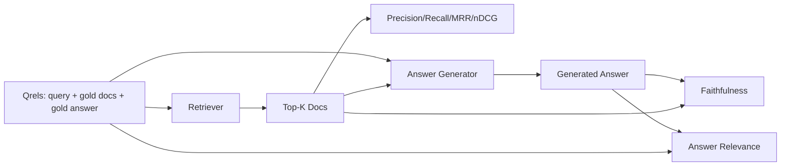

# Ocena RAG: precyzja, przypomnienie, MRR, nDCG, wierność, trafność odpowiedzi

> Jeśli nie możesz jednocześnie ocenić swojego wyszukiwania i odpowiedzi, nie możesz wysłać systemu. Nie są to te same metryki i ten sam monit nie działa na różnych osiach.

**Typ:** Kompilacja
**Języki:** Python
**Wymagania wstępne:** Faza 11 lekcji 06 (RAG), 10 (ocena); Faza 19 Podstawy ścieżki B (lekcje 20-29); Faza 19, lekcje 64, 65, 66, 67
**Czas:** ~90 minut

## Cele nauczania
- Oblicz cztery metryki wyszukiwania ze złotych qrels: precyzja@k, przypominanie@k, MRR (średnia ranga wzajemna) i nDCG@k.
- Oblicz dwa wskaźniki oceny odpowiedzi: wierność (każde twierdzenie oparte na odzyskanym kontekście) i trafność odpowiedzi (odpowiedź dotyczy pytania).
- Zbuduj plik qrels urządzenia (zapytania, identyfikatory złotych dokumentów, złoty tekst odpowiedzi), który eval będzie czytać od końca do końca.
- Przeczytaj wartości metryki, aby zdiagnozować, gdzie zawodzi potok: pobieranie, ranking, generowanie lub uziemianie.

## Problem

System RAG składa się z co najmniej czterech ruchomych części: chunkera, retrievera, rerankera i generatora. Każdy z nich może być przyczyną błędnej odpowiedzi. Bez wskaźników poszczególnych etapów lecisz na ślepo.

Użytkownik zgłasza błędną odpowiedź. Czy to dlatego, że chunker zmniejszył zakres odpowiedzi? Czy dzieje się tak dlatego, że retriever nie umieścił kawałka w top-k? Czy dzieje się tak dlatego, że osoba zajmująca się rerankingiem przesunęła właściwy fragment poza pozycję pierwszą? Czy dzieje się tak dlatego, że generator zignorował fragment i coś wymyślił? Nie można tego stwierdzić na podstawie samej odpowiedzi. Potrzebujesz:

- Metryki pobierania umożliwiające ocenę tego, co wyszło z retrievera.
- Ranking metryk w celu oceny, gdzie w kolejności znajdował się właściwy fragment.
- Wierność ocenie, czy generator pozostał w pobranym kontekście.
- Odpowiedź ma związek z oceną, czy odpowiedź w ogóle odnosi się do pytania.

W tej lekcji wszystkie sześć elementów zostanie zbudowane na pliku qrels urządzenia. Ocena jest offline i deterministyczna; w produkcji zamieniasz fałszywego LLM-jako-sędziego na prawdziwego.

## Koncepcja



### Precyzja@k

Jaka część z najważniejszych dokumentów, które zwrócił retriever, znajduje się w złotym zestawie? Jeśli złoto ma trzy dokumenty, a pierwsza trójka zwraca dwa z nich i jeden błędny, precyzja@3 wynosi 2/3. Użyj precyzji, gdy koszt nieistotnego odzyskanego fragmentu jest wysoki (generator marnuje na nim żetony lub fragment zatruwa odpowiedź).

### Przypomnij@k

Jaka część złotych dokumentów znajduje się w górnym k? Jeśli złoto ma trzy dokumenty, a pierwsza piątka zawiera wszystkie trzy, wartość przypomnienia@5 wynosi 1,0. Użyj przywołania, gdy koszt pominiętej odpowiedzi jest wysoki (wolisz zobaczyć jeden dodatkowy błędny fragment, niż całkowicie pominąć fragment odpowiedzi).

W produkcyjnym RAG metryka, którą ludzie zwykle podają, to przypomnieć@k. Generacja może łatwo upuścić nieistotne fragmenty; nie może wymyślić odpowiedzi na podstawie kawałka, którego nigdy nie widział.

### MRR (średnia ranga wzajemna)

Dla każdego zapytania znajdź pozycję pierwszego odpowiedniego dokumentu na liście rankingowej. Wzajemna ranga wynosi 1 / pozycja. Średnia w zestawie zapytań. MRR to jednoliczbowe podsumowanie tego, jak dobrze retriever umieszcza najlepszą odpowiedź na górze.

MRR mocno przypisuje pozycję 1. Zapytanie, w którym złoty dokument ma rangę 1, daje 1,0. Stopień 2 wnosi 0,5. Ranga 10 wnosi 0,1. Wskaźnik jest zdominowany przez górę listy.

### nDCG@k

Znormalizowany zdyskontowany skumulowany zysk. Pełna formuła przypisuje zysk każdemu odzyskanemu dokumentowi (często 1 dla istotnego, 0 dla nie), rabaty na podstawie dziennika pozycji, sumy i dzieli przez idealny DCG (DCG, który miałbyś, gdybyś uzyskał doskonałą pozycję w rankingu). Zakres od 0 do 1.

nDCG uwzględnia stopniowaną trafność: złoty może powiedzieć „doc A to 3, dokument B to 2, dokument C to 1”. MRR i przypomnieć@k spłaszczają wszystko do postaci binarnej. Użyj nDCG, jeśli korpus zawiera wiele częściowo istotnych dokumentów na zapytanie.

### Wierność

Dla każdego roszczenia w wygenerowanej odpowiedzi sprawdź, czy żądanie jest obsługiwane przez pobrany kontekst. Standardowa implementacja wykorzystuje zachętę LLM-as-sędziego, która pobiera (twierdzenie, kontekst) i zwraca tak lub nie. Metryka to ułamek oświadczeń, które zostały zaliczone.

Wierność wychwytuje tryb awarii generatora, w którym model wymyśla treść. Nawet jeśli retriever zwrócił właściwe kawałki, generator wywołujący halucynacje jest uszkodzony. Wierność nazywana jest także uziemieniem, wsparciem, atrybucją.

W tej lekcji zaimplementowano wierność za pomocą deterministycznego próbnego sędziego, który sprawdza, czy tokeny każdego roszczenia nakładają się na pobrany kontekst w pewnym stopniu. W produkcji przełączasz się na prawdziwe wywołanie modelu. Kształt metryki jest taki sam.

### Trafność odpowiedzi

Czy odpowiedź rzeczywiście odpowiada na pytanie? Wierność pyta: „Czy odpowiedź jest osadzona w kontekście?”. Trafność odpowiedzi polega na pytaniu „czy odpowiedź opiera się na pytaniu?”. Wierna, ale nie na temat odpowiedź ma wysoką ocenę wierności i niską przydatność. Krótka odpowiedź na temat, która ignoruje kontekst, ma wysoką ocenę trafności i niską wierność.

Standardowa implementacja wykorzystuje również LLM-as-sędzia: weź (pytanie, odpowiedź) i zapytaj, czy odpowiedź dotyczy pytania. Ta lekcja dotyczy symbolicznego nakładania się plus zastępowania sędziego.

## Urządzenie qrels

```python
{
  "qid": "q1",
  "query": "what is the abort threshold for multipart uploads",
  "gold_doc_ids": ["d1", "d3"],
  "gold_answer_substring": "three failed parts",
  "graded_relevance": {"d1": 3, "d3": 2},
}
```

Każde zapytanie niesie ze sobą:
- ciąg zapytania,
- zestaw identyfikatorów złotych dokumentów (dla precyzji / wycofania / MRR),
- dykt stopniowanej trafności (dla nDCG),
- złoty podciąg odpowiedzi (przechowywany jako metadane referencyjne dla każdego qrel; wierność w tej lekcji jest obliczana poprzez ocenę wyodrębnionych twierdzeń w odniesieniu do odzyskanego kontekstu, a nie tego podciągu).

W produkcji oznaczasz je. Ta lekcja zawiera ręcznie zbudowane urządzenie, więc eval nie działa od razu po wyjęciu z pudełka.

## Zbuduj to

`code/main.py` implementuje:

- `precision_at_k(retrieved, gold, k)` – dosłowna definicja.
- `recall_at_k(retrieved, gold, k)` – dosłowna definicja.
- `mean_reciprocal_rank(retrieved_list_of_lists, gold_list)` – średnia z zapytań.
- `ndcg_at_k(retrieved, graded_relevance, k)` – DCG / IDCG z zyskiem binarnym lub stopniowanym.
- `extract_claims(answer)` – dzieli odpowiedź na twierdzenia w formie zdań.
- `faithfulness(claims, context_texts, judge)` – część roszczeń uznanych za uzasadnione.
- `answer_relevance(question, answer, judge)` – oceń, czy odpowiedź dotyczy pytania.
- `MockJudge` - deterministyczny sędzia nakładania się tokenów, więc ewaluacja działa w trybie offline.
- `evaluate_pipeline(pipeline_fn, qrels, ks)` — koordynator obsługujący wszystkie metryki.
- Demo, które uruchamia trzy warianty potoków (linia bazowa fragmentacji, pobieranie hybrydowe, hybryda + reranking) względem qrels i drukuje tabelę metryk.

Uruchom to:

```bash
python3 code/main.py
```

Dane wyjściowe pokazują precyzję @ k, wycofanie @ k, MRR, nDCG @ k, wierność i trafność odpowiedzi dla każdego wariantu w pojedynczej tabeli metryk. Wiersz pobierania hybrydowego po przywołaniu przewyższa linię bazową chunkera; wiersz zmiany rankingu pokonuje hybrydę na MRR.

## Odczytywanie metryk w celu diagnozowania awarii

| Objaw | Prawdopodobna przyczyna | Co naprawić |
|------------|------------|------------|
| Niska pamięć @ k, niska precyzja @ k | Chunker przeciął odpowiedź lub retriever nie może jej znaleźć | Granice Chunkera (lekcja 64) lub modalność retrievera (lekcja 65) |
| Przyzwoite wycofanie @ k, niski MRR | Prawy fragment znajduje się w górnym k, ale nie na pozycji 1 | Reranker (lekcja 66) |
| Wysokie MRR, niska wierność | Generator wymyśla treść pomimo odpowiedniego kontekstu | Monit o generowanie; zmuś-cytuj-albo-odmów |
| Wysoka wierność, niska trafność | Odpowiedź jest uzasadniona, ale nie na temat | Przepisywanie zapytań (lekcja 67) lub zachęta do generowania |
| Wszystkie cztery wysokie, użytkownicy wciąż narzekają | Zbiór eval jest niereprezentatywny | Rozwiń qrels o prawdziwe zapytania użytkowników |

## Tryby awarii, które demo ukryje

**LLM-stronniczość oceniająca.** Model ocenia swoje własne wyniki jako wierniejsze niż w rzeczywistości. Użyj innej rodziny modeli dla oceny niż generator lub ręcznie oceń próbkę.

**Qrels gniją.** Złote odpowiedzi dryfują wraz ze zmianami korpusu. Dokument, który w styczniu 2024 r. zdobył złoty medal za pierwszy kwartał, nie jest już właściwą odpowiedzią w październiku 2024 r., ponieważ zespół zmienił nazwę tej funkcji. Zaplanuj kwartalny przegląd Qrels.

**Mikrokontrole wierności nie uwzględniają makrotwierdzeń.** Wierność w poszczególnych zdaniach może zostać pominięta, podczas gdy ogólna struktura odpowiedzi wprowadza w błąd. Oprócz zautomatyzowanego wskaźnika dodaj ocenę jakościową na poziomie próbki.

**Recall@k maskuje błędy poszczególnych zapytań.** Średnie przywołanie na poziomie 90% może ukryć to, że jedna klasa zapytania zawsze pomija. Podziel qrels według klasy zapytania (dosłowne, sparafrazowane, wielotematyczne) i zgłoś każdy kawałek.

## Użyj tego

Wzory produkcyjne:

- Uruchom ewaluację przy każdej zmianie retrievera lub generatora. Traktuj regresję przypomnienia@k jak niepowodzenie testu.
- Utrzymuj ślad metryki na zapytanie. Gdy użytkownik złoży skargę, sprawdź pasujący wpis qrels i sprawdź, czy zostałby wyłapany.
- Poziomowanie qrels: zestaw 20 zapytań uruchamianych w CI; zestaw regresji składający się z 200, który jest uruchamiany co noc; głęboki zestaw 2000, który działa co tydzień.

## Wyślij to

Lekcja 69 łączy cały potok (chunker, moduł pobierania, moduł rerankingu, generator) i przeprowadza tę ocenę w odniesieniu do kompleksowego systemu.

## Ćwiczenia

1. Dodaj piątą metrykę pobierania: hit-rate@k. Porównaj to z przypomnieniem@k. Wyjaśnij, kiedy się różnią.
2. Zastosuj stopniowaną wierność: 0 (nieobsługiwana), 1 (częściowo obsługiwana), 2 (w pełni obsługiwana). Zaktualizuj odpowiednio metrykę.
3. Zastąp pozorowanego sędziego prawdziwym wezwaniem modelki. Zmierz różnicę między próbą a prawdziwym sędzią na urządzeniu.
4. Dodaj wycinek klasy zapytania („dosłowny”, „parafrazowany”, „wielotematyczny”). Raportuj metryki według wycinka.
5. Dodaj metrykę „długość odpowiedzi” i skoreluj ją z wiernością. Narysuj krzywą.

## Kluczowe terminy

| Termin | Co ludzie mówią | Co to właściwie oznacza |
|------|-----------------|--------------------------------------|
| Precyzja@k | „Współczynnik trafień przekroczony” | Część górnego k, która jest złota |
| Przypomnij@k | „Współczynnik trafień w stosunku do złota” | Frakcja złota w top-k |
| MRR | „Pozycja pierwszego trafienia” | Średnia z 1 / ranga pierwszego odpowiedniego dokumentu |
| nDCG@k | „Oceniona jakość rankingu” | DCG przez górne k podzielone przez idealny DCG |
| Wierność | „Ugruntowanie” | Część oświadczeń odpowiedzi obsługiwanych przez pobrany kontekst |
| Znaczenie odpowiedzi | – Czy to dotyczyło pytania? | Czy odpowiedź jest zgodna z intencją pytania |
| Qrels | „Złote etykiety” | Oznaczony zestaw zapytań oraz ich złote dokumenty i odpowiedzi |

## Dalsze czytanie

- Buckley, Voorhees, „Evaluating Evaluation Measure Stability”, SIGIR 2000 – kanoniczna praca na temat metryk rankingowych
- Jarvelin, Kekalainen, „Cumulated Gain-Based Evaluation of IR Techniques” – artykuł nDCG
- [Ragas: Automatyczna ocena rurociągów RAG](https://docs.ragas.io)
– [Anthropic, Evaluating RAG](https://www.anthropic.com/news/evaluating-rag)
- Faza 11, lekcja 10 - podstawy ram ewaluacji
- Faza 19, lekcje 64-67 - elementy oceniane tutaj
- Faza 19, lekcja 69 - kompleksowy proces oceniania