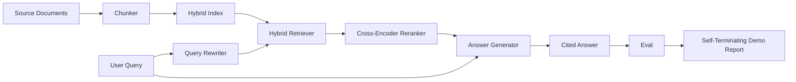

# End-to-End RAG System

> Six component lessons. One pipeline. One evaluation loop. One self-terminating demo. This is the system you deliver.

**Type:** Capstone
**Languages:** Python
**Prerequisites:** Phase 11 Lessons 06 (RAG), 10 (eval); Phase 19 Path B Foundations (Lessons 20-29); Phase 19 Lessons 64, 65, 66, 67, 68
**Time:** ~90 minutes

## Learning Objectives
- Compose a chunker, a hybrid retriever, a query rewriter, a cross-encoder reranker, and an answer generator into one end-to-end pipeline.
- Implement an answer generator that cites its claims using a chunk anchor, with a "refuse on low confidence" fallback.
- Run the Lesson 68 eval against the assembled pipeline and prove the composed stages beat the isolated ones on every metric.
- Build a self-terminating CLI demo that ingests a fixture corpus, runs a fixed set of queries, and exits zero with a summary report.

## The Problem

Six individual pieces prove nothing. A chunker can win on recall@5 with a corpus and lose on system recall@5 because the retriever can't score what the chunker emits. A reranker can boost MRR on a synthetic candidate pool and fail on real bi-encoder candidates because the bi-encoder recall at the reranking budget is too low. A query rewriter can promote the golden document in one query and break in the next because the mock LLM returns a degenerate hypothesis.

The integration test is to run the entire pipeline end-to-end against the same fixture qrels, with the same metric, with a single Orchestrator file that ties everything together. That's what this lesson builds. If the composed pipeline metrics exceed the isolated demo metrics of each stage, the system is proven.

## The Concept



### Wiring Choices

The pipeline is a small graph. Each stage is a function with an explicit signature.

| Stage | Input | Output |
|-------|-------|--------|
| Chunker | Document text | List of Chunk records |
| Retriever | Query string | Top-N Chunk records |
| Rewriter (optional) | Query string | List of rewrites + hypothetical |
| Reranker | Query, candidates | Top-K Chunk records with cross scores |
| Generator | Query, top-K Chunk records | Answer string with citations |

Composition is easy when each signature is stable. The `Pipeline` class of the lesson contains five stages and a `query` method that runs them in a specific order. Each stage can be swapped: pass a different chunker, retriever, rewriter, reranker, or generator, and the pipeline will still work.

### Answer Generator with Citations

The generator is the last stage and the easiest to break. The lesson introduces a deterministic mock generator that:

1. Takes the top K chunks.
2. Selects a maximum of two chunks whose text has the highest content token overlap with the query.
3. Outputs an answer combining one sentence from each selected chunk, with each sentence followed by an anchor `[doc_id:chunk_index]`.
4. If no chunk overlaps above the rejection threshold, it emits "I don't know" without a citation.

In production, you replace the mock with a real LLM call using a prompt template:

```
You are answering a question using only the snippets below.
Cite every claim with the anchor in parentheses.
If the snippets do not answer the question, say "I do not know".

Question: {query}

Snippets:
{enumerated chunks with anchors}

Answer:
```

The "refuse on low confidence" path is the main reason for logging the rank 1 cross-encoder score. If it's below the corpus threshold, the generator refuses. This is the safety valve against hallucinated answers.

### Self-Terminating Demo

The demo covers everything end-to-end. It prints the trace of one query across stages, runs the eval on four fixture qrels, prints the metrics table, and exits with a status of zero if all Lesson 68 metrics reach the thresholds set in the demo. If any metric is below the threshold, the demo exits with a non-zero status and a message naming the failed metric.

This is the shape of a CI smoke test. The pipeline runs offline, fast, and deterministically. The thresholds are intentionally tight for the fixture, so a regression in any of the six lessons fails the demo.

## Build It

`code/main.py` implements:

- `Chunk` - a record carried through all stages (extends Lesson 64 shape with chunk_index and source doc_id).
- `Chunker` - chooses a strategy from Lesson 64 (default recursive split).
- `HybridIndex` - BM25 + dense + RRF bundles from Lesson 65.
- `Rewriter` (optional) - chooses one of HyDE, multi-query, decomposition from Lesson 67 by query length and presence of conjunctions.
- `Reranker` - trained cross-encoder from Lesson 66, with a smaller fixture training set so it converges in seconds.
- `Generator` - deterministic mock generator with citations and low confidence rejection.
- `Pipeline` - assembles the five stages via a `query(question)` method that returns `Result(answer, top_k, latency_ms_per_stage)`.
- `run_demo()` - loads the corpus, runs three fixture queries, runs eval, prints results, sets exit code by threshold.

Run it:

```bash
python3 code/main.py
```

The output is one printed query trace, the full eval table, and the final Pass/Fail status. Returns exit code 0 on the fixture.

## Failure Modes the Demo Hides

**Chunk boundary drift.** If you swap the chunker strategy between the eval qrels labeling pass and the demo, the golden document IDs no longer match. Lock the chunker strategy in the qrels file. The demo includes a header with the chunker name.

**Reranker training set leaks into eval.** 14 training triplets from Lesson 66 contain queries resembling eval queries. In production, strictly hold out eval queries. The demo eval queries are intentionally disjoint from the reranking training set.

**Mock generator hides hallucination risk.** The mock cannot hallucinate because it only emits text from retrieved chunks. The lesson notes this and indicates the production swap path to a real model.

**Lack of streaming.** The pipeline returns the full response at the end of each stage. A production system would stream the generator output. Streaming is out of scope; answer eval metrics operate on the final string in both cases.

**Latency is offline.** Mock LLM calls take constant time. Real LLM calls dominate. Budget request latencies; the lesson duration per stage only measures CPU work.

## Use It

Production patterns:

- Ship the pipeline file inside one orchestrator with explicit stage interfaces. Avoid spreading wiring across the repo.
- Run the eval before every merge that touches a stage. If the eval drops, the merge fails.
- Maintain a metric trace per CI run to attribute regressions to stage swaps.
- Add a smoke suite of 20 queries (a subset of the regression suite) that runs in less than 30 seconds; the full regression suite runs nightly.

## Ship It

The pipeline file in this lesson is the shape the remaining Path F lessons take in Phase 19. Subsequent lessons would cover ingest automation, incremental reindexing, telemetry, and a serving layer. The retrieval, reranking, rewriting, and eval halves are complete here.

## Exercises

1. Add a strategy selector per query in the rewriter: heuristics from Lesson 67 (length, conjunctions, jargon ratio) pick HyDE, multi-query, or decomposition.
2. Add a real LLM call for the generator behind an env flag. Default to the mock. Measure the latency delta.
3. Extend the demo to take a `--corpus path` flag that loads a real corpus. Re-run eval and threshold checks.
4. Add a `--strategy` flag to the chunker. Measure the contribution of each strategy to end-to-end recall.
5. Add a streaming generator interface and feed it into the eval. Ensure fidelity is computed on the final string, not the streamed prefix.

## Key Terms

| Term | What People Say | What It Actually Means |
|------|-----------------|--------------------------------------|
| Pipeline | "RAG pipeline" | Composed stages from ingestion to cited answer |
| Citation Anchor | "Source Link" | A reference (doc_id, chunk_index) attached to each claim |
| Refuse on Low Confidence | "I don't know" | Generator returns no answer when the rank 1 reranker score is below threshold |
| Smoke Suite | "CI eval" | A minimal subset of qrels that runs on every PR check |
| Stage Interface | "Function signature" | Stable input and output types at each stage of the pipeline |

## Further Reading

- [Anthropic, Building Search and Retrieval](https://www.anthropic.com/news/contextual-retrieval)
- [Pinterest, internal search MCP](https://medium.com/pinterest-engineering) - reference production architecture
- [Ragas: Automated Evaluation of RAG Pipelines](https://docs.ragas.io)
- Phase 11 Lesson 06 - RAG Basics
- Phase 19 Lessons 64-68 - the components composed here
