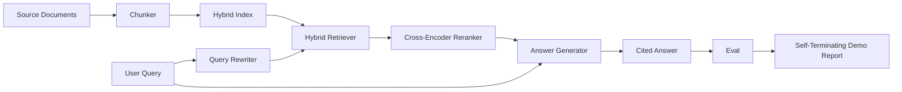

# Kompleksowy system RAG

> Sześć lekcji komponentów. Jeden rurociąg. Jedna pętla ewaluacyjna. Jedno samozakończające się demo. To jest system, który dostarczasz.

**Typ:** Kompilacja
**Języki:** Python
**Wymagania wstępne:** Faza 11 lekcji 06 (RAG), 10 (ocena); Faza 19 Podstawy ścieżki B (lekcje 20-29); Faza 19, lekcje 64, 65, 66, 67, 68
**Czas:** ~90 minut

## Cele nauczania
- Skomponuj fragmentator, moduł pobierania hybrydowego, narzędzie do ponownego zapisywania zapytań, narzędzie do zmiany rankingu koderów krzyżowych i generator odpowiedzi w jeden kompleksowy potok.
- Zaimplementuj generator odpowiedzi, który cytuje swoje twierdzenia za pomocą kotwicy fragmentu, z rezerwą typu „odrzuć przy niskim poziomie zaufania”.
- Uruchom lekcję 68 eval w odniesieniu do zmontowanego potoku i udowodnij, że kompilacja etapowa wygrywa w przypadku każdej metryki w odniesieniu do tych samych komponentów w izolacji.
- Zbuduj samokończące się demo CLI, które pobiera korpus urządzeń, uruchamia ustalony zestaw zapytań i wychodzi zera z raportem podsumowującym.

## Problem

Sześć pojedynczych elementów niczego nie dowodzi. Chunker może wygrać w przypadku przywołania @ 5 z korpusem i przegrać w przypadku przywołania systemu @ 5, ponieważ retriever nie może ocenić tego, co emituje chunker. Osoba dokonująca rerankingu może podnieść MRR w przypadku syntetycznej puli kandydatów i ponieść porażkę w przypadku prawdziwych kandydatów z dwoma koderami, ponieważ przywołanie bi-enkodera przy budżecie rerankingu jest zbyt niskie. Osoba pisząca zapytania może promować złoty dokument w jednym zapytaniu i przerywać w następnym, ponieważ próbna wersja LLM zwraca zdegenerowaną hipotezę.

Test integracji polega na uruchomieniu całego potoku od końca do końca względem tych samych urządzeń qrels, z tą samą metryką, z jednym plikiem programu Orchestrator, który łączy wszystko razem. To właśnie buduje ta lekcja. Jeśli metryki zintegrowanego potoku przewyższają metryki izolowanej wersji demonstracyjnej każdego etapu, oznacza to, że system został sprawdzony.

## Koncepcja



### Wybór okablowania

Potok to mały wykres. Każdy etap jest funkcją z wyraźną sygnaturą.

| Scena | Wejście | Wyjście |
|-------|-------|--------|
| Kawałek | Tekst dokumentu | Lista rekordów Chunk |
| Retriever | Ciąg zapytania | Top-N rekordów Chunk |
| Przepisujący (opcjonalnie) | Ciąg zapytania | Lista przeróbek + hipotetyczna |
| Zmiana rankingu | Zapytanie, kandydaci | Rekordy Top-K Chunk z wynikami krzyżowymi |
| Generator | Zapytanie, rekordy najwyższej liczby K fragmentów | Ciąg odpowiedzi z cytatami |

Kompozycja jest prosta, gdy każdy podpis jest stabilny. Klasa `Pipeline` z lekcji zawiera pięć etapów i metodę `query`, która uruchamia je w określonej kolejności. Każdy etap można zamienić: przekaż innego chunkera, retrievera, rewritera, rerankera lub generatora, a potok nadal będzie działać.

### Generator odpowiedzi z cytatami

Generator to ostatni stopień i najłatwiejszy do złamania. Lekcja przedstawia deterministyczny generator próbny, który:

1. Bierze kawałki z najwyższej półki K.
2. Wybiera maksymalnie dwa fragmenty, których tekst zawiera najwyższy token treści pokrywający się z zapytaniem.
3. Wysyła odpowiedź będącą połączeniem jednego zdania z każdego wybranego fragmentu, przy czym po każdym zdaniu następuje kotwica `[doc_id:chunk_index]`.
4. Jeśli żaden fragment nie pokrywa się powyżej progu odrzucenia, emitowany jest komunikat „Nie wiem” bez cytatu.

W środowisku produkcyjnym zamieniasz próbną rozmowę na prawdziwe wywołanie LLM za pomocą szablonu podpowiedzi:

```
You are answering a question using only the snippets below.
Cite every claim with the anchor in parentheses.
If the snippets do not answer the question, say "I do not know".

Question: {query}

Snippets:
{enumerated chunks with anchors}

Answer:
```

Ścieżka „odrzuć przy niskim poziomie zaufania” jest głównym powodem rejestrowania wyniku rangi 1 między koderami. Jeśli znajduje się poniżej progu korpusu, generator odmawia. To jest zawór bezpieczeństwa chroniący przed halucynacyjnymi odpowiedziami.

### Samozakończające się demo

Demo obejmuje wszystko od początku do końca. Drukuje podział jednego zapytania na etapy, uruchamia eval na czterech elementach qrel urządzeń, drukuje tabelę metryk i kończy ze statusem zero, jeśli wszystkie metryki z lekcji 68 osiągną progi ustawione w wersji demonstracyjnej. Jeśli jakakolwiek metryka jest poniżej progu, demonstracja kończy się ze statusem niezerowym i komunikatem z nazwą metryki, która uległa awarii.

Taki kształt przyjmuje test dymu CI. Potok działa w trybie offline, szybko i deterministycznie. Progi są celowo ciasne dla urządzenia, więc regresja w którejkolwiek z sześciu lekcji nie powoduje powodzenia demonstracji.

## Zbuduj to

`code/main.py` implementuje:

- `Chunk` - zapis przenoszony przez wszystkie etapy (rozszerza kształt lekcji 64 o chunk_index i source doc_id).
- `Chunker` - wybiera strategię z lekcji 64 (domyślny podział rekurencyjny).
- `HybridIndex` - wiązki BM25 + gęsty + RRF z lekcji 65.
- `Rewriter` (opcjonalnie) — wybiera jedno z HyDE, wielu zapytań, rozkładu z lekcji 67 według długości zapytania i obecności spójników.
- `Reranker` - wytrenowany cross-enkoder z lekcji 66, z mniejszym zestawem treningowym urządzeń, dzięki czemu zbiega się w ciągu kilku sekund.
- `Generator` - deterministyczny generator próbny z cytatami i odrzucaniem informacji o niskim poziomie zaufania.
- `Pipeline` — składa pięć etapów za pomocą metody `query(question)`, która zwraca `Result(answer, top_k, latency_ms_per_stage)`.
- `run_demo()` - pobiera korpus, uruchamia trzy zapytania o urządzenia, uruchamia eval, wypisuje wyniki, ustawia kod wyjścia według progu.

Uruchom to:

```bash
python3 code/main.py
```

Dane wyjściowe to jeden wydrukowany ślad zapytania, pełna tabela ewaluacyjna i końcowy status Pass/Fail. Zwraca kod wyjścia 0 na urządzeniu.

## Tryby awarii, które demo ukryje

**Przesunięcie granicy fragmentu.** Jeśli zamienisz strategię chunkera pomiędzy karnetem etykietowania eval qrels a wersją demonstracyjną, identyfikatory złotych dokumentów nie będą się już zgadzać. Zablokuj strategię chunkera w pliku qrels. Demo zawiera nagłówek z nazwą chunkera.

**Zestaw szkoleniowy narzędzia Reranker przecieka do eval.** 14 trójek szkoleniowych z lekcji 66 zawiera zapytania przypominające zapytania eval. W środowisku produkcyjnym ściśle wykonuj zapytania eval. Zapytania ewaluacyjne w wersji demonstracyjnej są celowo rozłączne ze zbiorem szkoleniowym zmiany rangi.

**Generator prób ukrywa ryzyko halucynacji.** Próba nie może mieć halucynacji, ponieważ emituje jedynie tekst z odzyskanych fragmentów. Lekcja odnotowuje to i wskazuje ścieżkę wymiany produkcyjnej na prawdziwy model.

**Brak przesyłania strumieniowego.** Potok zwraca pełną odpowiedź na końcu każdego etapu. System produkcyjny przesyłałby strumieniowo moc wyjściową generatora. Przesyłanie strumieniowe jest poza zakresem; metryki oceny odpowiedzi działają w obu przypadkach na końcowym ciągu znaków.

**Opóźnienie jest w trybie offline.** Próbne wywołania LLM mają stały czas. Dominują prawdziwe połączenia LLM. Zaplanuj budżet opóźnień w zakresie żądania; Czas trwania lekcji na etap mierzy jedynie pracę procesora.

## Użyj tego

Wzory produkcyjne:

- Wyślij plik potoku w ramach jednego orkiestratora z wyraźnymi interfejsami scenicznymi. Unikaj rozprzestrzeniania okablowania w całym repozytorium.
- Uruchom eval przed każdym połączeniem, które dotyka sceny. Jeśli wartość eval spadnie, połączenie nie zostanie zakończone.
— Utrzymuj ślad metryki na przebieg CI, aby móc przypisać regresje do zamiany etapów.
- Dodaj zestaw dymny składający się z 20 zapytań (podzbiór zestawu regresji), który działa w czasie krótszym niż 30 sekund; pełny zestaw regresji działa co noc.

## Wyślij to

Plik potoku w tej lekcji ma kształt, jaki przyjmują pozostałe lekcje ścieżki F w fazie 19. Kolejne lekcje obejmowałyby automatyzację przetwarzania, przyrostowe ponowne indeksowanie, telemetrię i warstwę obsługi. Połówki odzyskiwania, zmiany rankingu, przepisywania i ewaluacji są tutaj zakończone.

## Ćwiczenia

1. Dodaj selektor strategii na zapytanie w narzędziu przepisywania: heurystyka z lekcji 67 (długość, spójniki, współczynnik żargonu) wybierz HyDE, wiele zapytań lub dekompozycję.
2. Dodaj prawdziwe wywołanie LLM dla generatora za flagą env. Domyślnie dla makiety. Zmierz deltę opóźnienia.
3. Rozszerz demo, aby pobrać flagę `--corpus path`, która ładuje prawdziwy korpus. Uruchom ponownie eval i kontrolę progu.
4. Dodaj flagę `--strategy` do fragmentatora. Zmierz wkład każdej strategii w kompleksowe przypominanie.
5. Dodaj interfejs generatora przesyłania strumieniowego i wprowadź go do pliku eval. Upewnij się, że wierność jest obliczana na końcowym ciągu, a nie na przedrostku przesyłanym strumieniowo.

## Kluczowe terminy

| Termin | Co ludzie mówią | Co to właściwie oznacza |
|------|-----------------|--------------------------------------|
| Rurociąg | „gazociąg RAG” | Skomponowane etapy od spożycia do cytowanej odpowiedzi |
| Kotwica cytatu | „Link źródłowy” | Odniesienie (doc_id, chunk_index) dołączone do każdego roszczenia |
| Odrzuć przy niskim poziomie zaufania | „Nie wiem” | Generator nie zwraca żadnej odpowiedzi, gdy wynik pierwszej 1 osoby rerankingowej znajduje się poniżej progu |
| Zestaw dymny | „Ocena CI” | Minimalny podzbiór qrels, który działa podczas każdej kontroli PR |
| Interfejs sceniczny | „Podpis funkcji” | Stabilny typ wejścia i wyjścia na każdym etapie rurociągu |

## Dalsze czytanie

– [Anthropic, wyszukiwanie i odzyskiwanie budynków](https://www.anthropic.com/news/contextual-retrieval)
- [Pinterest, wewnętrzne wyszukiwanie MCP](https://medium.com/pinterest-engineering) - referencyjna architektura produkcyjna
- [Ragas: Automatyczna ocena rurociągów RAG](https://docs.ragas.io)
- Faza 11, lekcja 06 - Podstawy RAG
- Faza 19, lekcje 64-68 - elementy skomponowane tutaj