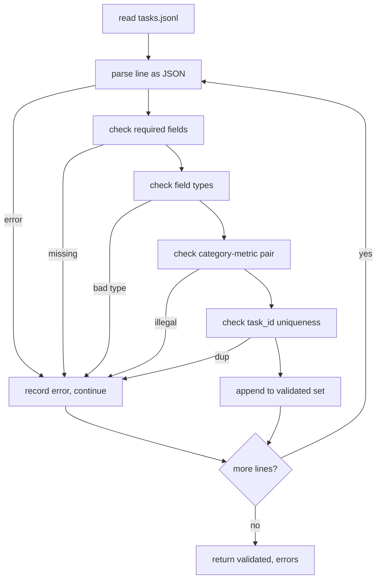

# Task Specification Format

> An eval harness is only as good as the contract its tasks follow. Lock down the JSONL shape and the metric vocabulary before you write a single evaluation function.

**Type:** Capstone
**Languages:** Python
**Prerequisites:** Phase 19 Path B Foundations
**Time:** ~90 min

## Learning Objectives

- Define a JSONL task record schema that encompasses arithmetic, multiple-choice, code execution, classification, and free-text summary into a single shape.
- Pin down a closed vocabulary of metric names so downstream lessons (71-73) can dispatch on a single field.
- Specify few-shot examples and post-processing rules as part of the task, not the runner, so the same prompt yields the same target across models.
- Implement a strict validator that rejects malformed records before they reach the runner.
- Ship a 10-task fixture suite that exercises every part of the spec so the validator has something to chew on.

## Why a Frozen Spec

A research codebase will accumulate eval scripts faster than it accumulates tests. After six months, every notebook has its own JSON shape, every metric is reimplemented twice, and nothing can be compared across runs. The fix is boring. Pick a schema. Write a validator. Reject everything else. That is what this lesson does.

The shape borrows ideas from BIG-bench, HELM, and lm-eval harnesses, but the field names are ours. Every field has one owner. The runner reads the task. The metric reads the targets. The post-process step normalizes the generation. No field can be mutated mid-pipeline.

## The Record Shape

A task is a single-line JSON object. The harness reads `tasks.jsonl` and validates each line independently. A bad line breaks the record, not the run.

```json
{
  "task_id": "arith_001",
  "category": "arithmetic",
  "prompt": "Compute the result. Question: 17 + 24\nAnswer:",
  "targets": ["41"],
  "metric_name": "exact_match",
  "few_shot_examples": [
    {"prompt": "Question: 2 + 2\nAnswer:", "completion": "4"}
  ],
  "post_process": "strip_whitespace",
  "metadata": {"difficulty": "easy"}
}
```

Required fields are `task_id`, `category`, `prompt`, `targets`, `metric_name`, `post_process`. `few_shot_examples` and `metadata` are optional. Unknown top-level fields are unverified.

## Field Rules

`task_id` is a string with no whitespace. The validator enforces uniqueness across the file.

`category` is one of `arithmetic`, `mcq`, `code_exec`, `classification`, `summary`. The category restricts which metric and post-process pair is allowed. A `code_exec` task must use `metric_name = code_exec`, and an `mcq` task must use `metric_name = exact_match` against a single-letter target.

`prompt` is a non-empty string. The validator forbids trailing whitespace and rejects records that already include a few-shot block in the prompt body. Few-shot rendering happens in the runner, not the author.

`targets` is a non-empty list of strings. For `exact_match`, any match counts. For `f1` and `rouge_l`, the target yielding the highest score wins. For `mcq`, the list has exactly one element.

`metric_name` is one of `exact_match`, `f1`, `bleu_4`, `rouge_l`, `accuracy`, `code_exec`. The vocabulary is closed. A new metric requires a new lesson and a new entry here.

`few_shot_examples` is a list of `{prompt, completion}` pairs. The validator caps the list at eight entries to bound prompt lengths.

`post_process` is one of `none`, `strip_whitespace`, `lower`, `extract_letter`, `extract_code_block`, `extract_first_line`. Each rule has a single deterministic behavior. The validator forbids combining rules.

## Validator Behavior



The validator returns two lists: validated records, and error records with the offending line, violated rule, and failing field. The runner refuses to start if the error list is not empty, unless an explicit `--allow-bad-tasks` flag is set.

## Few-Shot Rendering

The runner concatenates few-shot examples before the prompt with an empty line separator. This same code path runs for every model, so the only source of variance is the model itself. Authors write examples once, not once per provider.

```python
def render(task):
    parts = []
    for ex in task.get("few_shot_examples", []):
        parts.append(ex["prompt"] + " " + ex["completion"])
    parts.append(task["prompt"])
    return "\n\n".join(parts)
```

## Post-Process Rules

The post-process step executes after generation, before the metric. It is deterministic and stateless.

- `none` returns the string unchanged.
- `strip_whitespace` strips leading and trailing spaces.
- `lower` lowercases the string.
- `extract_letter` returns the first character matching `[A-E]`, used for MCQ.
- `extract_code_block` returns the body of the first triple-backtick block, used for code execution.
- `extract_first_line` returns the first non-empty line, used for bulk classification.

A task needing a rule outside this list belongs to a new lesson.

## What This Lesson Does Not Do

It does not score. It does not call a model. It does not execute code. Those come in Lessons 71, 72, and 75. This lesson freezes the contract that they all follow.

The 10-task fixture suite includes two arithmetic items, two MCQ items, two code-exec items, two classification items, and two summary items. The validator passes all 10. A separate fixture (`tasks_bad.jsonl`) triggers every rule, and the validator returns exactly that many errors.

## How to Read the Code

`main.py` defines `TaskSpec`, `validate_task`, `validate_file`, and the CLI entry point. The fixture loader is `load_fixtures`. The rendering and post-process helpers live alongside validation, so the runner from Lesson 75 imports a single module.

Read `main.py` top to bottom. Then read `code/tests/test_spec.py`. Tests pin every validation rule and every post-process behavior. The demo at the bottom of `main.py` validates the included fixture and prints the summary.

## Going Further

Real eval suites expand categories the same way schemas expand columns. The sober move is to refuse adding a category without adding a metric, a post-process rule, and at least one task. Treat the spec like a database migration. Every change is reviewed, versioned, and accompanied by tests. The validator in this lesson is the gate.
