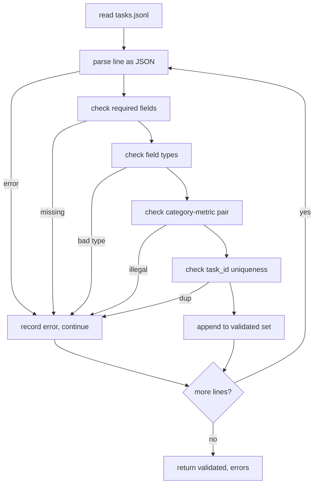

# Format specyfikacji zadania

> Uprząż eval jest tak dobra, jak umowa spełnia jej zadania. Zablokuj kształt JSONL i słownictwo metryczne przed napisaniem pojedynczej funkcji oceniającej.

**Typ:** Kompilacja
**Języki:** Python
**Wymagania:** Faza 19 Fundamenty ścieżki B
**Czas:** ~90 min

## Cele nauczania

- Zdefiniuj schemat rekordu zadań JSONL, który obejmuje arytmetykę, wielokrotny wybór, wykonanie kodu, klasyfikację i podsumowanie w postaci dowolnego tekstu w jednym kształcie.
- Przypnij zamknięty słownik nazw metryk, aby dalsze lekcje (71-73) mogły być wysyłane w jednym polu.
- Określ przykłady kilku strzałów i zasady przetwarzania końcowego jako część zadania, a nie elementu wykonawczego, tak aby ten sam monit generował ten sam cel we wszystkich modelach.
- Wdrożenie ścisłego modułu sprawdzania poprawności, który odrzuca zniekształcone rekordy, zanim dotrą do modułu uruchamiającego.
- Wyślij zestaw składający się z 10 zadań, który ćwiczy każdą część specyfikacji, aby walidator miał naprawdę coś do przeżucia.

## Dlaczego zamrożona specyfikacja

Baza kodu badawczego będzie gromadzić skrypty eval szybciej niż gromadzi testy. Po sześciu miesiącach każdy notatnik ma swój własny kształt JSON, każda metryka jest ponownie implementowana dwukrotnie i niczego nie można porównywać między seriami. Poprawka jest nudna. Wybierz schemat. Napisz walidator. Odrzuć wszystko inne. To właśnie ma na celu ta lekcja.

Kształt zapożycza pomysły z uprzęży w stylu BIG-bench, HELM i lm-eval, ale nazwy pól są nasze. Każde pole ma jednego właściciela. Biegacz czyta zadanie. Metryka odczytuje cele. Etap postprocesowy normalizuje generowanie. Żadnego pola nie można modyfikować w trakcie potoku.

## Kształt rekordu

Zadanie to obiekt JSON w pojedynczej linii. Wiązka przewodów odczytuje `tasks.jsonl` i niezależnie sprawdza każdą linię. Zła linia przerywa rekord, a nie bieg.

```json
{
  "task_id": "arith_001",
  "category": "arithmetic",
  "prompt": "Compute the result. Question: 17 + 24\nAnswer:",
  "targets": ["41"],
  "metric_name": "exact_match",
  "few_shot_examples": [
    {"prompt": "Question: 2 + 2\nAnswer:", "completion": "4"}
  ],
  "post_process": "strip_whitespace",
  "metadata": {"difficulty": "easy"}
}
```

Wymagane pola to `task_id`, `category`, `prompt`, `targets`, `metric_name`, `post_process`. `few_shot_examples` i `metadata` są opcjonalne. Nieznane pola najwyższego poziomu nie zostały zweryfikowane.

## Zasady terenowe

`task_id` to ciąg znaków bez białych znaków. Walidator wymusza unikalność w całym pliku.

`category` jest jednym z `arithmetic`, `mcq`, `code_exec`, `classification`, `summary`. Kategoria ogranicza, która para metryki i procesu końcowego jest dozwolona. Zadanie `code_exec` musi używać `metric_name = code_exec`, a zadanie `mcq` musi używać `metric_name = exact_match` w odniesieniu do jednoliterowego celu.

`prompt` jest ciągiem niepustym. Walidator zabrania końcowych białych znaków i odrzuca rekordy, które w treści zachęty zawierają już kilkupunktowy blok. Renderowanie kilku ujęć odbywa się w biegaczu, a nie u autora.

`targets` to niepusta lista ciągów. W przypadku `exact_match` liczy się każdy pasujący element. W przypadku `f1` i `rouge_l` wygrywa cel, który uzyska najwyższy wynik. Dla `mcq` lista zawiera dokładnie jeden element.

`metric_name` jest jednym z `exact_match`, `f1`, `bleu_4`, `rouge_l`, `accuracy`, `code_exec`. Słownictwo jest zamknięte. Nowa metryka wymaga nowej lekcji i nowego wpisu w tym miejscu.

`few_shot_examples` to lista par `{prompt, completion}`. Walidator ogranicza listę do ośmiu wpisów, aby ograniczyć monity.

`post_process` jest jednym z `none`, `strip_whitespace`, `lower`, `extract_letter`, `extract_code_block`, `extract_first_line`. Każda reguła ma jedno deterministyczne zachowanie. Walidator zabrania łączenia reguł.

## Zachowanie walidatora



Walidator zwraca dwie listy: sprawdzone rekordy i rekordy błędów z linią naruszającą, naruszoną regułą i polem, w którym występuje błąd. Program uruchamiający odmawia uruchomienia, jeśli lista błędów nie jest pusta, chyba że ustawiono wyraźną flagę `--allow-bad-tasks`.

## Renderowanie kilku ujęć

Moduł uruchamiający łączy kilka przykładów przed zachętą za pomocą pustego separatora linii. Ta sama ścieżka kodu działa dla każdego modelu, więc jedynym źródłem wariancji jest sam model. Autorzy piszą przykłady raz, a nie raz dla każdego dostawcy.

```python
def render(task):
    parts = []
    for ex in task.get("few_shot_examples", []):
        parts.append(ex["prompt"] + " " + ex["completion"])
    parts.append(task["prompt"])
    return "\n\n".join(parts)
```

## Reguły postprocesowe

Etap przetwarzania końcowego jest wykonywany po wygenerowaniu, przed metryką. Jest deterministyczny i bezstanowy.

- `none` zwraca ciąg znaków bez zmian.
- `strip_whitespace` usuwa początkowe i końcowe spacje.
- `lower` zmniejsza ciąg znaków.
- `extract_letter` zwraca pierwszy znak pasujący do `[A-E]`, używanego dla MCQ.
- `extract_code_block` zwraca treść pierwszego bloku z potrójnym backtickem, używanego do wykonywania kodu.
- `extract_first_line` zwraca pierwszą niepustą linię używaną do klasyfikacji zbiorczej.

Zadanie wymagające reguły spoza tej listy należy do nowej lekcji.

## Czego ta lekcja nie robi

To nie punktuje. Nie wywołuje modelu. Nie uruchamia kodu. Pochodzą one z lekcji 71, 72 i 75. Ta lekcja zamraża umowę, której wszyscy przestrzegają.

Zestaw składający się z 10 zadań obejmuje dwie pozycje arytmetyczne, dwie pozycje MCQ, dwie pozycje code-exec, dwie pozycje klasyfikacyjne i dwie pozycje podsumowujące. Walidator przekazuje wszystkie 10. Oddzielne urządzenie (`tasks_bad.jsonl`) uruchamia każdą regułę, a walidator zwraca dokładnie tyle błędów.

## Jak odczytać kod

`main.py` definiuje `TaskSpec`, `validate_task`, `validate_file` i punkt wejścia CLI. Program ładujący urządzenia to `load_fixtures`. Pomocnicy renderowania i postprocesu znajdują się obok walidacji, więc moduł uruchamiający z lekcji 75 importuje pojedynczy moduł.

Przeczytaj `main.py` od góry do dołu. Następnie przeczytaj `code/tests/test_spec.py`. Testy przypinają każdą regułę walidacji i każde zachowanie po procesie. Demo na dole `main.py` sprawdza poprawność dołączonego urządzenia i drukuje podsumowanie.

## Idziemy dalej

Prawdziwe zestawy ewaluacyjne powiększają kategorie w taki sam sposób, w jaki schematy powiększają kolumny. Trzeźwym posunięciem jest odmowa dodania kategorii bez dodania metryki, reguły postprocesowej i co najmniej jednego zadania. Traktuj specyfikację jak migrację bazy danych. Każda zmiana jest sprawdzana, wersjonowana i dołączana do testów. Walidatorem w tej lekcji jest brama.