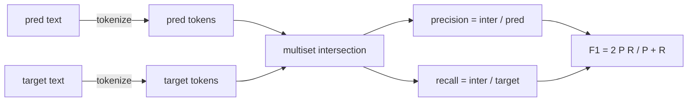
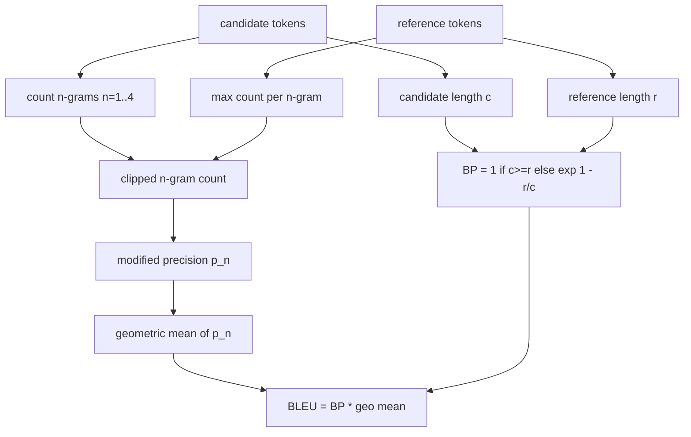

# Classical Metrics

> BLEU, ROUGE-L, F1, exact match, accuracy. The five metrics that still make up the bulk of published LLM eval numbers. Implement each from first principles so you know what the number means.

**Type:** Capstone
**Languages:** Python
**Prerequisites:** Phase 19 Path B Foundations, Lesson 70
**Time:** ~90 min

## Learning Objectives

- Implement exact match, token-level F1, and accuracy using explicit tokenization rules.
- Implement BLEU-4 from scratch: modified n-gram precision, geometric mean of n=1 to 4, brevity penalty.
- Implement ROUGE-L using Longest Common Subsequence, with F-beta combination of precision and recall.
- Dispatch on the metric_name field from Lesson 70 so the runner stays metric-agnostic.
- Pin behavior with reference vectors taken from worked examples, not a third-party library.

## Why Reimplement

You will read papers that report a BLEU of 28.3, and others that report a BLEU of 0.283. You will find ROUGE-L scores in two libraries that differ by ten points because one lowercases and the other doesn't. The fastest way to stop being confused is to write the metrics yourself, then point to the line where the tokenizer is pinned and the line where smoothing is applied. After that, comparing numbers across papers becomes a matter of reading their metric config, not arguing about libraries.

You need stdlib plus numpy. BLEU is counting and clamping. ROUGE-L is dynamic programming. F1 is set intersection on tokens. The hardest part is picking a tokenizer and committing to it.

## Tokenization

The tokenizer is `re.findall(r"\w+", text.lower())`. Lowercase, alphanumeric, strip punctuation. Every metric in this lesson uses exactly this tokenizer. The runner doesn't get a choice. If you swap tokenizers, you are running a different benchmark.

```python
TOKEN_RE = re.compile(r"\w+", re.UNICODE)
def tokenize(text):
    return TOKEN_RE.findall(text.lower())
```

This is intentionally simplistic. Production configs will care about CJK, contractions, and code identifiers. The lesson is that the tokenizer is a contract, not a knob.

## Exact Match

```python
def exact_match(pred, targets):
    return float(any(pred.strip() == t.strip() for t in targets))
```

Returns 1.0 or 0.0 per task. The aggregate across a dataset is the mean. This is the workhorse for arithmetic, MCQ, and short classification.

## Token-level F1

Set up a token multiset for prediction and target. Precision is multiset intersection divided by prediction multiset. Recall is the same intersection divided by target multiset. F1 is the harmonic mean. The implementation handles edge cases with empty predictions and empty targets.



For tasks with multiple targets, we take the best F1 across the targets list. This matches SQuAD-style behavior widely reported in literature.

## BLEU-4

BLEU is the canonical machine translation metric and still appears in summarization papers. The formula we use is corpus-level BLEU-4 with a standard brevity penalty and additive smoothing on modified n-gram counts so a single missing 4-gram doesn't push the score to zero.

For each candidate-reference pair, we count modified n-gram precision for n=1, 2, 3, 4. Modified precision clips the candidate n-gram count by the maximum count of that n-gram in any reference, so a candidate can't inflate counts by repeating one phrase. The geometric mean of the four precisions is multiplied by the brevity penalty.



The smoothing rule is what Lin and Och call method 1: add one to the numerator and denominator of each n-gram precision before taking the log. This avoids `log 0` when a reference lacks a matching 4-gram and stays close to the unsmoothed value for long candidates.

## ROUGE-L

ROUGE-L compares the longest common subsequence of candidate and reference token sequences. LCS captures word order without enforcing strict contiguity, making it the default summarization metric. We compute the LCS length via standard DP table, then derive recall as `lcs / reference length`, precision as `lcs / candidate length`, and combine with F-beta where beta equals one for symmetric F1 form.

```python
def lcs_length(a, b):
    n, m = len(a), len(b)
    dp = numpy.zeros((n + 1, m + 1), dtype=int)
    for i in range(n):
        for j in range(m):
            if a[i] == b[j]:
                dp[i+1, j+1] = dp[i, j] + 1
            else:
                dp[i+1, j+1] = max(dp[i+1, j], dp[i, j+1])
    return int(dp[n, m])
```

The numpy table makes the implementation readable; pure Python lists would work too. Tasks that opt into ROUGE-L pay an O(n m) cost per task. Fine for typical sub-millisecond summaries.

## Accuracy

For multi-target classification tasks, accuracy degrades to exact match against a single normalized target. We expose it as a separate function so the dispatcher can call `metric_name` without string matching inside the runner.

## The Dispatch Contract

The single entry point is `score(metric_name, prediction, targets)`. It returns a float in `[0, 1]`. The runner does not branch on metric name. It passes the call and saves the result. This is the surface that Lesson 75 will glue to the task spec from Lesson 70.

```python
def score(metric_name, pred, targets):
    if metric_name == "exact_match":
        return exact_match(pred, targets)
    if metric_name == "f1":
        return max(f1_score(pred, t) for t in targets)
    if metric_name == "bleu_4":
        return max(bleu4(pred, t) for t in targets)
    if metric_name == "rouge_l":
        return max(rouge_l(pred, t) for t in targets)
    if metric_name == "accuracy":
        return accuracy(pred, targets)
    raise ValueError(f"unknown metric_name: {metric_name}")
```

`code_exec` is handled in Lesson 72 and dispatched there.

## What This Lesson Does Not Do

It does not call a model. It does not normalize generations beyond what the Lesson 70 post-process rules already did. It does not compute confidence intervals. It does not do BLEURT or BERTScore (those need a model and live in another lesson). This is about the floor: five metrics, one tokenizer, one dispatch table.

## How to Read the Code

`main.py` defines each metric as a free function plus the dispatcher. Reference vectors are in the `_reference_examples` block at the bottom of the file. The demo runs the dispatcher against eight fixture examples and prints the scores by metric. Tests in `code/tests/test_metrics.py` pin the reference vectors and stress every edge case (empty prediction, empty reference, zero shared tokens, exact match, repeated phrase clipping).

Read `main.py` from top to bottom. The functions are ordered by complexity. exact_match and accuracy are one line. F1 is six lines. BLEU and ROUGE-L are the heavy parts and feature detailed comments on the smoothing rule and LCS recurrence.

## Going Further

Classical metrics are necessary but insufficient. They reward surface overlap and miss meaning. The fix is to layer model-based metrics (BLEURT, BERTScore, GEval) on top once you trust the classical floor. That's a later lesson. For now: get these five working, pin them with tests, and have an evaluable metric stack that is fast and reproducible.
