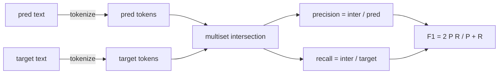
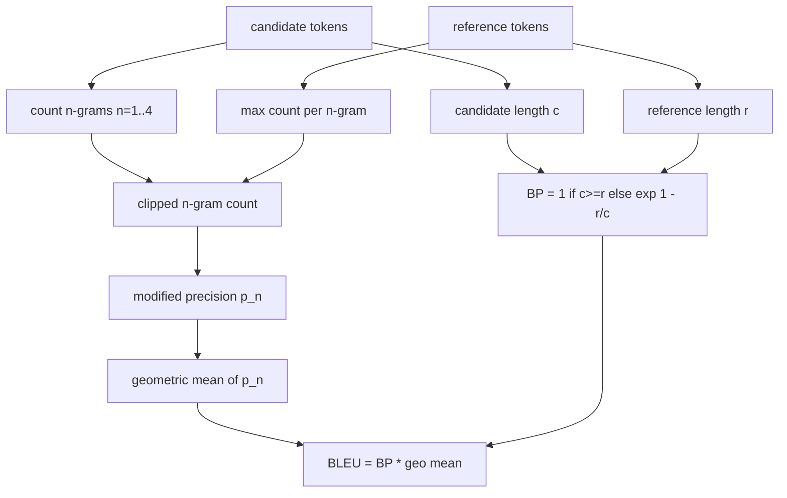

# Metryki klasyczne

> BLEU, ROUGE-L, F1, dokładne dopasowanie, dokładność. Pięć wskaźników, które nadal stanowią większość publikowanych liczb ewaluacyjnych LLM. Wdrożyj każdą z pierwszych zasad, abyś wiedział, co oznacza liczba.

**Typ:** Kompilacja
**Języki:** Python
**Wymagania wstępne:** Faza 19 Fundamenty ścieżki B, lekcja 70
**Czas:** ~90 min

## Cele nauczania

- Wdrażaj dokładne dopasowanie, F1 i dokładność na poziomie tokena za pomocą wyraźnych reguł tokenizacji.
- Zaimplementuj BLEU-4 od podstaw: zmodyfikowana precyzja w n-gramach, średnia geometryczna z n równa się od 1 do 4, kara za zwięzłość.
- Zaimplementuj ROUGE-L przy użyciu najdłuższego wspólnego podciągu, z kombinacją F-beta precyzji i przypominania.
- Komunikat w polu nazwa_metryki z lekcji 70, aby biegacz pozostał niezależny od metryki.
- Przypnij zachowanie wektorami odniesienia zaczerpniętymi z przepracowanych przykładów, a nie z biblioteki strony trzeciej.

## Po co wdrażać ponownie

Przeczytasz artykuły, które podają BLEU 28.3 i inne, które podają BLEU 0.283. W dwóch bibliotekach znajdziesz wyniki ROUGE-L, które różnią się o dziesięć punktów, ponieważ jedna jest obcinana na małe litery, a druga nie. Najszybszym sposobem, aby przestać się mylić, jest samodzielne zapisanie metryk, a następnie wskazanie linii, w której ustalany jest tokenizator, oraz linii, w której stosowane jest wygładzanie. Następnie porównywanie liczb w różnych artykułach staje się kwestią odczytania konfiguracji metryki, a nie kłótni o biblioteki.

Wystarczy stdlib plus numpy. BLEU liczy i zaciska. ROUGE-L to programowanie dynamiczne. F1 to ustawione przecięcie na żetonach. Najtrudniejszą częścią jest wybór tokenizera i zaangażowanie się w niego.

## Tokenizacja

Tokenizator to `re.findall(r"\w+", text.lower())`. Małe litery, znaki alfanumeryczne, znaki interpunkcyjne. Każda metryka w tej lekcji wykorzystuje dokładnie ten tokenizer. Biegacz nie ma wyboru. Jeśli zamienisz tokenizery, uruchomisz inny test porównawczy.

```python
TOKEN_RE = re.compile(r"\w+", re.UNICODE)
def tokenize(text):
    return TOKEN_RE.findall(text.lower())
```

Jest to celowe uproszczenie. Konfiguracje produkcyjne będą zwracać uwagę na CJK, skurcze i identyfikatory kodów. Lekcja jest taka, że ​​tokenizer to kontrakt, a nie pokrętło.

## Dokładne dopasowanie

```python
def exact_match(pred, targets):
    return float(any(pred.strip() == t.strip() for t in targets))
```

Zwraca wartość 1,0 lub 0,0 na zadanie. Agregat ze zbioru danych jest średnią. Jest to koń pociągowy do zadań arytmetycznych, MCQ i krótkiej klasyfikacji.

## Poziom tokena F1

Skonfiguruj zestaw wielokrotny tokenów dla przewidywania i celu. Precyzja to przecięcie wielu zbiorów podzielone przez zbiór wielu przewidywań. Przywołanie to to samo przecięcie podzielone przez zbiór wielokrotny celu. F1 jest średnią harmoniczną. Implementacja obsługuje przypadki skrajne z pustymi przewidywaniami i pustymi celami.



W przypadku zadań obejmujących wiele celów bierzemy najlepszy F1 z listy celów. Odpowiada to zachowaniu w stylu SQuAD, szeroko opisywanemu w literaturze.

## BLEU-4

BLEU jest kanonicznym miernikiem tłumaczenia maszynowego i nadal pojawia się w pracach podsumowujących. Formuła, której używamy, to BLEU-4 na poziomie korpusu ze standardową karą za zwięzłość i addytywnym wygładzaniem zmodyfikowanej liczby n-gramów, tak aby pojedynczy brakujący 4 gram nie spychał wyniku do zera.

Dla każdej pary kandydat-odniesienie zliczamy zmodyfikowaną precyzję n-gramów dla n równa się 1, 2, 3, 4. Zmodyfikowana precyzja odcina liczbę n-gramów kandydatów o maksymalną liczbę n-gramów w dowolnym odniesieniu, więc kandydat nie może zawyżać wartości, powtarzając jedną frazę. Średnia geometryczna z czterech dokładności jest otoczona karą za zwięzłość.



Reguła wygładzania to ta, którą Lin i Och nazywają metodą 1: dodaj jeden do licznika i mianownika każdej n-gramowej precyzji przed wykonaniem logu. Pozwala to uniknąć `log 0`, gdy odwołanie nie ma pasujących 4 gramów i pozostaje bliskie niewygładzonej wartości w przypadku długich kandydatów.

## ROUGE-L

ROUGE-L porównuje najdłuższy wspólny podciąg sekwencji tokenów kandydujących i referencyjnych. LCS przechwytuje kolejność słów bez wymuszania ciągłości, dlatego jest to domyślna metryka podsumowania. Obliczamy długość LCS za pomocą standardowej tabeli programowania dynamicznego, następnie wyprowadzamy odwołanie jako `lcs / reference length`, precyzję jako `lcs / candidate length` i łączymy z F-beta, gdzie beta równa się jeden dla symetrycznej formy F1.

```python
def lcs_length(a, b):
    n, m = len(a), len(b)
    dp = numpy.zeros((n + 1, m + 1), dtype=int)
    for i in range(n):
        for j in range(m):
            if a[i] == b[j]:
                dp[i+1, j+1] = dp[i, j] + 1
            else:
                dp[i+1, j+1] = max(dp[i+1, j], dp[i, j+1])
    return int(dp[n, m])
```

Tabela numpy sprawia, że implementacja jest czytelna; czyste listy Pythona też by zadziałały. Zadania, które zdecydują się na ROUGE-L, płacą koszt O(n m) na zadanie. Dla typowych podsumowań o długości poniżej milisekundy.

## Dokładność

W przypadku zadań klasyfikacji obejmujących wiele celów dokładność ogranicza się do dokładnego dopasowania do pojedynczego znormalizowanego celu. Udostępniamy ją jako osobną funkcję, aby dyspozytor mógł wywołać `metric_name` bez konieczności porównywania ciągów wewnątrz modułu uruchamiającego.

## Umowa wysyłkowa

Pojedynczy punkt wejścia to `score(metric_name, prediction, targets)`. Zwraca wartość zmiennoprzecinkową w `[0, 1]`. Runner nie rozgałęzia się na podstawie nazwy metryki. Przekazuje połączenie i zapisuje wynik. To jest powierzchnia, którą lekcja 75 przyklei do specyfikacji zadania z lekcji 70.

```python
def score(metric_name, pred, targets):
    if metric_name == "exact_match":
        return exact_match(pred, targets)
    if metric_name == "f1":
        return max(f1_score(pred, t) for t in targets)
    if metric_name == "bleu_4":
        return max(bleu4(pred, t) for t in targets)
    if metric_name == "rouge_l":
        return max(rouge_l(pred, t) for t in targets)
    if metric_name == "accuracy":
        return accuracy(pred, targets)
    raise ValueError(f"unknown metric_name: {metric_name}")
```

`code_exec` jest obsługiwany w lekcji 72 i tam umieszczany w programie rozsyłającym.

## Czego ta lekcja nie robi

Nie wywołuje modelu. Nie normalizuje pokoleń w sposób wykraczający poza to, co zrobiły już zasady postprocesu z lekcji 70. Nie oblicza przedziałów ufności. Nie robi BLEURT ani BERTScore (te potrzebują modelu i żyją na innej lekcji). Chodzi o podłogę: pięć metryk, jeden tokenizator, jedna tabela wysyłkowa.

## Jak odczytać kod

`main.py` definiuje każdą metrykę jako bezpłatną funkcję plus moduł rozsyłający. Wektory odniesienia znajdują się w bloku `_reference_examples` na dole pliku. Wersja demonstracyjna uruchamia program dyspozytorski na ośmiu przykładach i wyświetla wyniki według metryk. Testy w `code/tests/test_metrics.py` przypinają wektory odniesienia i podkreślają każdy przypadek brzegowy (pusta prognoza, puste odwołanie, brak współdzielonych tokenów, dokładne dopasowanie, powtarzające się obcinanie fraz).

Przeczytaj `main.py` od góry do dołu. Funkcje są uporządkowane według złożoności. Dopasowanie_dokładne i dokładność mają po jednej linii. F1 to sześć linii. BLEU i ROUGE-L to ciężkie części i zawierają szczegółowe komentarze na temat zasady wygładzania i powtarzalności LCS.

## Idziemy dalej

Metryki klasyczne są konieczne, ale niewystarczające. Nagradzają nakładanie się powierzchni i tracą znaczenie. Rozwiązaniem jest nałożenie na wierzch metryk opartych na modelu (BLEURT, BERTScore, GEval), gdy już zaufasz klasycznej podłodze. To późniejsza lekcja. Na razie: spraw, aby te pięć zadziałało, przypnij je testami i uzyskaj stos metryk, który można kontrolować, szybko i powtarzalnie.