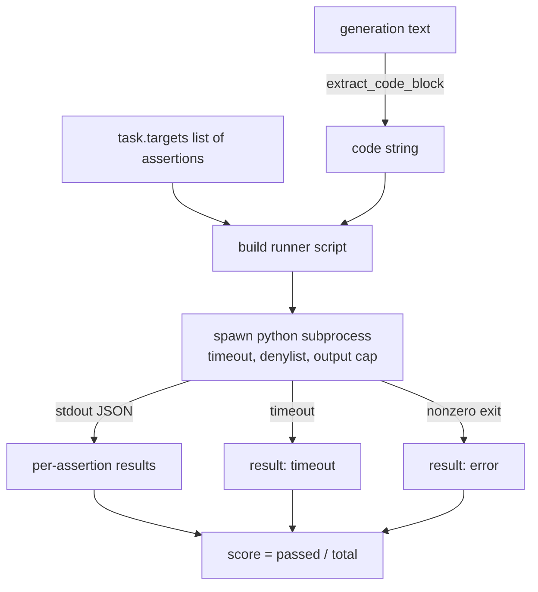
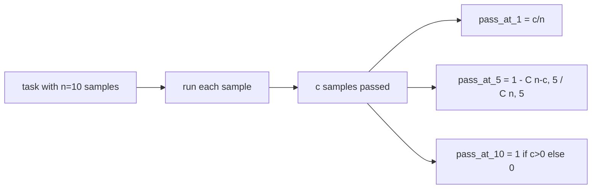

# Code Execution Metric

> Generated code is correct when it passes tests. An eval harness needs to extract the code, run it without hanging the host, and score the pass rate fairly. This lesson builds that surface.

**Type:** Capstone
**Languages:** Python
**Prerequisites:** Phase 19 Path B Foundations, Lessons 70 and 71
**Time:** ~90 min

## Learning Objectives

- Extract a code block from a free-text generation in a way compatible with the Lesson 70 post-process rule.
- Execute candidate code in an isolated subprocess with a wall-clock timeout, output cap, and an import denylist.
- Score a task as the fraction of provided assertion strings that pass against the candidate.
- Compute pass-at-k for tasks that sample multiple generations from one model.
- Treat sandbox crashes, syntax errors, and timeouts as first-class failure modes with distinct exit codes the runner can log.

## Why an Isolated Subprocess

Inline `exec` is a security and stability hazard. A generated `while True: pass` hangs the eval forever. A generated `import shutil; shutil.rmtree('/')` is exactly as disastrous as it sounds. The fix is to spawn a fresh Python interpreter for each candidate, feed the code to stdin, write the assertion results to stdout, and kill the process if it runs too long. The host eval process keeps running.

All real-world code evals like HumanEval, MBPP, BigCodeBench, and LiveCodeBench use a subprocess sandbox. Some layer Docker on top. We stop at subprocess for a reason: it's portable, it's standard library, and it captures the failure modes that matter for educational eval. Production deployments add seccomp, network isolation, and read-only filesystems. Another lesson on hardening lives outside this track.

## The code-exec Task Shape

A `code_exec` task carries assertion strings in `targets`. The runner extracts the guarded code block from the generation, builds a test harness around it, and runs the result.



The score is a fraction in `[0, 1]`. A task with three assertions where two pass gets 0.667. The runner returns this same shape regardless of what fails: subprocess crashes map to a normalized error code, not a Python traceback bubbled up to the harness.

## The Denylist

The denylist is import-based. Before running candidate code, the runner script rewrites imports of dangerous modules to stub code that raises `ImportError("denied")`. The list is intentionally conservative: `os.system`, `subprocess`, `socket`, `requests`, `urllib`, `urllib.request`, `urllib.error`, `urllib.parse`, `ctypes`, `shutil`, `http.client`, `asyncio.subprocess`.

We do not pretend this is bulletproof. A determined adversarial code generation can escape any in-process Python sandbox. The denylist is a safeguard. The wall-clock timeout and output cap are the load-bearing controls.

```python
DENIED = {
    "os.system": True,
    "subprocess": True,
    "socket": True,
    "shutil": True,
    "requests": True,
    "urllib": True,
    "ctypes": True,
}
```

We wrap the candidate by patching `import sys` and guards that `os.system` would raise. The full template is in `main.py`.

## Wall-clock Timeout

Every subprocess gets a default budget of three wall-clock seconds. The runner uses `subprocess.run(..., timeout=t)`. If the timeout hits, the runner catches `TimeoutExpired`, kills the child, and records `timeout` as the task exit reason. The score for that task is zero. The runner moves on.

Timeout is configurable per task via `task.metadata.timeout_s`. Long-running unit tests might need more; the validator in Lesson 70 caps it at thirty seconds to keep the suite bounded.

## Output Capping

A subprocess can spam stdout, exhausting host memory. The runner streams stdout into a buffer and kills the child as soon as the running total exceeds 256KB. The score is recorded as `exit_code = error` with a detail string of `"output overflow"`. You see this in practice when a generation accidentally writes an infinite loop that prints.

## Pass-at-k

Pass-at-k is the unbiased estimator used by HumanEval and friends. Given `n` independent samples per task, and `c` of them passing the criteria, the probability that a sample of size `k` drawn from `n` contains at least one passing solution is:

```
pass_at_k(n, c, k) = 1 - C(n - c, k) / C(n, k)
```

When `n - c < k` the numerator is undefined, and the value is `1`. The implementation handles the edge case directly. In Lesson 74, we expose `pass_at_k(n, c, k)` for the leaderboard layer to use.



## Exit Codes

The runner returns one of five outcomes per task:

- `pass` when every assertion passed.
- `assertion_fail` when the code ran but at least one assertion failed.
- `syntax_error` when the code failed to import or had a syntax error.
- `timeout` when the wall-clock expires.
- `error` for any other crash, including denylist hits and output overflows (surfaces with `"output overflow"` details).

The score is still a fraction. The exit code is metadata. Downstream lessons can decide whether to count timeouts as zero or as missing data.

## What This Lesson Does Not Do

It does not give you a real sandbox. Do not run untrusted code from the open web with this. It does not handle stateful tasks like file I/O or network calls. Those need a container or microVM. This lesson is about the contract: isolated subprocess, denylist, timeout, output cap, a clean exit code vocabulary, and the pass-at-k math.

## How to Read the Code

`main.py` defines `extract_code`, `run_candidate`, `score_code_exec`, and `pass_at_k`. The subprocess runner script is built as a string and passed as `-c` to a new Python interpreter. Tests in `code/tests/test_exec.py` exercise the four exit codes plus pass-at-k against verified fixtures taken from HumanEval style.

Read `main.py` top to bottom. The runner template is load-bearing. Look at the assertion loop until you can predict the JSON envelope it writes back to the parent.

## Going Further

Once the subprocess shape works, the next problem is portability. Different Python versions handle SIGKILL on Windows differently. The cleanest fix is to wrap the runner in a Docker image. The next thing is replacing assertion strings with real unit test files, so the eval matches what a production CI does. Stop doing string assertion tests at that point; they are toy tests and have toy failure modes.
