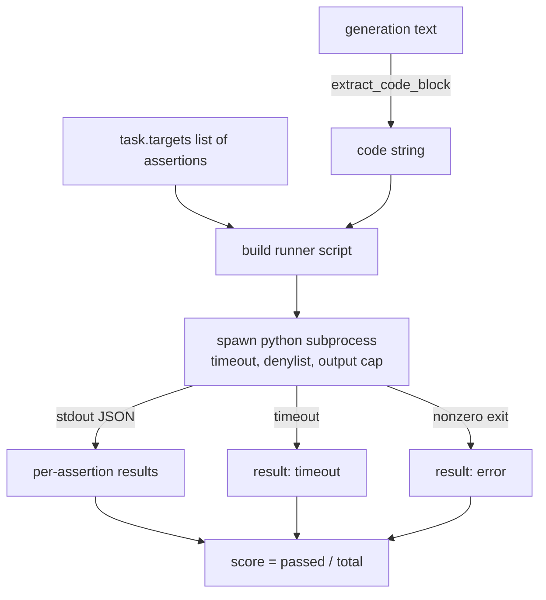
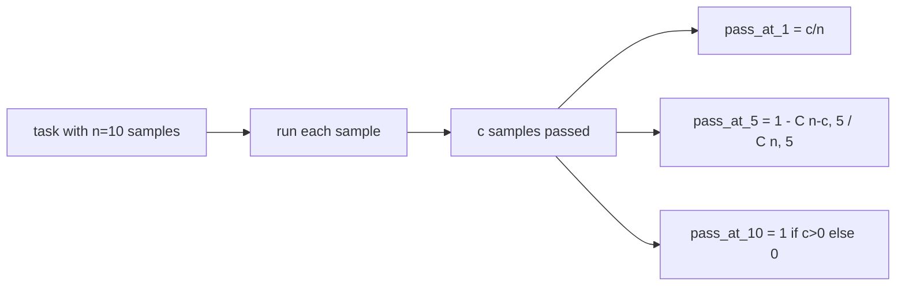

# Metryka wykonania kodu

> Wygenerowany kod jest poprawny, gdy pomyślnie przejdzie testy. Uprząż eval musi wyodrębnić kod, uruchomić go bez zawieszania hosta i uczciwie zliczać przepustowość. Ta lekcja buduje tę powierzchnię.

**Typ:** Kompilacja
**Języki:** Python
**Wymagania wstępne:** Faza 19 Podstawy ścieżki B, lekcje 70 i 71
**Czas:** ~90 min

## Cele nauczania

- Wyodrębnij blok kodu z generacji swobodnej w sposób zgodny z regułą przetwarzania końcowego z lekcji 70.
- Wykonaj kod kandydujący w izolowanym podprocesie z limitem czasu zegara ściennego, limitem wyjściowym i listą odrzuconych importów.
- Oceń zadanie jako ułamek dostarczonych ciągów asercji, które przechodzą przeciwko kandydatowi.
- Oblicz pass-at-k dla zadań, które próbkują wiele generacji z jednego modelu.
- Traktuj awarie piaskownicy, błędy składni i przekroczenia limitu czasu jako pierwszorzędne tryby awarii z odrębnymi kodami wyjścia, które biegacz może zarejestrować.

## Dlaczego izolowany podproces

Inline `exec` stanowi zagrożenie dla bezpieczeństwa i stabilności. Wygenerowany `while True: pass` blokuje eval na zawsze. Wygenerowany `import shutil; shutil.rmtree('/')` jest dokładnie tak katastrofalny, jak się wydaje. Rozwiązaniem jest utworzenie nowego interpretera Pythona dla każdego kandydata, przekazanie kodu na standardowe wejście, zapisanie wyników asercji na standardowe wyjście i zakończenie procesu w przypadku jego przekroczenia. Proces oceny hosta nadal działa.

Wszystkie rzeczywiste ewaluacje, takie jak HumanEval, MBPP, BigCodeBench i LiveCodeBench, korzystają z piaskownicy podprocesów. Niektóre warstwy Docker na górze. Zatrzymujemy się na podprocesie nie bez powodu: jest on przenośny, ma standardową bibliotekę i wychwytuje tryby awarii istotne dla ewaluacji edukacyjnej. Wdrożenia produkcyjne dodają seccomp, izolację sieci i system plików tylko do odczytu. Kolejna lekcja na temat hartowania życia poza tym torem.

## Kształt zadania code-exec

Zadanie `code_exec` przenosi ciągi asercji w `targets`. Biegacz wyodrębnia z generacji chroniony blok kodu, buduje wokół niego wiązkę testową i uruchamia wynik.



Wynik jest ułamkiem w `[0, 1]`. Zadania z trzema stwierdzeniami, w przypadku których dwa pozytywne wyniki dają wynik 0,667. Moduł uruchamiający zwraca ten sam kształt niezależnie od tego, co się nie powiedzie: awarie podprocesu są odwzorowywane na znormalizowany kod błędu, a nie na ślad Pythona przesyłany do wiązki przewodów.

## Lista odrzuconych

Lista odrzuconych jest oparta na imporcie. Przed uruchomieniem kodu kandydującego skrypt uruchamiający przepisuje import niebezpiecznych modułów do kodu pośredniczącego, który wywołuje `ImportError("denied")`. Lista jest celowo konserwatywna: `os.system`, `subprocess`, `socket`, `requests`, `urllib`, `urllib.request`, `urllib.error`, `urllib.parse`, `ctypes`, `shutil`, `http.client`, `asyncio.subprocess`.

Nie udajemy, że jest to kuloodporne. Określony kod kontradyktoryjny może uciec z dowolnej piaskownicy w procesie w Pythonie. Lista odrzuconych jest zabezpieczeniem. Limit czasu zegara ściennego i ograniczenie wyjściowe to elementy sterujące nośne.

```python
DENIED = {
    "os.system": True,
    "subprocess": True,
    "socket": True,
    "shutil": True,
    "requests": True,
    "urllib": True,
    "ctypes": True,
}
```

Owijamy kandydata, dodając `import sys` i strażnika, którego ma podnieść `os.system`. Pełny szablon znajduje się w `main.py`.

## Limit czasu zegara ściennego

Każdy podproces ma domyślny budżet wynoszący trzy sekundy zegara ściennego. Biegacz używa `subprocess.run(..., timeout=t)`. Jeśli nastąpi przekroczenie limitu czasu, moduł uruchamiający przechwytuje `TimeoutExpired`, kończy proces i rejestruje `timeout` przyczynę wyjścia zadania. Wynik za to zadanie wynosi zero. Biegacz idzie dalej.

Limit czasu można skonfigurować dla każdego zadania za pomocą `task.metadata.timeout_s`. Długotrwałe testy jednostkowe mogą wymagać więcej; Walidator z lekcji 70 ogranicza wartość do trzydziestu sekund, aby pakiet był ograniczony.

## Ograniczenie wyjściowe

Podproces może zapełnić standardowe wyjście, wyczerpując pamięć hosta. Biegacz przesyła strumieniowo standardowe wyjście do bufora i zabija dziecko, gdy tylko bieżąca suma przekroczy 256 KB. Wynik jest rejestrowany jako `exit_code = error` z ciągiem szczegółów `"output overflow"`. Widać to w praktyce, gdy pokolenie przypadkowo zapisuje nieskończoną pętlę, która jest drukowana.

## Pass-at-k

Pass-at-k to nieobciążony estymator używany przez HumanEval i jego przyjaciół. Biorąc pod uwagę `n` niezależne próbki na zadanie i `c` z nich, które spełniły kryteria, prawdopodobieństwo, że próbka o rozmiarze `k` z `n` zawiera co najmniej jedno pomyślne rozwiązanie wynosi:

```
pass_at_k(n, c, k) = 1 - C(n - c, k) / C(n, k)
```

Gdy `n - c < k` licznik jest niezdefiniowany, a wartość wynosi `1`. Implementacja obsługuje przypadek Edge bezpośrednio. W lekcji 74 udostępniamy `pass_at_k(n, c, k)` do wykorzystania przez warstwę liderów.



## Kody wyjścia

Biegacz zwraca jeden z pięciu wyników na zadanie:

- `pass`, gdy każde potwierdzenie zostało zaliczone.
- `assertion_fail`, gdy kod został uruchomiony, ale co najmniej jedno potwierdzenie nie powiodło się.
- `syntax_error`, gdy kod nie został zaimportowany lub zawierał błąd składniowy.
- `timeout` kiedy wygaśnie ważność zegara ściennego.
- `error` w przypadku wszelkich innych awarii, w tym trafień na liście odrzuconych i przepełnienia danych wyjściowych (przepełnienie powierzchni ze szczegółami `"output overflow"`).

Wynik to nadal ułamek. Kodem wyjścia są metadane. Dalsze lekcje mogą zdecydować, czy liczyć przekroczenie limitu czasu jako zero, czy jako brakujące dane.

## Czego ta lekcja nie robi

Nie daje prawdziwej piaskownicy. Nie uruchamia niezaufanego kodu z otwartej sieci. Nie obsługuje zadań stanowych, takich jak operacje we/wy plików lub wywołania sieciowe. Potrzebują kontenera lub mikroVM. Celem tej lekcji jest kontrakt: izolowany podproces, lista odrzuconych, limit czasu, limit wyjściowy, czyste słownictwo dotyczące kodu wyjścia i matematyka typu pass-at-k.

## Jak odczytać kod

`main.py` definiuje `extract_code`, `run_candidate`, `score_code_exec` i `pass_at_k`. Skrypt uruchamiający podproces jest budowany jako ciąg znaków i przekazywany jako `-c` do nowego interpretera Pythona. Testy w `code/tests/test_exec.py` ćwiczą cztery kody wyjścia plus pass-at-k w oparciu o sprawdzone przykłady zaczerpnięte ze stylu HumanEval.

Przeczytaj `main.py` od góry do dołu. Szablon prowadnicy jest elementem nośnym. Przyglądaj się pętli asercji, aż będziesz w stanie przewidzieć kopertę JSON, którą zapisuje ona z powrotem do procesu nadrzędnego.

## Idziemy dalej

Gdy kształt podprocesu zadziała, kolejnym problemem jest przenośność. Różne wersje Pythona w różny sposób obsługują SIGKILL w systemie Windows. Najczystszym rozwiązaniem jest umieszczenie modułu uruchamiającego w obrazie Dockera. Następną rzeczą jest zastąpienie ciągów asercji prawdziwymi plikami testów jednostkowych, aby wartość eval odpowiadała temu, co robi produkcyjny CI. W tym momencie przestań wywoływać testy ciągów asercji; są to testy zabawek i mają tryby awarii zabawek.