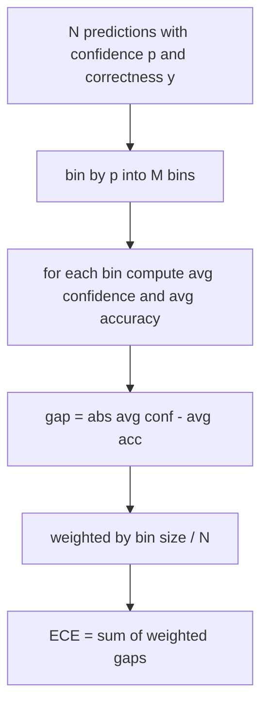
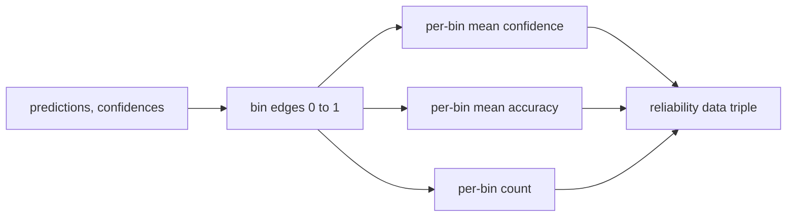

# Perplexity and Calibration

> If your model says it is 90% confident on a thousand answers, and six hundred are right, it is poorly calibrated. Calibration is half of a trustworthy evaluation. The other half is perplexity, which tells you if the model thinks the provided text is even plausible.

**Type:** Capstone
**Languages:** Python
**Prerequisites:** Phase 19 Path B Foundations, Lessons 70 and 71
**Time:** ~90 min

## Learning Objectives

- Calculate token-level perplexity on a held-out corpus from the negative log probabilities of the token provided by the model adapter.
- Calculate Expected Calibration Error (ECE) of a classifier or multiple-choice score based on binned predicted probabilities.
- Compute the Brier score (mean squared error relative to correctness indicator) and explain when it does what ECE does not.
- Build the reliability diagram data needed to plot a confidence vs. accuracy curve.
- Hook all three into the eval harness so the runner can append `perplexity`, `ece`, and `brier` numbers to the model report.

## What Perplexity Tells You

Perplexity is the exponentiated average negative log-likelihood per token. Lower is better. A perplexity of one means the model assigns probability one to every actual token. A perplexity of vocabulary size means the model is uniform and learned nothing. Real numbers fall between: a strong 2026 base model on WikiText-103 is between eight and twelve. A bad one on the same text is fifty plus.

The harness itself does not compute the log probability. Those come from the model adapter. The harness aggregates: it takes a list of log probs per token, a list of token counts per sequence, and returns corpus perplexity.

```python
def perplexity(neg_log_probs, token_counts):
    total_nll = sum(neg_log_probs)
    total_tokens = sum(token_counts)
    return math.exp(total_nll / total_tokens)
```

The implementation handles zero-token edge cases and ensures negative log probs are non-negative. A common mistake is forgetting the negation: an adapter returning `log p` instead of `-log p` yields perplexities below one, which is impossible. The function catches this as a contract violation.

## What ECE Measures

Expected Calibration Error bins predictions by their confidence into a fixed number of buckets, then measures the average difference between confidence and accuracy within the buckets, weighted by bucket size.



The standard formula uses ten equal-width bins in `[0, 1]`. The implementation handles any positive integer. We expose a `bins` parameter so the runner can choose between the publication convention (10) and the comparison convention (15).

ECE is biased by the number of bins and the sample size. With ten bins and a hundred predictions, you cannot distinguish 0.02 ECE from random noise. The implementation returns the number of populated bins alongside ECE, so a runner can refuse to report the single number if the sample is too small.

## What Brier Score Does and ECE Does Not

ECE only cares about average gaps. A model that is wildly overconfident half the time and underconfident the other half can have low ECE while being poorly calibrated locally. Brier score measures the squared error against the true correctness outcome, so it penalizes spread directly.

For binary outcomes, Brier is `mean((p_i - y_i)^2)`. It decomposes into reliability, resolution, and uncertainty. We compute the score and the decomposition. The runner reports the scalar but logs the decomposition for the dashboard.

```python
def brier(p, y):
    return float(np.mean((p - y) ** 2))
```

## Reliability Diagram Data

A reliability diagram plots predicted confidence against empirical accuracy per bin. The diagonal is perfect calibration. The function returns three arrays: mean confidence per bin, mean accuracy per bin, and count per bin. The plotting code goes downstream; this lesson stops at the data shape.



The returned tuple is what a calling layer needs to draw the chart or compute a custom ECE variant (adaptive ECE, sweeping ECE, etc). We return numpy arrays so the downstream code doesn't have to convert.

## Confidence Sources

The harness makes no assumptions about confidence coming from softmax. It accepts any number in `[0, 1]` per prediction. For multiple-choice tasks, the natural confidence is `softmax over option log-likelihoods`. For free text, the natural confidence is the sequence probability reported by the model, or exponentiated average log probability. The eval function just consumes the number. Where it comes from is the adapter's job.

## Edge Cases

- All predictions are wrong: ECE is the average confidence, Brier is high, perplexity is whatever the model thought of the text.
- All predictions correct with high confidence: ECE near zero, Brier near zero.
- A perfectly uncertain predictor at p=0.5: ECE is 0.5 minus accuracy, Brier is 0.25 minus a correction term.
- Empty input: ECE, Brier, and reliability return `0.0` (or zero-filled arrays). Perplexity returns `NaN` for the zero-token case. None of these paths throw an exception; the runner checks values and decides whether to report or skip.

These cases are covered in tests. A real model on a real benchmark won't hit them, but a buggy adapter or a tiny sample will, and the runner shouldn't crash.

## Hook It Up

Calibration is not a per-task metric like F1. It is a per-model report. The runner aggregates `(confidence, correct)` pairs across the entire eval run and computes ECE, Brier, and reliability data once at the end. Perplexity is computed on a held-out text corpus, independent of individual task scoring.

The interface is:

```python
report = CalibrationReport.from_predictions(confidences, correct)
report.ece          # float
report.brier        # float
report.reliability  # tuple of three numpy arrays
report.populated_bins  # int
```

`PerplexityResult.from_token_nll(neg_log_probs, token_counts)` returns the perplexity and average negative log probability per token.

## What This Lesson Does Not Do

It does not call the model. It does not implement softmax. It does not estimate confidence from output tokens; that is the adapter's job. It does not perform temperature scaling or Platt scaling; those are post-hoc fixes that belong in another lesson. The goal of this lesson is to make the three numbers (perplexity, ECE, Brier) trustworthy and reproducible.

## How to Read the Code

`main.py` defines `perplexity`, `expected_calibration_error`, `brier_score`, `reliability_diagram`, and the `CalibrationReport` / `PerplexityResult` dataclasses. The demo builds on synthetic predictions where ground truth is known: a well-calibrated model, an overconfident model, and an underconfident model. Tests in `code/tests/test_calibration.py` pin every edge case plus reference values for the synthetic predictors.

Read `main.py` top to bottom. The function order is scalar to vector to report. Every function has a brief docstring with the math and the contract.

## Going Further

Calibration is the most frequently ignored axis in published evals. Most leaderboards report a single accuracy value and call it done. A model that wins on accuracy and loses on Brier is a worse production deployment than a model that drops a couple points of accuracy but reliably reports its uncertainty. Once you have the calibration plumbing in place, add temperature scaling on a held-out validation split, recompute ECE, and watch the gap shrink. That's a separate lesson, but the floor lives here.
